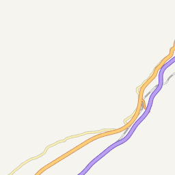

# GIS 基础

## 1. GIS基础

**地理信息系统**（英语：**G**eographic **I**nformation **S**ystem，[缩写](https://zh.wikipedia.org/wiki/縮寫)：**GIS**）是一门结合[地理学](https://zh.wikipedia.org/wiki/地理学)与[地图学](https://zh.wikipedia.org/wiki/地图学)的综合性学科，是用于输入、存储、查询、分析和显示[地理](https://zh.wikipedia.org/wiki/地理)数据的[计算机系统](https://zh.wikipedia.org/wiki/计算机系统)。

从定义可以看出，GIS的主要组成部分：

- 人员：开发人员定义GIS中被执行的各种**任务**，开发处理程序
- 数据：地图信息本身就是一种数据
- 硬件：想使用GIS，需要硬件支持，如：PC/显示器
- 软件：GIS软件、数据库，绘图、统计、影像处理及其它程序
- 过程：GIS要求明确定义，一致的方法来生成正确的可验证的结果

## 2. 地理坐标系

> 地球是个椭圆球体，可以通过经度、纬度来准确描述一个位置。

想要把一个三维的地球球面数据在二维平面（地图）上展示，需要采用某种[地图投影](https://zh.wikipedia.org/wiki/地图投影)。

### 2.1 坐标系分类：

- GWS84坐标系：地心坐标系，GPS原始坐标体系

  谷歌地图、bing地图等

- GCJ-02 坐标系：国测局坐标，火星坐标系

  腾讯地图、

- CGCS2000坐标系：国家大地坐标系

  天地图

- 百度/搜狗等其他坐标系，一般在 GCJ-02基础上再次加密

### 2.2 地图投影

将球体投影到平面上，球面必然会有一定程度的变形，根据地图的目的，有些变形是可以接受的，有些则是不可以接受的，因此，为了保留球面的某些性质而牺牲其他性质，就存在不同的地图投影。

[D3制作的投影动画，非常酷](https://observablehq.com/@d3/orthographic-to-equirectangular)

目前最常用的投影是 [墨卡托投影](https://zh.wikipedia.org/wiki/%E9%BA%A5%E5%8D%A1%E6%89%98%E6%8A%95%E5%BD%B1%E6%B3%95)：

- 优点：保留了正确的经纬度信息，即：投影上两点的经纬度和实际一样，适用于航海等
- 缺点：接近地球赤道附近则拉伸形变较小，两极形变很大，无法准确显示面积大小

*墨卡托投影示意图：*先把球体扩展为圆柱体，然后展开圆柱体为长方形


### 3. 从经纬度到地图瓦片

[可视化查看地图瓦片](https://www.maptiler.com/google-maps-coordinates-tile-bounds-projection/#0/11.12/-11.97)

总结一下上面👆的过程：

1. 经纬度转Web墨卡托；
2. Web墨卡托转世界平面点
3. 世界平面点转瓦片像素坐标
4. 瓦片像素坐标转瓦片行列号

地图缩放一般有18个层级，每一级按照四叉树进行分层切割，因为放大一层，长宽增加一倍，面积就是之前的4倍。

所以，每一层对应的瓦片数量为：

```js
Math.pow(Math.pow(2, n), 2)// 行*列：2^n * 2^n
```

第18层的数量为：68719476736。

每个瓦片都是有编号的，地图软件会根据我们浏览器的视图，请求回相应的瓦片。

### 4. 瓦片的加载

1. 要根据用户缩放程度算出显示范围所对应的瓦片的**x、y、z**（leve）（也可以说是行列号）
2. 再对应的位置，获取并加载上对应的x、y、z的瓦片
3. 必要的一些缩放功能，平移等等基本的地图浏览操作，触发地图的更新

*天地图请求一个瓦片：*


```
// 图片的链接地址
https://t2.tianditu.gov.cn/vec_w/wmts?SERVICE=WMTS&REQUEST=GetTile&VERSION=1.0.0&LAYER=vec&STYLE=default&TILEMATRIXSET=w&FORMAT=tiles&TILECOL=1678&TILEROW=774&TILEMATRIX=11&tk=0b79a07d2808103ab84aa56485c331a8
```

链接里的关键信息：

- LAYER=vec：图层类型为vec
- STYLE=default：样式默认
- TILEMATRIXSET=w：
- FORMAT=tiles：格式为瓦片
- TILECOL=1678：瓦片所在列
- TILEROW=774：瓦片所在行
- TILEMATRIX=11：瓦片缩放等级

可以看出，这个图片是在放大等级为 11 时，第 1678 列，第 774 行的瓦片。

### 5. 地图分层

细心的你可能看出来了，上面的瓦片图片只有道路、铁路等图形信息，没有文字。



实际上，为了方便管理，地图是分层的，地图里的图形和文字并不在一层。


从代码里可以清楚的看到，这里的图层被分成了两层：


是否有更多的图层要看具体的需求，例如：为了展示天气污染情况，地图可能需要加载一个空气质量的图层。

例如，下面这张[全球空气质量地图](https://www.iqair.cn/cn/world-air-quality)就包含了多个图层：


- 底图图层
- 行政区划图层
- aqi图层
- 风场图层
- 污染指数图层（放大后可以看到pm2.5数据）


----

参考：

[GIS--wikipedia](https://zh.wikipedia.org/wiki/%E5%9C%B0%E7%90%86%E4%BF%A1%E6%81%AF%E7%B3%BB%E7%BB%9F)

[一个小游戏认识墨卡托投影](//blog.geohey.com/-ge-xiao-you-xi-rang-ni-che-di-nong-dong-mo-qia-tuo-tou-ying/)

[瓦片地图原理](https://segmentfault.com/a/1190000011276788)