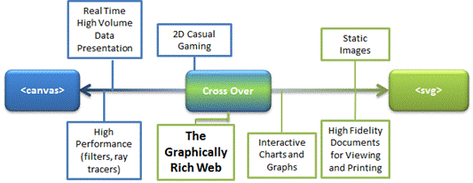
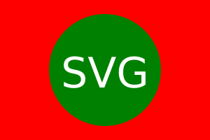

# 地图性能

## 1. 性能影响因素

## 2. 地图基础技术

### 2.1 图片

很明显，图片是展示地图最简单的方式，[天地图](https://www.tianditu.gov.cn/)就是采用这种形式。

### 2.2 \<svg\> 和 \<canvas\>

想要在显示器上绘图，目前比较成熟的方案有两个：

1. `<svg>`: **可缩放矢量图形**（Scalable Vector Graphics)，基于XML，用于描述2D矢量图
2. `<cnavas>`：画布，顾名思义它是一块供 Canvas API 和 WebGL API 来作画的容器

*svg和canvas对比：*

| 名称   | 绘图方式                     | 图像类型                 | 性能                   | 常用库                     | 常见使用场景                               | 事件                           |
| :----- | :--------------------------- | ------------------------ | ---------------------- | :------------------------- | ------------------------------------------ | ------------------------------ |
| svg    | XML                          | 2D矢量图，放大不失真     | 渲染性能差，适合静态图 | D3.js                      | 静态图像、可交互数据可视化、地图瓦片       | 支持事件，可以交互             |
| canvas | JS脚本,Canvas API、WebGL API | 2D或3D像素位图，放大失真 | 渲染性能高，适合游戏等 | Echarts、Three.js、Pixi.js | 动画、游戏画面、大规模数据可视化、图片编辑 | 不支持事件，想改变只能重新渲染 |



画一个svg图：

```xml
<svg version="1.1"
     baseProfile="full"
     width="300" height="200"
     xmlns="http://www.w3.org/2000/svg">
  <rect width="100%" height="100%" fill="red" />
  <circle cx="150" cy="100" r="80" fill="green" />
  <text x="150" y="125" font-size="60" text-anchor="middle" fill="white">SVG</text>
</svg>
```

效果⬇️：



### 2.2 Canvas API

### 2.3 WebGL API

`WebGL`（Web 图形库）是一个 JavaScript API，可以和浏览器进行2D和3D交互。

通过引入一个与 OpenGL ES 2.0 非常一致的 API，可以利用用户设备提供的硬件图形加速。

OpenGL是 底层的驱动级的图形接口（是显卡有直接关系的） ，显然，寄生于浏览器的JavaScript无法涉及，所以2010年才有了 `WebGL`。

JavaScript -> WebGL -> OpenGL ->.... -> 显卡 并把最终渲染出来图形 呈现到 `<canvas>`。

#### 2.3.1 常见的WebGL 库

直接通过手写WebAPI的方式来开发是很低效的，所以社区出现了很多优秀的库，它们和 `WebGL`的关系像 `JQuery`和原生 `JavaScript`的关系。

**常见库：**

- 3D: [three.js](https://threejs.org/)
- 2D: [Pixi.js](https://pixijs.com/)

### 2.4 \<canvas\>、Canvas API 和 WebGL API 的关系

`<canvas>` 是一个 HTML5标签，可被用来通过 JavaScript（[Canvas](https://developer.mozilla.org/zh-CN/docs/Web/API/Canvas_API) API 或 [WebGL](https://developer.mozilla.org/zh-CN/docs/Web/API/WebGL_API) API）绘制图形及图形动画。

```html
<canvas id="canvas" width="300" height="300">
  抱歉，您的浏览器不支持 canvas 元素
 （这些内容将会在不支持<canvas>元素的浏览器或是禁用了 JavaScript 的浏览器内渲染并展现）
</canvas>
```

获取一个绘图上下文开始绘制：

```js
var canvas = document.getElementById('canvas');
var ctx = canvas.getContext('2d');
ctx.fillStyle = 'green';
ctx.fillRect(10, 10, 100, 100);
```

`Canvas API` 和 `WebGL API` 都是用来在 `<canvas>`绘图上下文绘图的。


----

总结：

- 图片：开发简单，兼容性好；性能差，不支持3D。主流地图基本放弃这种方式。
- Canvas API：只支持2D图形，兼容性好，
- WebGL API：性能好，支持3D，兼容性略差，但是库可以做降级为 Canvas API


----

参考：

[跨平台高性能地图渲染技术研究](http://www.xml-data.org/CHDLXX/html/070f27d6-3ba4-4396-b1a1-170e9db71e96.htm#outline_anchor_14)--论文

[SVG教程](https://developer.mozilla.org/zh-CN/docs/Web/SVG/Tutorial)-- MDN官方

