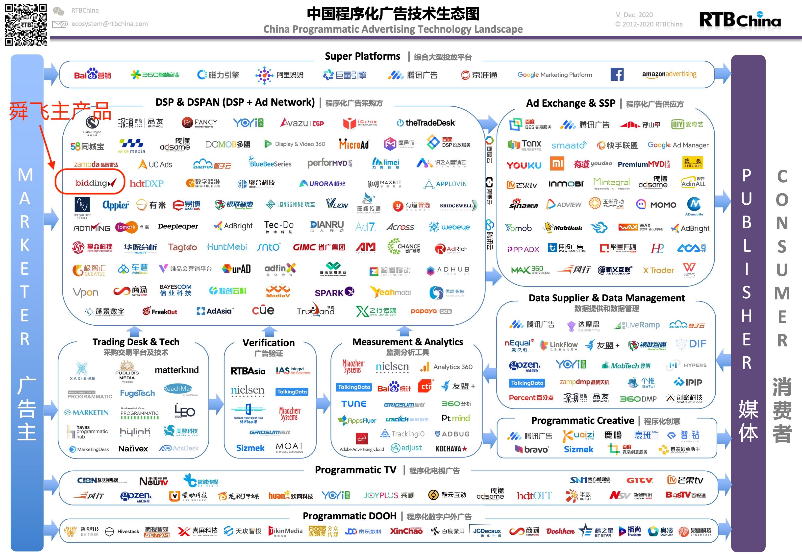
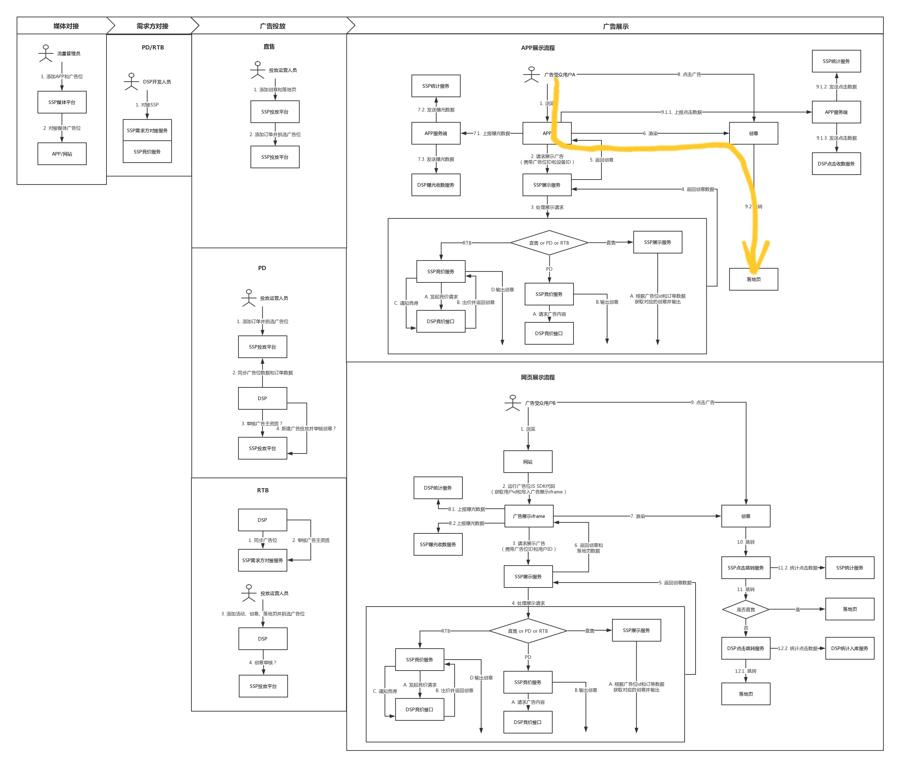

# 程序化广告

> 新时代的广告方式。

## 1. 什么是程序化广告

<code style="color: #708090; background-color: #F5F5F5; font-size: 18px">程序化广告</code>是指**利用技术手段进行广告交易和管理**。

**广告一般由三部分组成**：

- 广告主：砸钱做营销的人（如：可口可乐、宝洁）
- 媒介：报纸、电视、网站、APP 等
- 消费者：看广告的人

_2020 年程序化广告生态圈：_

## 2. 程序化广告是如何运作的

程序化广告是随着互联网的兴起而逐渐兴盛的。

经过近 20 年的发展，目前已经形成了一个很复杂的体系，而且还在不断的演进当中。

_程序化广告化流程示意：_

## 3. 名称解释

## 参考

[《中国程序化广告技术生态图》2020 年终更新版发布](https://www.rtbchina.com/china-programmatic-ad-tech-landscape-2020-year-end-html.html)

[程序化广告 -- 百度百科](https://baike.baidu.com/item/%E7%A8%8B%E5%BA%8F%E5%8C%96%E5%B9%BF%E5%91%8A/22187818)
