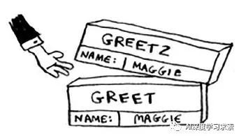
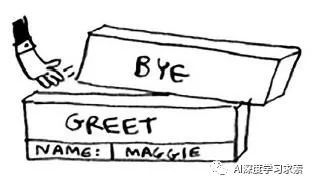

# 算法 (Algorithms)

> 从广义上讲，数据结构就是指**一组数据的存储结构**。算法就是**操作数据的一组方法**。

**数据结构与算法的关系**：

数据结构是**为算法服务**的，算法要**作用在特定的数据结构**之上。

_算法与数据结构分类：_


## 1. 算法复杂度

> 复杂度帮助我们了解算法的好坏程度，不理解复杂度就无法判断算法的好坏。

<code style="color: #708090; background-color: #F5F5F5; font-size: 18px">复杂度</code>帮助我们分析、统计算法的**执行效率**和**资源消耗**。

<code style="color: #708090; background-color: #F5F5F5; font-size: 18px">复杂度</code>可以衡量算法的执行效率，可以从两个维度来衡量：

- **1. 时间复杂度**

- **2. 空间复杂度**

### 1.1 时间复杂度

指算法需要消耗的**时间资源**。

_示例：_

```js
function cal(int n) {
  int sum = 0;
  int i = 1;
  int j = 1;
  for (; i <= n; ++i) {
    j = 1;
    for (; j <= n; ++j) {
      sum = sum +  i * j;
    }
  }
}
```

---

假设上面代码中每个语句的执行时间是 unit_time; 总执行时间 T(n).

第 2、3、4 行代码，每行都需要 1 个 unit_time 的执行时间；

第 5、6 行代码循环执行了 n 遍，需要 2n \* unit_time 的执行时间；

第 7、8 行代码循环执行了 n2 遍，所以需要 2n^2 \* unit_time 的执行时间；

所以，整段代码总的执行时间 T(n) = (2n^2+2n+3)\*unit_time。

---

我们可以得到一个非常重要的规律，那就是，<span style="color: #ff0000; font-size: 16px;">所有代码的执行时间 T(n) 与每行代码的执行次数 f(n) 成正比</span>。

算法的时间复杂度用大 O(意思是正比) 表示，记作：

```js
T(n) = O(f(n));
```

<span style="color: #ff0000; font-size: 16px;">算法**执行时间的增长率**与 **f(n) 的增长率**成正相关</span>，称作<code style="color: #708090; background-color: #F5F5F5; font-size: 18px">渐近时间复杂度</code>，简称<code style="color: #708090; background-color: #F5F5F5; font-size: 18px">时间复杂度</code>。

#### 1.1.1 常见的时间复杂度：

- 多项式量级

  - 常数阶 O(1)

    一般情况下，只要算法中**不存在循环语句、递归语句**，其时间复杂度是 <code style="color: #708090; background-color: #F5F5F5; font-size: 18px">常数阶 O(1)</code>。

  - 对数阶 O(log n)

    ```js
    i = 1;
    while (i <= n) {
      i = i * 3;
    }
    ```

    像上面代码，n 的变化是**乘法级**变化，它的变化率是对数，复杂度为 O(log3n)；

    类似这样的，我们忽略底数，表示为 <code style="color: #708090; background-color: #F5F5F5; font-size: 18px">对数阶 O(log n)</code>

  - 线性阶 O(n)

    一般有一个循环时，算法的时间复杂度为 <code style="color: #708090; background-color: #F5F5F5; font-size: 18px">线性阶 O(n)</code>

  - 线性对数阶 O(n log n)

    **线性阶**和**对数阶**共同组成了<code style="color: #708090; background-color: #F5F5F5; font-size: 18px">线性对数阶 O(n log n)</code>

    常见的线性对数阶：**归并排序**、**快速排序**

  - k 次方阶 O(n^k)

    一般，嵌套循环代码的时间复杂度为 <code style="color: #708090; background-color: #F5F5F5; font-size: 18px">k 次方阶 O(n^k)</code>，k 是指嵌套层级，k=2 为<code style="color: #708090; background-color: #F5F5F5; font-size: 18px">平方阶 O(n^2)</code>，k=3 为<code style="color: #708090; background-color: #F5F5F5; font-size: 18px">立方阶 O(n^3)</code>

  - O(m+n)、O(m\*n)

    上面的时间复杂度由**两个数据的规模**来决定。

    ```js
    int cal(int m, int n) {
      int sum_1 = 0;
      <!-- 时间复杂度为 O(m) -->
      int i = 1;
      for (; i < m; ++i) {
        sum_1 = sum_1 + i;
      }

      int sum_2 = 0;
      int j = 1;
      <!-- 时间复杂度为 O(n) -->
      for (; j < n; ++j) {
        sum_2 = sum_2 + j;
      }

      return sum_1 + sum_2;
    }
    ```

- 非多项式量级
  - 指数阶 O(2^n)
  - 阶乘阶 O(n!)

> 随着问题规模 n 的不断增大，上述时**间复杂度不断增大，算法的执行效率越低**。


#### 1.1.2 时间复杂度分析

大 O 表示法表示了算法时间复杂度的**趋势**，并不是具体的时间。

因此，对时间复杂度分析时我们可以考虑一下几点：

- 1. 只关注循环**执行次数最多**的一段代码(任何固定的次数，其复杂度为**常量阶段 O(1)**；重复不固定的 n 次，复杂度为**线性阶 O(n)**)
- 2. 加法法则：总复杂度等于**量级最大**的那段代码的复杂度
- 3. 乘法法则：嵌套代码的复杂度等于嵌套内外代码复杂度的**乘积**

如： T(n) = (2n^2+2n+3)\*unit_time, 根据**加法法则**我们可以理解为其时间复杂度为 <code style="color: #708090; background-color: #F5F5F5; font-size: 18px">平方阶 O(n^2)</code>

_示例_：

```js

int cal(int n) {
  int sum_1 = 0;
  int p = 1;
  // 执行 100 次，复杂度为 O(1)
  for (; p < 100; ++p) {
    sum_1 = sum_1 + p;
  }

  int sum_2 = 0;
  int q = 1;
  // 执行 n 次，复杂度为 O(n)
  for (; q < n; ++q) {
    sum_2 = sum_2 + q;
  }

  int sum_3 = 0;
  int i = 1;
  int j = 1;
  for (; i <= n; ++i) {
    j = 1;
    // 根据乘法法则，执行 n * n 次，复杂度为 O(n^2)
    for (; j <= n; ++j) {
      sum_3 = sum_3 +  i * j;
    }
  }

   return sum_1 + sum_2 + sum_3;
 }
```

### 2. 空间复杂度

算法的<code style="color: #708090; background-color: #F5F5F5; font-size: 18px">空间复杂度</code>是指算法需要**消耗的空间资源**。

与时间复杂度类似，一般都用复杂度的**渐近性**来表示。

同时间复杂度相比，**空间复杂度的分析要简单得多**。

_示例：_

```js
// 空间复杂度为 n
void print(int n) {
  int i = 0;
  int[] a = new int[n];
  // 申请了一个为 n 的 int 类型数组
  for (i; i <n; ++i) {
    a[i] = i * i;
  }

  for (i = n-1; i >= 0; --i) {
    print out a[i]
  }
}
```

我们常见的空间复杂度就是 O(1)、O(n)、O(n2 )。

## 2. 常见算法设计模式（算法思想）

### 2.1 完全遍历法和不完全遍历法

<code style="color: #708090; background-color: #F5F5F5; font-size: 18px">完全遍历法</code>是最简单的算法，就是把解空间的所有元素**完全遍历一遍**，逐个检测元素是否是我们要的解。

这是**最直接**的算法，实现往往**最简单**。

但是，当解空间特别庞大时，这种算法很可能导致工程上无法承受的计算量。

这时候可以利用<code style="color: #708090; background-color: #F5F5F5; font-size: 18px">不完全遍历方法</code>——例如各种搜索法和规划法——**来减少计算量**。

**常见的不完全遍历方法（设计模式）**：

- 1. 分治法

  把一个问题**分割**成互相独立的多个部分分别求解的思路，便于进行并行计算。

  如：**归并排序**、**快速排序**

- 2. 动态规划法

  当问题的**整体最优解就是由局部最优解组成**的时候，经常采用的一种方法。

- 3. 贪心算法

  当问题的整体**最优解不是（或无法证明是）由局部最优解组成**，且对解的**最优性没有要求**的时候，可以采用的一种方法。

- 4. 线性规划法
- 5. 回溯算法
- 6. 枚举算法
- 7. 简并法

## 3. 递归

> 递归是很多算法都使用的一种编程方法。

调用自身的函数我们称为<code style="color: #708090; background-color: #F5F5F5; font-size: 18px">递归函数</code>。

在某种意义上说，<code style="color: #708090; background-color: #F5F5F5; font-size: 18px">递归函数</code>近似于**循环**。

例如，以下循环：

```js
var x = 0;
// "x < 10" 是循环条件
while (x < 10) {
  // do stuff
  x++;
}
```

替换成递归函数：

```js
function loop(x) {
  if (x > 10) { // 退出条件
    return;
  } else {
    loop(x+1; // 递归调用
  }
}
loop(0);
```

有些递归用循环很难实现，但在算法中又很有用，如“获取树结构中所有的节点时”，使用递归实现：

```js
function walkTree(node) {
  if (node === null) return;

  for (let i = 0; i < node.childNodes.length; i++) {
    // 这里递归调用产生了更多递归
    walk(node.childNodes[i]);
  }
}
```

事实上，<span style="color: #ff0000; font-size: 16px;">递归函数使用了**函数堆栈**</span>。

```js
function foo(i) {
  // 终止递归
  if (i < 0) return;
  // 递归导致不断把下面函数添加到【调用栈】
  console.log("begin:" + i);
  foo(i - 1);
  console.log("end:" + i);
}
foo(3);

// 输出:

// begin:3
// begin:2
// begin:1
// begin:0
// end:0
// end:1
// end:2
// end:3
```

_执行动画演示：_


执行过程：

- 1. 从上面的动画中右侧的【Call Stack】可以看出：递归调用的过程就是往【Call Stack】添加 foo 的过程
- 2. 往【Call Stack】添加 foo 的过程中会执行 第 2、3、4、5 行代码，控制栏不断输出打印结果，begin: 3,2,1,0
- 3. 当 foo(0)时递归终止
- 4. 递归调用终止后，从【Call Stack】中取出执行 foo，按照栈的执行顺序 LIFO(后进先出)，所以一次打印 end: 0,1,2,3
- 5. 【Call Stack】清空，执行结束

### 3.1 调用栈

想了解递归的本质，必须搞清楚<code style="color: #708090; background-color: #F5F5F5; font-size: 18px">调用栈</code>。

#### 3.1.1 普通函数调用栈执行过程

_普通函数调用栈示例：_

```js
function greet(name) {
  console.log(`hello, ${name} !`);
  greet2(name);
  bye();
  console.log("end");
}
greet("MAGGIE");
```

上面代码的执行逻辑：

- 1. 调用 greet("han")，计算机首先**为该函数调用分配一块内存**，计算机使用一个<code style="color: #708090; background-color: #F5F5F5; font-size: 18px">栈</code>来表示内存块


- 2. 使用分配的内存，变量 name 被设置为“han"


- 3. 接着执行函数内的代码，打印出“hello, han !”
- 4. 然后调用 greet2(name)，greet2 被**压入栈顶**。（因为这里的调用是同步执行的，所以函数 greet 现在发生了**暂停**）

_此时的调用栈：_


- 5. greet2 执行后会**从栈顶弹出**，函数 greet **继续执行**



- 6. 接着是函数 bye 的压入、执行和弹出




- 7. 最后执行 greet 中的 console.log()，函数 greet 退出，调用栈清空

#### 3.1.2 递归函数调用栈执行过程

_递归函数调用栈示例：_

```js
// 求一个数的阶乘
function fact(x) {
  // 递归函数的基线条件，控制递归函数是否退出
  if (x == 1) {
    return 1;
  } else {
    // 递归执行
    return x * fact(x - 1);
  }
}
fact(3);
```

**递归调用过程：**

| 执行步骤 | 代码                  | 调用栈                              |
| -------- | --------------------- | ----------------------------------- |
| 1        | fact(3)               | FACT[x=3]                           |
| 2        | if (x == 1)           | FACT[x=3]                           |
| 3        | else                  | FACT[x=3]                           |
| 4        | return x \* fact(x-1) | FACT[x=2]<br>FACT[x=3]              |
| 5        | if (x == 1)           | FACT[x=2]<br>FACT[x=3]              |
| 6        | else                  | FACT[x=2]<br>FACT[x=3]              |
| 7        | return x \* fact(x-1) | FACT[x=1]<br>FACT[x=2]<br>FACT[x=3] |
| 8        | if (x == 1)           | FACT[x=1]<br>FACT[x=2]<br>FACT[x=3] |
| 9        | return 1              | FACT[x=2]<br>FACT[x=3]              |
| 10       | return x \* fact(x-1) | FACT[x=3]                           |
| 11       | return 2              | FACT[x=3]                           |
| 12       | return 6              |                                     |

主要步骤说明：

---

- 1-7: 递阶段，栈不断压入递归函数

- 8-11: 归阶段，栈不断执行递归函数，并弹出

- 4: 此时， x = 3, 代码相当于 return 3 \* fact(2)，调用栈压入 <code style="color: #708090; background-color: #F5F5F5; font-size: 18px">FACT[x=2]</code>

- 7: 此时， x = 2, 代码相当于 return 2 \* fact(1)，调用栈压入 <code style="color: #708090; background-color: #F5F5F5; font-size: 18px">FACT[x=1]</code>

- 8: 执行 fact(1)时，判断是否满足（x === 1）

- 9： 此时 x = 1，执行 return 1，**递归调用终止**，调用栈弹出<code style="color: #708090; background-color: #F5F5F5; font-size: 18px">FACT[x=1]</code>

- 10-11: 开始弹出栈 FACT[x=2]，执行 fact(2)，此时 x = 2，相当于 2 \* fact(1)，结果是 return 2；

- 12: 此时 x = 3，相当于 3 \* fact(2), return 6，调用栈清空

注意 ⚠️：

- 每个 fact 调用都有自己的 x 变量
- 调用栈执行（弹出）阶段，会直接获取上一个弹出返回的值
- 递归的最终结果是最后一次调用的返回值

### 3.2 递归的应用

<code style="color: #708090; background-color: #F5F5F5; font-size: 18px">递归</code>的关键点是<code style="color: #708090; background-color: #F5F5F5; font-size: 18px">基线条件</code>（退出调用自己）和<code style="color: #708090; background-color: #F5F5F5; font-size: 18px">递归条件</code>（调用自己）。

**递归需要满足的三个条件**:

- 1. 一个问题的解可以分解为几个子问题的解
- 2. 这个问题与分解之后的子问题，除了数据规模不同，求解思路完全一样
- 3. 存在递归终止条件

写递归代码最关键的是**写出递推公式**和**找到终止条件**。

_🌰 展平数组_：

> 问题：请写一个函数把多层数组展平为一维数组。

```js
function flatArr(arr) {
  let flatA = [];
  for (let i = 0; i < arr.length; i++) {
    if (Array.isArray(arr[i])) {
      flatA = flatA.concat(flatArr(arr[i]));
    } else {
      flatA.push(arr[i]);
    }
  }

  return flatA;
}
```

_执行过程演示：_


**流程分析：**

1. 首先执行 <code style="color: #708090; background-color: #F5F5F5; font-size: 18px">flatArr(["a", ["bb", "cc"], [1, [22, [333]]]])</code>，我们把第一个 flatArr 叫做 **flatArr-1**，注意 ⚠️，在**flatArr-1**内执行的函数，作用域都在**flatArr-1**内。

2. 执行 for 循环, i = 0，执行 <code style="color: #708090; background-color: #F5F5F5; font-size: 18px">flatA = flatA.concat(“a”)</code>，此时 **flatArr-1** 中的 <code style="color: #708090; background-color: #F5F5F5; font-size: 18px">flatA = ["a"]</code>;

3. 执行 for 循环，i = 1，执行 <code style="color: #708090; background-color: #F5F5F5; font-size: 18px">flatA = flatA.concat(flatArr(["bb", "cc"]));</code>，此时会**递归调用**flatArr，我们把这次调用的 flatArr 叫做 **flatArr-2**，**flatArr-2** 会立即执行，直到返回结果 <code style="color: #708090; background-color: #F5F5F5; font-size: 18px">["bb", "cc"]</code>，**flatArr-1**中会得到最终的结果 <code style="color: #708090; background-color: #F5F5F5; font-size: 18px">flatA = ["a"].concat(["bb", "cc"]) = ["a", "bb", "cc"]</code>;

4. 执行 for 循环，i = 2，过程和上面相同，最终**递归调用**返回结果 flatA = ["a", "bb", "cc"].concat([1, 22, 333]) = ["a", "bb", "cc", 1, 22, 333];

5. **flatArr-1** 执行结束，清空调用栈

**小结：**

- 不要在脑子里想像递归的整个过程，往往越想越糊涂，建议直接在控制台执行，看调用 Chrome 栈执行的整个大致流程
- 即便仔细研究了一下递归，但是复杂一点的递归感觉还是难以理解，唯有多写了

## 4. 常见算法分类

- 基本算法
  - 枚举
  - 搜索
    - 深度优先搜索
    - 广度优先搜索
    - 启发式搜索
    - 遗传算法
- 计算几何的算法
  - 凸包算法
- 图论的算法
  - 哈夫曼编码
  - 树的遍历
  - 最短路径算法
  - 最小生成树算法
  - 最小树形图
  - 网络流算法
  - 匹配算法
  - 分团问题
- 动态规划
- 其他算法
  - 数值分析
  - 加密算法
  - 排序算法
  - 检索算法
  - 随机化算法

## 5. 排序算法


### 4.1 冒泡排序

- 冒泡排序只会操作**相邻**的两个数据
- 一次冒泡会让至少一个元素移动到它应该在的位置
- 冒泡重复 n 次，就完成了 n 个数据的排序工作

> 如：将 4,5,6,3,2,1 从小到大，冒泡排序。


**冒泡过程：**

1. 4,5 比较，不需要换位置
2. 5,6 比较，不需要换位置
3. 6，3 比较，要换位置
4. 6，2 比较，要换位置
5. 6，1 比较，要换位置，最终，找到最大的数字 6

所以，按照这个逻辑，我们共需要 6 次，可以排出所有顺序。

_冒泡排序：_

```js
// 冒泡排序--从大到小
function sortBubble(num) {
  // 判断是否有数据位置交换
  let changed = false;
  if (num.length <= 1) return;

  for (let i = 0; i < num.length; i++) {
    for (let j = 0; j < num.length - i - 1; j++) {
      if (num[j] < num[j + 1]) {
        let numJ = num[j];
        // 数据交换
        num[j] = num[j + 1];
        num[j + 1] = numJ;

        changed = true;
      }
    }
    // 没有数据交换，退出循环
    if (!changed) break;
  }

  return num;
}
```

**冒泡排序特性：**

- 冒泡排序是**原地排序算法**

  只需要常量级的临时空间，所以它的空间复杂度为 O(1),是一个原地排序算法。

- 冒泡排序是**稳定**的排序算法(相同大小的数据不会被重排)

- 冒泡排序的时间复杂度（最好为 O(n)，最坏为 O(n^2)）

### 4.2 插入排序

插入排序也包含两种操作，一种是**元素的比较**，一种是**元素的移动**。


红色为已经排序，黄色为未排序。

**插入排序过程**：

- 1. 初始时第一个元素 4 默认是有序的（有序数字为 4）
- 2. 第一次插入排序时，5 和 4 比较，不需要移动（有序的数字为 4，5）
- 3. 第二次插入排序时，6 和前面的 5、4 比较， 也不要移动（有序的数字为 4，5，6）
- 4. 第三次插入排序时，1 和 6、5、4 比较，需要将 6、5、4 向后移动，把 1 插入 4 前面（有序的数字为 1，4，5，6）
- 5. 第四次插入排序时，3 和 6、5、4、1 比较，需要把 6， 5， 4 后移，把 3 插入到原来 4 的位置（有序的数字为 1，3，4，5，6）
- 6. 同理，3，4，5，6 后移，2 插入原来 3 的位置

_插入排序：_

```js
// 插入排序--从小到大
function sortInsert(num) {
  if (num.length <= 1) return num;

  for (let i = 1; i < num.length; i++) {
    // 当前需要被插入的数
    let currentValue = num[i];
    // 可能被插入的位置
    let j = i - 1;
    for (; j >= 0; j--) {
      // 找到需要插入的位置
      if (num[j] > currentValue) {
        // 移动数据
        num[j + 1] = num[j];
        // 插入数据
        num[j] = currentValue;
      } else {
        break;
      }
    }
  }

  return num;
}

// sortInsert([456, 455, 7894, 78, 556, 0])
// => [0, 78, 455, 456, 556, 7894]
```

**插入排序特性：**

- 插入排序是**原地排序算法**

  插入排序算法的运行并不需要额外的存储空间，所以空间复杂度是 O(1)，也就是说，这是一个原地排序算法。

- 插入排序是**稳定**的排序算法(相同大小的数据不会被重排)

- 插入排序的时间复杂度（最好为 O(n)，最坏为 O(n^2)）

### 4.3 选择排序

<code style="color: #708090; background-color: #F5F5F5; font-size: 18px">选择排序</code>每次会<span style="color: #ff0000; font-size: 16px;">从未排序区间中找到**最小**的元素，将其放到已排序区间的**末尾**</span>。

_选择排序：_


_示例：_

```js
// 选择排序--从小到大
function sortSelect(num) {
  if (num.length <= 1) return num;

  for (let i = 0; i < num.length; i++) {
    let j = i;
    // 最小值
    let minNum = num[j];
    // 最小值索引
    let minIndex = j;
    // 找出最小未排序值
    for (; j < num.length; j++) {
      if (num[j] < minNum) {
        minNum = num[j];
        minIndex = j;
      }
    }
    // 最小值数据交换
    let numI = num[i];
    num[i] = minNum;
    num[minIndex] = numI;
  }

  return num;
}

// sortSelect([45654,45,788,455,0,-454])
// => [-454, 0, 45, 455, 788, 45654]
```

**选择排序特性：**

- 选择排序是**原地排序算法**

  选择排序算法的空间复杂度是 O(1)，也就是说，这是一个原地排序算法。

- 选择排序是**不是稳定**的排序算法(每次都要交换数据，可能破坏稳定性)

  如：5，8，5，2，9 这样一组数据，第一选择排序，需要找出最小值（2），和最左侧的值（5）交换位置；那么第一个 5 和第二个 5 的位置就发生了变化

- 选择排序的时间复杂度（平均 O(n^2)，最坏为 O(n^2)）

---

**小结**：

- 冒泡排序： <span style="color: #ff0000; font-size: 16px;">未排序</span>数据位置交换；
- 插入排序： <span style="color: #ff0000; font-size: 16px;">移动已排序</span>数据，直到找到需要<span style="color: #ff0000; font-size: 16px;">插入的位置</span>；
- 选择排序：找<span style="color: #ff0000; font-size: 16px;">未排序</span>元素中最小值，和<span style="color: #ff0000; font-size: 16px;">未排序最前面的元素交换</span>

> 冒泡排序和插入排序的时间复杂度都是 O(n^2)，都是原地排序算法，为何插入排序比冒泡排序更受欢迎 ❓

- 1. <code style="color: #708090; background-color: #F5F5F5; font-size: 18px">冒泡排序</code>的数据交换要比<code style="color: #708090; background-color: #F5F5F5; font-size: 18px">插入排序</code>的数据移动要复杂，差不多是后者的 3 倍，效率略低。

### 4.4 归并排序与快速排序

<code style="color: #708090; background-color: #F5F5F5; font-size: 18px">归并排序</code>和<code style="color: #708090; background-color: #F5F5F5; font-size: 18px">快速排序</code>利用了算法的<span style="color: #ff0000; font-size: 16px;">分治</span>思想。

这两种排序算法**适合大规模的数据排序**，同时也更加**常用**。

<code style="color: #708090; background-color: #F5F5F5; font-size: 18px">Array.prototype.sort()</code> 方法在 Chrome(V8 引擎)中就是使用 <code style="color: #708090; background-color: #F5F5F5; font-size: 18px">快速排序</code> 实现的，在 FirFox 中是使用 <code style="color: #708090; background-color: #F5F5F5; font-size: 18px">归并排序</code>实现的。

_归并排序：_


<code style="color: #708090; background-color: #F5F5F5; font-size: 18px">归并排序</code>的关键是<code style="color: #708090; background-color: #F5F5F5; font-size: 18px">分解</code>与<code style="color: #708090; background-color: #F5F5F5; font-size: 18px">合并</code>。

因此，归并排序的过程大致如下：

- 1. 分：将数据**递归分解**成较小的块（每个块只含有 2-3 个元素）
- 2. 合：将较小的块**递归合并**，并重新排序

_示例：_

```js
// 归并排序--从小到大
// 归并排序主函数
function mergeSort(array) {
  if (array.length > 1) {
    const { length } = array;
    // 分解数组
    const middle = Math.floor(length / 2);
    const left = mergeSort(array.slice(0, middle));
    const right = mergeSort(array.slice(middle, length));
    array = merge(left, right);
  }

  return array;
}

// 合并左右数组
function merge(left, right) {
  let i = 0;
  let j = 0;
  const result = [];

  while (i < left.length && j < right.length) {
    result.push(left[i] < right[i] ? left[i++] : right[j++]);
  }

  return result.concat(i < left.length ? left.slice(i) : right.slice(j));
}
```

**归并排序特性：**

- 归并排序

## 6. 搜索算法

## 7. 查找算法

### 7.1 二分法

>

_示例：_

```js

```

## 8. 字符串匹配算法

## 9. 其他算法

## 参考

[算法 | wikipedia](https://zh.wikipedia.org/wiki/%E7%AE%97%E6%B3%95)

推荐购买学习 👍 -- [数据结构与算法之美 ｜ 极客时间(付费课程)](https://time.geekbang.org/column/intro/126)

[递归函数 ｜ MDN](https://developer.mozilla.org/zh-CN/docs/Web/JavaScript/Guide/Functions#%E9%80%92%E5%BD%92)
