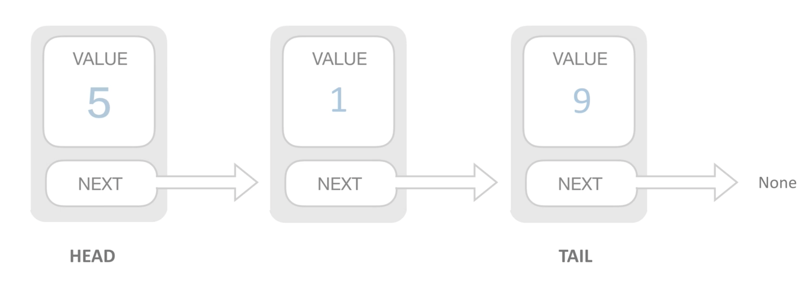
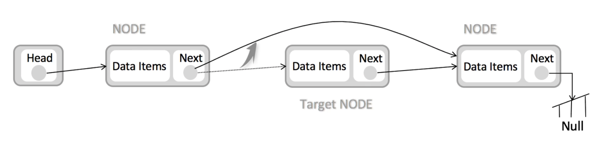

# Data Structure(数据结构)

> 不同的数据结构适应不同的环境，解决不同的问题。

## 1. 数据结构分类

### 1.1 Array（数组）

数组有下标，可以根据下标来增、删、查。

**时间复杂度：**

- 查(lookup)：O(1)，硬件会帮我们直接从内存中读取
- 增(insert)：平均 O(n)，插入需要移动下标后面所有位置的元素
- 删除(delete)：平均 O(n)，插入需要移动下标后面所有位置的元素

**数组的操作：**

- 增、删、改、查
- 嵌套数组展平（Flat）
- 排序（Sort）
-

### 1.2 Linked List（链表）

_链表：_

**时间复杂度：**

- append: O(1)
- insert: O(1)
- delete: O(1)
- lookup: O(n)

**只需移动 next 指针指向下一个元素即可。**

_链表的删操作：_

**结论：**

---

**没有完美的数据结构，如果有那其他数据结构就没有存在的意义了。**

- 数组更适合查操作
- 链表适合增、删操作

### 3. Stack(栈)

**FILO(First In Last Out): 先入后出。**

### 4. Queue(队列)

**FIFO(First In First Out): 先入先出。**

### 5. Map(映射) 和 Set

