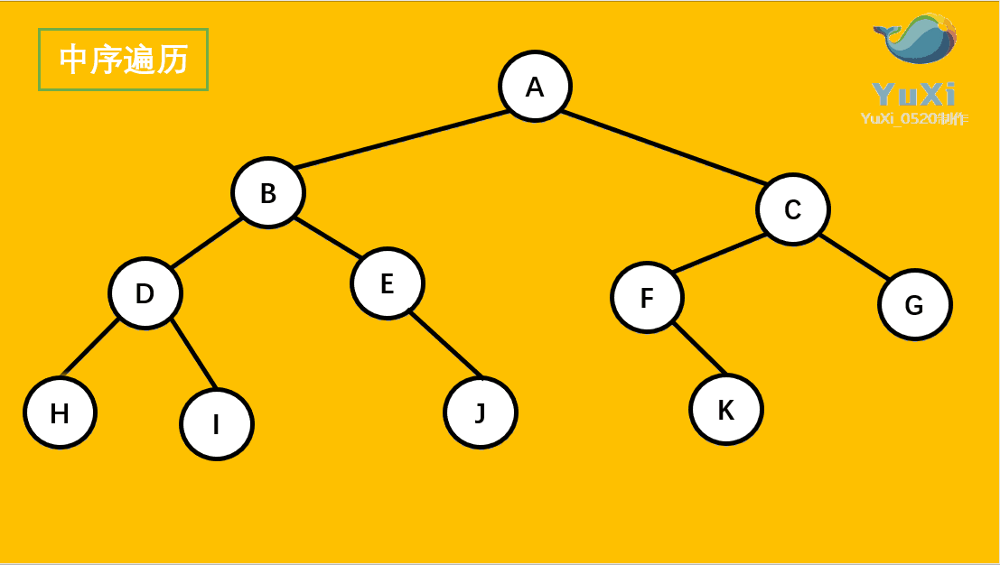
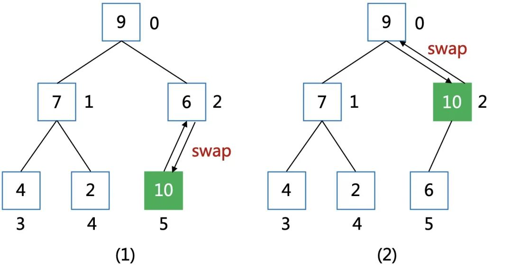

# 数据结构（Data Structure）

> 从广义上讲，数据结构就是指**一组数据的存储结构**。

不同的数据结构适用不同的业务场景，数据结构没有好坏之分。

## 1. 内存的工作原理

<code style="color: #708090; background-color: #F5F5F5; font-size: 18px">计算机存储器</code>可分为<code style="color: #708090; background-color: #F5F5F5; font-size: 18px">内部存储器</code>（又称内存或主存）和<code style="color: #708090; background-color: #F5F5F5; font-size: 18px"> 外部存储器</code>，其中<span style="color: #ff0000; font-size: 16px;">内存是 CPU 能直接寻址的储存空间，由半导体器件制成</span>。

<code style="color: #708090; background-color: #F5F5F5; font-size: 18px">内存</code>用于暂时存放 CPU 中的运算数据，计算机中所有程序的运行都在内存中进行。

只要计算机开始运行，<code style="color: #708090; background-color: #F5F5F5; font-size: 18px">操作系统</code>就会把需要运算的数据从<code style="color: #708090; background-color: #F5F5F5; font-size: 18px">内存</code>调到（寻址） <code style="color: #708090; background-color: #F5F5F5; font-size: 18px">CPU</code> 中进行运算，当运算完成，CPU 将结果传送出来。

内存是如何存放数据的呢 ❓

_内存 IC 引脚：_


- 1. 内存的内部是由各种**IC 电路**组成的
- 2. **内存 IC** 是一个完整的结构，它内部也有**电源**、**地址信号**、**数据信号**、**控制信号**和用于寻址的 **IC 引脚**来进行数据的读写
- 3. A0 - A9 是地址信号的引脚，数据就存储在它上面。地址信号共十个，表示可以指定 00000 00000 - 11111 11111 共 2 的 10 次方 = 1024 个地址。<span style="color: #ff0000; font-size: 16px;">每个地址都会存放 1 byte 的数据</span>，因此，**内存 IC** 的容量是 1 byte \* 1024 = 1 KB
- 4. 512 MB 的内存，这就相当于是 512000（512 \* 1000） 个**内存 IC**
- 5. D0 - D7 表示的是数据信号，也就是说，一次可以输入输出 8 bit（比特） = 1 byte（字节）的数据，例如，字母“A”的二进制表示为<code style="color: #708090; background-color: #F5F5F5; font-size: 18px">01000001</code>，它占用的内存大小是 1 byte(字节).

可以做一个类比，把数据存储到内存，相当于我们去超市时的物品寄存。


## 2. 数据结构分类

不同的数据结构有各自的优缺点。

_数据结构分类：_

- 线性表
  - 数组（Array）
  - 链表（Linked List）
  - 堆栈（Stack）
  - 队列（Queue）
- 非线性表
  - 树（Tree）
    - 二叉树
    - 堆积（Heap）
  - 图（Graph）
  - 散列表（Hash table，又叫哈希表）
    - 映射（Map），又叫“字典”
      - JS 语言内部使用**散列表**来表示<code style="color: #708090; background-color: #F5F5F5; font-size: 18px">对象</code>
      - 关系型数据库（如 MySQL）表中[键,值]对就是一种散列表
    - 集合（Set）

_线性表数据结构图示：_


_非线性表数据结构图示：_


## 3. 线性表

### 3.1 数组

<code style="color: #708090; background-color: #F5F5F5; font-size: 18px">数组</code>（Array）是一种**线性表**数据结构。它用一组**连续**的内存空间，一般用来存储一组具有**相同类型的数据**。

最大的特点就是**支持随机访问**（因为有下标）。

<code style="color: #708090; background-color: #F5F5F5; font-size: 18px">数组</code>为了保持内存数据的连续性，会导致<span style="color: #ff0000; font-size: 16px;">插入、删除这两个操作比较低效</span>。

#### 数组的使用

JS 中有<code style="color: #708090; background-color: #F5F5F5; font-size: 18px">数组</code>这一数据结构，而且在 JS 中它的应用十分广泛。

_定义一个数组_：

```js
let arr = new Array();
let arr2 = [];
```

_操作数组_：

```js
let arr = [1, 2, 3];

// 数组新增项
arr.push(4); // arr => [1, 2, 3, 4];

// 删除项
arr.splice(1, 1); // arr => [1, 3, 4]
```

### 3.2 链表

<code style="color: #708090; background-color: #F5F5F5; font-size: 18px">链表</code>是一种**线性表**数据结构。它用一组**非连续**的内存空间，因此，**链表可以存储在内存的任何地方**。

<code style="color: #708090; background-color: #F5F5F5; font-size: 18px">链表</code>通过**指针**来存储它的下一个元素地址，从而**使一系列随机的内存地址串在一块儿**。

#### 3.2.1 ES6 实现一个链表

JavaScript 中没有链表结构，我们可以通过对象来实现一个链表。

链表具有如下属性：

- value: 链表的值；

- next: 链表的指针(指向下一个元素)

```js
class Link {
  constructor(arg) {
    this.value = arg || null;
    this.next = null;
  }
}

let a = new Link("a");
let b = new Link("b");
let c = new Link("c");

a.next = b;
b.next = c;

console.log(a.next.next);

// 遍历链表
let p = a;
while (p) {
  console.log(p.value);
  p = p.next;
}
// a
// b
// c

// 链表插入
let d = new Link("d");
b.next = d;
d.next = c;
// 再次遍历查看整个链表
let p2 = a;
while (p2) {
  console.log(p2.value);
  p2 = p2.next;
}
// a
// b
// d
// c

// 链表删除
// 直接修改 a 的 next 指针，指向 b 的 next，即：把 b 删除
a.next = d;
// 再次遍历查看整个链表
let p3 = a;
while (p3) {
  console.log(p3.value);
  p3 = p3.next;
}
// a
// d
// c
```

**链表解题技巧**：🔥

---

- 1. 利用指针（有时是多个）

  如：快慢指针解决“链表是否有环”问题;

  多指针解决链表反转；


- 2. 构建一个虚假链表头

  一般需要返回一个新链表时使用，如返回合并链表；

- 3. 最好画出链表关系，便于理解

#### 3.2.2 数组(Array) VS 链表(Linked List)

数组和链表区别：

- 1. <code style="color: #708090; background-color: #F5F5F5; font-size: 18px">数组</code>支持随机访问，根据下标随机访问的时间复杂度为 O(1)

- 2. <code style="color: #708090; background-color: #F5F5F5; font-size: 18px">链表</code>的**插入**、**删除**只是修改其指针指向，时间复杂度为 O(1)


**结论**：<span style="color: #ff0000; font-size: 16px;">数组**更擅长**查询**操作，**链表**更擅长**插入**、**删除**操作**</span>

### 3.3 栈(Stack)

<code style="color: #708090; background-color: #F5F5F5; font-size: 18px">栈</code>只允许在有序的线性资料集合的一端（称为堆栈顶端，top）进行加入数据（push）和移除数据（pop）的运算，因此遵循<code style="color: #708090; background-color: #F5F5F5; font-size: 18px">后进先出</code>（LIFO, Last In First Out）的原理运作。

<code style="color: #708090; background-color: #F5F5F5; font-size: 18px">栈</code>常用**一维数组**或**链表**来实现。

#### 3.3.1 使用 ES6 实现一个栈的类

Stack 类需要实现如下方法：

- push(): 入栈
- pop(): 出栈
- peek(): 获取栈最低层元素

```js
class Stack {
  constructor(...args) {
    this.stack = [...args];
  }

  pop() {
    return this.stack.pop();
  }

  push(item) {
    return this.stack.push(item);
  }

  peek() {
    return this.stack[0];
  }
}

// 使用示例
let stack1 = new Stack(1, 3, 5);
console.log(stack1.stack); // [1, 3, 5]
stack1.push(4);
console.log(stack1.stack); // [1, 3, 5, 4]
```

**栈解题技巧**：🔥

---

- 1. **栈**往往适用于**只关心上一次的操作**的场景

### 3.4 队列(Queue)

<code style="color: #708090; background-color: #F5F5F5; font-size: 18px">队列</code>最大特点：**先进先出**。

根据其特征可以知道，队列适合解决**按顺序执行**的问题。

应用场景：**浏览器事件队列**等。

JavaScript 中<code style="color: #708090; background-color: #F5F5F5; font-size: 18px">队列</code>常用**数组**来实现。

```js
let a = [];

// 入列
a.push(1);
console.log(a); // [1]

// 出列
a.shift();
console.log(a); // []
```

**队列解题技巧**：🔥

---

- 1. **队列**长被用于广度优先搜索等
- 2. **双端队列**常用于**动态窗口**类场景

#### 3.4.1 优先队列

**与普通队列区别：**

保证每次**取出的元素是队列中优先级最高的**。

**本质**：

优先队列的本质是**二叉堆**结构，利用一个数组结构来实现<code style="color: #708090; background-color: #F5F5F5; font-size: 18px">完全二叉树</code>。


**最常用场景：**

- 从混乱数据中按照一定顺序（优先级）筛选数据

  如：[找出前 K 个高频词汇](https://leetcode-cn.com/problems/top-k-frequent-elements/)

_例题：_

## 4.非线性表

### 4.1 树

<code style="color: #708090; background-color: #F5F5F5; font-size: 18px">树</code>是一种非顺序<span style="color: #ff0000; font-size: 16px;">分层</span>数据结构，<span style="color: #ff0000; font-size: 16px;">适用于存储需要快速查找的数据</span>。


**前端工作中常见的树**：

- DOM 树
- 级联选择（如：地区选项卡）
- 树形控件

JavaScript 中没有<code style="color: #708090; background-color: #F5F5F5; font-size: 18px">树</code>，可以使用 Object 和 Array 来构建树。

_模拟多叉树：_

```js
{
  value: 'hubei',
  label: 'hubei',
  children: [
    {
      value: 'wuhan',
      label: 'wuhan',
      children: [
        {
          value: 'hongshan',
          label: 'hongshan',
        },
        {
          value: 'gaoxin',
          label: 'gaonxin',
        }
      ]
    }
  ]
}
```

_模拟二叉树：_

```js
{
  value: 1,
  left: {
    value: 2,
    left: {
      value: 3,
      left: null,
      right: null,
    },
    right: {
      value: 4,
      left: null,
      right: null,
    },
  },
  right: {
    value: 5,
    left: {
      value: 6,
      left: null,
      right: null,
    },
    right: null,
  }
}
```

_模拟二叉树示例：_


#### 4.1.1 二叉树

<code style="color: #708090; background-color: #F5F5F5; font-size: 18px">二叉树</code>是最多有两个“叉”的树，即：最多两个子节点。


- 图示 1 为一般二叉树
- 图示 2 为<code style="color: #708090; background-color: #F5F5F5; font-size: 18px">满二叉树</code>
- 图示 3 为<code style="color: #708090; background-color: #F5F5F5; font-size: 18px">完全二叉树</code>

**二叉树的存储方式**：

- 链式存储（左右指针来实现）

  

- 顺序存储（数组来实现）

  

#### 4.1.2 二叉搜索树

<code style="color: #708090; background-color: #F5F5F5; font-size: 18px">二叉搜索树</code>(Binary Search Tree)，也称为**有序二叉树等**。

<code style="color: #708090; background-color: #F5F5F5; font-size: 18px">二叉搜索树</code>是具有如下性质的**二叉树**：

- 1. 若任意节点左子树不空，则**左子树上所有节点都小于他的根节点**
- 2. 若任意节点右子树不空，则**右子树上所有节点都大于他的根节点**
- 3. 任意节点的左、右子树也分别为二叉搜索树

_二叉搜索树：_


_不是二叉搜索树：_


**二叉搜索树特点**：

> **二叉搜索树**支持数据的快速插入、删除、查找操作，且平均时间复杂度为 O(log(n)).

#### 4.1.3 树的遍历

**（多叉）树的遍历：**

- 深度优先遍历：沿着层级遍历，即：先往下一层级遍历，再回到同层，最后上层
- 广度优先遍历：先遍历层级低的，即：先同层，再下层

**二叉树的深度遍历又分为三种：**

- 先序遍历：从根节点开始，先左子节点，后右子节点（递归）

  

  ```js
  const preOrder = (root) => {
    if (!root) return;

    // 打印(访问)当前节点的值
    console.log(root.value);

    // 分别遍历左右节点
    preOrder(root.left);
    preOrder(root.right);
  };
  // 遍历👆模拟二叉树
  //打印结果： 1, 2, 3, 4, 5, 6
  ```

- 中序遍历：从最左侧子节点开始，左 -> 中 -> 右

  

  ```js
  const inOrder = (root) => {
    if (!root) return;

    // 先遍历左节点
    inOrder(root.left);
    // 打印(访问)当前节点的值
    console.log(root.value);
    // 最后遍历右节点
    inOrder(root.right);
  };
  // 遍历👆模拟二叉树
  //打印结果： 3, 2, 4, 1, 6, 5
  ```

- 后续遍历：从最左侧子节点开始，先左，后右，最后中

  

  ```js
  const postOrder = (root) => {
    if (!root) return;

    // 先遍历左节点
    postOrder(root.left);
    // 然后遍历右节点
    postOrder(root.right);
    // 打印(访问)当前节点的值
    console.log(root.value);
  };
  // 遍历👆模拟二叉树
  //打印结果： 3, 4, 2, 6, 5, 1
  ```

**树的遍历本质：**

_树的节点示意图_:


除了**根结点**和**叶子结点**，其他所有结点都有三个箭头指向它。

这些有 3 个箭头的中间节点被遍历了 3 遍，三种遍历方式<span style="color: #ff0000; font-size: 16px;">不同点是哪一步访问了它</span>。

- 先序遍历：第一次箭头穿过，即：父节点过来的箭头访问了它
- 中序遍历：第二次箭头穿过，即：左子节点过来的箭头访问了它
- 中序遍历：第三次箭头穿过，即：右子节点过来的箭头访问了它

**广度优先遍历**：

_广度优先遍历步骤：_

- 1. 新建一个队列，把根节点入队
- 2. 把队头出队并访问
- 3. 把队头的 children 逐个入队
- 4. 重复 2-3 步，知道队列为空

#### 4.1.4 深度优先处理 JSON

```js
const json = {
  a: {
    b: { c: 1 },
  },
  d: [1, 2],
};

// n => 当前节点的值
// 当前节点的 key路径
const dfs = (n, path) => {
  console.log(n, path);
  Object.keys().forEach((key) => {
    dfs(n[key], path.concat(key));
  });
};
// 初始路径为[]
dfs(json, []);
```

### 4.2 堆（二叉堆和堆排序）

<code style="color: #708090; background-color: #F5F5F5; font-size: 18px">堆</code>是<span style="color: #ff0000; font-size: 16px;">一种特殊的二叉树</span>，也叫**二叉堆**。

**二叉堆**是一种非常著名的数据结构，特点是**可以高效、快速找到最大和最小值**。

常被用于**优先队列**、**堆排序算法**中。

_二叉堆特性_：

- **结构特性**：二叉堆是一个**完全二叉树**，即：每一层都有左侧和右侧节点，除子节点外（可以只有一个左节点）
- **堆特性**：所有节点都大于等于（最大堆）或小于等于（最小堆）根元素

_二叉堆合法示例：_


<code style="color: #708090; background-color: #F5F5F5; font-size: 18px">JavaScript</code> 中通常用**数组**表示<code style="color: #708090; background-color: #F5F5F5; font-size: 18px">堆</code>。

左侧子节点的位置是 2 \* index + 1,右侧子节点的位置是 2 \* index + 2,父节点的位置是 （index - 1）/ 2。

_用数组表示最小堆：_


#### 4.2.1 创建一个最小堆的 Class

```js
class MinHeap {
  constructor() {
    this.heap = [];
  }

  // 插入
  insert(value) {
    if (value != null) {
      this.heap.push(value);
      // 上移
      this.siftUp(this.heap.length - 1);
      return true;
    }
    return false;
  }

  // 上移
  siftUp(index) {
    let parent = this.getParentIndex(index);
    while (index > 0 && this.heap[parent] > this.heap[index]) {
      // 交换数据
      [heap[a], heap[b]] = [heap[b], heap[a]];
      index = parent;
      parent = this.getParentIndex(index);
    }
  }

  // 操作堆的 index
  getLeftIndex(index) {
    return 2 * index + 1;
  }
  getRightIndex(index) {
    return 2 * index + 2;
  }
  getParentIndex(index) {
    if (index === 0) {
      return undefined;
    }

    return Math.floor((index - 1) / 2);
  }
}
```

> 为何上移？
>
> 我们用数组表示最小堆，新插入的值应该小于父节点。

_最大堆的堆节点上移：_



#### 4.2.2 堆的应用--找第 K 大/小的值

### 4.3 图

<code style="color: #708090; background-color: #F5F5F5; font-size: 18px">图</code>是网络结构的抽象模型，是<span style="color: #ff0000; font-size: 16px;">一组由边和节点的连接</span>。

图可以表示**任何二元关系**，如：道路、航班，社交网络中的关系（如：微信好友）。

#### 4.3.1 实现一个 Graph 类

```js
class Graph {
  constructor(isDirected = false) {
    this.isDirected = isDirected; // 表示图是否有向
    this.vertices = []; // 数组存储所有顶点
    this.adjList = new Directed(); // 一个映射(Map实例)存储邻接表
  }

  // 向图中添加顶点
  addVertex(v) {
    if (!this.vertices.includes(v)) {
      this.vertices.push(v);
      this.adjList.set(v, []);
    }
  }

  // 向图中添加边
  // v,w都是顶点
  addEdge(v, w) {
    if (!this.adjList.get(v)) {
      this.addVertex(v);
    }

    if (!this.adjList.get(w)) {
      this.addVertex(w);
    }

    this.adjList.get(v).push(w);
    if (!this.isDirected) {
      this.adjList.get(w).push(v);
    }
  }

  // 获取顶点列表
  getVertices() {
    return this.vertices;
  }

  // 获取邻接表
  getAdjList() {
    return this.adjList;
  }
}
```

#### 4.3.2 图的表示法

JavaScript 中没有图，可以用 Object 和 Array 构建图。

图的表示法有：邻接矩阵、邻接表、关联矩阵...

1. 邻接矩阵

_JS 中使用二维数组表示邻接矩阵_：


图中共 5 个节点，6 个边，二维数组中，**交集为 1 代表两个节点的连接**。

```js
[
  [0, 1, 0, 0, 0],
  [0, 0, 1, 1, 0],
  [0, 0, 0, 0, 1],
  [1, 0, 0, 0, 0],
  [0, 0, 0, 1, 0],
];
```

**二维数组**的缺点是不够灵活。

2. 邻接表

JS 可以使用对象实现**邻接表**。

_使用邻接表表示上班的二维数组：_

```js
let graph = {
  0: [1],
  1: [2, 3],
  2: [4],
  3: [0],
  4: [3],
};
```

#### 4.3.3 图的深度优先遍历

- 1. 访问根节点
- 2. 对根节点的**没访问过的相邻节点**（防止循环遍历）挨个进行深度优先遍历

_一个“图“实例：_


左侧为一个“图”，右侧为遍历步骤。

```js
// 邻接矩阵表示图
let graph = {
  0: [1, 2],
  1: [2],
  2: [0, 3],
  3: [3],
};

const visited = new Set();

const dfs = (graph, node) => {
  console.log(node);
  visited.add(node);
  graph[node].forEach((c) => {
    if (!visited.has(c)) {
      dfs(c);
    }
  });
};

dfs(graph, 2);
// 2, 0, 1, 3
```

#### 4.3.4 图的广度优先遍历

- 1. 新建一个队列，把根节点入队
- 2. 把对头出队并访问
- 3. 把队头的**没访问过得的相邻节点**入队
- 4. 重复 2，3 步，直到队列为空

```js
const bfs = (graph, node) => {
  // 初始化访问缓存集合
  const visited = new Set(node);
  // 初始化队列，把起始点入队
  const queue = [node];

  // 广度优先遍历
  while (queue.length) {
    const n = queue.shift();
    console.log(n);

    graph[n].forEach((item) => {
      if (!visited.has(item)) {
        queue.push(item);
        visited.add(item);
      }
    });
  }
};

bfs(graph, 2);
```

## 5.散列表（又叫哈希表，Hash Table）

### 5.1 集合(Set)

集合是一种**无序且唯一**的数据结构。

ES6 中新增的<code style="color: #708090; background-color: #F5F5F5; font-size: 18px">Set</code>就是集合。

**集合的应用**：

- 去重
- 判断某元素是否在集合中
- 求交集(与数组集合来处理)

```js
// 数组去重
let arr = [1, 1, 2, 2, 3, 4];
let setArr = [...new Set(arr)];
// setArr -> [1, 2, 3, 4]

// 字符串去重
let str = "abcccdde";
let setStr = [...new Set(str)].join("");
// setStr -> "abcde"

// 判断是否存在某个元素
let has1 = new Set(arr).has(1);
// has1 -> true

// 求交集、并集、差集
let a = new Set([1, 2, 3]);
let b = new Set([2, 3, 4]);

// 并集
let union = new Set([...a, ...b]);

// 交集
let intersect = new Set([...a].filter((x) => b.has(x)));

// 差集
let diff = new Set([...a].filter((x) => !b.has(x)));
```

### 5.2 映射(或”字典“，Map)

与<code style="color: #708090; background-color: #F5F5F5; font-size: 18px">集合</code>类似，<code style="color: #708090; background-color: #F5F5F5; font-size: 18px">映射</code>也是一种**存储唯一值**的数据结构，它是通过<code style="color: #708090; background-color: #F5F5F5; font-size: 18px">[键,值]对</code>的形式来存储的。

映射由称作“符号表”、“关联数组”。

ES6 中新增的<code style="color: #708090; background-color: #F5F5F5; font-size: 18px">Map</code>就是<code style="color: #708090; background-color: #F5F5F5; font-size: 18px">映射</code>。

_数据结构操作的复杂度：_


## 参考

推荐 👍 -- [程序员需要了解的硬核知识之内存](https://www.cnblogs.com/cxuanBlog/p/11751609.html)

[理解二叉树的三种遍历--前序、中序、后序 +层序（简明易懂）](https://blog.csdn.net/weixin_44032878/article/details/88070556)
