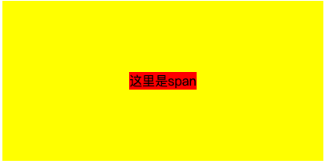

# CSS 篇

### 1.1 重要概念与属性

问 ❓：BFC 是什么？有什么作用？

> 答：BFC 是**块级格式化上下文**，是**页面中可视 CSS 渲染的一部分**，可以理解为一个相对独立的布局区域。
>
> 可以解决**让浮动元素高度塌陷**、**上下 margin 折叠**等问题；

问 ❓：link 与 @import 的区别？

> 答：<1> 类别不同：link 是 HTML 标签，@import 是 css 语法
>
> <2>加载顺序：页面加载时 link 会和 html 同时被加载；@import 引入的 CSS 将在页面加载完毕后被加载；
>
> <3>优先级：link 引入的优先级高于@import；因为 @import 引入的内容会被放在 css 文件的顶部
>
> <4>DOM 操作权: JS 可以通过 DOM 操作新建 link 标签的方式引入样式；@import 不行

问 ❓：rem、em 与 vh 的区别？

> 答：
>
> **1rem**是等于根元素\<html\>字体大小
>
> **1em**等于父元素字体大小
>
> **1vh**等于“视口”高度的 1%；

问 ❓：如何理解 Flex（弹性） 布局？

> 答：<1> Flex 布局把布局元素分为**Flex 容器**和**Flex 元素**两部分
>
> <2>通过<code style="color: #708090; background-color: #F5F5F5; font-size: 18px">Flex 容器</code>可以控制容器内所有<code style="color: #708090; background-color: #F5F5F5; font-size: 18px">Flex 元素</code>在**主轴**和**交叉轴**的整体布局。
>
> <3>通过单独控制<code style="color: #708090; background-color: #F5F5F5; font-size: 18px">Flex 元素</code>的属性可以控制单个<code style="color: #708090; background-color: #F5F5F5; font-size: 18px">Flex 元素</code>的布局和剩余空间占用情况。
>
> [Flex 属性速查](https://www.processon.com/view/link/603dfb0d1e085353231ae05d)

问 ❓：CSS transform 属性熟悉吗？

> CSS <code style="color: #708090; background-color: #F5F5F5; font-size: 18px">transform</code> 属性允许你**旋转**，**缩放**，**倾斜**或**平移**给定元素。
>
> translate(水平垂直方向**平移**)、scale(水平垂直方向**缩放**)、skew(水平垂直方向**倾斜**)、rotate(绕元素中心旋转，如：90deg)、scale(绕中心缩放，如：0.5 为缩小为一半)
>
> **matrix(矩阵)**方法可以实现任何上面的组合效果；
>
> 注意 ⚠️：
>
> 1.transform 只能转化 {display: block;} 的元素。
>
> 2.transform 并不是都会启动 GPU 加速，3D transforms (transform: translateZ(), rotate3d())才会启动加速

问 ❓：了解什么是<code style="color: #708090; background-color: #F5F5F5; font-size: 18px">包含块</code>吗？

> 答：多说情况下，包含块是这个元素**最近的祖先块元素**的**内容区**，元素的尺寸、位置百分比计算是根据**包含块**来确定的。
>
> 主要知识点：
>
> <1>position 属性为 static | relative | sticky 时，包含块一般由**它的最近的祖先块元素**的**内容边缘**组成
>
> <2>position 属性为 absolute,包含块就是由它的**最近的 position 不是 static 的祖先元素**的**内容边缘**组成
>
> <3>position 属性是 fixed，包含块为**可视视口**

### 1.2 水平垂直居中

问 ❓：已知父元素宽高，子元素宽高**未知**，如何实现子元素“水平垂直居中”？（腾讯一面原题）

> 答：
>
> 1.Flex 布局，给**父元素**设置：

```css
 {
  display: flex;
  justify-content: center;
  align-items: center;
}
```

> 2.绝对定位 + transform 偏移， 如：**父元素**：{position: relative;},**子元素**如下，

```css
 {
  position: absolute;
  left: 50%;
  top: 50%;
  transform: translate(-50%, -50%);
}
```

以上 👆 两种布局，适用于任何情况。

如果子元素是**inline**或**inline-block**级别元素：⬇️

> 3.直接给**父元素**设置：{text-align: center;}, 给**子元素**设置 {line-height: 父元素高度;}

```html
<div class="container">
  <span class="child">这里是span</span>
</div>
```

```css
.container {
  width: 400px;
  height: 200px;
  background: yellow;
  /*  使 span 居中  */
  text-align: center;
}

.child {
  background: red;
  line-height: 200px;
}
```

_效果如下_



如果子元素是**块**级别元素：⬇️

```html
<div class="container">
  <div class="child">这里是div</div>
</div>
```

问 ❓：已知父元素宽高，子元素宽高**也已知**，如何实现子元素“水平垂直居中”？

> 答：上面的方法对**子元素宽度已知**都是有效的，已知**子元素**宽高的话还可以使用下面的方法。
>
> 1.绝对定位 + margin 偏移，给**父元素**：{position: relative;},**子元素**设置如下：

```css
 {
  position: absolute;
  left: 50%;
  top: 50%;
  width: 6em;
  height: 8em;
  margin-top: -4em;
  margin-left: -3em;
}
```

或者省略“margin-top”和“margin-left”，使用<code style="color: #708090; background-color: #F5F5F5; font-size: 18px">calc()</code>直接计算出前居中位置：

```css
 {
  position: absolute;
  left: calc(50% - 3em);
  top: calc(50% - 4em);
  width: 6em;
  height: 8em;
}
```

> 2.绝对定位 + margin: auto; **父元素**：{position: relative;},**子元素**如下：

```css
 {
  background: red;
  width: 100px;
  height: 100px;
  margin: auto;
  position: absolute;
  top: 0;
  left: 0;
  right: 0;
  bottom: 0;
}
```

---

**总结**：

- Flex 元素天生适合"水平、垂直居中"布局；
- 其他方案主要分为两步：
  - 1. 先把子元素的“左上顶点”移动到父元素的中心点
    - 绝对定位方案
  - 2. 偏移子元素
    - **子元素宽高未知**：可以用**transform**偏移
    - **子元素宽高已知**：可以用**负 margin**偏移

---

问 ❓：如何实现一个“垂直水平居中”的弹窗？

> 答：一般有 3 种方案：
>
> <1>固定定位（fixed）**遮罩层**，绝对定位**弹窗**

_HTML 元素_

```html
<!-- 遮罩层 -->
<div class="bg">
  <!-- 弹窗 -->
  <div class="pop"></div>
</div>
```

_方案 1：绝对定位 + transform_

```css
/* 遮罩层 */
.bg {
  position: fixed;
  left: 0;
  top: 0;
  width: 100%;
  height: 100%;
  background: rgba(0, 0, 0, 0.3);
}
/* 弹窗 */
.pop {
  position: absolute;
  left: 50%;
  top: 50%;
  transform: translate(-50%, -50%);
  /* 默认宽高，可修改 */
  width: 500px;
  height: 500px;
}
```

_方案 2:使用视口单位 vh + transform_

```css
.pop {
  margin: 50vh auto 0;
  transform: translate(-50%, -50%);
  width: 100px;
  height: 100px;
  border: 1px solid red;
}
```

### 1.3 清除浮动

问 ❓：如何清除浮动？

> 方案 1：叫做**clearfix**,即：给 container 添加**伪元素** ，并给其**clear：both;**

```css
#container::after {
  content: "";
  display: block;
  clear: both;
}
```

> 方案 2：触发父元素形成**BFC**

```css
#container {
  overflow: auto;
  /* 或 */
  display: flow-root;
  /* 或 */
  display: inline-block;
}
```

### 1.4 长度单位问题：rem、em、vh、vw、100%

问 ❓：rem与em和px区别？

> px是绝对数值，只和屏幕像素有关；
>
> em是和rem是相对长度，em相对于自身元素的字体大小（font-size: 1em则是相对于父元素字体大小）；
>
> rem相对于跟元素\<html\>字体大小。

问 ❓：vh包含不包含浏览器标签栏？

> 答：不包括，隐藏标签栏会影响vh的计算，如果使用了vh布局等，会受到影响。

问 ❓：width 100%是相对于谁？

> 相对于父元素的同一属性的值。如：font-size相对于的父元素的font-size,with相对于父元素的width;
