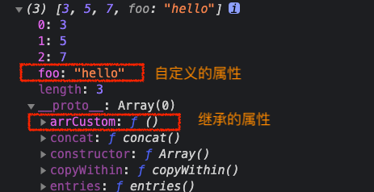

# JS 篇

### 2.1 重要概念及 API 等

问 ❓：var、let、const 有什么区别？（腾讯一面原题）

> 答：let 和 const 在块级作用域内有效，let 和 const 的区别是 const 定义常量一样，定义后不可以重新赋值。
>
> 在代码执行执行的编译时，var 定义的变量在赋值之前为 _undefined_，let 和 const 在赋值之前为*uninitialized*；
>
> let 和 const 定义的变量在赋值前不能访问，会**未定义**报错。

问 ❓：for...in 与 for...of 区别？

> <code style="color: #708090; background-color: #F5F5F5; font-size: 18px">for...in</code>遍历对象除*Symbol*以外的**可枚举**属性,包括继承的可枚举属性；
>
> <code style="color: #708090; background-color: #F5F5F5; font-size: 18px">for...of</code>语句在**可迭代对象**上创建一个迭代循环；

_示例_

```js
Object.prototype.objCustom = function () {};
Array.prototype.arrCustom = function () {};

let iterable = [3, 5, 7];
iterable.foo = "hello";

for (let i in iterable) {
  console.log(i);
}
// 打印结果： 0, 1, 2, "foo", "arrCustom", "objCustom"
// objCustom 和 arrCustom 是 iterable 继承的属性
// foo 是直接定义在 iterable 的属性

for (let i of iterable) {
  console.log(i);
}
// 打印结果：3, 5, 7
```

_iterable 图示_



问 ❓：for 与 Array.prototype.forEach() 区别？

> 答：区别主要有两点：
>
> 1.<code style="color: #708090; background-color: #F5F5F5; font-size: 18px">forEach</code>是 Array.prototype 上的方法，只能循环数组；
>
> 2.<code style="color: #708090; background-color: #F5F5F5; font-size: 18px">for 循环</code>可以跳出循环，⚠️<code style="color: #708090; background-color: #F5F5F5; font-size: 18px">forEach</code>除了抛出异常以外，**没有办法中止或跳出 forEach() 循环**。；

问 ❓：Map 与 Object 区别？

> 答：1.Object 是无序的集合，Map 保证了遍历的有序性；
>
> 2.Map 可以使用任意数据类型作为“键”，Object 只能使用字符串；
>
> 3.Object 查询性能略好，Map 的增、删、改性能更好。

### 2.2 异步与 Event Loop

问 ❓：下面代码打印结果是什么？为什么？（腾讯一面原题）

```js
Promise.resolve().then(() => {
  console.log("P1");
  setTimeout(() => {
    console.log("S2");
  }, 0);
});

setTimeout(() => {
  console.log("S1");
  Promise.resolve().then(() => {
    console.log("P2");
  });
}, 0);

console.log(1);
```

> 答：1, P1，S1，P2，S2。
>
> 1. 整个代码片段是个宏任务，进行第一个**事件循环**，开始执行里面代码，往<code style="color: #708090; background-color: #F5F5F5; font-size: 18px">微任务队列</code>添加了一个**微任务**（.then()里的回调函数，我们叫它 Promise1）；同时，往<code style="color: #708090; background-color: #F5F5F5; font-size: 18px">宏任务队列</code>添加了一个**宏任务**（下方 setTimeout 里的回调，我们叫它 Time1）
>
> 2. 执行到 console.log(1)，会直接打印 1；
>
> 3. 然后，依次执行<code style="color: #708090; background-color: #F5F5F5; font-size: 18px">微任务队列</code>里所有**微任务**，微任务只有一个 Promise1，所以会打印 "P1"；同时，添加一个新的**宏任务**（setTimeout 的回调，我们叫它 Time2）到宏任务队列
>
> 4. 执行完微任务 Promise1 后，<code style="color: #708090; background-color: #F5F5F5; font-size: 18px">宏任务队列</code>上有两个**宏任务**，分别是 Time1 和 Time2; 先执行 Time 1，会打印 "S1";同时，添加了一个**微任务**（我们叫他 Promise2）到<code style="color: #708090; background-color: #F5F5F5; font-size: 18px">微任务队列</code>；
>
> 5. 此时，<code style="color: #708090; background-color: #F5F5F5; font-size: 18px">微任务队列</code>有一个 Promise2；宏任务队列还有一个没执行的 Time2;先执行 Promise2，所以会打印“P2”;
>
> 6. 最后，只剩下 <code style="color: #708090; background-color: #F5F5F5; font-size: 18px">宏任务队列</code>上的 Time2，所以，打印“S2”.

升级版：

```js
Promise.resolve()
  .then(() => {
    console.log("P1");
    setTimeout(() => {
      console.log("S2");
    }, 0);
  })
  .then(() => {
    console.log(3);
    setTimeout(() => {
      console.log("S3");
    }, 0);
  });

setTimeout(() => {
  console.log("S1");
  Promise.resolve().then(() => {
    console.log("P2");
  });
}, 0);

console.log(1);
```

> 打印：1，P1，3，S1，P2，S2，S3
>
> 简述：先执行同步，分别往**微任务队列**和**宏任务队列**各添加一个任务，打印 1 ，同步执行结束 --> 然后，开始下一轮事件循环，执行**微任务**，所以打印 P2,然后添加 S2 到**宏任务队列**，继续执行微任务，打印 3，添加 S3 到**宏任务队列** --> 然后依次执行，S1，S2,S3。因为执行 S1 时，新增了微任务 P2,所以，打印顺序为 S1,P2,S2,S3。
