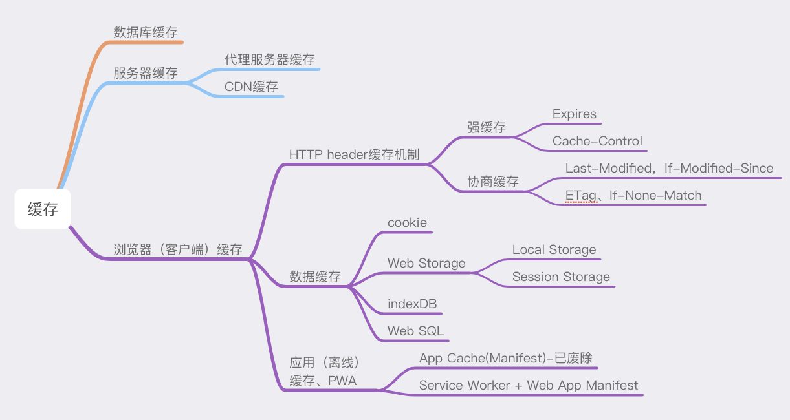
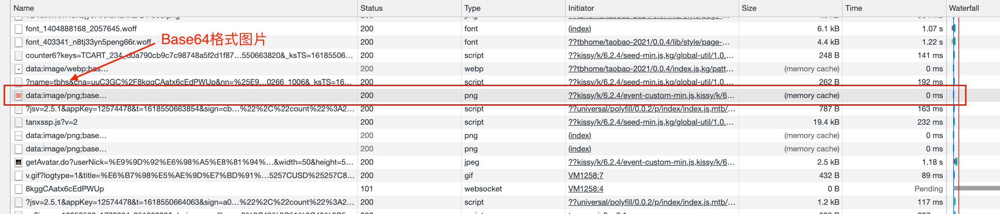
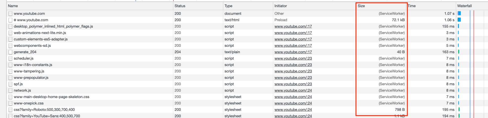
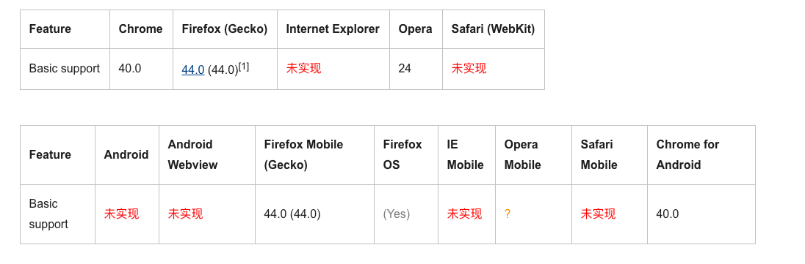
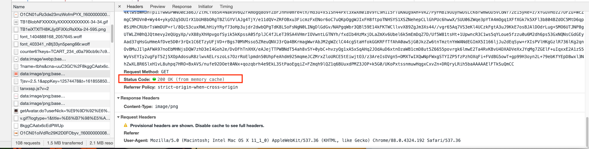
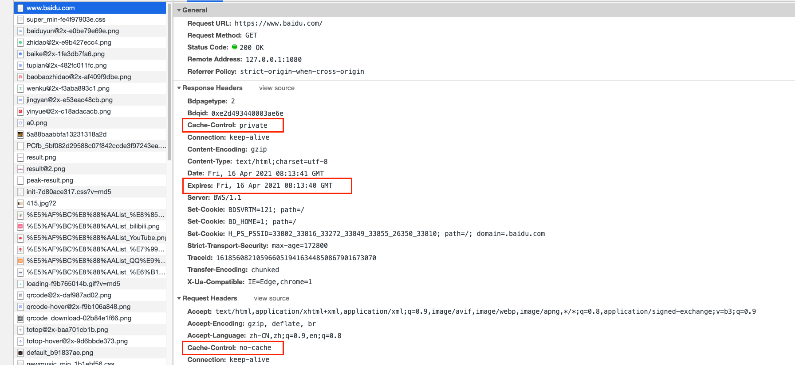
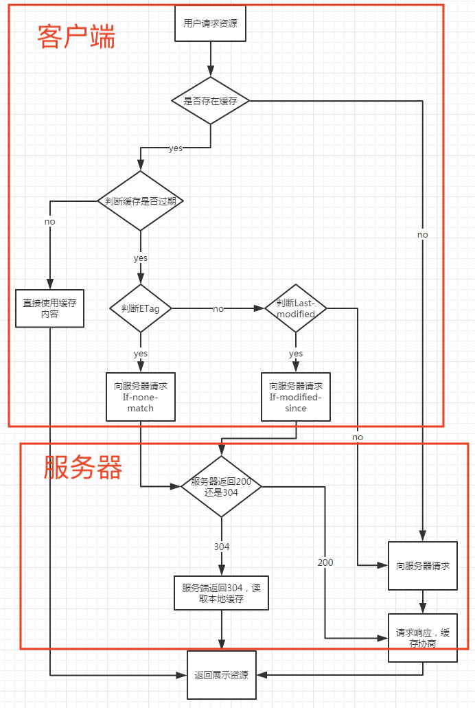

# 浏览器缓存

> 缓存是为了提高性能。

**缓存分类：**



<code style="color: #708090; background-color: #F5F5F5; font-size: 18px">缓存</code>可以**减少网络 IO 消耗**，提高访问速度。

浏览器缓存是其中一种，也叫做客户端缓存或 Web 缓存。

## 1. 浏览器缓存

**浏览器缓存**是指一个 Web 资源（如 html 页面，图片，js，数据等）存在于 Web 服务器和客户端（浏览器）之间的<code style="color: #708090; background-color: #F5F5F5; font-size: 18px">副本</code>.

缓存会根据进来的请求保存输出内容的副本；

当下一个请求来到的时候，如果是相同的 URL，缓存会根据缓存机制决定是直接使用副本响应访问请求，还是向源服务器再次发送请求。

## 2. 浏览器缓存

**浏览器缓存分为四个方面：**

（请求的优先级排序）

- 1. Memory Cache
- 2. Disk Cache(HTTP Cache)
- 3. ServiceWorker Cache
- 4. Push Cache

_淘宝网使用 Memory Cache 缓存示例：_



_YouTube 使用 ServiceWorker 缓存示例：_



## 3. Memory 缓存

<code style="color: #708090; background-color: #F5F5F5; font-size: 18px">Memory 缓存</code>是指存在内存中的缓存。从优先级上来说，它是浏览器最先尝试去命中的一种缓存。

从效率上来说，它是响应速度最快的一种缓存。

内存缓存是快的，也是“短命”的。

当进程结束后，也就是 tab 关闭以后，内存里的数据也将不复存在。

**那么哪些文件会被放入内存呢？**

目前没有具体的定论，通常是浏览器来做处理，根据日常开发经验，Base64 格式图片会被放入 memory cache，还有体积比较小的静态文件（如 JS、CSS）也有可能被放进 memory cache，大一些的文件是不会放入 memory cache 的，毕竟内存资源太宝贵。

## 4. Disk 缓存

Disk Cache 是存储在硬盘中的缓存，读取速度比 Memory Cache 稍慢，但是**容量**和**时效性**较 Memory Cache 更好。

Disk Cache 不会随着浏览器 Tab 页关闭而释放。

在所有的浏览器缓存中，Disk Cache 覆盖面基本是最大的。

他会根据 HTTP Header 中的字段判断哪些资源需要缓存，哪些资源不请求直接使用，哪些资源已经过期需要重新请求，即 <span style="color: #ff0000; font-size: 16px;">HTTP 协议头中的缓存字段主要影响的是 Disk Cache，因此，可以把 Disk Cache 看作是 HTTP Cache</span>。

## 5. ServiceWorker 缓存

<code style="color: #708090; background-color: #F5F5F5; font-size: 18px">ServiceWorker</code> 是一种独立于主线程之外的 Javascript 线程。

它脱离于浏览器窗体，因此无法直接访问 DOM。

这样**独立**的个性使得 ServiceWorker 的“个人行为”**不会影响页面的性能**。

上面第二张图片，youtube 使用了 ServiceWorker cache。

**作用：**

- 可以帮我们实现**离线缓存**，这是一种我们可以充分控制的缓存
- 消息推送
- 网络代理等功能

<code style="color: #708090; background-color: #F5F5F5; font-size: 18px">ServiceWorker</code> 的生命周期包括 <code style="color: #708090; background-color: #F5F5F5; font-size: 18px">install</code>、<code style="color: #708090; background-color: #F5F5F5; font-size: 18px">active</code>、<code style="color: #708090; background-color: #F5F5F5; font-size: 18px">working</code> 三个阶段。

一旦 ServiceWorker 被 install，它将始终存在，只会在 active 与 working 之间切换，除非我们主动终止它。

注意 ⚠️：

> 1. 目前 ServiceWorker 是一个实验功能，Chrome 实现了它，Youtube 也在使用。
> 2. ServerWorker 对协议是有要求的，必须以 https 协议为前提。

_ServiceWorker 兼容性不是很好：_



### 5.1 ServiceWork 实现离线缓存

_引入 ServiceWorker:_

```js
if ("serviceWorker" in navigator) {
  navigator.serviceWorker
    .register("service-worker.js", {
      scope: "./",
    })
    .then(function (registration) {
      var serviceWorker;
      if (registration.installing) {
        serviceWorker = registration.installing;
        document.querySelector("#kind").textContent = "installing";
      } else if (registration.waiting) {
        serviceWorker = registration.waiting;
        document.querySelector("#kind").textContent = "waiting";
      } else if (registration.active) {
        serviceWorker = registration.active;
        document.querySelector("#kind").textContent = "active";
      }
      if (serviceWorker) {
        // logState(serviceWorker.state);
        serviceWorker.addEventListener("statechange", function (e) {
          // logState(e.target.state);
        });
      }
    })
    .catch(function (error) {
      // Something went wrong during registration. The service-worker.js file
      // might be unavailable or contain a syntax error.
    });
} else {
  // The current browser doesn't support service workers.
}
```

_在 service-worker.js 中设置缓存文件：_

```js
// Service Worker会监听 install事件，我们在其对应的回调里可以实现初始化的逻辑
self.addEventListener("install", (event) => {
  event.waitUntil(
    // 考虑到缓存也需要更新，open内传入的参数为缓存的版本号
    caches.open("test-v1").then((cache) => {
      return cache.addAll([
        // 此处传入指定的需缓存的文件名
        "/test.html",
        "/test.css",
        "/test.js",
      ]);
    })
  );
});

// Service Worker会监听所有的网络请求，网络请求的产生触发的是fetch事件，我们可以在其对应的监听函数中实现对请求的拦截，进而判断是否有对应到该请求的缓存，实现从Service Worker中取到缓存的目的
self.addEventListener("fetch", (event) => {
  event.respondWith(
    // caches 是一个 ServiceWorkerGlobalScope 接口的只读属性，返回与当前service worker相关联的CacheStorage对象
    // 尝试匹配该请求对应的缓存值
    caches.match(event.request).then((res) => {
      // 如果匹配到了，调用Server Worker缓存
      if (res) {
        return res;
      }
      // 如果没匹配到，向服务端发起这个资源请求
      return fetch(event.request).then((response) => {
        if (!response || response.status !== 200) {
          return response;
        }
        // 请求成功的话，将请求缓存起来。
        caches.open("test-v1").then(function (cache) {
          cache.put(event.request, response);
        });
        return response.clone();
      });
    })
  );
});
```

## 6. Push 缓存

<code style="color: #708090; background-color: #F5F5F5; font-size: 18px">Push Cache</code> 是指 HTTP2 在 server push 阶段存在的缓存。

- Push Cache 是缓存的最后一道防线。浏览器只有在 Service Worker Cache、 Memory Cache、Disk Cache 均未命中的情况下才会去询问 Push Cache。
- Push Cache 是一种存在于会话阶段的缓存，当 session 终止时，缓存也随之释放。
- 不同的页面只要共享了同一个 HTTP2 连接，那么它们就可以共享同一个 Push Cache。

## 7. HTTP 实现缓存

通常我们说的浏览器缓存都是**HTTP 缓存**。

缓存的行为由 <code style="color: #708090; background-color: #F5F5F5; font-size: 18px">request headers(请求头) </code>和 <code style="color: #708090; background-color: #F5F5F5; font-size: 18px">response headers（响应头）</code>的组合控制。

**HTTP 缓存可以分为两类：**

- 强缓存：优先级较高，浏览器加载资源时**如果命中强缓存**，则**直接从缓存中读取**
- 协商缓存：在命中强缓存失败的情况下，才会走协商缓存，请求头通过设置 **Last-Modified**和**ETag**验证资源是否命中协商缓存，服务器会返回 304

注意 ⚠️：🌟

> 1. HTTP 缓存一般只针对 GET 请求。
> 2. 可以看出，强缓存和协商缓存都是从客户端缓存中加载资源

### 7.1 HTTP 强缓存

强缓存是利用 http 头中的 <code style="color: #708090; background-color: #F5F5F5; font-size: 18px">Expires</code> 和 <code style="color: #708090; background-color: #F5F5F5; font-size: 18px">Cache-Control</code> 两个字段来控制的。

强缓存中，当请求再次发出时，浏览器会根据其中的 expires 和 cache-control 判断目标资源是否“命中”强缓存，若命中则直接从缓存中获取资源，**不会再与服务端发生通信**。

_淘宝缓存 Base64 二维码图片返回 HTTP 信息：_



### 7.2 HTTP 强缓存实现

- Cache-Control: 被用于在 http **请求**和**响应**中，通过指定指令来**实现缓存机制**
- Expires：HTTP 的 Response Headers 包含的一个日期 时间戳， 即**在此时候之后，响应过期**

> HTTP1.1 标准试图将缓存相关配置收敛进 Cache-Control 这样的大背景下， max-age 可以视作是对 expires 能力的补位/替换。
> 如果你的应用对向下兼容有强诉求，那么 expires 仍然是不可缺少的。

*www.baidu.com 的 HTTP headers:*



```js
// Response Headers
Cache-Control: private
Expires: Fri, 16 Apr 2021 08:13:40 GMT
```

#### 7.2.1 Cache-Control

**请求指令：**

```js
Cache-control: no-store -> 不使用任何缓存
Cache-control: no-cache -> 绕开浏览器缓存，直接发起HTTP请求到服务器
Cache-control: no-transform
Cache-control: only-if-cached
Cache-Control: max-age=<seconds>
Cache-Control: max-stale[=<seconds>]
Cache-Control: min-fresh=<seconds>
```

**响应指令：**

```js
Cache-control: public -> 响应可以被任何对象缓存（如：发送请求的客户端、代理服务器等）
Cache-control: private（默认值） -> 响应只能被单个用户缓存，不能作为共享缓存（代理服务器不能缓存它）
Cache-control: no-cache
Cache-control: no-store
Cache-control: must-revalidate -> 该指令就意味着使用一个陈旧的资源时，必须先验证它的状态
Cache-control: no-transform
Cache-control: proxy-revalidate
Cache-Control: max-age=<seconds> -> 设置缓存存储最大周期（超过周期即算过期，时间是相对于请求时间）
Cache-control: s-maxage=<seconds> -> **优先级最高**，🌟 会覆盖 max-age 或 Expires；但只适用于public(共享缓存)，通常是服务器使用，private（私有缓存）则会忽略它
```

**注意**⚠️：

> public 不是默认值，但是如果同时设置了 max-age 和 s-maxage，则 s-maxage 也会生效

_示例：_

**禁止缓存：**发送如下**响应头**可以关闭缓存

```js
Cache-Control: no-store
```

**缓存静态资源：**应用中不会改变的资源（图像、CSS、JS 文件等），在**响应头**添加积极缓存

```js
Cache-Control:public, max-age=31536000
```

**缓存重新验证：**如下**响应头**表示客户端可以缓存资源，每次使用缓存资源前**必须重新验证**其有效性，意味着每次都会发起 HTTP 请求，如果缓存仍有效，则跳过 HTTP 响应体的下载

```js
Cache-Control: no-cache
Cache-Control: max-age=0
```

#### 7.2.2 Expires

**HTTP 响应头**中可以设置该指令，合法的 Expires 是一个**即将到来的时间戳**。

```js
// 无效
Expires: 0
// 无效(过期时间戳)
Expires: Wed, 21 Oct 2015 07:28:00 GMT
```

注意 ⚠️：

如果在<code style="color: #708090; background-color: #F5F5F5; font-size: 18px">Cache-Control</code>响应头设置了**max-age** 或者 **s-max-age** 指令，那么 Expires 头会被忽略。

### 7.3 HTTP 协商缓存

**浏览器与服务器合作**下的缓存策略。

#### 7.3.1 Last-Modified 和 If-Modified-Since

- Last-Modified: 缓存上次修改的时间，如果本地打开了缓存文件，则会造成 Last-Modified 被修改，所以，**HTTP/1.1 中出现了 ETag**.
- If-Modified-Since: 请求头字段，代表上次服务器返回的 Last-Modified 的值

#### 7.3.2 ETag 和 If-None-Match

- ETag： 每次资源修改都会修改 ETag，所以 ETag 保证了资源的唯一
- If-None-Match： 请求头字段，代表上次服务器返回的 ETag 的值，服务器通过验证 ETag 判断是否返回新的资源

服务器提示缓存源未改动（Not Modified）,资源会重定向到浏览器缓存，这种情况下网络请求对应的状态码是**304**。

_服务器检查资源未发生变化时返回 304:_


**注意**⚠️：

> 1. ETag 优先级更高

_协商缓存整体流程：_



## 8. 手动实现一个 Node.js 协商缓存

```js
const http = require("http");
const fs = require("fs");
const path = require("path");
const mime = require("mime");
const etag = require("etag");

http
  .createServer((request, response) => {
    // 解析请求路径
    var pathname = __dirname + decodeURI(request.url);
    // 跳转默认页面
    if (pathname === __dirname + "/") {
      pathname = __dirname + "/index.html";
    }

    fs.exists(pathname, (exists) => {
      // 如果资源存在，处理请求
      if (exists) {
        // 读取请求文件
        fs.readFile(pathname, (err, data) => {
          if (err) console.error(err.stack);

          // 获取文件当前的 Etag
          const Etag = etag(data);

          // 如果当前文件 Etag 与请求的 Etag 相同，返回 304 命中协商缓存
          if (Etag === request.headers["if-none-match"]) {
            response.statusCode = 304;
          } else {
            // 如果 Etag 不相同或者第一次请求文件，则返回静态资源并更新 Etag
            response.setHeader("Cache-Control", "no-cache");
            response.setHeader("Etag", Etag);
            response.writeHead(200, {
              "Content-Type": mime.getType(pathname),
            });
            response.on("error", (err) => {
              console.error(err.stack);
            });
            response.write(data);
          }
          response.end();
        });
        // 如果资源不存在，返回 404
      } else {
        response.writeHead(404, {
          "Content-Type": "text/plain;charset=utf-8",
        });
        response.end(path.basename(pathname) + "\n文件不存在！");
      }
    });
  })
  .listen(8080);

console.log("server is listening on port: 8080");
```

## 参考

[HTTP 缓存 -- MDN](https://developer.mozilla.org/zh-CN/docs/Web/HTTP/Caching)

[Cache-Control -- MDN](https://developer.mozilla.org/zh-CN/docs/Web/HTTP/Headers/Cache-Control)

[Expires -- MDN](https://developer.mozilla.org/zh-CN/docs/Web/HTTP/Headers/Expires)

[ServiceWorker --MDN](https://developer.mozilla.org/zh-CN/docs/Web/API/ServiceWorker#browser_compatibility)

[Prevent unnecessary network requests with the HTTP Cache](https://web.dev/http-cache/)

[Service worker caching and HTTP caching](https://web.dev/service-worker-caching-and-http-caching/)

[缓存总览：从性能优化的角度看缓存](https://github.com/amandakelake/blog/issues/43)
