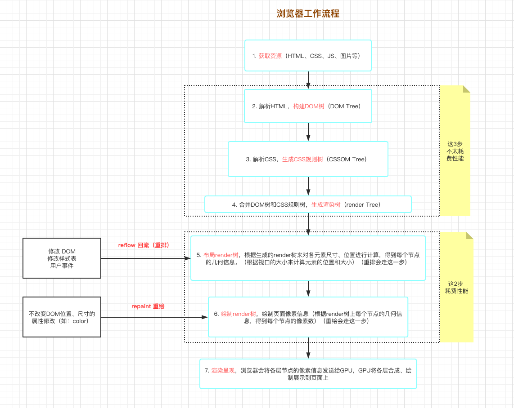

# DOM 操作与 reflow(回流) 和 repaint(重绘）

## 1. 弄清楚 EcmaScript 和 DOM 的关系

浏览器中的 JavaScript 由三部分组成：

- EcmaScript：
- DOM：是 HTML 和 XML 文档的编程接口，它会将 web 页面和脚本或程序语言连接起来。
- BOM：


**EcmaScript 和 DOM 有什么关系 ❓**

答：**没关系**。

**什么是 DOM 操作呢 ❓**

答：**DOM 是 web 页面的完全的面向对象表述，它能够使用如 JavaScript、Python 等脚本语言进行修改，这种修改就是 DOM 操作。**

**如何访问 DOM❓**

不同的浏览器都有对 DOM 不同的实现，通常都可以使用 <code style="color: #708090; background-color: #F5F5F5; font-size: 18px">document</code> 或 <code style="color: #708090; background-color: #F5F5F5; font-size: 18px">window</code> 元素的 API 来操作文档本身或获取文档的子类（web 页面中的各种元素）。

_一些常见的 DOM API：_

```js
document.getElementById(id);
document.getElementsByTagName(name);
document.createElement(name);
parentNode.appendChild(node);
element.innerHTML;
element.style.left;
element.setAttribute();
element.getAttribute();
element.addEventListener();
window.content;
window.onload;
```

## 2. DOM 操作的实质

DOM 和 EcmaScript 没什么关系，浏览器帮我们实现了 DOM API，因此我们可以操作 DOM。

所以，操作 DOM 本质中上是浏览器在干活。

浏览器的 JS 引擎会调度 CPU、GPU 来完成我们的具体的任务。

浏览器每执行一次 DOM 操作都会连接 ES 与 DOM，所以**ES 与 DOM 每次连接都需要消耗性能**。

DOM 操作分为两步：

- **访问 DOM**：要建立 ES 与 DOM 的连接，**消耗性能**
- **修改 DOM**：会导致浏览器重新计算页面的几何变化、引发浏览器模板引擎的<span style="color: #ff0000; font-size: 16px;">重排(回流 - 回滚流程)</span>和<span style="color: #ff0000; font-size: 16px;">重绘</span>，进而**更加消耗性能**。

## 3. 浏览器渲染引擎的工作原理和工作流程

浏览器下载完页面中的所有资源（比如 HTML、JavaScript、CSS、图片等）后，会发生如下的 6 步过程：



_渲染流程图示：_


### 3.1 reflow（重排/回流）

DOM 中元素几何尺寸发生了变化，浏览器需要重新排列所有元素，这就叫<code style="color: #708090; background-color: #F5F5F5; font-size: 18px">重排</code> 或 <code style="color: #708090; background-color: #F5F5F5; font-size: 18px">回流</code>。

**导致重排的因素：**

- 1. 修改 DOM

  DOM 增、删、修改尺寸等；

  内容改变：如文本内容发生变化【计算会消耗 CPU】；

- 2. 修改样式表

- 3. 用户事件（比如鼠标悬停、页面滚动、输入框键入文字、改变窗口大小等等）

  改变窗口大小【计算会消耗 GPU】

### 3.2 repaint（重绘）

**除元素尺寸、位置属性发生改变以外的其他属性变化，（比如字体颜色、背景色等发生改变）。**

有一点要明确，从上图可以看出，<span style="color: #ff0000; font-size: 16px;">任何 reflow 都会引起 repaint</span>.

## 4. 聪明的浏览器与愚蠢的人类

现代浏览器在设计上大都进行了性能优化，会智能的<code style="color: #708090; background-color: #F5F5F5; font-size: 18px">节流</code>操作 DOM，比如**实现队列化修改**、**批量执行**。

解释来说就是，浏览器会有一个“队列”，用以存放（攒着）需要操作 DOM 的 js 程序。

每当执行一次 js 操作 dom 的代码，这个队列里就先暂存一个程序。

等到一段时间后，浏览器再集中、批量的链接一次"ES 岛"和"DOM 岛"（就是让 JS 引擎去链接渲染引擎），进而触发一次 DOM 操作。

你可以形象的理解为“过一段时间发一班车”。

**但，愚蠢的人类往往需要打断浏览器的“节流”，浏览器不得不中断当前的“等待”，去赶紧、立马进行一次 dom 操作，如下属性的操作会强迫触发重排：**

- offsetTop/offsetLeft/offsetWidth/offsetHeight
- scrollTop/scrollLeft/scrollWidth/scrollHeight
- clientTop/clientLeft/clientWidth/clientHeight
- getComputedStyle()

## 5. 为何要减少 reflow 和 repaint

答案显而易见，<span style="color: #ff0000; font-size: 16px;">为了性能</span>。

**重排会占用 CPU**，dom 元素位置计算会消耗 CPU 的算力，所以应该尽量减少 CPU 的占用，使电脑不卡顿。
**重绘会占用 GPU**，渲染页面时会消耗 GPU 的算力。

## 6. 如何减少 reflow 和 repaint

减少 reflow 和 repaint 是一种性能优化。

### 6.1 函数的节流与防抖

导致<code style="color: #708090; background-color: #F5F5F5; font-size: 18px">重绘</code>的原因有 3 个，<code style="color: #708090; background-color: #F5F5F5; font-size: 18px">DOM 操作</code>和 <code style="color: #708090; background-color: #F5F5F5; font-size: 18px">修改 CSS</code> 我们往往无法避免，但是我们可以减少<code style="color: #708090; background-color: #F5F5F5; font-size: 18px">用户事件执行频率，这种减少用户执行频率的性能优化方法叫**“函数防抖”**。

**函数防抖：**

[防抖](https://zh-hans.reactjs.org/docs/faq-functions.html#debounce)确保函数不会在上一次被调用之后一定量的时间内被执行。

对一些一些费时的计算来**响应快速派发的事件**时（比如鼠标滚动或键盘事件时），防抖是非常有用的。

**防抖场景：**

触发一次即可。

- 搜索框搜索输入。只需用户最后一次输入完，再发送请求
- 手机号、邮箱验证输入检测
- 窗口大小 Resize。只需窗口调整完成后，计算窗口大小。防止重复渲染。

_以 250ms 的延迟来改变文本输入：_

```js
import debounce from "lodash.debounce";

class Searchbox extends React.Component {
  constructor(props) {
    super(props);
    this.handleChange = this.handleChange.bind(this);
    this.emitChangeDebounced = debounce(this.emitChange, 250);
  }

  componentWillUnmount() {
    this.emitChangeDebounced.cancel();
  }

  render() {
    return (
      <input
        type="text"
        onChange={this.handleChange}
        placeholder="Search..."
        defaultValue={this.props.value}
      />
    );
  }

  handleChange(e) {
    this.emitChangeDebounced(e.target.value);
  }

  emitChange(value) {
    this.props.onChange(value);
  }
}
```

**函数节流：**

[节流](https://zh-hans.reactjs.org/docs/faq-functions.html#throttle)阻止函数在给定时间窗口内被调不能超过一次。

**节流场景：**

触发一次后，一段时间内不允许再次触发。

- 滚动加载，加载更多或滚到底部监听
- 谷歌搜索框，搜索联想功能
- 高频点击提交，表单重复提交

_节流 “click” 事件处理器，使其每秒钟的只能调用一次:_

```js
import throttle from "lodash.throttle";

class LoadMoreButton extends React.Component {
  constructor(props) {
    super(props);
    this.handleClick = this.handleClick.bind(this);
    this.handleClickThrottled = throttle(this.handleClick, 1000);
  }

  componentWillUnmount() {
    this.handleClickThrottled.cancel();
  }

  render() {
    return <button onClick={this.handleClickThrottled}>Load More</button>;
  }

  handleClick() {
    this.props.loadMore();
  }
}
```

**区别：**

函数防抖 关注一定时间连续触发的事件只在**最后执行一次**，而函数节流侧重于**一段时间内只执行一次**。

```js

```

### 6.2 其他技巧

- DOM 的多个读操作（或多个写操作），应该放在一起。不要两个读操作之间，加入一个写操作
- 如果某个样式是通过重排得到的，那么最好缓存结果（如何缓存？？）
- 不要一条条地改变样式，而要通过改变 class，或者 csstext 属性，一次性地改变样式
- 尽量使用离线 DOM，而不是真实的网面 DOM，来改变元素样式（如：操作 Document Fragment 对象）
- 先将元素设为 display: none，然后执行 DOM 操作，最后再显示
- position 属性为 absolute 或 fixed 的元素，重排的开销会比较小
- 使用虚拟 DOM 的脚本库，比如 React 等（虚拟 DOM 相关问题请看 React 相关介绍）
- 使用 window.requestAnimationFrame()、window.requestIdleCallback()

---

外链：

[各 css 属性对重排重绘的影响](https://csstriggers.com/)

## 参考

[为什么操作 DOM 会影响 WEB 应用的性能 -- xing.org1^](https://www.cnblogs.com/padding1015/p/11405788.html)

[网页性能管理详解 -- 阮一峰](https://www.ruanyifeng.com/blog/2015/09/web-page-performance-in-depth.html)

[7 分钟理解 JS 的节流、防抖及使用场景](https://juejin.cn/post/6844903669389885453)

[DOM 概述 -- MDN](https://developer.mozilla.org/zh-CN/docs/Web/API/Document_Object_Model/Introduction)
