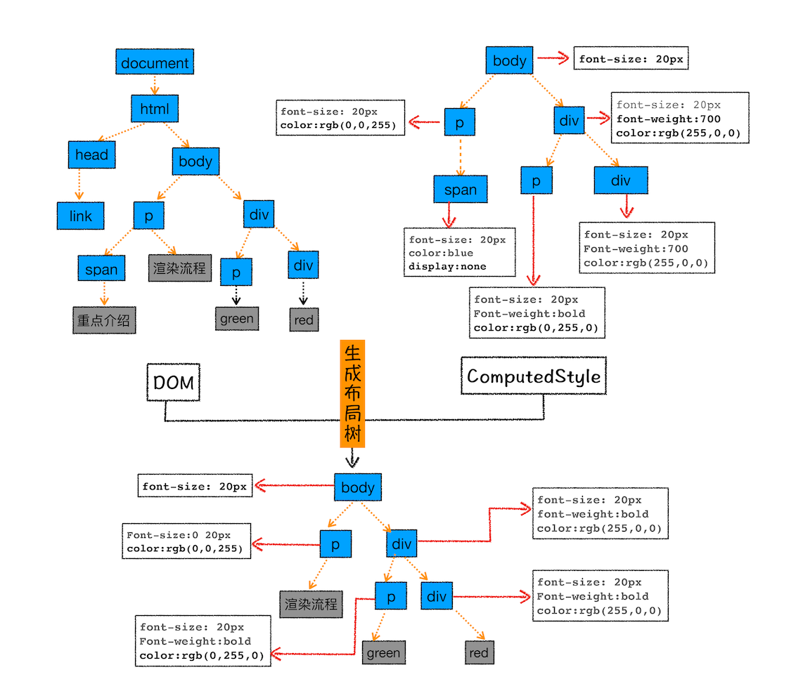

# 从一道经典的面试题看浏览器

> 问题：请说一下从输入 URL 到页面显示的过程？

这是个十分常见的前端面试题，几乎涵盖了前端所有内容，从这个问题几乎可以引申出任何前端问题。

## 1. Chrome 架构

想搞懂这个问题，就必须先认识一下浏览器。

### 1.1 启动 Chrome 开启了哪些进程

_启动一个 chrome 之后开启多个进程_


启动**Chrome**一共启动了 4 个进程，可以看到，**Chrome 是一个多进程架构的浏览器**。

_多进程浏览器架构_


**各进程的作用**：

- 浏览器进程

  主要负责**界面显示**、**用户交互**、**子进程管理**，同时提供**存储**等功能；

- 渲染进程（排版引擎 <code style="color: #708090; background-color: #F5F5F5; font-size: 18px">Blink</code> 和 JS 引擎 <code style="color: #708090; background-color: #F5F5F5; font-size: 18px">V8</code> 都在该进程）🌟🌟

  主要负责将 HTML、CSS 和 JavaScript 转换为可交互网页；

  每个 Tab 标签会创建一个**渲染进程**；

- GPU 进程

  CSS 3D 效果；

  某些 UI 界面采用 GPU 绘制；

- 网络进程

  主要负责**网页的网络资源加载**；

- 插件进程

  因为插件容易崩溃，所以，采用该进程来隔离；

> 采用多进程优点：快。
>
> 缺点：占用内存资源；

## 2. 从输入 URL 到页面显示详细流程

_整体流程_


_从 url 到页面_


_流程如下_

### 2.1 用户输入

用户输入**关键词**或**URL**并按下 Enter 键，浏览器会自动判断，并自动给**URL**补充协议，合成完整的**URL**。

### 2.2 URL 请求过程

**浏览器进程**会通过进程间通信（IPC）把 URL 请求发送至<code style="color: #708090; background-color: #F5F5F5; font-size: 18px">网络进程</code>；

<code style="color: #708090; background-color: #F5F5F5; font-size: 18px">网络进程</code>会查找本地缓存是否**缓存**了该资源；

有**缓存**则直接返回缓存结果，没缓存则“开启网络请求”流程；

_网络请求流程_

- 首先是 DNS 解析，获取域名服务器 IP 地址；
- 如果是 HTTPS 协议，还需要建立 TLS 连接；
- 利用 IP 地址和服务器建立 TCP 连接；
- 浏览器端会构建 HTTP 请求行、请求头等信息，并把和该域名相关的 Cookie 等数据附加到请求头中，然后向服务器发送构建的请求信息
- 服务器接收到请求信息后，会根据请求信息生成响应数据（包括响应行、响应头和响应体等信息）
- 浏览器<code style="color: #708090; background-color: #F5F5F5; font-size: 18px">网络进程</code>接收了响应行和响应头之后，就开始解析响应头的内容

**HTTP 请求流程**：


### 2.3 浏览器处理响应信息

- 1> 重定向

  如果返回的响应状态码为 301 或 302，说明需要**重定向**；

  <code style="color: #708090; background-color: #F5F5F5; font-size: 18px">网络进程</code>会从响应头的 Location 字段里面读取重定向的地址，然后再发起新的 HTTP 或者 HTTPS 请求，一切又重头开始了.

  

- 2> 响应数据类型处理

  如果返回的响应状态码为 200，说明**返回数据正常**，浏览器可以继续处理其他请求了；

  **Content-type**这一 HTTP 响应头字段会<span style="color: #ff0000; font-size: 16px;">告诉浏览器返回数据的类型</span>，然后浏览器会根据不同的数据类型来<span style="color: #ff0000; font-size: 16px;">决定如何显示响应体的内容</span>。

  ```js
  Content-Type:
    text/html （html页面）
    application/octet-stream （字节流，启动下载，关闭浏览器当前窗口）
  ```

### 2.4 准备渲染进程

如果返回的数据是 HTML 页面，则会做渲染工作。

渲染工作的第一步是**准备渲染进程**；

因为浏览器会**为每一个新页面创建一个渲染进程**；

如果新页面是同一个站点，如都是 bilibili，则新打开的页面和其他 bilibili 已经打开的页面在同一个<code style="color: #708090; background-color: #F5F5F5; font-size: 18px">渲染进程</code>；

### 2.5 提交文档

**提交文档**就是指浏览器进程将网络进程接收到的 HTML 数据提交给<code style="color: #708090; background-color: #F5F5F5; font-size: 18px">渲染进程</code>。

然后，<code style="color: #708090; background-color: #F5F5F5; font-size: 18px">渲染进程</code>会和<code style="color: #708090; background-color: #F5F5F5; font-size: 18px">网络进程</code>建立传输数据的“管道”；然后返回“确认提交”的消息。

最后，收到“确认消息”，<code style="color: #708090; background-color: #F5F5F5; font-size: 18px">浏览器进程</code>开始<span style="color: #ff0000; font-size: 16px;">更新页面</span>。

_浏览器进程更新页面_：


### 2.6 渲染阶段

<code style="color: #708090; background-color: #F5F5F5; font-size: 18px">渲染进程</code>在提交“确认信息”后开始**解析页面和子资源加载**。

渲染的流程很复杂，被分为多个子阶段。


_整体流程：_

- 构建 DOM 树

  即：将 HTML 转换为**DOM 树**，正式 DOM 树的存在，我们**才能使用 JS 通过来控制页面**。

  

- 样式计算

  1. 渲染引擎会把 CSS 文本转化为浏览器可以理解的 styleSheets(样式表，可以理解为老版浏览器的**CSS 树**)；
  2. 转换样式表中的属性值，使其标准化；
  3. 计算出 DOM 树中每个节点的具体样式

  

- 布局

  1. 创建布局树

  

  可以简单理解为老版浏览器的**渲染树**。

- 分层

  渲染引擎还需要为特定的节点生成专用的图层，并生成一棵对应的**图层树**（LayerTree）；

  像 PhotoShop 里的图层。

  

- 图层绘制

**渲染引擎**实现图层的绘制，会把一个图层的绘制拆分成很多小的<code style="color: #708090; background-color: #F5F5F5; font-size: 18px">绘制指令</code>，<code style="color: #708090; background-color: #F5F5F5; font-size: 18px">绘制指令</code>会形成一个**绘制表**，绘制表里的指令会一步步执行，完成绘制工作。


- 栅格化（raster）

  所谓栅格化，是指**将图块转换为位图**；

  即：GPU 把绘制出的东西生成**位图**，我们能看懂的东西，如带边框的 DIV。

- 合成和显示

  一旦所有图块都被光栅化，合成线程就会生成一个绘制图块的命令——“DrawQuad”；

  浏览器进程里面有一个叫 viz 的组件，根据 DrawQuad 命令，将其页面内容绘制到内存中，最后再将内存显示在屏幕上。

_绘制整体流程_：


## 3. 重排与重绘

### 3.1 重排

更新元素的几何属性（位置、大小）会引起重排。


**重排**需要更新完整的渲染流水线，所以**开销最大**。

### 3.2 重绘

改变元素的颜色等，会引起重绘。


**重绘**省去了布局和分层阶段，所以执行效率会比重排操作要高一些。

**减少重排重绘, 方法很多：**

1. 使用 class 操作样式，而不是频繁操作 style
2. 避免使用 table 布局
3. 批量 dom 操作，例如 createDocumentFragment，或者使用框架，例如 React
4. Debounce window resize 事件
5. 对 dom 属性的读写要分离
6. will-change: transform 做优化

## 参考

[在浏览器输入 URL 回车之后发生了什么？](https://zhuanlan.zhihu.com/p/99628615)
