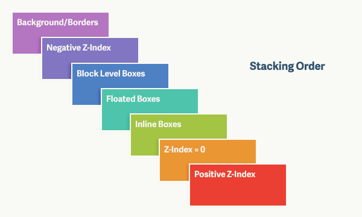

# CSS 常见面试题

## 1. 概念

### 1.1 选择器

> 选择器优先级？

_优先级从高到低排序：_

- 1. !important：这个不算 CSS 选择器
- 2. 内联样式（权重 1000）：严格来说也不算选择器
- 3. ID 选择器（权重 100）
- 4. 类选择器 (例如，.example)，属性选择器（例如，[type="radio"]）和伪类（例如，:hover）=> （权重 10）
- 5. 类型选择器（例如，h1）和伪元素（例如，::before）=> 1
- 6. 通配选择符（universal selector）（\*）关系选择符（combinators）（+, >, ~, ' ', ||）, 对优先级没影响（权重 0）

### 1.2 盒模型

参考：[视觉格式化模型](https://developer.mozilla.org/zh-CN/docs/Web/CSS/Visual_formatting_model)、[盒模型](https://developer.mozilla.org/zh-CN/docs/Web/CSS/CSS_Box_Model)

> 了解盒模型吗？

<code style="color: #708090; background-color: #F5F5F5; font-size: 18px">盒模型</code>是 **CSS 规范的一个模块**。

浏览器对文档进行布局时，渲染引擎会根据[视觉格式化模型](https://developer.mozilla.org/zh-CN/docs/Web/CSS/Visual_formatting_model)来处理和在视觉上显示文档时使用的**计算规则**。该模型是 CSS 的基础概念之一。

**盒子的布局由以下因素影响：**

- 盒子尺寸
- 盒子类型：块盒子（block）、行内盒子（inline）、行内级盒子（inline-level）、原子行内级盒子（atomic inline-level）
- 定位方案：普通流、浮动定位或绝对定位
- 文档树中的其他元素：即当前盒子的子元素或兄弟元素
- 视口尺寸于位置
- 等

**视觉格式化模型**会根据<code style="color: #708090; background-color: #F5F5F5; font-size: 18px">[盒模型](https://developer.mozilla.org/zh-CN/docs/Web/CSS/CSS_Box_Model)</code>将元素表示为一个个矩形的盒子（box）。

_盒模型：_


**控制盒模型的属性**：

- 控制盒模型中内容流

  overflow、overflow-x、overflow-y

- 控制盒模型大小的属性

  width、height、min-width、min-height、max-width、max-height

- 控制外边距 Margin

  margin、margin-top、margin-right、margin-bottom、margin-left

- 控制内边距 Padding 的属性

  padding、padding-top...

- 其他属性

  visibility

### 1.3 CSS 定位方式

> CSS 定位方式有哪些？

<code style="color: #708090; background-color: #F5F5F5; font-size: 18px">position</code>属性决定了元素定位方式。

<code style="color: #708090; background-color: #F5F5F5; font-size: 18px">position</code> 和元素的 top，right，bottom、left 属性共同决定了该元素的最终位置。

- 正常文档流定位：position: static（默认）
- 相对定位: relative -> 相对于**元素默认位置**偏移，不脱离文档流（偏移之前的位置仍然被占据）
- 绝对定位:
  - absolute -> 相对于**最近的非 static 定位祖先元素**的<span style="color: #ff0000; font-size: 16px;">Border 内边缘</span>偏移，元素会被移出正常文档流
  - fixed(也叫固定定位) -> 相对于**屏幕视口（viewport）的位置**来偏移（当元素祖先的 transform, perspective 或 filter 属性非 none 时，容器由视口改为该祖先）；元素会被移出正常文档流
- sticky: 粘性定位，根据正常文档流定位

### 1.4 BFC

> BFC 是什么？

**块格式化上下文（Block Formatting Context，BFC）** 是 **CSS 可视化渲染的一部分**，可以把它看作**一个相对独立的渲染区域**，有自己的**渲染规则**，块盒子模型可以在里面布局，浮动元素可以在里面浮动，不会影响到**BFC**之外的区域。

**BFC 特性**：

- 1. BFC 形成的区域会把浮动元素包含在内

> 如何触发 BFC ？

- 根元素：（\<html\>）
- 浮动元素：（float 部位 none）
- 绝对定位元素：(position 为 absolute 或 fixed)
- 行内块元素：（display: inline-block）
- overflow 不为 visible 的元素
- contain: layout|content|paint 的元素
- display：flow-root 的元素
- 弹性元素：display 为 flex 或 inline-flex 元素的**直接子元素**
- 网格元素：display 为 grid 或 inline-flex 元素的**直接子元素**
- 多列容器：column-count 或 column-width 不为 auto 的元素
- 表格单元格：(display: table-cell)
- 表格标题：(display: table-caption)
- 匿名表格单元格元素：（display 为 table、table-row 等）

> BFC 有哪些应用？

- 1. 清除浮动
- 2. 解决外边距（margin）重叠的问题

**利用 BFC 清除浮动：**

```html
<div class="container">
  <div class="left">left</div>
  <div class="right">right</div>
</div>
```

```css
.container {
  background: yellow;
}
.left {
  width: 100px;
  height: 100px;
  background: green;
  float: right;
}
.right {
  height: 50px;
  background: red;
}
```

_布局样式：_


_添加 overflow: auto 属性_:

```css
.container {
  background: yellow;
  /* .container会形成一个BFC */
  display: flow-root;
  /* overflow: auto; */
}
```


**原理**：给父元素设置<code style="color: #708090; background-color: #F5F5F5; font-size: 18px">overflow: auto;</code>或<code style="color: #708090; background-color: #F5F5F5; font-size: 18px">display: flow-root;</code>使 **.container** 形成了一个 BFC，BFC 内的浮动元素会被包含在 BFC 内。

**利用 BFC 解决外边距重叠问题：**

```html
<div class="container">
  <div class="left">left</div>
  <div class="rightContainer">
    <div class="right">right</div>
  </div>
</div>
```

```css
.container {
  background: yellow;
  border: 3px solid #bbb;
  width: 400px;
}
.left {
  width: 100px;
  height: 100px;
  background: green;
  margin: 50px 0;
  overflow: hidden;
}
.right {
  margin: 50px 0;
  width: 200px;
  height: 50px;
  background: red;
}
```


```css
.rightContainer {
  /* 形成新的 BFC */
  display: flow-root;
  /*   overflow: hidden; */
}
```


**利用 BFC 解决元素被浮动元素覆盖：**

```html
<div class="container">
  <div class="left">left</div>
  <div class="right">right</div>
</div>
```

```css
.left {
  width: 100px;
  height: 100px;
  background: green;
  float: left;
}
.right {
  width: 200px;
  height: 50px;
  background: red;
}
```

_浮动元素 left 会脱离文档流，覆盖正常布局的元素 right_


_触发元素 right 的 BFC_

```css
.right {
  width: 200px;
  height: 200px;
  background: red;
  display: flow-root;
}
```


**IE 盒模型**：

IE 盒模型和 W3C 盒模型略有不同，主要是宽度计算规则不同。

```css
/* 默认的 W3C 盒模型 */
box-sizing: content-box;
/* IE盒模型 */
box-sizing: border-box;
```


### 1.5 z-index

> 说说 **z-index** 有什么需要注意的地方.

HTML 元素被认为是**二维的**，元素被排列在页面上而不重叠。

在 CSS 2.1 中, 所有的盒模型元素都处于**三维坐标系中**，Z 轴顺序用 CSS 的 z-index 属性来指定。

<code style="color: #708090; background-color: #F5F5F5; font-size: 18px">z-index</code> 属性可让你在渲染内容时**调整对象分层的顺序**。

_z-index 分层：_



### 1.6 伪类与伪元素

> 伪类与伪元素的区别

**伪类**一般用于选择**特殊状态的元素**，如：<code style="color: #708090; background-color: #F5F5F5; font-size: 18px">:hover</code>、<code style="color: #708090; background-color: #F5F5F5; font-size: 18px">:first-child</code>。

**伪元素**一般用于处理**元素的某些部分**，如：<code style="color: #708090; background-color: #F5F5F5; font-size: 18px">::after</code>、<code style="color: #708090; background-color: #F5F5F5; font-size: 18px">::first-letter</code>

更多[伪类与伪元素](https://www.shushuo.me/#/css/pseudo)

## 2. 布局实战

### 2.1 “左侧宽度固定，右侧宽度自适应”

_html_

```html
<div class="container">
  <div class="left"></div>
  <div class="right"></div>
</div>
```

**1: float + margin**:

```css
.left {
  float: left;
  /* 固定宽度 */
  width: 200px;
  height: 200px;
  background: green;
}
.right {
  height: 300px;
  margin-left: 200px;
  background: red;
}
```

**2: float + BFC**:

直接修改上面 **.right** 样式，使之形成 BFC。

```css
.right {
  height: 300px;
  display: flow-root;
  background: red;
}
```

**3: 左右 float + calc()函数**:

```css
.container {
  height: 400px;
  background: yellow;
}
.left {
  /* 左浮动 */
  float: left;
  width: 200px;
  height: 200px;
  background: green;
}
.right {
  /* 右浮动 */
  float: right;
  /* 计算宽度 */
  width: calc(100% - 200px);
  height: 300px;
  background: red;
}
```

**4: flex 布局**:

```css
.container {
  display: flex;
  height: 400px;
  background: yellow;
}
.left {
  /* width: 200px; */
  flex-basis: 200px;
  height: 200px;
  background: green;
}
.right {
  /* 占据所有剩余空间 */
  flex-grow: 1;
  height: 300px;
  background: red;
}
```


### 2.2 水平垂直居中

- 1. 行内元素：在它的**包含块**中设置：{text-align:center;}，行内元素设置：{ line-height: 包含块高度; }

_示例：_

```html
<div class="container">
  <span class="left">这里是span</span>
  <p>这里是 p</p>
</div>
```

```css
.container {
  width: 400px;
  height: 200px;
  background: yellow;
  /*  使 span 和 p 里的文字水平居中  */
  text-align: center;
}

span {
  background: red;
  /* 使 span 垂直居中 */
  line-height: 200px;
}

p {
  /*  可以单独控制 p 里的文字位置  */
  text-align: start;
  background: green;
}
```

_布局结果_


- 2. 块级元素

  - 子元素**宽高已知**时

  - 子元素**宽高未知**时

  具体布局看[这里](http://localhost:3000/#/interview/ask1000?id=_11-%e6%b0%b4%e5%b9%b3%e5%9e%82%e7%9b%b4%e5%b1%85%e4%b8%ad)
