# CSS 布局 -- 响应式 Web 设计

> 想让你的网站在电脑大屏幕和手机的小屏幕都能合理展示，响应式应该是个不错的方案。

虽然目前 App 和 小程序遍地开花，但是一个网站如果不能响应式地适应各种屏幕，那么，用户的体验将是很差的。

## 1. 什么是响应式 Web 设计

<code style="color: #708090; background-color: #F5F5F5;">响应式 Web 设计</code>，是网页内容会随着访问它的适口及设备的不同呈现不同的样式。

“响应式 Web 设计” 这个名字是 Ethan Marcotte 在 2010 年发明的，他在一篇文章中综合运用了 3 种已有技术（弹性网格布局、弹性图片/媒体、媒体查询）实现了一个解决方案，就叫“响应式 Web 设计”。

## 2. 响应式的布局

### 2.1 HTML

```html
<meta name="viewport" content="width=device-width" />
```

它表达的意思是：按照设备宽度来渲染网页内容。

### 2.2 图片

```css
img {
  max-width: 100%;
}
```

CSS 的 max-width 规则，就是要保证所有图片最大显示为自身的 100%；

如果包含图片的宽度比图片（img）窄，图片会缩小到占满空间；

如果包含的图片比较小，则显示只占原图大小。

### 2.3 媒体查询

<code style="color: #708090; background-color: #F5F5F5;">CSS3</code> 的媒体查询可以根据设置的断点来加载不同的布局。

```css
/* 默认样式 */
body {
  background: green;
}

/* 宽度大于 600px 样式 */
@media screen And (min-width = 600px) {
  background: yellow;
}

/* 宽度大于 60em 样式 */
@media screen And (min-width = 60em) {
  background: red;
}
```

⚠️ 注意：

> 断点的设计不应该根据屏幕，毕竟你不能设置所有的宽度，否则那将是一件繁琐的事。出了新的屏幕尺寸怎么办？
>
> 断点应该根据“内容”来设计。在不同断点下我们的内容如何展示才是我们需要做的。

### 2.3 FlexBox（CSS Flexible Box Layout Module , 弹性布局）

## 3. FlexBox（CSS Flexible Box Layout Module , 弹性布局）

最早期的网站宽度大都以百分比形式定义，后来，精确设置固定宽度的样式一度很流行。如今，响应式设计流行开来，我们又要捡起曾经的弹性布局。

### 3.1 将固定像素大小转化为弹性比例大小

```css
.Left {
  height: 600px;
  background: yellow;
  display: inline-block;
  font-size: 0.9rem;
  transition: transform 0.5s;
  width: 200px;
  left: -200px;
  position: absolute;
}

@media (min-width: 40rem) {
  .Left {
    /* 将宽度转化为百分比值，假设父元素1000px */
    width: 20%;
    /* 通过设置 left值显示元素 */
    left: 0;
    /* 修改定位方式 */
    position: relative;
  }
}
```

通过媒体查询为宽度大于 40rem 时设置 .Left 的样式。

### 3.2 为何需要 Flexbox

**现在布局中存在的问题，如下：**

#### 3.2.1 行内块空白与垂直居中

使用行内块（inline-block）会在 HTML 元素间渲染空白。

而且，行内块中垂直居中内容也很不容易。

#### 3.2.2 浮动

缺点：

1. 浮动元素设置宽度为百分比，那么最终计算值在不同平台上的结果会不一样
2. 通常要清除浮动，才能避免父盒子/元素的折叠

#### 3.2.3 表格于表元

display:table 行为像 HTML 的 <code style="color: #708090; background-color: #F5F5F5;">table</code>。

display:table-cell 与对应的 <code style="color: #708090; background-color: #F5F5F5;">td</code>类似。

他们可以用来实现布局，但是，需要在每个项目外再包裹一层。

### 3.3 Flexbox 概述

<code style="color: #708090; background-color: #F5F5F5;">Flexbox</code> 可以解决掉上面提到的所有问题。

<span style="color: #ff0000; font-size: 16px;">Flexbox 的特性：</span>

> 1. flex 布局中的项目可以增大和缩小
> 2. 可以将空间（Space）分配到项目本身、项目之间或项目周围
> 3. 可以对齐主轴或交叉轴上的项目

### 3.4 使用 Flexbox

Flexbox 中的核心概念：<span style="color: #ff0000; font-size: 16px;">轴</span>、<span style="color: #ff0000; font-size: 16px;">Flex 容器与 Flex 元素</span>、<span style="color: #ff0000; font-size: 16px;">弹性</span>。

Flexbox 是一种一维的布局，与之相对的是另一个二维布局 [CSS Grid Layout](https://developer.mozilla.org/en-US/docs/Web/CSS/CSS_Grid_Layout)。

我们说的布局其实就是指子元素在父元素中位置关系。Flexbox 中的父元素叫<span style="color: #ff0000; font-size: 16px;">Flex 容器</span>，Flexbox 中的子元素叫<span style="color: #ff0000; font-size: 16px;">Flex 元素</span>。

### 3.5 Flexbox 默认布局

> Flexbox 的所有属性都和这两根轴有关。

给一个元素设置 <code style="color: #708090; background-color: #F5F5F5;">display: flex</code>,那么，它就变成了 Flexbox 布局中的 <code style="color: #708090; background-color: #F5F5F5;">Flex 容器</code>，它里面的元素就变成了 <code style="color: #708090; background-color: #F5F5F5;">Flex 元素</code>。

[代码地址](https://jsfiddle.net/legendHan/hvzoubk8/5/)

_🌰 1: flexbox 默认布局_

```html
<!DOCTYPE html>
<html lang="en">
  <head>
    <meta charset="UTF-8" />
    <title>Document</title>
  </head>
  <body>
    <!-- 这样写是不合适的，这里只是为了说明 flex容器 会默认占一整行 -->
    <span class="container">
      <div class="item item1">item1</div>
      <div class="item item2">item2</div>
      <div class="item item3">item3</div>
      <span class="item item4">Item4</span>
    </span>
  </body>
  <style>
    body {
      margin: 0;
    }
    .container {
      border: 2px solid red;
      display: inline-flex;
      height: 400px;
    }
    .item {
      border: 2px dashed yellowgreen;
    }
    .item1 {
      width: 50px;
    }
    .item2 {
      width: 100px;
      height: 100px;
    }
    .item3 {
      width: 150px;
      height: 150px;
    }
    .item4 {
      width: 200px;
      height: 200px;
    }
  </style>
</html>
```

结果 ⬇️：

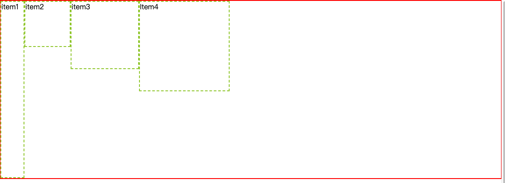

<code style="color: #708090; background-color: #F5F5F5;">.container</code> 就是一个 <code style="color: #708090; background-color: #F5F5F5;">Flex 容器</code>，它的子元素 .item 就是 <code style="color: #708090; background-color: #F5F5F5;">Flex 元素</code>。

**<code style="color: #708090; background-color: #F5F5F5;">display: flex</code> 做了什么？**

- display: flex 时 Flex 容器 宽度会默认填满一整行，占 Flex 元素撑起的高度，无论是块级元素 或 行内元素；
- display: inline-flex 时 Flex 容器 会默认占 Flex 元素撑起的宽高，无论是块级元素 或 行内元素；
- Flex 元素 会默认沿着主轴排列（默认主轴，从起点指向终点方向），无论是块级元素 或 行内元素；
- Flex 元素 高度会自动填充为 Flex 容器高度(item1 高度和 Flex 容器等高)；

### 3.6 操作 Flex 容器

> Flex 容器 的操作几乎都是围绕 轴 展开的。

#### 3.6.1 flex-direction

上面的 🌰 1 中，Flex 元素 默认向左排列，我不想向左排列怎么办？

flex-direction 属性定义了 Flex 元素 沿着 <code style="color: #708090; background-color: #F5F5F5;"> 主轴</code> 的排列方向。

- row: 默认值，即从起点指向终点方向排列;
- row-reverse: row 的相反方向；
- column：沿着上下方向
- column-reverse: 沿着由下到上方向

```css
.container {
  border: 2px solid red;
  display: flex;
  flex-direction: row-reverse;
}
```

_flex-direction: row-reverse ⬇️_

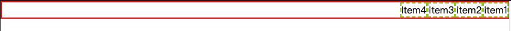

_flex-direction: column ⬇️_

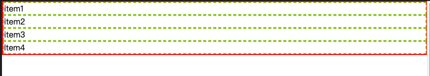

_flex-direction: column-reverse ⬇️_

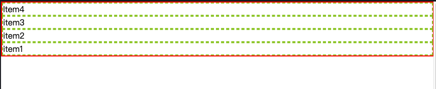

**和主轴垂直的轴是 <code style="color: #708090; background-color: #F5F5F5;"> 交叉轴</code>。**

为了便于展示，我们给各 item1 设置一个高度：

```css
.item1 {
  width: 50px;
  height: 50px;
}
```

_效果如下：_

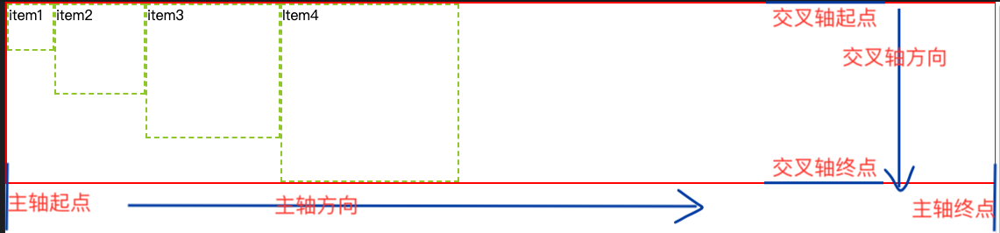

准确描述一下<code style="color: #708090; background-color: #F5F5F5;"> display: flex</code>时 Flex 元素 排列方式：

**Flex 元素 会默认沿着主轴从起点指向终点方向排列，沿着交叉轴从交叉轴起点到交叉轴终点排列，无论是块级元素 或 行内元素；**

#### 3.6.2 justify-content

我们可以修改沿着主轴、交叉轴的排列方式，以及分配剩余空间：

- **justify-content: 控制主轴 Flex 元素 对齐**

  flex-start: 与主轴起点对齐

  center: 伸缩元素向主轴中点排列

  flex-end: 与主轴终点对齐

  space-between: 主轴剩余空间全部分配到 flex 元素 之间

  space-around: 主轴剩余空间分配到 flex 元素之间 和 flex 元素与起点和终点之间, 且 flex 元素与起点和终点之间 的距离是 flex 元素之间 的一半

  space-evenly: 主轴剩余空间分配到 flex 元素之间 和 flex 元素与起点和终点之间,所有间隔相等

#### 3.6.3 align-items

- **align-items: 控制交叉轴 Flex 元素 对齐**

  stretch: （默认值）Flex 元素拉伸为 Flex 容器高度，这就是为什么 🌰 1 中，item1 的高度会拉伸到 400px

  flex-start: 与交叉轴起点对齐

  center: 伸缩元素向交叉轴中点排列

  flex-end: 与交叉轴终点对齐

  baseline: Flex 元素 相对于 Flex 容器的基线（文字底部）对齐

```css
.container {
  border: 2px solid red;
  display: flex;
  justify-content: center;
}
```

_效果 ⬇️：_

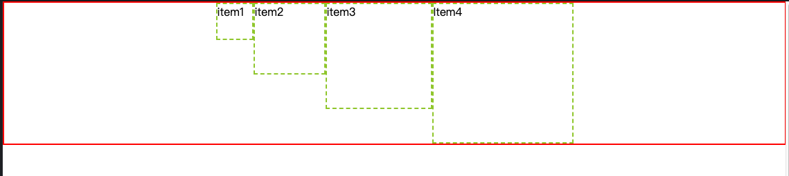

```css
.container {
  border: 2px solid red;
  display: flex;
  justify-content: space-between:
}
```

_效果 ⬇️：_

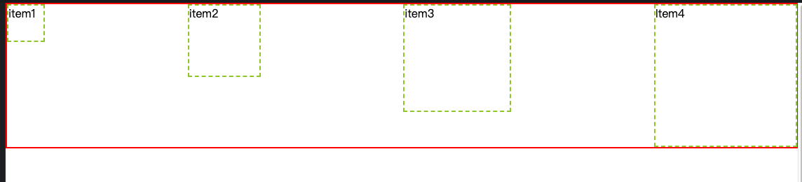

```css
.container {
  border: 2px solid red;
  display: flex;
  justify-content: space-around:
}
```

_效果 ⬇️：_

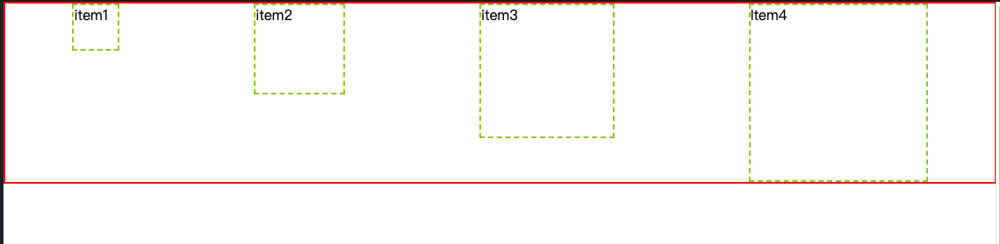

```css
.container {
  border: 2px solid red;
  display: flex;
  justify-content: space-around;
  align-items: center;
}
```

_效果 ⬇️：_

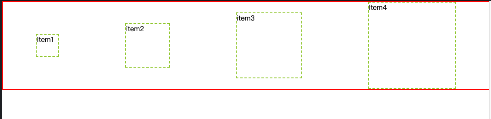

align-items: center 在这里实现了 Flex 元素的 垂直居中。

#### 3.6.4 flex-wrap

有的朋友可能已经发现，我们的 Flex 元素 宽度总和是小于 Flex 容器的宽度，所以有剩余空间可以 分配。

**思考 🤔**

> 如果 Flex 元素 宽度总和是大于 Flex 容器的宽度，会不会溢出 ❓ 样式不就全乱了 ❓

我们增加 Flex 元素 的数量，然后设置 Flex 容器 的宽度。

```html
<!DOCTYPE html>
<html lang="en">
  <head>
    <meta charset="UTF-8" />
    <title>Document</title>
  </head>
  <body>
    <div class="container">
      <div class="item item1">item1</div>
      <div class="item item2">item2</div>
      <div class="item item3">item3</div>
      <span class="item item4">Item4</span>
      <div class="item item5">Item5</div>
      <div class="item item6">item6</div>
      <div class="item item7">item7</div>
      <div class="item item8">item8</div>
    </div>
  </body>
  <style>
    body {
      margin: 0;
    }
    .container {
      width: 700px;
      border: 2px solid red;
      display: flex;
      justify-content: space-around;
      align-items: center;
    }
    .item {
      border: 2px dashed yellowgreen;
    }
    .item1,
    .item5 {
      width: 50px;
      height: 50px;
    }
    .item2,
    .item6 {
      width: 100px;
      height: 100px;
    }
    .item3,
    .item7 {
      width: 150px;
      height: 150px;
    }
    .item4,
    .item8 {
      width: 200px;
      height: 200px;
    }
  </style>
</html>
```

_效果 ⬇️：_

此时，Flex 元素 的总宽度达到了 1000px,而 Flex 容器的宽度只有 700px。会溢出到下一行吗？

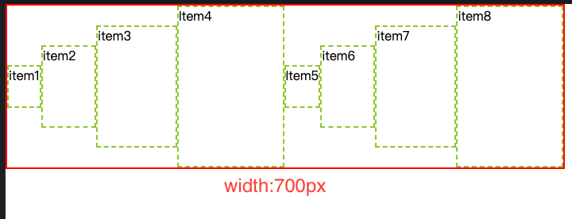

可以看到，Flex 元素 的总宽度超过了 Flex 容器宽度，默认情况下，Flex 元素 会伸缩，填满整个 Flex 容器。

因为 Flex 容器 有个默认属性 <code style="color: #708090; background-color: #F5F5F5;"> flex-wrap</code>。

**flex-wrap: 用来控制 Flex 元素 整体单行还是换行显示，如果换行，则下一行是否反向**

flex-wrap 的值：

- nowrap: (默认值)单行显示，不换行。
- wrap: 宽度不足时换行
- wrap-reverse: 宽度不足换行显示，但是是从下往上开始

```css
.container {
  border: 2px solid red;
  display: flex;
  justify-content: space-around;
  align-items: center;
  flex-wrap: wrap;
}
```

_效果 ⬇️：_

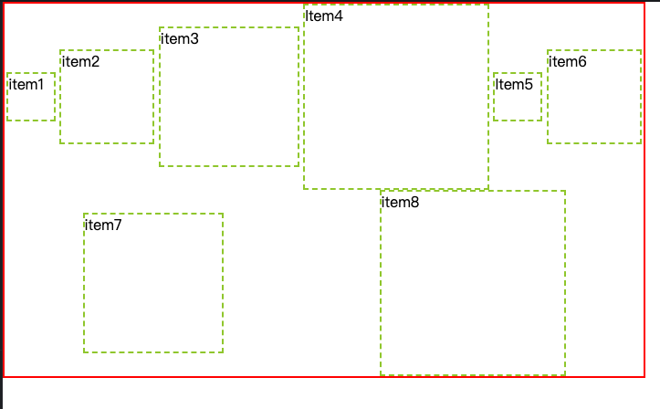

#### 3.6.5 align-content

交叉轴出现了多行的情况，如何控制交叉轴上 Flex 元素 的对齐和剩余空间分布 ❓

Flex 容器的 <code style="color: #708090; background-color: #F5F5F5;"> align-content</code> 属性指明垂直方向<span style="color: #ff0000; font-size: 16px;">多行 flex 元素</span>的对齐和分布方式，对单行不起作用。

align-content 属性的值：

- stretch: 默认值，每一行 flex 子元素都等比例拉伸，如果只有两行就各占 50%
- flex-start: 与文档流方向相关，默认为 交叉轴起点（顶部） 对齐
- flex-end: 与文档流方向相关，默认为 交叉轴终点（底部） 对齐
- center: 多行垂直居中对齐
- space-between: 上下两行两端对齐,剩下每一行元素等分剩余空间
- space-around: 每一行元素上下都享有独立不重叠的空白空间
- space-evenly: 每一行元素都完全上下等分

```css
.container {
  width: 700px;
  height: 800px;
  border: 2px solid red;
  display: flex;
  justify-content: space-around;
  align-items: center;
  align-content: space-around;
  flex-wrap: wrap;
}
```

_效果 ⬇️：_


#### 3.6.6 flex-flow

<‘flex-direction’> || <‘flex-wrap’>, 以上两者的 缩写

### 3.7 操作 Flex 元素

有没有发现一个问题？上面的属性都是作用与 Flex 容器上的，如果想单独操作某个 Flex 元素 怎么办呢 ❓❓

> 想单独操作某个 Flex 元素，可以使用下面的属性。

说明：以下示例基于 🌰 1 做修改。

#### 3.7.1 flex-grow: 扩展剩余空间（默认 0）

- **flex-grow**：Flex 元素 扩展剩余空间（剩余空间为总量为 1），flex-grow 的值为 0-1 的数（默认为 0）

  _flex-grow 属性示例：_

  ```css
  .container {
    width: 700px;
    border: 2px solid red;
    display: flex;
  }
  .item3 {
    /* flex-grow = 0 代表不占用剩余空间 */
    /* flex-grow = 0.5 代表占用剩余空间的一半，其他 Flex元素 共用另一半 */
    /* flex-grow = 1 代表占用所有剩余空间 */
    flex-grow: 1;
  }
  ```

  _flex-grow: 1 效果 ⬇️_

  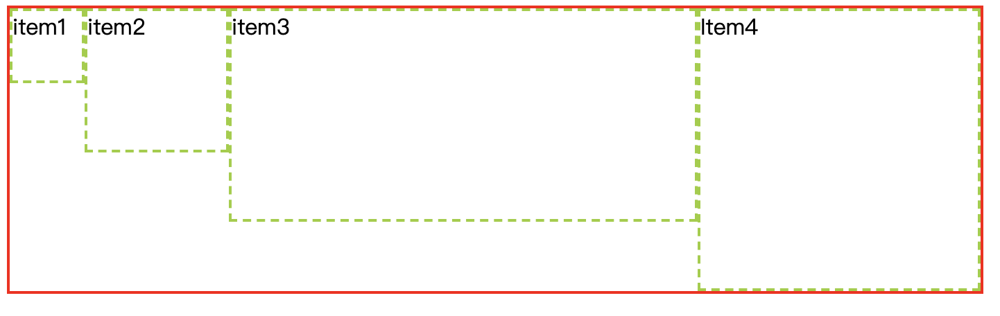

  ```css
  .container {
    width: 700px;
    border: 2px solid red;
    display: flex;
  }
  .item3 {
    /* flex-grow = 0 代表不占用剩余空间 */
    /* flex-grow = 0.5 代表占用剩余空间的一半，其他 Flex元素 共用另一半 */
    /* flex-grow = 1 代表占用所有剩余空间 */
    flex-grow: 0.5;
  }
  ```

  _flex-grow: 0.5 效果 ⬇️_

  

#### 3.7.2 flex-shrink: 空间不足时压缩 Flex 元素(默认 1，所有 Flex 元素收缩相同)

- **flex-shrink**：当 flex 容器空间不足时候，操作 Flex 元素 的收缩比例

  所有 Flex 元素 的 flex-shrink 默认为 1，代表空间不足时大家收缩比例相同

  flex-shrink 收缩值越大，代表这个 Flex 元素 所占空间越小，flex-shrink 为 0 代表不缩小

  _flex-shrink 示例_

  ```css
  .container {
    width: 700px;
    height: 300px;
    border: 2px solid red;
    display: flex;
  }
  .item {
    border: 2px dashed yellowgreen;
  }
  .item1 {
    width: 250px;
    height: 250px;
  }
  .item2 {
    width: 250px;
    height: 250px;
  }
  .item3 {
    width: 250px;
    height: 250px;
  }
  .item4 {
    width: 250px;
    height: 250px;
  }
  .item3 {
    /* 正常收缩值的 2 倍 */
    flex-shrink: 2;
  }
  ```

  _flex-shrink: 2 效果 ⬇️_

  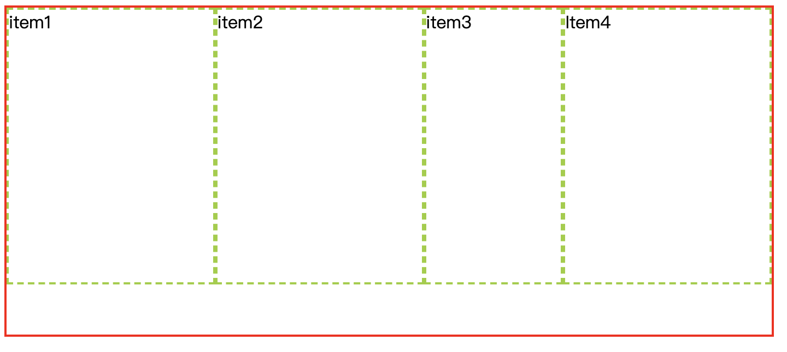

  ```css
  .item3 {
    /* 不收缩 */
    flex-shrink: 0;
  }
  ```

  _flex-shrink: 0 效果 ⬇️_

  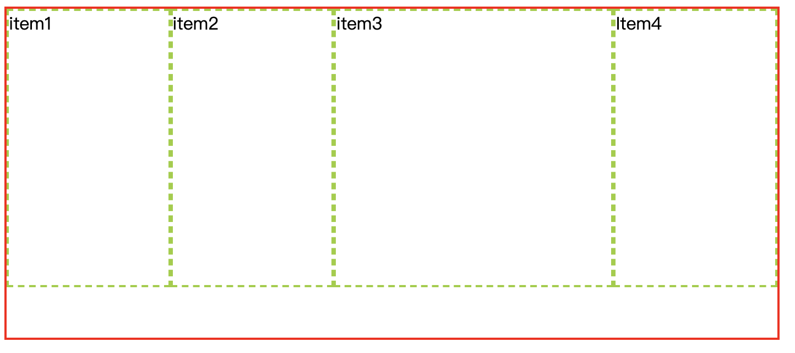

#### 3.7.3 flex-basis: 定义 Flex 元素宽度

- **flex-basis**: 定义了分配给 Flex 元素 的宽度（优先级高于 width）

  默认值是 auto，就是元素原始宽度；

  flex-basis 为宽度单位，如 100px;

  当容器有足够剩余空间时，Flex 元素 会按照占用该值大小的空间，当容器不足时会跟随其他 Flex 元素一起缩小.

  _剩余空间不足时，flex-basis 属性示例：_

  ```css
  .container {
    width: 700px;
    height: 300px;
    border: 2px solid red;
    display: flex;
  }
  .item {
    border: 2px dashed yellowgreen;
  }
  .item1 {
    width: 250px;
    height: 250px;
  }
  .item2 {
    width: 250px;
    height: 250px;
  }
  .item3 {
    width: 250px;
    height: 250px;
  }
  .item4 {
    width: 250px;
    height: 250px;
  }
  .item3 {
    flex-basis: 500px;
  }
  ```

  _剩余空间不足时，flex_basis 属性 效果 ⬇️_

  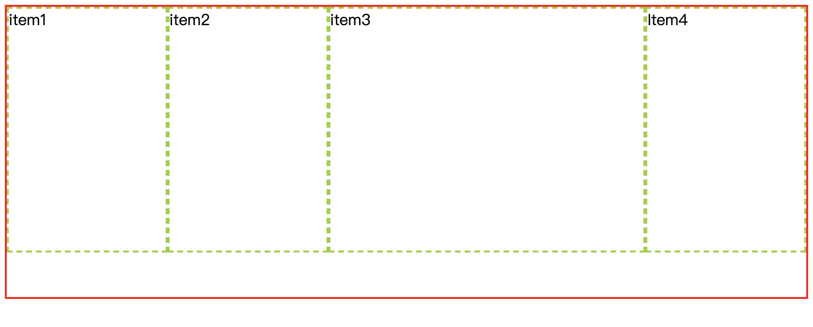

  _剩余空间足够时，flex_basis 属性示例_

  ```css
  .container {
    height: 300px;
    border: 2px solid red;
    display: flex;
  }
  .item {
    border: 2px dashed yellowgreen;
  }
  .item1 {
    width: 150px;
    height: 250px;
  }
  .item2 {
    width: 150px;
    height: 250px;
  }
  .item3 {
    width: 150px;
    height: 250px;
  }
  .item4 {
    width: 150px;
    height: 250px;
  }
  .item3 {
    flex-basis: 300px;
  }
  ```

  _flex-basis: 300px 效果 ⬇️_

  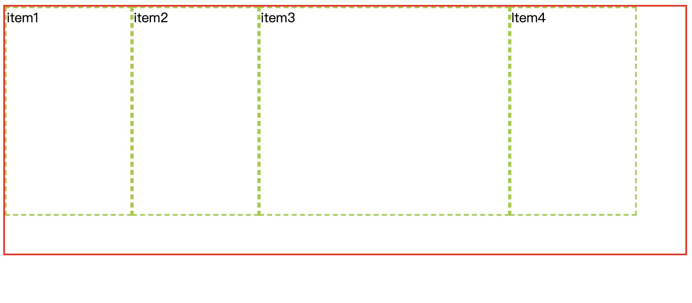

#### 3.7.4 flex: <flex-grow | flex-shrink | flex-basis> 的缩写

flex-grow，flex-shrink 和 flex-basis 的缩写。

**flex 简写示例：**

- 默认值 => flex: 0 1 auto; -> Flex 元素不放大、同时缩小、占用原始宽度。
- flex: 1; => flex: 1 1 0%; -> Flex 放大占用所有剩余空间、同时缩小、不预定剩余空间。
- flex: auto; => flex: 1 1 auto; -> Flex 放大占用所有剩余空间、同时缩小、占用原始宽度。
- flex: none; flex: 0 0 auto; -> Flex 元素不放大、不缩小、占用原始宽度。
- flex: 0%; flex: 1 1 0%; -> Flex 放大占用所有剩余空间、同时缩小、不预定剩余空间。
- flex: 2 3; flex: 2 3 0%; -> Flex 放大占用所有剩余空间、3 倍缩小、不预定剩余空间。
- flex: 2 3px; flex: 2 1 3px; -> Flex 元素 放大占用所有剩余空间、同时缩小、固定占用 3px 剩余空间。

**flex: 1; 与 flex: auto; 区别：**

flex: 1; 相当于 flex: 1 1 0%;

> flex 元素宽度 = 所有剩余空间宽度 + 自身宽度（0）

flex: auto; 相当于 flex: 1 1 auto;

> flex 元素宽度 = 所有剩余空间宽度 + 自身宽度

所以可以看出，**flex: auto** 比 **flex: 1** 多出一个自身宽度。

_示例：_

```html
<div id="container">
  <sapn class="item item1">1</sapn>
  <sapn class="item item2">2</sapn>
  <sapn class="item item3">3</sapn>
</div>
<style>
  #container {
    display: flex;
    width: 500px;
    height: 200px;
    background: #ddd;
  }
  .item {
    width: 100px;
    height: 100px;
    background: yellowgreen;
    border: 1px solid red;
    box-sizing: border-box;
  }
  .item1 {
    flex: auto;
  }
  .item2 {
    flex: 1;
  }
</style>
```

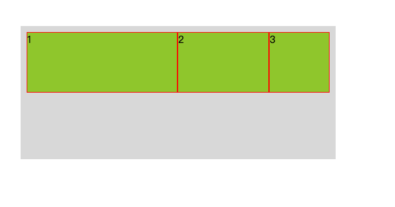

#### 3.7.5 align-self

- **align-self**：控制单独某一个 Flex 元素 的垂直对齐方式

  auto: 默认值,表示继承自 Flex 容器 的 align-items 属性值

  flex-start | flex-end | center | baseline | stretch 和 align-items 的作用相同

#### 3.7.6 order

- **order**: Flex 元素 按照 order 属性的值的大小增序排列，order 默认为 0，且可以为 负数

  _order 属性示例：_

  ```css
  .container {
    width: 700px;
    border: 2px solid red;
    display: flex;
  }
  .item3 {
    order: -1;
  }
  ```

  _order: -1 效果 ⬇️_

  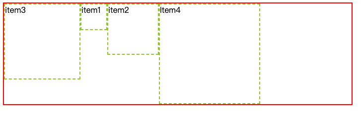

### 3.8 Flex 布局案例

#### 3.8.1 实现

**说明：**

1. 在 Flex 布局中，flex 子元素的设置 float，clear 以及 vertical-align 属性都是没有用的

2. Flexbox 兼容性没啥问题，除非...

3. Flexbox 适合组件和小规模布局

**思维导图，拿走不谢 😄：**

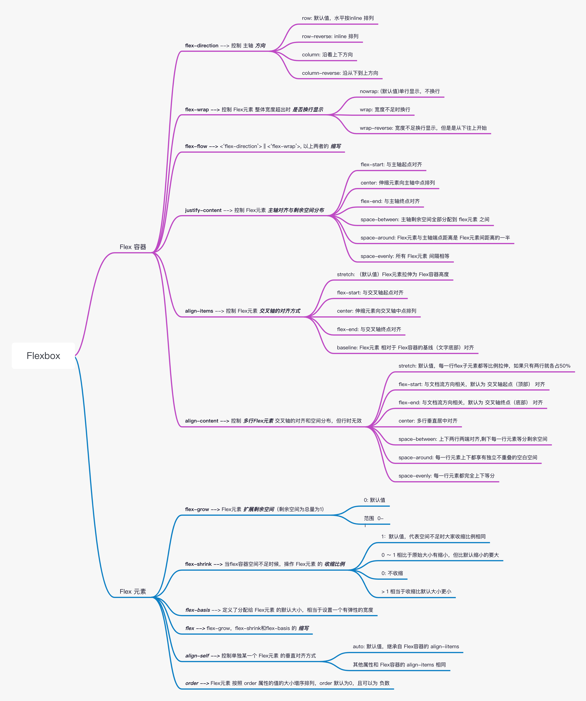

## 参考

[flex 布局的基本概念 --> MDN](https://developer.mozilla.org/zh-CN/docs/Web/CSS/CSS_Flexible_Box_Layout/Basic_Concepts_of_Flexbox)

[写给自己看的 display: flex 布局教程 --> 张鑫旭](https://www.zhangxinxu.com/wordpress/2018/10/display-flex-css3-css/#flex-basis)

《响应式 Web 设计》--> Ben Frain
