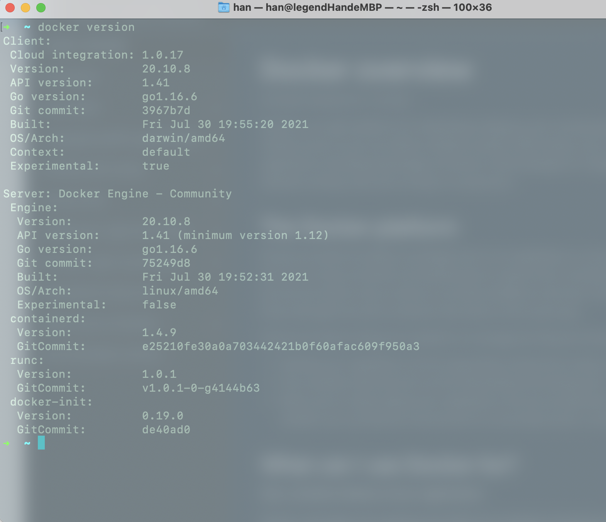

# Docker概念

> Docker 要解决软件运行环境配置的难题。

## 1.软件运行环境配置的难题

软件要想顺利运行，运行环境是必须要符合要求的。但是，用户计算机的环境各不相同，如何保证你的软件能在这些机器上正确运行呢？

用户需要做两件事才能让软件运行：操作系统的设置，各种库和组件的安装。

如果某些老旧的模块与当前环境不兼容，那就麻烦了。很多软件无法正常运行的题都是环境导致的。

环境配置如此麻烦，换一台机器，就要重来一次，旷日费时。

能不能从根本上解决问题，软件可以带环境安装？也就是说，**安装的时候，把原始环境一模一样地复制过来**。

## 2.虚拟机

**虚拟机（virtual machine）**就是带环境安装的一种解决方案。

它可以在一种操作系统里面运行另一种操作系统，比如在 Windows 系统里面运行 Linux 系统。

应用程序对此毫无感知，因为虚拟机看上去跟真实系统一模一样，而对于底层系统来说，虚拟机就是一个普通文件，不需要了就删掉，对其他部分毫无影响。

这种方案有很大弊端：

- **资源占用多：**虚拟机会独占一部分内存和硬盘空间。可能虚拟机里的程序需要使用的内存只有 1M，但是虚拟机本身运行所占用的几百 M 内存是必不可少的。

- **冗余步骤多：**虚拟机是完整的操作系统，一些系统级别的操作步骤，往往无法跳过，比如用户登录

- **启动慢：**启动操作系统需要多久，启动虚拟机就需要多久。可能要等几分钟，应用程序才能真正运行

## 3.Linux 容器

**Linux 容器（Linux Containers，缩写为 LXC）**不是模拟一个完整的操作系统，而是<span style="color: #ff0000; font-size: 16px;">对进程进行隔离</span>。

或者说，这是在正常进程的外面套了一个保护层。对于容器里面的进程来说，它接触到的各种资源都是虚拟的，从而实现与底层系统的隔离。

容器是<span style="color: #ff0000; font-size: 16px;">进程级别</span>的，能很好解决虚拟机的弊端：

- **资源占用少：**容器只占用需要的资源，不占用那些没有用到的资源；虚拟机由于是完整的操作系统，不可避免要占用所有资源。另外，多个容器可以共享资源，虚拟机都是独享资源。

- **体积小：**容器只要包含用到的组件即可，而虚拟机是整个操作系统的打包，所以容器文件比虚拟机文件要小很多。

- **启动快：**容器里面的应用，直接就是底层系统的一个进程，而不是虚拟机内部的进程。所以，启动容器相当于启动本机的一个进程，而不是启动一个操作系统，速度就快很多

## 4.认识 Docker

### 4.1 Docker 的基本认识

**Docker 属于 Linux 容器的一种封装，提供简单易用的容器使用接口。**

**Docker 将应用程序与该程序的依赖，打包在一个文件里面。运行这个文件，就会生成一个虚拟容器。**

程序在这个虚拟容器里运行，就好像在真实的物理机上运行一样。有了 Docker，就不用担心环境问题。

总体来说，Docker 的接口相当简单，用户可以方便地创建和使用容器，把自己的应用放入容器。容器还可以进行版本管理、复制、分享、修改，就像管理普通的代码一样。

_Docker 用的的容器技术_：

- chroot

> 改变进程根目录，使得进程不能对该根目录之外的文件进行访问动作，达到了简单的**文件隔离**。

- Namespace:

> Linux 内核的功能,可以隔离进程 ID、主机名、用户 ID、文件名、网络和进程通信等相关资源，使进程只能访问当前容器命名空间的资源；

- Cgroups

> Linux 内核功能，可以限制和隔离进程的资源使用情况，如 CPU、内存、磁盘 I/O、网络等。

- UnionFS

> 也叫做“联合文件系统”，是一种通过创建文件层进程操作的文件系统，使得容器可以实现**写时复制**以及**镜像的分层构建和存储**

### 4.2 Docker 架构

> Docker 是 CS(client-server) 结构的软件，由客户端和服务端两部分组成。
>
> Docker 客户端和守护进程使用 REST API、UNIX 套接字或网络接口进行通信.

_Docker architecture_:


- client: 客户端包括我们安装的**桌面应用**和**CLI**，客户端和 Docker daemon 对话，负责**容器**的*构建*、*运行*和*分发*（注意不同线形的工作流程）
- daemon(dockerd):
  - 监听 Docker API 请求并管理 Docker 对象，例如图像、容器、网络和卷
  - 还可以与其他守护进程通信以管理 Docker 服务
- registry: 存储 Docker 镜像
- image: 是一个只读模板，包含创建 Docker 容器的说明
- container: image 的可运行实例

安装 Docker 后可以使用<code style="color: #708090; background-color: #F5F5F5; font-size: 18px">docker version</code>查看 Docker 的 client 和 server 的相关信息，如下图 ⬇️：



### 4.2 Docker 相关名词

- Docker：是一种容器实现方式,同时也是一个公司名
- Docker Desktop：提供给用户操作的客户端，有 Mac/Windows/Linux 版
- Docker Command Line: Docker 的 CLI 工具，帮助我们使用命令行操作 **Docker daemon**

## 5. Docker 核心概念

### 5.1 container（容器）

> container 是 image 的运行实体，为**应用程序**提供运行环境。同时，container 是被隔离的，无法看到主机的进程、环境变量等信息。

[What is a container?](https://docs.docker.com/get-started/#what-is-a-container)

**容器是您机器上的沙盒进程，与主机上的所有其他进程隔离。这种隔离正是利用了Linux 上的技术，如 Namespace、cgroups等。**

总结就是：

- 容器是*镜像*的运行实例
- 容器可以运行在本地、虚拟机和云
- 容器是可移植的（可运行在任何OS）
- 容器是相互隔离的，它们执行着自己的软件、二进制文件或配置文件

### 5.2 container image（容器镜像）

> "镜像"是“容器镜像”的简称。

**镜像**是一个只读的模板，带有创建 **container**的说明。

**镜像**包括你运行一个应用程序所需要的一切 —— *代码*或*二进制文件*、_运行时_、_依赖性和任何其他所需的文件系统对象_。

所以，image 和 container 的关系是：

> 当运行一个 container，它就是一个隔离的文件系统。image 就是这个文件系统的描述。

_镜像常见操作_：

- 获取镜像：docker pull
- 重命名镜像：docker tag
- 构建镜像：docker build
  1. docker commit 命令创建
  2. Dockerfile 方式构建
- 上传镜像：docker push

### 5.3 repository（仓库）

> 存储和分发 Docker 镜像。

### 5.4 layer（层）

**镜像(image)**是由一个个层组成的，**层**是容器具体的任务，合理的 Dockerfile 可以利用**层**的缓存特性来减少镜像体积。

---

## 6. Docker CLI

### 6.1 如何查看 Docker 命令

1. 随时随地查看所有命令 👍

   > docker

2. 查看命令具体用法

   > docker COMMAND --help

3. 命令使用方法
   
   > docker [OPTIONS] COMMAND

**示例**：

```shell
# 运行mysql container
docker run mysql:5.7
```

```shell
# 运行mysql container 并附加参数
# -d(--detach的缩写) : Run container in background and print container ID
# --network : Connect a container to a network
# --network-alias : Add network-scoped alias for the container
# -v(--volume的缩写) : Bind mount a volume
# -e(--env的缩写) : Set environment variables
docker run -d `
    --network todo-app --network-alias mysql `
    -v todo-mysql-data:/var/lib/mysql `
    -e MYSQL_ROOT_PASSWORD=secret `
    -e MYSQL_DATABASE=todos `
    mysql:5.7
```

### 6.2 常用 Docker 命令

镜像相关：

> 拉取镜像: docker pull <imageAddress>

容器相关:

> **启动容器(run an image inside of a container)** docker run <imageName>
>
> -d 后台启动
> prot1:port2 暴露端口
> -v 指定 volume
>
> 如： docker run -dp 3000:3000 -v todo-db:/etc/todos geeting-started
>
> **查看容器** docker ps
> -a 查看所有
>
> **重启、停止、删除** docker stop/restart/rm [ContainerName]

列出所有运行的 container

> docker ps

新建 volume

> docker volume create <dbname>

删除 container（相当于再 Dashboard 执行 stop 和 remove）

> docker rm -f <id>

新建网络

> docker network create <netName>

## 7. 构建 image

> docker build [OPTIONS] PATH | URL | -

- OPTIONS
  -f: 指定 Dockerfile 文件
  -t: 给 image 命名一个 tag
- PATH: 任意合法的文件路径
- URL: Git repository location

执行*docker build*命令，Docker 会根据 Dockerfile 和 context(PATH 目录或 URL 地址)构建 **image**。

构建过程如下：

- 1. **Docker daemon**读取 Dockerfile，如果 Dockerfile 有语法错误等会停止构建
- 2. 读取 .dockerignore
- 3. **Docker daemon**获取 context
- 4. **Docker daemon**执行 Dockerfile 里的每一行指令（注释会被忽略），Dockerfile 中的每个指令都会在镜像中创建一个层，会优先获取缓存（缓存一般是你上次构建时用到的资源）的层。
- 5. 生成 image
- 6. 命名 tag（如果有）

> 什么是 context？
>
> **context**是位于指定 PATH 或 URL 中的一组文件,Docker 构建过程可以访问位于**context**中的任何文件。

### 7.1 Dockerfile

[Dockerfile 官方参考，不会就到这里找](https://docs.docker.com/engine/reference/builder/)

[Node 环境 Dockerfile 详解](https://docs.docker.com/language/nodejs/build-images/)

> 指定 Docker image 的组成内容，用于构建 image。

_指令说明：_

- From：指定基础 image,我们的应用基于它来创建，有点像**继承**。

- WORKDIR：指定工作目录文件，路径会相对于这个目录文件

- COPY：获取文件放到 image 中

- RUN：执行 shell 命令

- COPY . .:把所有文件添加到 image

- CMD：当我们的 image 在 container 中运行时，告诉 Docker 我们想要执行的命令

完整的文件如下 👇：

```Dockerfile
# syntax=docker/dockerfile:1
FROM node:12.18.1

WORKDIR /app

COPY ["package.json", "package-lock.json*", "./"]

RUN npm install --production

COPY . .
```

#### 7.1.1 Dockerfile 指令

- ARG：设置参数
- FROM
- RUN：执行 shell 命令
- CMD：为正在运行的 container 提供默认值
- EXPOSE：指定**container 运行时** 监听的网络端口/协议
- ENV：设置环境变量
- ADD：复制文件到 image 中
- COPY：复制文件到 container 中
- WORKDIR：设置 RUN/CMD/COPY/ADD 等命令的工作目录

#### 7.1.2 环境变量

```Dockerfile
FROM busybox
ENV FOO=/bar
WORKDIR ${FOO}   # WORKDIR /bar
ADD . $FOO       # ADD . /bar
COPY \$FOO /quux # COPY $FOO /quux
```

## 8. Docker 容器间通信

> 有时我们的应用依赖另一个应用，可以使用 --link 来关联两个容器。

```sh
# 运行 kubeblog 镜像，关联 mysql57镜像（如果mysql57没有启动，则kubeblog无法启动）
docker run --name kubeblog -d -p 5000:5000  --link mysql57 -e MYSQL_SERVER="mysql57"  registry.cn-beijing.aliyuncs.com/qingfeng666/kubeblog:1.3
```

