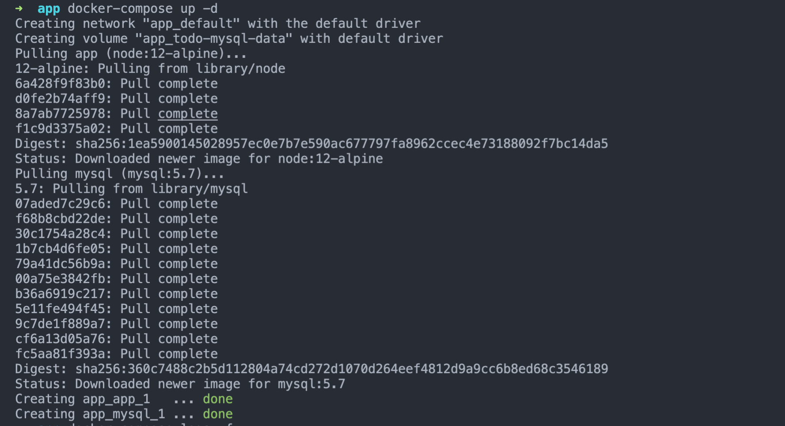

# Docker镜像与容器

> Docker 应用实战，从Dockerfile到部署上线。

## 1. 构建一个前端静态文件镜像

> 前端静态文件一般基于Nginx构建，它可以把静态文件发送给请求的客户端。

*构建步骤：*

1. 可以使用 create-react-app 构建一个基于React的前端应用
2. 在应用的根目录创建一个 .Dockerfile文件

```sh
# 使用 node 镜像
FROM node:16 AS build
# 设置容器内的目录，通常我们会使用 app 目录
WORKDIR /app
# 项目文件拷贝到容器 /app 下
COPY . .
# 下载依赖包，并构建打包文件
RUN yarn && yarn build

# 使用 nginx 镜像
FROM nginx
# 跳转到 nginx 的 80 静态服务对应的目录
WORKDIR /usr/share/nginx/html
# 删掉里面的文件
RUN rm -rf ./*
# 将我们在 node 镜像的打包文件拷贝到这里
COPY --from=build /app/build .
```

3. 添加 .dockerignore 文件，毕竟我们有些东西不需要放到容器中
4. 

## 2. 构建一个 node 镜像

### 1.1 创建Dockerfile文件

1. 在node应用的主目录创建一个空文件，命名为 `Dockerfile`：

```markup
touch Dockerfile
```

2. 我们要做的第一件事是定义我们需要**从哪个镜像进行构建**。

这里我们将使用最新的 LTS（长期服务器支持版），`Node` 的版本号为 `12`。你可以从 [Docker 站点](https://hub.docker.com/) 获取相关镜像：

```docker
FROM node:12
```

3. 在镜像中创建一个文件夹存放应用程序代码，这将是你的应用程序工作目录：

```docker
# Create app directory
WORKDIR /usr/src/app
```

4. 使用 `npm` 安装应用程序的所有依赖

为何要先安装依赖，答案[在这](http://bitjudo.com/blog/2014/03/13/building-efficient-dockerfiles-node-dot-js/)

原因一句话概括：先安装依赖，可以在package.json 没有变化时更好地利用缓存layer。

```docker
COPY package*.json ./

RUN npm install
# If you are building your code for production
# RUN npm ci --only=production
```

5. 在 Docker 镜像中使用 `COPY` 命令绑定你的应用程序：

```docker
# Bundle app source
COPY . .
```

6. 应用程序绑定的端口为 `8080`，所以你可以使用 `EXPOSE` 命令使它与 `docker` 的镜像做映射：

```docker
EXPOSE 8080
```

7. 使用定义运行时的 `CMD` 定义命令来运行应用程序

```docker
CMD [ "node", "server.js" ]
```

`Dockerfile` 现在看上去是这个样子：

```docker
FROM node:12

# Create app directory
WORKDIR /usr/src/app

# Install app dependencies
# A wildcard is used to ensure both package.json AND package-lock.json are copied
# where available (npm@5+)
COPY package*.json ./

RUN npm install
# If you are building your code for production
# RUN npm ci --only=production

# Bundle app source
COPY . .

EXPOSE 8080
CMD [ "node", "server.js" ]
```

### 1.2 添加 .dockerignore 文件

在 `Dockerfile` 的同一个文件夹中创建一个 `.dockerignore` 文件，可以避免不需要的文件被拷贝到镜像文件中：

```
node_modules
npm-debug.log
```

### 1.3 构建镜像

`docker build` 命令可以根据 `Dockerfile`文件构建镜像。

开关符 `-t` 让你标记你的镜像，以至于让你以后很容易地用 `docker images` 找到它。

```bash
docker build . -t <your username>/node-web-app
```
## 2. 运行镜像

### 2.1 启动容器

使用 `-d` 模式运行镜像将以分离模式运行 Docker 容器，使得容器在后台自助运行。

开关符 `-p` 在容器中把一个公共端口导向到私有的端口。

```bash
docker run -p 49160:8080 -d <your username>/node-web-app
```

### 2.2 查看容器运行情况

```bash
docker ps 
# Example 
ID            IMAGE                                COMMAND    ...   PORTS 
ecce33b30ebf  <your username>/node-web-app:latest  npm start  ...   49160->8080
```

在容器中 Docker 把端口号 `8080` 映射到你机器上的 `49160` ;

可以使用 `curl`（如果需要的话请通过 `sudo apt-get install curl` 安装）调用你的程序：

```bash
curl -i localhost:49160

HTTP/1.1 200 OK
X-Powered-By: Express
Content-Type: text/html; charset=utf-8
Content-Length: 12
ETag: W/"c-M6tWOb/Y57lesdjQuHeB1P/qTV0"
Date: Mon, 13 Nov 2017 20:53:59 GMT
Connection: keep-alive

Hello world
```

## 3. 容器编排

### 3.1 Docker Compose

> Docker 命令的声明式标记语言。

[Docker Compose](https://docs.docker.com/get-started/08_using_compose/)帮助构建*多容器应用*。

什么是*多容器应用*？

我们的应用往往会用到很多容器，如：一个网站可能会用**node 容器**来构建后端，会用**mysql**容器来做存储，会用。。。

我们需要一个一个的来设置这些容器，然后启动它们。所以，容器管理麻烦的问题逐渐凸显。

**Docker Compose**就是帮我们解决*多容器的管理问题*。

#### Docker Compose 是如何工作的

如果你安装了 Windows/Mac 版的 Docker Desktop/Toolbox,**Docker Compose**已经默认安装。

_使用 Docker Compose:_

> 1. 在文件根目录新增 XXX.yml 文件
> 2. 给 yml 文件配置版本，如：version: "3.8"
> 3. 定义应用用到的服务/容器,如下

```yml
version: "3.8"

services:
  app:
    image: node:12-alpine
    command: sh -c "yarn install && yarn run dev"
    ports:
      - 3000:3000
    working_dir: /app
    volumes:
      - ./:/app
    environment:
      MYSQL_HOST: mysql
        MYSQL_USER: root
        MYSQL_PASSWORD: secret
        MYSQL_DB: todos

  mysql:
    image: mysql:5.7
    volumes:
      - todo-mysql-data:/val/lib/mysql
    environment:
      MYSQL_ROOT_PASSWORD: secret
      MYSQL_DATABASE: todos

  volumes:
    todo-mysql-data:
```

> 4. 启动应用

```shell
# -d 代表后台运行
docker-compose up -d
```

此时，会看到所有所有的任务被执行。



> 5. 关闭应用并清除 volumes

```shell
# -d 代表后台运行
docker-compose down --volumes
```


## 参考

[构建 node 应用](https://nodejs.org/zh-cn/docs/guides/nodejs-docker-webapp/)

[如何写 node 应用的 Dockerfile](http://bitjudo.com/blog/2014/03/13/building-efficient-dockerfiles-node-dot-js/)