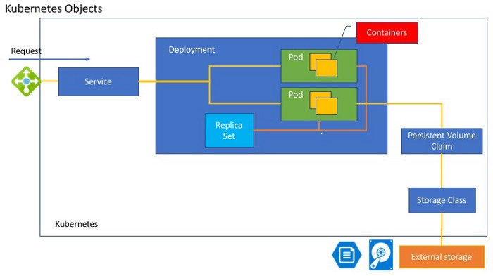
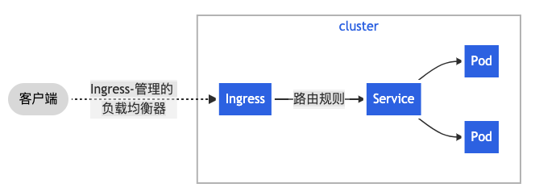

# Kubernetes 核心概念

> 2021 年，想部署一个应用的话，Docker 应该是最佳方案，k8s 是必备技能。

## 1. 什么是 k8s?

**k8s**是一个基于`容器`的分布式架构方案。

关于 k8s 的你要知道：

- 它的前身是 Google 的 Brog(google 内部超级强大的集群管理系统)
- k8s 可以增加运维效率，减少运维成本
- K8s 是一个开放性的开发平台，和语言无关（无论你的项目使用的是 Java、Go、Python 还是 NodeJs）
- K8s 是一个完备的分布式系统支撑平台，具有完备的集群管理能力

## 2. k8s 优点

- 团队可以“轻装上阵”，需要的运维工作量大大减少，质量大大提高
- 拥抱**微服务**
- 可以随时随地将系统“搬迁”上云
- **弹性扩容**可以轻松应对流量高峰
- 可以快速横向扩容，轻松应对用户激增

## 3. k8s 组成

- kubeadm
  k8s 的管理工具，使用它初始化、管理 K8s 集群；
- kubelet
  管理工作节点上运行的容器；
- kubectl
  kubectl 是 Kubernetes API 的一个客户端，可以调用任何 Kubernetes API，做自己想做的；

精彩文章：[How kubeadm Initializes Your Kubernetes Master](https://www.ianlewis.org/en/how-kubeadm-initializes-your-kubernetes-master)

[What is kubectl?](https://dockerlabs.collabnix.com/kubernetes/beginners/what-is-kubect.html)

## 4. k8s 核心概念

k8s 中的术语大多围绕`资源对象（Resource Object）`而言的，可以大致分为两类：

#### 1. 某种具体资源对象：如：节点（Node）、Pod、服务（Service）、存储卷（Volume）

#### 2. 与资源相关的事物与动作：如：标签（Label）、注释（Annotation）、命名空间（Namespace）、部署（Deployment）、HPA、PVC 等。

`资源对象（Resource Object）`通常一定有名称、标签、注释这 3 个元数据（metadata）；

我们可以通过 YAML 或 JSON 格式来声明一个 K8s`资源对象（Resource Object）`，然后把它们存放在 etcd 这样的非关系型数据库中，便于快速读写；

`资源对象（Resource Object）`也可以使用*kubectl*工具执行增、删、改、查。

_一个 k8s 编排文件里含有多个`资源对象（Resource Object）`：_

```yaml
apiVersion: apps/v1beta1
kind: Deployment
metadata:
  name: azure-vote-back
spec:
  replicas: 1
  template:
    metadata:
      labels:
        app: azure-vote-back
    spec:
      containers:
        - name: azure-vote-back
          image: redis
          ports:
            - containerPort: 6379
              name: redis
---
apiVersion: v1
kind: Service
metadata:
  name: azure-vote-back
spec:
  ports:
    - port: 6379
  selector:
    app: azure-vote-back
---
apiVersion: apps/v1beta1
kind: Deployment
metadata:
  name: azure-vote-front
spec:
  replicas: 1
  template:
    metadata:
      labels:
        app: azure-vote-front
    spec:
      containers:
        - name: azure-vote-front
          image: microsoft/azure-vote-front:v1
          ports:
            - containerPort: 80
          env:
            - name: REDIS
              value: "azure-vote-back"
---
apiVersion: v1
kind: Service
metadata:
  name: azure-vote-front
spec:
  type: LoadBalancer
  ports:
    - port: 80
  selector:
    app: azure-vote-front
```

_k8s 资源对象图示：_



### 4.1 集群类

集群中的机器被划分为一个**Master**和多个**Node**

- `Master`上运行着管理集群的进程，如：
  - **kube-apiserver**：接口 API，通过接口可以对容器里所有资源增删改查--集群的入口；
  - **kube-controller-manager**：对 k8s 的资源自动化控制--大总管；
  - **kube-sechuduler**：它们实现了对集群的资源管理、Pod 调度、弹性伸缩等--调度室
- **`Node`**: 集群的工作节点，其上运行着具体的工作进程，如：
  - **kubelet**： 负责 Pod 对容器的创建、启停等任务 🌟🌟，与 Master 协作，实现集群管理的基本功能
  - **kube-proxy**：负责*kubenetes service*的**通信**，以及实现软件模式的**负载均衡**🌟🌟

### 4.2 应用类

- `Deploayment`: 工作负载
  - 提供了 Pod 的模版，实现自动创建 Pod
- `Service`：k8s 使用 Service 来连接指定的服务
  - 拥有一个指定的名称，可以是多个副本提供服务（无状态），也可是某个具体的服务，如 mysql-server
  - 拥有一个虚拟 IP 和端口号（ClusterIP）：如 192.13.34.4:3001，这个 K8s 的重要‼️ 机制，它实现了 k8s 内部 DNS 里**名称---IP**的映射，可以通过**名称**直接找到**服务**
  - 可以将客户端对服务的访问请求转发到一组容器
- `Pod`：服务进程容器在 Pod 中运行
  - **Pod**是 K8s 管理的最小单位
  - **Pod**运行在一个被称为**节点（Node）**的环境中，**节点（Node）**可以是物理机，也可以是云平台的虚拟机
  - 一个**节点（Node）**可以运行多个**Pod**
  - 每个 Pod 中都运行着一个特殊的被称为**Pause**的容器，其他容器则为**业务容器**，**业务容器**共享**Pause**容器内的*网络*和*Volume*，因此，它们之间的通信和数据交换是高效的
  - 为了建立 Service 和 Pod 的连接，需要给 Pod 贴上**标签**（如：name = mysql、name=php）
  - **Deployment 定义文件**，定义了 Pod，k8s 可以根据**Deployment**来自动创建符合要求的 Pod，大大提高运维效率
- `Label`:这里的 Label 指一个 key=value 键值对
  - 一个 Label 可以添加给多个资源对象，如 Node、Pod、Service、Deployment 等
  - 一个资源对象上可以有多个 Label
  - Label 作用是：让资源实现**多维度分组管理功能**🌟，和 Label Select 共同构成了 K8s 系统核心的应用模型
  - Label 是 Pod 的重要属性，重要性仅次于 Pod 的端口
  - **Label Selector(标签选择器)**：查询和筛选拥有某些 Label 的资源对象
- `Service网络通信`
  - Node IP：真实服务器的 IP 地址，K8s 节点外的 Node IP 可以访问 K8s 里的 TCP/IP 服务，真实的 TCP/IP 流量是 Node IP 所在的网卡流出的
  - Pod IP：每个 Pod 的 IP 地址，使用 Docker 做容器时，它是 Docker Engine 根据 docker0 网桥的 IP 分配的，是一个虚拟二层网络。K8s 集群里的 Pod 间通信就是通过这个二层网络
  - `Service IP`: Service 的 ClusterIP 地址属于集群内的地址，无法在集群外直接使用。**NodePort**解决了集群外访问集群内服务的直接有效、有效方法。
- `Replica Set(副本集)`:
  - **副本集**确保在任何时候都有指定数量的 pod 复制在运行
  - **副本集**帮助你定义多少个**Pod**是可用的，如果你把**副本集**定义为三个，那么一个**Pod**死亡，**副本集**就会创建一个**Pod**，使其成为三个。
- Ingress: 路由 Http 请求
  - 流量路由由 Ingress 资源上定义的规则控制

### 4.3 存储类

- `Volume`: 存储卷，是 Pod 中能被多个容器访问的共享目录
  - emptyDir: k8s 自动创建的目录，Pod 移除时会销毁，是一个临时空间
  - hostPath: 在 Pod 上挂载**宿主机上的文件或目录**
    - 如日志文件需要存储在宿主机目录
    - 如需要访问宿主机 Docker 的目录

_k8s 架构_：


## 5. Pod

> K8s 的最小工作单位；
>
> Pod 内是容器；
>
> Pod 内的容器可以资源共享、通信；

### 5.1 Pod 的组成

>

创建 Pod 有两种方式：

1. 使用 YAML 文件创建

```shell
kubectl apply [XXX.yaml]
```

## 6. Deployment（工作负载）

> 为 Pods 和 ReplicaSets 提供声明式的更新能力。

## 7. Ingress（路由）

> Ingress 管理 HTTP 请求的路由到特定的 Service. 可做负载均衡等。



## 参考

《Kubernetes 权威指南--第 5 版》

[图解 k8s 架构](https://phoenixnap.com/kb/understanding-kubernetes-architecture-diagrams)
