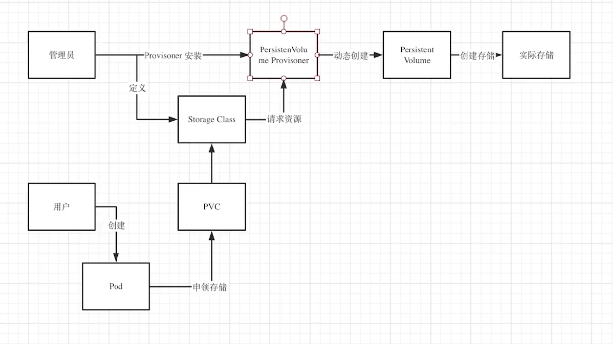

# Kubernetes 核心概念

> 2021 年，想部署一个应用的话，Docker 应该是最佳方案，k8s 是必备技能。

## 1. 什么是 k8s?

**k8s**是一个基于`容器`的分布式架构方案。

关于 k8s 的你要知道：

- 它的前身是 Google 的 Brog(google 内部超级强大的集群管理系统)
- k8s 可以增加运维效率，减少运维成本
- K8s 是一个开放性的开发平台，和语言无关（无论你的项目使用的是 Java、Go、Python 还是 NodeJs）
- K8s 是一个完备的分布式系统支撑平台，具有完备的集群管理能力

### 1.1. k8s 优点

- 团队可以“轻装上阵”，需要的运维工作量大大减少，质量大大提高
- 拥抱**微服务**
- 可以随时随地将系统“搬迁”上云
- **弹性扩容**可以轻松应对流量高峰
- 可以快速横向扩容，轻松应对用户激增

### 1.2 Kubernetes 能解决的问题

- 按需垂直扩容，新的服务器（node节点）能轻易增加和删除
- 按需的水平扩容，容器实例能轻松扩容，缩容
- 副本控制器，不需要担心副本的状态
- 服务发现和路由
- 自动部署和回滚，如果应用状态错误，可以实现自动回滚

## 2. k8s 组件

> 当你部署完 Kubernetes，便拥有了一个完整的集群。

*k8s组件*


*k8s架构：*


重点组件：

- Kubernetes API

  > Kubernetes [控制面](https://kubernetes.io/zh-cn/docs/reference/glossary/?all=true#term-control-plane)的核心是 [API 服务器](https://kubernetes.io/zh-cn/docs/concepts/overview/components/#kube-apiserver)。 
  >
  > API 服务器负责提供 HTTP API，以供用户、集群中的不同部分和集群外部组件相互通信。
  >
  > Kubernetes API 使你可以查询和操纵 Kubernetes API 中**对象**（例如：Pod、Namespace、ConfigMap 和 Event）的状态。

  可以通过 `kubectl`命令行接口，或`kubeadm`这类命令行工具来调用 API，以达到某些操作。

  也可以考虑使用[客户端库](https://kubernetes.io/zh-cn/docs/reference/using-api/client-libraries/)。

[K8s组件](https://kubernetes.io/zh-cn/docs/concepts/overview/components/)

## 3. K8s 对象

### 3.1 理解K8s对象

**Kubernetes 对象** 是持久化的实体。 Kubernetes 使用这些实体去*表示整个集群的状态*。

**对象**描述了如下信息：

1. 哪些容器化应用正在运行（以及在哪些节点上运行）
2. 可以被应用使用的资源
3. 关于应用运行时表现的策略，比如重启策略、升级策略以及容错策略

通过创建对象，你就是在告知 Kubernetes 系统，你想要的集群工作负载状态看起来应是什么样子的， 这就是 Kubernetes 集群所谓的 **期望状态（Desired State）**。

操作 Kubernetes 对象 —— 无论是创建、修改或者删除 —— 需要使用 [Kubernetes API](https://kubernetes.io/zh-cn/docs/concepts/overview/kubernetes-api)。

### 3.2 对象规约（Spec）与状态（Status）

对于有`spec` 的对象，你必须在创建对象时设置其**内容**，描述你希望对象所具有的特征： **期望状态（Desired State）**。

`status` 描述了对象的**当前状态（Current State）**。

> 例如，Kubernetes 中的 Deployment 对象能够表示运行在集群中的应用。 当创建 Deployment 时，可能会去设置 Deployment 的 `spec`，以指定该应用要有 3 个副本运行。 Kubernetes 系统读取 Deployment 的 `spec`， 并启动我们所期望的应用的 3 个实例 —— 更新状态以与规约相匹配。 如果这些实例中有的失败了（一种状态变更），Kubernetes 系统会通过执行修正操作来响应 `spec` 和状态间的不一致 —— 意味着它会启动一个新的实例来替换。

### 3.3 描述K8s对象

创建 Kubernetes 对象时，必须提供对象的 `spec`，用来描述该对象的期望状态， 以及关于对象的一些基本信息（例如名称）。

创建对象时（直接创建，或经由 `kubectl`）， API 请求必须在请求本体中包含 JSON 格式的信息。

**大多数情况下，你需要提供 `.yaml` 文件为 kubectl 提供这些信息**。

`kubectl` 在发起 API 请求时，将这些信息转换成 JSON 格式。

一个 `.yaml` 示例文件，展示了 Kubernetes Deployment 的必需字段和对象 `spec`：

```yaml
apiVersion: apps/v1
kind: Deployment
metadata:
  name: nginx-deployment
spec:
  selector:
    matchLabels:
      app: nginx
  replicas: 2 # 告知 Deployment 运行 2 个与该模板匹配的 Pod
  template:
    metadata:
      labels:
        app: nginx
    spec:
      containers:
      - name: nginx
        image: nginx:1.14.2
        ports:
        - containerPort: 80

```

### 3.4 K8s对象管理

1. 指令式

> ```sh
> kubectl create deployment nginx --image nginx
> ```

2. 指令式对象配置

> ```sh
> kubectl create -f nginx.yaml
> ```

3. 声明式对象配置

> ```sh
> kubectl diff -f configs/
> kubectl apply -f configs/
> ```

### 3.5 名字空间（Namespace）

**名字空间（Namespace）** 提供一种机制，将同一集群中的资源划分为相互隔离的组。

名字空间作用域仅针对带有名字空间的对象，例如 Deployment、Service 等。

名字空间是在多个用户之间划分集群资源的一种方法，所以，如果你的集群只有几到几十个用户，根本不需要考虑名字空间。

```json
"metadata": {
  "labels": {
    "key1" : "value1",
    "key2" : "value2"
  }
}
```

### 3.6 标签和选择算符

**标签（Labels）**是附加到 Kubernetes 对象（比如 Pods）上的*键值对*。

标签可以用于组织和选择对象的子集。

标签可以在创建时附加到对象，随后可以随时添加和修改。

#### 3.6.1 标签选择算符

标签不支持唯一性。通常，我们希望许多对象携带相同的标签。

通过**标签选择算符**，客户端/用户可以识别一组对象。

标签选择算符是 Kubernetes 中的核心分组原语。

API 目前支持两种类型的选择算符：**基于等值的**和**基于集合的**。

1. 基于等值的需求
2. 基于集合的需求

#### 3.6.2 API 的 LIST和WATCH过滤

```sh
kubectl get pods -l environment=production,tier=frontend # 基于等值
kubectl get pods -l 'environment in (production),tier in (frontend)' # 基于集合
kubectl get pods -l 'environment in (production, qa)' # 基于集合（或）
```

### 3.7 注解（annotations）

注解不用于标识和选择对象，这是和标签的主要区别。

你可以使用标签或注解将**元数据(metadata)**附加到 Kubernetes 对象。

#### 3.7.1 为对象附加元数据

```json
"metadata": {
  "annotations": {
    "key1" : "value1",
    "key2" : "value2"
  }
}
```

### 3.8 字段选择器

```sh
# 两者等效
kubectl get pods
kubectl get pods --field-selector ""

# 筛选出 status.phase 字段值为 Running 的所有 Pod
kubectl get pods --field-selector status.phase=Running
```

## 4. 工作负载

工作负载是在 Kubernetes 上运行的应用程序。

负载可以由一个或多个一起工作的**组件**组成，你可以在Pod中运行它们。

在 Kubernetes 中，Pod 代表的是集群上处于运行状态的一组 [容器](https://kubernetes.io/zh-cn/docs/concepts/overview/what-is-kubernetes/#why-containers) 的集合。

而是使用**负载资源**来替用户管理一组 Pod。 

这些负载资源通过配置 [控制器](https://kubernetes.io/zh-cn/docs/concepts/architecture/controller/) 来确保正确类型的、处于运行状态的 Pod 个数是正确的，与用户所指定的状态相一致。

*Kubernetes 提供若干种内置的工作负载资源：*

- Deployment 和 Replicaset: `Deployment` 很适合用来管理你的集群上的无状态应用
- StatefulSet: 运行一个或者多个以某种方式**跟踪应用状态的 Pods**。
- [DaemonSet](https://kubernetes.io/zh-cn/docs/concepts/workloads/controllers/daemonset/) 定义提供节点本地支撑设施的 `Pods`
- [Job](https://kubernetes.io/zh-cn/docs/concepts/workloads/controllers/job/) 和 [CronJob](https://kubernetes.io/zh-cn/docs/concepts/workloads/controllers/cron-jobs/)。 定义一些一直运行到结束并停止的任务。`Job` 用来表达的是一次性的任务，而 `CronJob` 会根据其时间规划反复运行。

### 4.1 Pod

> K8s 的最小工作单位；
>
> Pod 内是一组（一个或多个）容器；
>
> Pod 内的容器可以资源共享、通信；

Pod 通常不是直接创建的，而是使用工作负载资源创建的。

一般每个 Pod 都旨在运行给定应用程序的**单个实例**。

如果想运行多个实例以提供更多的资源，则应该使用多个 Pod，每个实例使用一个 Pod。 这样的多个实例通常被称为**副本（Replication）**。

通常使用一种**工作负载资源**及其[控制器](https://kubernetes.io/zh-cn/docs/concepts/architecture/controller/) 来创建和管理一组 Pod 副本。

Pod 类似于共享名字空间和文件系统卷的一组 Docker 容器。

Pod 的共享上下文包括一组 Linux 名字空间、控制组（cgroup）和可能一些其他的隔离方面， 即用来隔离 Docker 容器的技术。

#### 4.1.1 使用Pod

Pod 不是进程，而是容器运行的环境。 在被删除之前，Pod 会一直存在。

可以使用工作负载资源来创建和管理多个 Pod。 

负载资源的**控制器**能够使用 **Pod 模板（Pod Template）**处理副本的管理、上线，并在 Pod 失效时提供自愈能力。

#### 4.1.2 Pod模板

Pod 模板是包含在工作负载对象中的规范，用来创建 Pod。这类负载资源包括 [Deployment](https://kubernetes.io/zh-cn/docs/concepts/workloads/controllers/deployment/)、 [Job](https://kubernetes.io/zh-cn/docs/concepts/workloads/controllers/job/) 和 [DaemonSet](https://kubernetes.io/zh-cn/docs/concepts/workloads/controllers/daemonset/) 等。

**工作负载的控制器**会使用负载对象中的 `PodTemplate` 来生成实际的 Pod。

*一个Job的清单：*

```yaml
apiVersion: batch/v1
kind: Job
metadata:
  name: hello
spec:
  template: # 指示启动一个容器
    # 这里是 Pod 模板
    spec:
      containers:
      - name: hello
        image: busybox:1.28
        command: ['sh', '-c', 'echo "Hello, Kubernetes!" && sleep 3600']
      restartPolicy: OnFailure
    # 以上为 Pod 模板
```

#### 4.1.3 Pod更新与替换

当某工作负载的 Pod 模板被改变时， 控制器会*基于更新的模板创建新的 Pod 对象*而不是对现有 Pod 执行更新或者修补操作。

### 4.2 资源

工作负载资源有以下类型：

- Deployments
- ReplicaSet
- StatefulSet
- DaemonSet
- Job

#### 4.2.1 Deployments

一个 Deployment 为 [Pod](https://kubernetes.io/docs/concepts/workloads/pods/pod-overview/) 和 [ReplicaSet](https://kubernetes.io/zh-cn/docs/concepts/workloads/controllers/replicaset/) 提供声明式的更新能力。

你负责描述 Deployment 中的 **目标状态**，而 Deployment [控制器（Controller）](https://kubernetes.io/zh-cn/docs/concepts/architecture/controller/) 以受控速率更改实际状态， 使其变为期望状态。

#####  创建Deployment

```yaml
apiVersion: apps/v1
kind: Deployment # Deployment的资源类型
metadata:
  name: nginx-deployment # pod名称
  labels:
    app: nginx
spec:
  replicas: 3 # 创建了一个 ReplicaSet，负责启动三个 nginx Pods
  selector: # 定义 Deployment 如何查找要管理的 Pods
    matchLabels: # 在 Pod 模板中定义的标签
      app: nginx # 定义一个label键值对（app: nginx）
  template:
    metadata:
      labels:
        app: nginx # Pod 被使用 template.metadata.labels 字段打上 app: nginx 标签
    spec:
      containers:
      - name: nginx # 模板规约（即 .template.spec 字段）指示 Pods 运行一个 nginx 容器
        image: nginx:1.14.2 # nginx容器的镜像
        ports:
        - containerPort: 80
```

##### 更新 Deployment

TODO...

#### 4.2.2 ReplicaSet

> 控制Pod的副本数，在 Deployments里定义。

#### 4.2.3 StatefulSets

> 管理有状态的应用（如：Mysql应用）的工作负载API对象。
>
> 使Pod重启后可以继续使用之前Pod里存储的数据。

StatefulSet 用来管理某 [Pod](https://kubernetes.io/docs/concepts/workloads/pods/pod-overview/) 集合的部署和扩缩， 并*为这些 Pod 提供持久存储和持久标识符*。

和 Deployment 相同的是，StatefulSet 管理了基于相同容器定义的一组 Pod。

*和Deployment不同点：*

 	1. StatefulSet 为它们的每个 Pod 维护了一个*固定的 ID*，也就是说每个Pod 是不能替换的
 	2. 给定 Pod 的存储必须由 PersistentVolume 驱动 基于所请求的 storage class 来提供，或者由管理员预先提供
 	3. 删除 StatefulSet不会删除相应的卷，删除Deployment会删除它的所有信息
 	4. StatefulSet 当前需要headless 服务来负责 Pod 的网络标识。您需要负责创建此服务。
 	5. 当删除 StatefulSets 时，StatefulSet 不提供任何终止 Pod 的保证。- 为了实现 StatefulSet 中的 Pod 可以有序和优雅的终止，可以在删除之前将 StatefulSet 缩放为 0

*一个StatefulSet组件：*

```yaml
apiVersion: v1
kind: Service
metadata:
  name: nginx
  labels:
    app: nginx
spec:
  ports:
  - port: 80
    name: web
  clusterIP: None
  selector:
    app: nginx
---
apiVersion: apps/v1
kind: StatefulSet
metadata:
  name: web
spec:
  selector:
    matchLabels:
      app: nginx # 必须匹配 .spec.template.metadata.labels
  serviceName: "nginx"
  replicas: 3 # 默认值是 1
  minReadySeconds: 10 # 默认值是 0
  template:
    metadata:
      labels:
        app: nginx # 必须匹配 .spec.selector.matchLabels
    spec:
      terminationGracePeriodSeconds: 10
      containers:
      - name: nginx
        image: k8s.gcr.io/nginx-slim:0.8
        ports:
        - containerPort: 80
          name: web
        volumeMounts:
        - name: www
          mountPath: /usr/share/nginx/html
  volumeClaimTemplates:
  - metadata:
      name: www
    spec:
      accessModes: [ "ReadWriteOnce" ]
      storageClassName: "my-storage-class"
      resources:
        requests:
          storage: 1Gi
```

`volumeClaimTemplates` 将通过 PersistentVolumes 驱动提供的 [PersistentVolumes](https://kubernetes.io/zh-cn/docs/concepts/storage/persistent-volumes/) 来提供稳定的存储。

#### 4.2.4 DaemonSet

> 有时我们需要在所有节点都运行一个监控Pod，我们不需要每个都手动去创建，可以用DaemonSet.

*DaemonSet* 确保全部（或者某些）节点上运行一个 Pod 的副本。

*DaemonSet 的一些典型用法：*

- 在集群的每个节点上运行存储 Daemon，比如 glusterd 或 ceph。
- 在每个节点上运行日志收集 Daemon，比如 flunentd 或 logstash。
- 在每个节点上运行监控 Daemon，比如 Prometheus Node Exporter 或 collectd。

#### 4.2.5 Job

> 有时我们需要做一个任务，做完就停止（如定时任务），Job就是用来做这个的。

*我们创建一个 perl 的 Pod，它负责计算 π 到小数点后 2000 位，并将结果打印出来：*

```yaml
apiVersion: batch/v1
kind: Job
metadata:
  name: pi
spec:
  template:
    spec:
      containers:
      - name: pi
        image: perl:5.34.0
        command: ["perl",  "-Mbignum=bpi", "-wle", "print bpi(2000)"]
      restartPolicy: Never
  backoffLimit: 4
```

## 5. 服务、负载均衡和网络

 Kubernetes 为 Pod 提供自己的 IP 地址，并为一组 Pod 提供相同的 DNS 名， 并且可以在它们之间进行负载均衡。

Pod 是非永久性资源。 如果你使用 [Deployment](https://kubernetes.io/zh-cn/docs/concepts/workloads/controllers/deployment/) 来运行你的应用程序，则它可以动态创建和销毁 Pod。

每个 Pod 都有自己的 IP 地址，但是在 Deployment 中，在同一时刻运行的 Pod 集合可能与稍后运行该应用程序的 Pod 集合不同，因为可能发生Pod的销毁和创建。

*这导致了一个问题：*

> 如果一组 Pod（称为“后端”）为集群内的其他 Pod（称为“前端”）提供功能， 那么前端如何找出并跟踪要连接的 IP 地址，以便前端可以使用提供工作负载的后端部分？

### 5.1 Service 资源

Service 定义了这样一种抽象：逻辑上的一组 Pod，一种可以访问它们的策略 —— 通常称为微服务。

Service 所针对的 Pod 集合通常是通过[选择算符](https://kubernetes.io/zh-cn/docs/concepts/overview/working-with-objects/labels/)来确定的。

> 举个例子，考虑一个图片处理后端，它运行了 3 个副本。这些副本是可互换的 —— 前端不需要关心它们调用了哪个后端副本。 然而组成这一组后端程序的 Pod 实际上可能会发生变化， 前端客户端不应该也没必要知道，而且也不需要跟踪这一组后端的状态。

Service 定义的抽象能够解耦这种关联。

#### 5.1.1 定义 Service

```yaml
apiVersion: v1
kind: Service # 定义资源类型
metadata:
  name: my-service # 定义 Service 名称
spec:
  selector: # 选择算符
    app: MyApp # 要作用于Pod的标签
  # 将请求代理到使用 TCP 端口 9376
  ports:
    - protocol: TCP
      port: 80 # Service 暴露的端口
      targetPort: 9376 # 
```

#### 5.1.2 没有选择算符的 Service

服务最常见的用法是为 Kubernetes Pod 的访问提供抽象， 但是当与相应的 Endpoints 对象一起使用且没有选择算符时， 服务也可以为其他类型的后端提供抽象，包括在集群外运行的后端。

如：

- 希望在生产环境和测试环境使用不同的数据库
- 希望服务指向另一个名字空间
- 你正在将工作负载迁移到 Kubernetes。在评估该方法时，你仅在 Kubernetes 中运行一部分后端。

*一个没有Selector(选择算符)的 Service:*

```yaml
apiVersion: v1
kind: Service
metadata:
  name: my-service
spec:
  ports:
    - protocol: TCP
      port: 80
      targetPort: 9376
```

*手动添加 Endpoints 对象，将服务手动映射到运行该服务的网络地址和端口：*

（如果不手动添加 EndpointsD对象，Service会匹配Pod，并创建 Endpoints对象。）

```yaml
apiVersion: v1
kind: Endpoints
metadata:
  # 这里的 name 要与 Service 的名字相同
  name: my-service
subsets:
  - addresses:
      - ip: 192.0.2.42
    ports:
      - port: 9376
```

### 5.2 虚拟 IP 和 Service 代理

Kubernetes 集群中，每个 Node 运行一个 `kube-proxy` 进程。 `kube-proxy` 负责为 Service 实现了一种 VIP（虚拟 IP）的形式.

### 5.3 Ingress

[Ingress](https://kubernetes.io/docs/reference/generated/kubernetes-api/v1.24/#ingress-v1beta1-networking-k8s-io) 公开从集群外部到集群内[服务](https://kubernetes.io/zh-cn/docs/concepts/services-networking/service/)的 HTTP 和 HTTPS 路由。 

流量路由由 Ingress 资源上定义的规则控制。

*一个将所有流量都发送到同一 Service 的简单 Ingress 示例：*


 [Ingress 控制器](https://kubernetes.io/zh-cn/docs/concepts/services-networking/ingress-controllers) 通常负责通过负载均衡器来实现 Ingress。

你必须拥有一个 [Ingress 控制器](https://kubernetes.io/zh-cn/docs/concepts/services-networking/ingress-controllers) 才能满足 Ingress 的要求。 仅创建 Ingress 资源本身没有任何效果。

你可能需要部署 Ingress 控制器，例如 [ingress-nginx](https://kubernetes.github.io/ingress-nginx/deploy/)。 你可以从许多 [Ingress 控制器](https://kubernetes.io/zh-cn/docs/concepts/services-networking/ingress-controllers) 中进行选择。

#### 5.3.1 Igress资源

*个最小的 Ingress 资源示例：*

```yaml
apiVersion: networking.k8s.io/v1
kind: Ingress
metadata:
  name: minimal-ingress
  annotations:
    nginx.ingress.kubernetes.io/rewrite-target: /
#  规约，提供了配置负载均衡器或者代理服务器所需的所有信息
spec:
  ingressClassName: nginx-example
  # 默认后端，以服务于无法与规约中 path 匹配的所有请求。
  defaultBackend:
    resource:
      apiGroup: k8s.example.com
      kind: StorageBucket
      name: static-assets
  rules: # Ingress规则
  - http:
      paths:
      - path: /testpath
        pathType: Prefix
        backend:
        	# 服务
          service:
            name: test
            port:
              number: 80
```


## 6. 存储

### 6.1 卷

Container 中的文件在磁盘上是临时存放的，这给 Container 中运行的较重要的应用程序带来一些问题。

-  问题之一是当容器崩溃时文件丢失
- 第二个问题会在同一 `Pod` 中运行多个容器并共享文件时出现

卷的核心是一个目录，其中可能存有数据，Pod 中的容器可以访问该目录中的数据。

使用卷时, 在 `.spec.volumes` 字段中设置为 Pod 提供的卷，并在 `.spec.containers[*].volumeMounts` 字段中声明卷在容器中的挂载位置。

### 6.2 卷类型

#### 6.2.1 configMap

> [`configMap`](https://kubernetes.io/zh-cn/docs/tasks/configure-pod-container/configure-pod-configmap/) 卷提供了向 Pod 注入配置数据的方法。
>
>  ConfigMap 对象中存储的数据可以被 `configMap` 类型的卷引用，然后被 Pod 中运行的容器化应用使用。

*下面的配置显示了如何将名为 `log-config` 的 ConfigMap 挂载到名为 `configmap-pod` 的 Pod 中：*

```yaml
apiVersion: v1
kind: Pod
metadata:
  name: configmap-pod
spec:
  containers:
    - name: test
      image: busybox:1.28
      volumeMounts:
        - name: config-vol
          mountPath: /etc/config # 卷在容器中挂载的目录
  volumes:
    - name: config-vol
      configMap:
        name: log-config
        items:
          - key: log_level
            path: log_level # 挂载到 Pod 的 /etc/config/log_level 路径下
```

#### 6.2.2 local

> `local` 卷所代表的是某个被挂载的本地存储设备，例如磁盘、分区或者目录。

#### 6.2.3 nfs

> `nfs` 卷能将 NFS (网络文件系统) 挂载到你的 Pod 中。
>
> 可以实现集群内文件的统一管理，可以理解成公司买了一堆磁盘，各个项目组都可以往里面存取数据，nfs是大家共用的。
>
> nfs 不适合大量文件存储，想要大量文件存储要用对象存储。

假如我们想要让Pod处理用户的头像，是不能存储到work node文件下的，因为可能有多个work node来提供服务，work node1是无法使用work node2中的文件的。

这时，我们需要有一个统一的文件管理系统，所有的Pod都把文件存储在这里。

##### 实战nfs

1. 在所有节点安装nfs服务

```sh
yum install -y nfs-utils rpcbind
```

2. 在master节点修改配置

```sh
# 创建一个目录，用于存放数据
mkdir /nfsdata
vi /etc/exports
/nfsdata   *(rw,sync,no_root_squash)
```

3. 在 master 节点系统自动启动

```sh
systemctl enable --now rpcbind
systemctl enable --now nfs
```

4. 如果修改了/etc/exports，需要重新激活配置

```sh
exportfs -r
```

5. 查看nfs挂载效果

```sh
[root@master Chapter8]# showmount -e master
Export list for master:
/nfsdata *
```

6. 创建Pod 引用NFS存储
   执行代码：
   kubectl apply -f 8-2-nfs.yaml

   ```yaml
   apiVersion: v1
   kind: Pod
   metadata:
     name: nfs-pd
   spec:
     containers:
     - name: test-container
       image: nginx
       volumeMounts:
       - mountPath: /usr/share/nginx/html # 挂载本节点文件目录
         name: test-volume
     volumes:
     - name: test-volume
       nfs: # nfs配置
         server: master # nfs所在节点
         path: /nfsdata # nfs文件地址
   ```

#### 6.2.4 持久卷 Persistent Volume (PV)

> 持久卷可以理解成公司运维买了一堆制作好的磁盘，供公司使用。

**持久卷（PersistentVolume，PV）** 是集群中的一块存储，可以由管理员事先制备， 或者使用[存储类（Storage Class）](https://kubernetes.io/zh-cn/docs/concepts/storage/storage-classes/)来动态制备。

持久卷是集群资源，就像节点也是集群资源一样。

PV 持久卷和普通的 Volume 一样， 也是使用卷插件来实现的，它们拥有独立于任何使用 PV 的 Pod 的生命周期。

##### 持久卷申领（PersistentVolumeClaim，PVC）

**持久卷申领（PersistentVolumeClaim，PVC）** 表达的是用户对存储的请求。

> 持久卷申领，就像各个项目组向公司运维申领磁盘，申领后的磁盘只能项目组内部使用。
>
> 必须先创建了PV才能创建PVC去申领相应的存储空间。

#### 6.3 Storage Class

> PV需要管理员手动创建，然后用户配置PVC来申领存储空间，这样就需要管理员不停的手动创建PV。
>
> 解决办法是：管理员创建一个Storage Class，用户可以在PVC中使用这个Storage Class 来自动创建PV，不需要管理员去手动创建PV了。

*PV-PVC和 Storage Class的关系：*



## 7. 配置

### 7.1 配置最佳实践

#### 7.1.1 一般配置

- 指定最新的稳定API版本
- 配置文件应存储在版本控制中，如：git
- 使用 YAML 而不是 JSON 编写配置文件
- 只要有意义，就将相关对象分组到一个文件中，一个文件更容易管理
- 可以在目录上调用许多`kubectl`命令
- 除非必要，否则不指定默认值：简单的最小配置会降低错误的可能性。
- 将对象描述放在注释中，以便更好地进行内省（写注释有时很重要）

#### 7.1.2 工作负载配置

- 一般不要用独立的Pods(即，未绑定到 ReplicaSet 或 Deployment的Pod)，如果节点发生故障，将不会重新调度独立的 Pods

#### 7.1.3 服务配置

在创建相应的后端工作负载（Deployment 或 ReplicaSet），以及在需要访问它的任何工作负载之前创建 [服务](https://kubernetes.io/zh-cn/docs/concepts/services-networking/service/)。

- 必须在 `Pod` 本身被创建之前创建 `Pod` 想要访问的任何 `Service`
- 一个可选（尽管强烈推荐）的[集群插件](https://kubernetes.io/zh-cn/docs/concepts/cluster-administration/addons/) 是 DNS 服务器。DNS 服务器为新的 `Services` 监视 Kubernetes API，并为每个创建一组 DNS 记录。
- 除非绝对必要，否则不要为 Pod 指定 `hostPort`。 将 Pod 绑定到`hostPort`时，它会限制 Pod 可以调度的位置数
- 如果你只需要访问端口以进行调试，则可以使用 [apiserver proxy](https://kubernetes.io/zh-cn/docs/tasks/access-application-cluster/access-cluster/#manually-constructing-apiserver-proxy-urls)或 [`kubectl port-forward`](https://kubernetes.io/zh-cn/docs/tasks/access-application-cluster/port-forward-access-application-cluster/)

### 7.2 ConfigMap

ConfigMap 将你的环境配置信息和 [容器镜像](https://kubernetes.io/zh-cn/docs/reference/glossary/?all=true#term-image) 解耦，便于应用配置的修改。

使用 ConfigMap 来将你的配置数据和应用程序代码分开。

在 ConfigMap 中保存的数据不可超过 1 MiB。如果你需要保存超出此尺寸限制的数据，你可能希望考虑挂载存储卷 或者使用独立的数据库或者文件服务。

#### 7.2.1 ConfigMap 和 Pods

ConfigMap 是一个 API [对象](https://kubernetes.io/zh-cn/docs/concepts/overview/working-with-objects/kubernetes-objects/)， 让你可以存储其他对象所需要使用的配置。

和其他 Kubernetes 对象都有一个 `spec` 不同的是，ConfigMap 使用 `data` 和 `binaryData` 字段。这些字段能够接收键-值对作为其取值。

*一个ConfigMap示例：*

```yaml
apiVersion: v1
kind: ConfigMap
metadata:
  name: game-demo
data:
  # 类属性键；每一个键都映射到一个简单的值
  player_initial_lives: "3"
  ui_properties_file_name: "user-interface.properties"

  # 类文件键
  game.properties: |
    enemy.types=aliens,monsters
    player.maximum-lives=5    
  user-interface.properties: |
    color.good=purple
    color.bad=yellow
    allow.textmode=true 
```

#### 7.2.2 使用 ConfigMap

ConfigMap 可以作为数据卷挂载。ConfigMap 也可被系统的其他组件使用， 而不一定直接暴露给 Pod。

ConfigMap 最常见的用法是为同一命名空间里某 Pod 中运行的容器执行配置。 

##### 在Pod中将 ConfigMap当做文件使用：

*一个将 ConfigMap 以卷的形式进行挂载的 Pod 示例：*

```yaml
apiVersion: v1
kind: Pod
metadata:
  name: mypod
spec:
  containers:
  - name: mypod
    image: redis
    volumeMounts:
    - name: foo
      mountPath: "/etc/foo"
      readOnly: true
  volumes:
  - name: foo
    configMap:
      name: myconfigmap
```

使用 `envFrom` 将所有 ConfigMap 的数据定义为容器环境变量，ConfigMap 中的键成为 Pod 中的环境变量名称。

第一步，创建ConfigMap资源：

```yaml
apiVersion: v1
kind: ConfigMap
metadata:
  name: special-config
  namespace: default
data:
  SPECIAL_LEVEL: very
  SPECIAL_TYPE: charm
```

第二步，创建容器将ConfigMap作为容器环境变量：

```yaml
apiVersion: v1
kind: Pod
metadata:
  name: dapi-test-pod
spec:
  containers:
    - name: test-container
      image: k8s.gcr.io/busybox
      command: [ "/bin/sh", "-c", "env" ]
      envFrom: # 
      - configMapRef:
          name: special-config
  restartPolicy: Never
```

### 8.3 secret

> `secret` 卷用来给 Pod 传递敏感信息，例如密码。
>
> `secret` 卷由 tmpfs（基于 RAM 的文件系统）提供存储，因此它们永远不会被写入非易失性（持久化的）存储器。

## 9. 安全

## 10. 策略

## 11. 集群管理


## 参考

《Kubernetes 权威指南--第 5 版》

[图解 k8s 架构](https://phoenixnap.com/kb/understanding-kubernetes-architecture-diagrams)

[Kubernetes是什么？](https://kubernetes.io/zh-cn/docs/concepts/overview/what-is-kubernetes/)

[Kubernetes Concepts and Architecture](https://platform9.com/blog/kubernetes-enterprise-chapter-2-kubernetes-architecture-concepts/)

**Kubernetes 入门到进阶实战，系统性掌握 K8s 生产实践（慕课网）**
