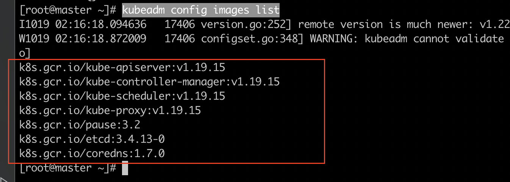
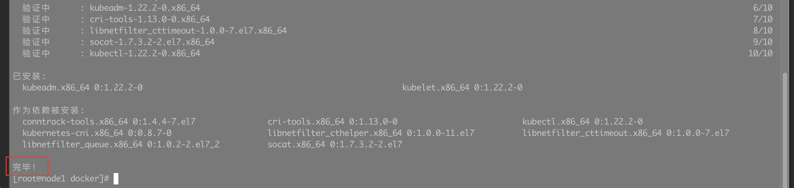
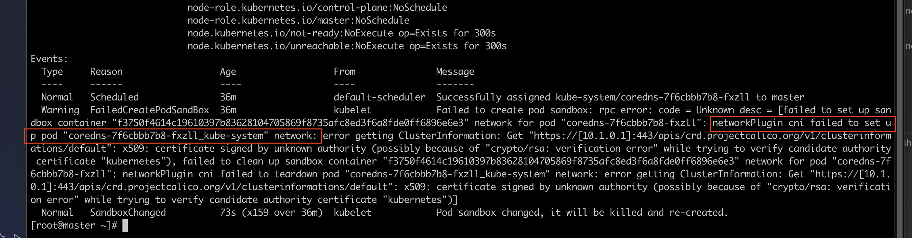
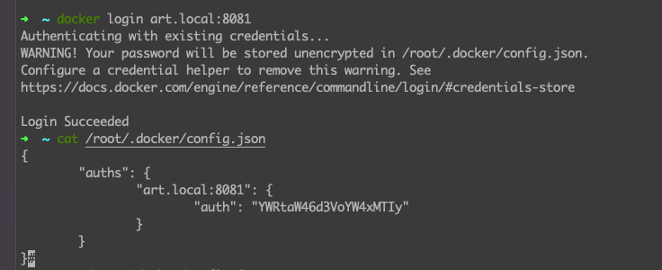
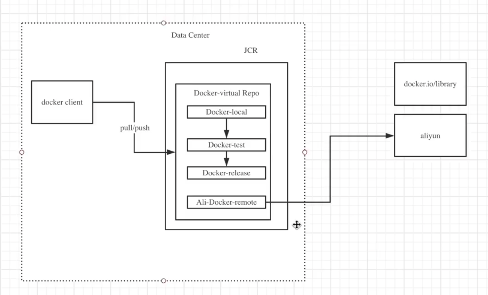
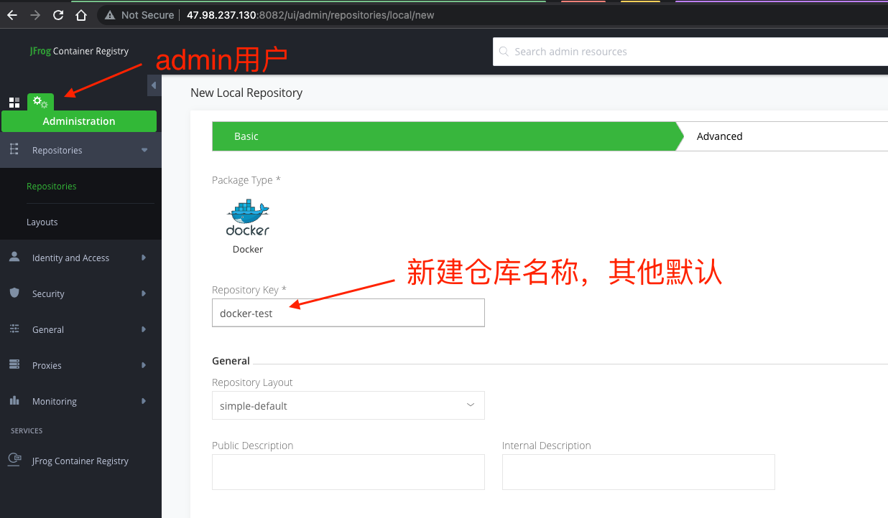
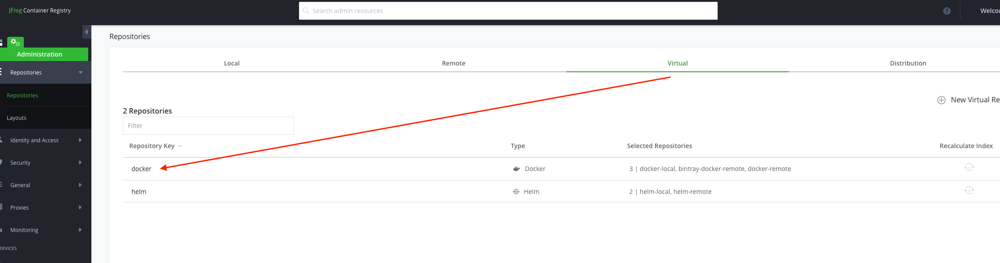
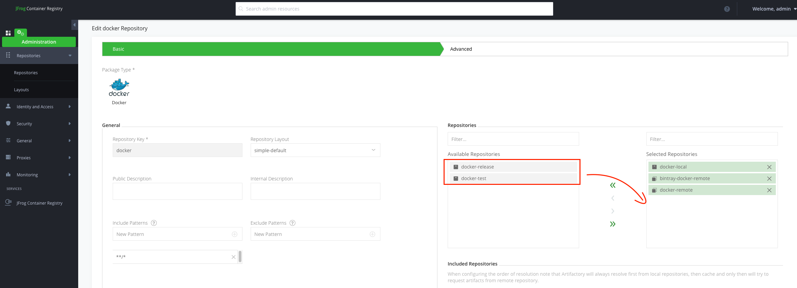

# 部署小白的 Kubernetes 学习之路

## 1. 购买服务器

### 1.1 主流服务器

**云服务器**是当今服务器市场的主角。

- 阿里云：
  - ECS（Elastic Compute Service）：即弹性计算服务器

服务器配置：一般个人项目 2G（内存） + 4G（空间）的配置就足够，如果部署集群，建议 3 个服务器即可。

### 1.2 设置服务器

服务器往往需要设置一些安全策略后才能使用，一般都有默认的安全策略。如阿里的 ECS 会有*安全组*来管理服务器端口的进出。

## 2. 连接并设置服务器

连接服务器的方式有多种，一般简单的有：

- 使用 SSH 连接工具，如：Xshell、Putty 等
- 使用 Terminal 直接连接

### 2.1 关闭防火墙

> 为了 Master 和 Node 间通信方便，暂时关闭。

```bash
systemctl disable firewalld
```

### 2.2 禁用 SELinux

> 让容器可以访问宿主机文件系统。

```bash
vim /etc/sysconfig/selinux
# 将 SELINUX=enforcing 改为 SELINUX=disabled
```

### 2.3 关闭 swap 交换区

```bash
swapoff -a
```

## 3. 给服务器安装软件

### 3.1 安装 Docker

准备工作：给 yum 配置源(一定要做，不然下载速度慢，且包的版本可能比较旧)。详情可以看下方链接 1

```bash
# 安装 wget,用于下载文件
yum install -y wget
# 下载CentOS7 的 repo文件
wget -O /etc/yum.repos.d/CentOS-Base.repo http://mirrors.aliyun.com/repo/Centos-7.repo
# 更新镜像源-清除缓存
yum clean all
# 更新镜像源-生成新缓存
yum makecache
# 备份自带镜像源配置文件（重要）
mv /etc/yum.repos.d/CentOS-Base.repo /etc/yum.repos.d/CentOS-Base.repo.backup
# 进入yum源的配置文件目录
cd /etc/yum.repos.d
# 查看文件目录
ls
> CentOS-Base.repo  CentOS-Base.repo.backup  epel.repo
# 编辑配置文件，将http修改为 https
vim CentOS-Base.repo
# 更新yum
yum update
```

_配置 Docker CE 镜像源站_

> 如果不配置可能会下载测试版等。

```bash
# step 1: 安装必要的一些系统工具
sudo yum install -y yum-utils device-mapper-persistent-data lvm2
# Step 2: 添加软件源信息
sudo yum-config-manager --add-repo http://mirrors.aliyun.com/docker-ce/linux/centos/docker-ce.repo
# Step 3: 更新并安装 Docker-CE
sudo yum makecache fast
sudo yum -y install docker-ce
```

_安装 Docker_

```bash
yum install docker-ce -y
```

安装 docker-ce 会自动安装相关依赖，如下：


_查看 Docker 是否安装成功_

```bash
docker version
```

_后台启动 docker_

```bash
systemctl start docker
# docker 随着系统自启动
systemctl enable docker
```

### 3.2 安装 K8s Master 节点

#### 3.2.1 _配置 K8s 源：_

```bash
cat >>/etc/yum.repos.d/kubernetes.repo <<EOF
[kubernetes]
name=Kubernetes
baseurl=https://mirrors.aliyun.com/kubernetes/yum/repos/kubernetes-el7-x86_64/
enabled=1
gpgcheck=1
repo_gpgcheck=1
gpgkey=https://mirrors.aliyun.com/kubernetes/yum/doc/yum-key.gpg https://mirrors.aliyun.com/kubernetes/yum/doc/rpm-package-key.gpg
EOF
```

#### 3.2.2 _使用 systemd 作为 docker 的驱动（和 K8s 保持一致），同时设置 Docker 镜像代理_

```bash
# 创建或进入 /etc/docker 目录
mkdir /etc/docker
# 创建Docker配置文件
cat > /etc/docker/daemon.json <<EOF
{
  "exec-opts": ["native.cgroupdriver=systemd"],
  "registry-mirrors": ["https://registry.cn-hangzhou.aliyuncs.com"]
}
EOF
# 重启docker服务
systemctl daemon-reload
systemctl restart docker
systemctl enable docker
```

#### 3.2.3 _安装相关软件_

```bash
yum install -y kubelet kubeadm kubectl
```

- Kubeadm : k8s 包管理程序
- Kubelet: Pod 管理服务组件
- Kubectl: K8s 命令行程序，用于集群管理

#### 3.2.4 _启动应用_

```bash
# 先启动 kubelet, kubeadm要用它
systemctl start kubelet
# 设置为开机启动
systemctl enable kubelet
```

_查看 k8s 已经安装的镜像：_

```bash
kubeadm config images list
```

_如图：_



#### 3.2.5 _初始化 K8s 的 Master 节点（控制平面）_

```bash
# ⚠️ 版本一定要注意，否则 Node节点可能无法加入
kubeadm init --kubernetes-version=1.22.2 \
--apiserver-advertise-address=172.16.164.42 \
--image-repository registry.aliyuncs.com/google_containers \
--service-cidr=10.1.0.0/16 \
--pod-network-cidr=192.168.0.0/16 # 指定CNI网络插件（calico）的特殊地址
```

😄 初战告捷：

```bash
.....
[kubelet-finalize] Updating "/etc/kubernetes/kubelet.conf" to point to a rotatable kubelet client certificate and key
[addons] Applied essential addon: CoreDNS
[addons] Applied essential addon: kube-proxy

Your Kubernetes control-plane has initialized successfully!

To start using your cluster, you need to run the following as a regular user:

	##########
	## 下面提示我们要配置证书
	##########

  mkdir -p $HOME/.kube
  sudo cp -i /etc/kubernetes/admin.conf $HOME/.kube/config
  sudo chown $(id -u):$(id -g) $HOME/.kube/config

You should now deploy a pod network to the cluster.
Run "kubectl apply -f [podnetwork].yaml" with one of the options listed at:
  https://kubernetes.io/docs/concepts/cluster-administration/addons/

  ##########
	## 下面是token,用于Node节点加入集群
	##########

Then you can join any number of worker nodes by running the following on each as root:

kubeadm join 172.1X.XX.XX:6443 --token jheyp2.y7ye53nsjrzi0709 \
    --discovery-token-ca-cert-hash sha256:d63aaebc4fbc8f92e504a029e9baa4dc84c0520d42e0178d3f737bcf5d7d18dd
[root@master ~]#
```

#### 3.2.6 _为 kubeadm 配置证书，否则不能使用 kubectl_

```bash
# 为非root用户配置证书
mkdir -p $HOME/.kube
sudo cp -i /etc/kubernetes/admin.conf $HOME/.kube/config
sudo chown $(id -u):$(id -g) $HOME/.kube/config
# 为root用户配置KUBECONFIG环境变量即可
echo "export KUBECONFIG=/etc/kubernetes/admin.conf" >> ~/.bash_profile
```

_试试 kubectl 可以用不，查看一下 kube-system 中的 ConfigMap 列表：_

```bash
kubectl -n kube-system get configmap
# 输出如下
NAME                                 DATA   AGE
coredns                              1      15m
extension-apiserver-authentication   6      15m
kube-proxy                           2      15m
kubeadm-config                       2      15m
kubelet-config-1.19                  1      15m
```

🎉🎉🎉

### 3.3 给 Master 安装 CNI 网络插件

> K8s 默认没有安装 CNI 网络插件。

```bash
# 安装 CNI 插件前，状态时 NoReady
kubectl get nodes
NAME     STATUS     ROLES    AGE   VERSION
master   NotReady   master   51m   v1.19.3
```

_安装 CNI 插件 -- calico_

```bash
kubectl apply -f https://docs.projectcalico.org/manifests/calico.yaml
```

_查看一下节点运行情况：_

```bash
# 安装 CNI 插件后，状态变为 Ready
kubectl get nodes
NAME     STATUS   ROLES    AGE   VERSION
master   Ready    master   52m   v1.19.3
```

### 3.4 安装 K8s Node 节点

> 安装过程和安装 K8s Master 一样，重复 3.2.1 ～ 3.2.2，然后安装软件，Node 节点不需要 kubectl，3.2.3 的执行步骤如下：

```bash
yum install kubelet kubeadm --disableexcludes=kubernetes
```

_安装完成提示：_



运行 kubelet 服务：

```
systemctl start kubelet
systemctl enable kubelet
```

### 3.5 ‼️ 关键步骤：将 Node 节点添加到集群，执行 3.2.5 步骤中的加入集群提示，如下：

```bash
kubeadm join 172.16.164.42:6443 --token p6kt93.yu984oesojqq8ut9 \
	--discovery-token-ca-cert-hash sha256:5d05b26d9649467e05ccf1a779a7655c83d2527bd7622182e0ac80f293d83aca
# 输出如下，表示加入成功
[preflight] Running pre-flight checks
[preflight] Reading configuration from the cluster...
[preflight] FYI: You can look at this config file with 'kubectl -n kube-system get cm kubeadm-config -o yaml'
[kubelet-start] Writing kubelet configuration to file "/var/lib/kubelet/config.yaml"
[kubelet-start] Writing kubelet environment file with flags to file "/var/lib/kubelet/kubeadm-flags.env"
[kubelet-start] Starting the kubelet
[kubelet-start] Waiting for the kubelet to perform the TLS Bootstrap...

This node has joined the cluster:
* Certificate signing request was sent to apiserver and a response was received.
* The Kubelet was informed of the new secure connection details.

Run 'kubectl get nodes' on the control-plane to see this node join the cluster.
```

到 Master 查看加入的信息：

```bash
# 查看集群所有节点
kubeadm get nodes
		# 输出信息如下，可以看到，node1 节点已经在集群下了
		NAME     STATUS   ROLES                  AGE   VERSION
    master   Ready    control-plane,master   16h   v1.22.2
    node1    Ready    <none>                 16h   v1.22.2
# 查看集群上所有的pod
kubectl get pods --all-namespaces
		AMESPACE     NAME                                       READY   STATUS    RESTARTS   AGE
    kube-system   calico-kube-controllers-75f8f6cc59-6jlsl   1/1     Running   0          16h
    kube-system   calico-node-glfwh                          0/1     Running   0          16h
    kube-system   calico-node-w67wg                          0/1     Running   0          16h
    kube-system   coredns-7f6cbbb7b8-78xng                   1/1     Running   0          17h
    kube-system   coredns-7f6cbbb7b8-c4trd                   1/1     Running   0          17h
    kube-system   etcd-master                                1/1     Running   4          17h
    kube-system   kube-apiserver-master                      1/1     Running   4          17h
    kube-system   kube-controller-manager-master             1/1     Running   0          17h
    kube-system   kube-proxy-bxb5d                           1/1     Running   0          17h
    kube-system   kube-proxy-hm2tm                           1/1     Running   0          16h
    kube-system   kube-scheduler-master                      1/1     Running   4          17h
# 注意 --v=2 在出错时可以打印出错误信息，2 是打印信息的数量
# 查看service
kubectl get service --all-namespaces
# 审查具体某个 Pod 出错原因, -n 是 --namespaces 缩写
kubectl describe pod coredns-7f6cbbb7b8-78xng -n kube-system
```

### 3.6 故障排查：

1. Iptables 没有设为 1，手动设置为 1 即可：

   > ```
   > [preflight] Running pre-flight checks
   > error execution phase preflight: [preflight] Some fatal errors occurred:
   >         [ERROR CRI]: container runtime is not running: output: Cannot connect to the Docker daemon at tcp://localhost:2375. Is the docker daemon running?
   > , error: exit status 1
   >         [ERROR IsDockerSystemdCheck]: cannot execute 'docker info': exit status 1
   >         [ERROR FileContent--proc-sys-net-bridge-bridge-nf-call-iptables]: /proc/sys/net/bridge/bridge-nf-call-iptables contents are not set to 1
   > [preflight] If you know what you are doing, you can make a check non-fatal with `--ignore-preflight-errors=...`
   > ```

   ```bash
   echo 1 > /proc/sys/net/bridge/bridge-nf-call-iptables
   echo 1 > /proc/sys/net/bridge/bridge-nf-call-ip6tables
   ```

2. token 过期

   在 Master 节点 init 时会生成一个 token 和 证书号，token 会在一定时间后过去，导致加入到 Master 失败。可以在 Maser 重新生成 token:

   ```bash
   # 先看一下Master 有没有有效的token
   kubeadm token list
   # 生成token, --ttl 0 代表token 有效期为永久
   kubeadm token create --ttl 0
   ```

3. kubeadm 版本错误

   > [preflight] Running pre-flight checks
   > [preflight] Reading configuration from the cluster...
   > [preflight] FYI: You can look at this config file with 'kubectl -n kube-system get cm kubeadm-config -o yaml'
   > error execution phase preflight: unable to fetch the kubeadm-config ConfigMap: this version of kubeadm only supports deploying clusters with the control plane version >= 1.21.0. Current version: v1.19.2
   > To see the stack trace of this error execute with --v=5 or higher

   解决办法：给 Node 节点的 kubeadm 配置文件，设置到指定的版本，然后使用配置文件加入集群：

   ```bash
   # 复制一份配置文件到用户目录
   kubeadm config print join-defaults > join.config.yaml
   # 查看配置文件，然后可以做出修改
   [root@node1 ~]# cat join.config.yaml
   apiVersion: kubeadm.k8s.io/v1beta3
   caCertPath: /etc/kubernetes/pki/ca.crt
   discovery:
     bootstrapToken:
       apiServerEndpoint: kube-apiserver:6443
       token: abcdef.0123456789abcdef
       unsafeSkipCAVerification: true
     timeout: 5m0s
     tlsBootstrapToken: abcdef.0123456789abcdef
   kind: JoinConfiguration
   nodeRegistration:
     criSocket: /var/run/dockershim.sock
     imagePullPolicy: IfNotPresent
     name: node1
     taints: null
   # 修改配置文件，添加版本信息 + 配置 token
   kubernetesVersion: v1.19.2
   apiVersion: kubeadm.k8s.io/v1beta3
   caCertPath: /etc/kubernetes/pki/ca.crt
   discovery:
     bootstrapToken:
       apiServerEndpoint: kube-apiserver:6443
       # 这里替换成Master init时生成的token
       token: abcdef.0123456789abcdef
       unsafeSkipCAVerification: true
     timeout: 5m0s
     # 这里也替换成Master init时生成的token
     tlsBootstrapToken: abcdef.0123456789abcdef
   kind: JoinConfiguration
   ```

4. 节点状态为 NotReady

   ```bash
   # 1.查看所有节点状态
   kubectl get nodes
   		# --> 显示node1 为 NotReady
       NAME     STATUS     ROLES                  AGE   VERSION
       master   Ready      control-plane,master   18m   v1.22.2
       node1    NotReady   <none>                 16m   v1.22.2
   # 2.查看所有 pod的情况
   kubectl get pods --all-namespaces
   		# --> 发现有 coredns-7f6cbbb7b8-fxzll 的状态是 ContainerCreating
       NAMESPACE     NAME                             READY   STATUS              RESTARTS   AGE
       kube-system   coredns-7f6cbbb7b8-fxzll         0/1     ContainerCreating   0          19m
       kube-system   coredns-7f6cbbb7b8-k69v7         0/1     ContainerCreating   0          19m
       kube-system   etcd-master                      1/1     Running             2          20m
       kube-system   kube-apiserver-master            1/1     Running             2          20m
       kube-system   kube-controller-manager-master   1/1     Running             2          20m
       kube-system   kube-proxy-cfp4c                 1/1     Running             0          19m
       kube-system   kube-proxy-pfx7n                 1/1     Running             1          17m
       kube-system   kube-scheduler-master            1/1     Running             2          20m
   # 3.继续找原因，查看 node1 的 pod是否都正常
   kubectl get pods --all-namespaces -o wide | grep node1
   		# --> node1 一切正常
   		kube-system   kube-proxy-pfx7n  1/1  Running  1 18m 172.16.164.41 node1 <none>  <none>
   kubectl get pods --all-namespaces -o wide | grep master
   		# --> master 的 coredns-7f6cbbb7b8-fxzll 这个 pod 出错了
       kube-system   coredns-7f6cbbb7b8-fxzll         0/1     ContainerCreating   0          21m   <none>          master   <none>           <none>
       kube-system   coredns-7f6cbbb7b8-k69v7         0/1     ContainerCreating   0          21m   <none>          master   <none>           <none>
   # 4. 查看出错信息
   kubectl describe pod coredns-7f6cbbb7b8-fxzll -n kube-system
   		# --> 报错信息如下图
   ```

   

告诉我们说是“cni”插件出问题了！

5. Work 接口无法使用 `kubectl`命令

   ```bash
   # 在 Work 节点执行
   kubectl get pods
   # 报错如下
   Config not found: /etc/kubernetes/admin.conf
   The connection to the server localhost:8080 was refused - did you specify the right host or port?
   ```

   这是说明，我们 Work 节点 没有相应的配置，是变量环境导致的；

   解决办法：

   ```bash
   # 1. 将Master 节点的 /etc/kubernetes/admin.conf 文件复制粘贴到 Work节点 对应的目录
   # 2. 执行命令，设置环境变量等
   echo "export KUBECONFIG=/etc/kubernetes/admin.conf" >> ~/.bash_profile
   # 3. 重启配置
   source ~/.bash_profile
   ```

### 3.7 使用 kubeadm 升级集群

> 注意：kubeadm 提供的升级只能按版本升级，不可以跨版本，如：1.19 -> 1.20 是可以的，1.19-> 1.21 是不行的。

1. 首先升级 kubeadm

   ```bash
   # 查看当前 kubeadm 版本
   kubeadm version
   # 查看所有版本
   yum list --showduplicates kubeadm --disableexcludes=kubernetes
   # 安装特定版本
   yum install -y kubeadm-1.20.11-0 --disableexcludes=kubernetes
   ```

2. 升级 kubernetes 相关软件

   ```
   # 查看升级计划
   kubeadm upgrade plan
   # 执行升级,开始升级工作,⚠️最后的补丁号“-0”不需要带上
   kubeadm upgrade apply 1.20.11
   ```

   _升级成功提示：_

   ```bash
   ......
   [addons] Applied essential addon: CoreDNS
   [addons] Applied essential addon: kube-proxy

   [upgrade/successful] SUCCESS! Your cluster was upgraded to "v1.20.11". Enjoy!

   [upgrade/kubelet] Now that your control plane is upgraded, please proceed with upgrading your kubelets if you haven't already done so.
   ```

   _最后一行提示我们，别忘了升级 kubelets，否则我们下次升级到更新的版本时会报错啊_:

   ```bash
   # 查看升级后 kubectl 版本
   kubelet version
   # 升级kubelets 和 kubectl
   yum install -y kubelet-1.20.11-0 kubectl-1.20.11-0 --disableexcludes=kubernetes
   # 重启kubelet
   sudo systemctl daemon-reload
   sudo systemctl restart kubelet
   # 再查看升级后 kubectl 版本
   kubectl version
   ```

   _查看升级后的 k8s 集群信息：_

   ```bash
   [root@master ~]# kubeadm config images list
   I1021 00:41:44.008360   22781 version.go:254] remote version is much newer: v1.22.2; falling back to: stable-1.20
   # 已经完成升级了，从 1.19 升级到了 1.20
   k8s.gcr.io/kube-apiserver:v1.20.11
   k8s.gcr.io/kube-controller-manager:v1.20.11
   k8s.gcr.io/kube-scheduler:v1.20.11
   k8s.gcr.io/kube-proxy:v1.20.11
   k8s.gcr.io/pause:3.2
   k8s.gcr.io/etcd:3.4.13-0
   k8s.gcr.io/coredns:1.7.0
   ```

3. 升级集群中的 Node

   ```bash
   # 查看一下当前 Node
   kubectl get nodes
   
   ```

### 3.8 安装 MySql

首先要新建 mysql 相关目录和配置文件，**Docker 启动 mysql 容器时要用到**：

```bash
# 创建mysql 安装目录
mkdir /opt/mysql
# 创建配置存放目录
mkdir /opt/mysql/conf.d
# 创建data数据存放目录
mkdir /opt/mysql/data/
```

创建 mysql 启动时需要的配置文件：

```bash
# 创建配置文件
mkdif /opt/mysql/my.cnf
# 填写配置信息
[mysqld]
user=mysql
character-set-server=utf8
default_authentication_plugin=mysql_native_password
secure_file_priv=/var/lib/mysql
expire_logs_days=7
sql_mode=STRICT_TRANS_TABLES,NO_ZERO_IN_DATE,NO_ZERO_DATE,ERROR_FOR_DIVISION_BY_ZERO,NO_ENGINE_SUBSTITUTION
max_connections=1000

[client]
default-character-set=utf8

[mysql]
default-character-set=utf8
```

启动 mysql 容器：

```
docker run \
 --name mysql57 \
 -p 3306:3306 \
 -v /opt/mysql/data:/var/lib/mysql \
 -v /opt/mysql/log:/var/log/mysql \
 -v /opt/mysql/my.cnf:/etc/mysql/my.cnf:rw \
 -e MYSQL_ROOT_PASSWORD=password \
 -d registry.cn-beijing.aliyuncs.com/qingfeng666/mysql:5.7 --default-authentication-plugin=mysql_native_password
```

安装 mysql 客户端（记住这里客户端，用来操作 mysql 服务的，我们已经通过 docker 启动了 mysql 服务）：

```bash
# 安装mysql客户端
yum install -y mysql
# 连接mysql服务，用户时root，密码为 password
mysql -uroot -h127.0.0.1 -ppassword
# 创建一个数据库
> CREATE DATABASE `blogDB` CHARACTER SET utf8 COLLATE utf8_general_ci;
```

### 3.9 安装 MongoDB

```bash
# 配置MongoDB安装源
vim /etc/yum.repos.d/mongodb-org-4.2.repo
# 输入如下信息
[mongodb-org-5.0]
name=MongoDB Repository
baseurl=https://repo.mongodb.org/yum/redhat/$releasever/mongodb-org/5.0/x86_64/
gpgcheck=1
enabled=1
gpgkey=https://www.mongodb.org/static/pgp/server-5.0.asc
```

## 4. 安装 Dashboard 可视化插件部署

> Dashboard 是基于 web 的用户界面，可以管理 K8s 集群。

[dashboard 官方地址](https://github.com/kubernetes/dashboard)

_用 kubectl apply xxx.yaml 命令， 以 yaml 创建一个 Service 资源：_

```bash
kubectl apply -f https://raw.githubusercontent.com/kubernetes/dashboard/v2.0.0/aio/deploy/recommended.yaml
		# 会自动帮我们创建相应的命名空间
		namespace/kubernetes-dashboard created
    serviceaccount/kubernetes-dashboard created
    service/kubernetes-dashboard created
    secret/kubernetes-dashboard-certs created
    secret/kubernetes-dashboard-csrf created
    secret/kubernetes-dashboard-key-holder created
    configmap/kubernetes-dashboard-settings created
    role.rbac.authorization.k8s.io/kubernetes-dashboard created
    clusterrole.rbac.authorization.k8s.io/kubernetes-dashboard created
    rolebinding.rbac.authorization.k8s.io/kubernetes-dashboard created
    clusterrolebinding.rbac.authorization.k8s.io/kubernetes-dashboard created
    deployment.apps/kubernetes-dashboard created
    service/dashboard-metrics-scraper created
```

💔💔 糟糕，忘记配置这个文件了：

浏览器打开：https://raw.githubusercontent.com/kubernetes/dashboard/v2.0.0/aio/deploy/recommended.yaml

可以看到它的配置信息：

```yaml
# limitations under the License.

apiVersion: v1
kind: Namespace
metadata:
  name: kubernetes-dashboard

---

apiVersion: v1
kind: ServiceAccount
metadata:
  labels:
    k8s-app: kubernetes-dashboard
  name: kubernetes-dashboard
  namespace: kubernetes-dashboard

---
# 这里告诉我们，要启动一个服务，它就是 kubernetes-dashboard 服务
kind: Service
apiVersion: v1
metadata:
  labels:
    k8s-app: kubernetes-dashboard
  name: kubernetes-dashboard
  namespace: kubernetes-dashboard
spec:
	# 添加下面一行，修改类型为 NodePort,⚠️ 这样就会被安装到Node 节点上，而不是默认安装到 Master 节点
	type: NodePort
  ports:
    - port: 443
      targetPort: 8443
      # 添加代理端口
      nodePort: 30001
  selector:
    k8s-app: kubernetes-dashboard

---
......
```

将上面的修改保存为一个 k8s-dashboard.yaml 文件，直接执行下面的命令部署：

```bash
# 如果发现有镜像无法下载，我们可以手动下载它，如：
docker pull registry.cn-hangzhou.aliyuncs.com/google_containers/dashboard:v2.0.0
docker pull registry.cn-hangzhou.aliyuncs.com/google_containers/metrics-scraper:v1.0.4
# 然后重命名一下
docker tag registry.cn-hangzhou.aliyuncs.com/google_containers/dashboard:v2.0.0 kubernetesui/dashboard:v2.0.0
docker tag registry.cn-hangzhou.aliyuncs.com/google_containers/metrics-scraper:v1.0.4 kubernetesui/metrics-scraper:v1.0.4
# 最后部署🪤
kubectl apply -f k8s-dashboard.yaml
```

### 4.1 如何访问 Dashboard

1. Https://节点IP:port 

2. Chrome浏览器会报错，说Https证书有问题，此时需要点击页面任意位置，然后输入“thisisunsafe”即可跳转

3. 访问Dashboard需要token，通过以下命令可以获取：

   `kubectl -n kube-system describe $(kubectl -n kube-system get secret -n kube-system -o name | grep namespace) | grep token`

## 5. 搭建私有仓库

> 私有仓库可以更方便管理我们自己的镜像。

### 5.1 常见的镜像分类

- 公有镜像（docker hub、aliyun镜像）
- 私有镜像 （哈勃、JFrog）

### 5.2 安装JFrog

> JFrog 帮我们搭建私有镜像。

- 创建文件夹
```shell
# 创建目录
mkdir -p /etc/artifactory/var/etc/
# 进入目录
cd /etc/artifactory/var/etc/
# 创建文件
touch system.yaml
# 修改权限等
chown -R 1030:1030 /etc/artifactory/var/
chmod -R 777 /etc/artifactory/var/
# 运行jcr镜像
docker run --name artifactory-jcr -v /etc/artifactory/var:/var/opt/jfrog/artifactory -d -p 8081:8081 -p 8082:8082 registry.cn-beijing.aliyuncs.com/qingfeng666/artifactory-jcr:latest
# 查看一下运行的容器
docker ps |grep jcr
```

如果容器名称 *artifactory-jcr*已经被占用，可以先删除该容器，然后再创建。或者重启该容器：

```shell
# 删除容器
docker rm /artifactory-jcr
# 重启容器
docker start artifactory-jcr
```

### 5.3 配置私有镜像中心

#### 5.3.1 在 Master，node 节点上分别配置 JCR 的本地域名解析

配置域名解析，我们可以通过 art.local 访问JCR服务。

```sh
vim /etc/hosts
# 输入如下信息，分别对应各个节点的内网IP和域名
172.16.164.41	work1
172.16.164.43	work2
172.16.164.42	master	art.local
```

#### 5.3.2 配置一个不安全的registry(注册表)

配置Docker insecure registry。

```sh
vi /etc/docker/daemon.json
```

*配置如下信息：*

```json
{
  "registry-mirrors": [
    "https://registry.docker-cn.com",
    "https://dockerhub.azk8s.cn",
    "https://reg-mirror.qiniu.com",
    "http://hub-mirror.c.163.com",
    "https://docker.mirrors.ustc.edu.cn"
  ],
  "insecure-registries": ["art.local:8081"]
}
```

#### 5.3.4 登陆到自己配置的注册表

1. 执行下方命令，登陆注册表

```sh
docker login art.local:8081
```

如果忘记密码，可以到 /root/.cocker/config.json去查看。



### 5.4 配置JCR仓库

一般我们需要至少有三个镜像仓库：

- docker-local: 开发环境仓库，给开发人员来用
- docker-test: 测试环境，给测试团队来用
- docker-release: 发布用的包，运维部署用
- docker-remote: 代理远程的仓库，如阿里云
- docker-virtual: 虚拟仓库，用来客户端和上面的4个仓库通信

*私有仓库架构：*



*给admin用户新建仓库：*



*把新建的仓库添加到virtual Repository:*





此时，我们的虚拟仓库有了5个docker镜像仓库，分别用来存储我们不同种类的镜像。

### 5.5 将镜像推送到私有镜像中心

#### 5.5.1 上传代码到gitlab，然后在服务器拉取代码

到服务器相关目录，拉起代码

#### 5.5.2 把本地代码打包成镜像

*在项目执行：*

```sh
docker build -t art.local:8081/yyweb:v0.1 .
```

#### 5.5.3 启动容器

```sh
docker run -d --name yyweb  -p 80:80 art.local:8081/yyweb:v0.1
```

**至此，我们的应用可以在浏览器中访问了。**

#### 5.5.4 重新给镜像打个tag，添加仓库名称 docker-local

```sh
docker tag art.local:8081/yyweb:v0.1 art.local:8081/docker-local/yyweb:0.1
```

#### 5.5.5 推送镜像到私有仓库

```sh
docker push art.local:8081/docker-local/yyweb:0.1
```


## 6. 使用 Helm 管理 K8s 的包

### 6.1 安装 Helm

**安装 helm**

```bash
# CentOs 直接执行安装脚本
curl https://raw.githubusercontent.com/helm/helm/main/scripts/get-helm-3 | bash
```

**手动二进制版本安装**

```bash
# 到官方地址下载相应版本
https://github.com/helm/helm/releases
# 解压
tar -zxvf helm-v3.0.0-linux-amd64.tar.gz
# 找到helm程序，移动到需要的目录中
mv linux-amd64/helm /usr/local/bin/helm
```

### 5.2 使用 Helm 安装服务

_安装 Prometheus_

## 参考

[链接 1：CentOS 7- yum 配置阿里镜像源](https://developer.aliyun.com/article/704987)

[链接 2: Docker CE 镜像源站](https://developer.aliyun.com/article/110806)

