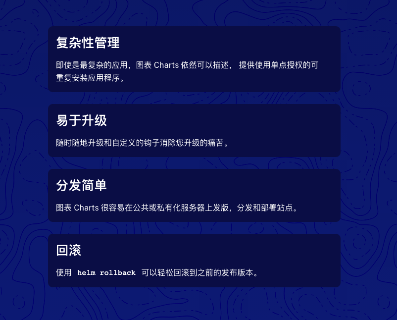

# Helm

> K8s 包管理器。

## 1. 为何需要 Helm

一个项目的开发环境一般有3种，

1. 生产环境
2. 测试环境
3. 开发环境

3个不同环境下，同一个应用会有不同的功能。

开发环境下，开发者根据需求进行开发，一行一行敲下新功能所需的业务代码；

程序员把一个功能开发完之后，需要部署到测试环境，让相关测试人员进行验证，验证功能是否符合需求，验证是否有BUG；此时，开发环境下，程序员又在开发其他功能；

等一切准备就绪，我们会将测试完成的功能部署到生产环境，这时，新功能才会呈现在用户面前。

K8s 下，这种模式如何实施？

- 1、文件夹管理不同功能

  如：我们的前端代码，/fontend-dev 存放开发环境的代码；/fontend-test 存放测试环境代码；/fontend-prod 存放生产环境的代码；然后，容器构建时，分别把它们打包成不同的 Docker 镜像，然后部署。

- 2、使用 git 分支管理

  这样的话可是实现3种不同环境下代码管理，但是要搞清楚，我们切换分支时，不同环境下的配置文件是不同的。使用分支管理这些配置文件，那么合并，回滚等git 操作的难度会大大增加。

  

  这种情况，你需要有不同的环境分支，如：dev分支、test分支、prod分支；

  

  然后，把各种功能在需要的时候，分别往上面合并；测试时要把一个评论功能的分支 dev-feature-commont 合并到 test 分支，然后上线时，在合并到 prod分支。

  

  困难点在于，不同分支下的配置不同，你是不能直接合并它们的，往往需要修改后才能合并，

  如：一个链接 url1:

  ```
  # 在开发环境时它是
  http://localhost:8081/
  # 在测试环境它是
  http://189.32.32.45:8999/
  # 在生产环境
  https://192.30.43.34/
  ```

  你需要在合并到不同的环境时，把他们修改成特定的值，光想想是不是都有点头大。

- 3、使用**模版系统**

  模版系统采用模版+配置的方式来管理不同环境下的代码；

  如：一个链接，在这种模式下，它是：

  ```bash
  ${protol}://${host}:{port}/
  ```

  对，你没看错，只需要一套代码，可以实现在不同环境下运行，获取到不同的值。

所以，我们需要一套类似的模版系统，来管理 K8s的各种应用。

为了实现：`配置/应用分离`。

## 2. Helm简介

> Helm 是 K8s 的包管理器。
>
> 是查找、分享和使用软件构件 K8s 的最优方式。
>
> 真正做到了 配置/应用 分离。

*Helm优点*



### 2.1 Helm 架构

🌟🌟 Helm 是干什么的？

> 

## 3. Helm核心概念

[Helm三大概念](https://helm.sh/zh/docs/intro/using_helm/#%E4%B8%89%E5%A4%A7%E6%A6%82%E5%BF%B5)

- Chart 表：

  它是 Helm 包，包含一个 K8s 资源的所有定义。

  🌟 chart 表分两种：🌟

  - **application** chart：

    官方定义：Application charts are a collection of templates that can be packaged into versioned archives

    to be deployed。

    翻译一下：**application** 表，是模版的集合，他能被打包成不同的版本，以便部署。

  - **library** chart:

    用于给开发者提供工具或其他有用的功能。

- Repository（仓库）：

  是用来存放和共享 charts 的地方。

- Release:

  运行在 K8s集群中的 chart 的**实例**。

*一句话概括 Helm 与 K8s关系‼️：*

> Helm 安装 *charts* 到 Kubernetes 集群中，每次安装都会创建一个新的 *release*。

## 4. chart 表详解

```bash
# 创建一个chart表
helm create mychart
# 查看创建了哪些内容
cd mychart
➜  mychart ls
charts  Chart.yaml  templates  values.yaml
```

- charts
- Chart.yaml 
- templates  
- values.yaml

我们看一下 `Chart.yaml`里面是什么：

```bash
➜  mychart cat Chart.yaml
apiVersion: v2
name: mychart
description: A Helm chart for Kubernetes
####总结：type表示chart的类型，application是用于部署的；library是用于给开发者提供工具或其他有用的功能。 ####
type: application
####总结：chart 版本，每次修改包都要更新它 ####
version: 0.1.0
####总结：需要部署的应用的版本，下面的 1.16.0 是一个 Nginx 版本 ####
appVersion: "1.16.0"
```

看一下 `values.yaml`里面是什么：

> 定义了一些变量和值，用于*配置应用分离*。

```bash
➜  mychart cat values.yaml
# 定义了 template 使用的 默认值

replicaCount: 1

image:
  repository: nginx
  pullPolicy: IfNotPresent
  # Overrides the image tag whose default is the chart appVersion.
  tag: ""

imagePullSecrets: []
nameOverride: ""
fullnameOverride: ""

serviceAccount:
  create: true
  annotations: {}
  name: ""

podAnnotations: {}

podSecurityContext: {}
  # fsGroup: 2000

securityContext: {}

service:
  type: ClusterIP
  port: 80

ingress:
  enabled: false
  className: ""
  annotations: {}
  hosts:
    - host: chart-example.local
      paths:
        - path: /
          pathType: ImplementationSpecific
  tls: []

resources: {}
  # limits:
  #   cpu: 100m
  #   memory: 128Mi
  # requests:
  #   cpu: 100m
  #   memory: 128Mi

autoscaling:
  enabled: false
  minReplicas: 1
  maxReplicas: 100
  targetCPUUtilizationPercentage: 80
  # targetMemoryUtilizationPercentage: 80

nodeSelector: {}

tolerations: []

affinity: {}
```

templates目录：

> 模板，方便我们更快更好的写 service.

charts 目录：

> 第三方依赖库，如一个应用需要mysql.


## 5. Helm 工作流

1. ➕ 添加 chart 存储库 

   存储库是用来查找 Charts 的地方 ；

   Helm3 没有默认存储库，需要手动添加。

2. 🔍 查找要安装的 chart 

   `helm search hub` 命令:  从 [Artifact Hub](https://artifacthub.io/) 中查找并列出 helm charts （这里是公开可用的 charts）；

   `helm search repo`命令：从你添加（使用 `helm repo add`）到本地 helm 客户端中的仓库中进行查找。

3. 📦 安装 Helm chart 

   `helm install`命令：安装一个新的 helm 包；

   ```bash
   helm install [ReleaseName] [HelmPackageName]
   ```

   *安装时，helm 客户端会打印一些信息，包括：*

   - 哪些资源已经被创建 
   - release当前的状态 
   - 以及你是否还需要执行额外的配置步骤

   Helm 按照 chart 安装资源是有顺序的：

   1. Namespace

   2. NetworkPolicy

   3. LimitRange

   4. PodSecurityPolicy

      [更多安装顺序](https://helm.sh/zh/docs/intro/using_helm/#helm-install%E5%AE%89%E8%A3%85%E4%B8%80%E4%B8%AA-helm-%E5%8C%85)

   安装后 release 并不是立马就能安装成功，使用 `helm status`查看安装状态。

   ```bash
   helm status [ReleaseName]
   ```

4. 🧾 查看安装内容列表

   ```bash
   # 列出所有 release
   helm list
   # 查看某个 release
   helm get values [ReleaseName]
   ```

   

5. 升级安装/恢复安装

   `helm upgrade`命令：升级到 chart 的新版本，或修改 release 配置 🌟

   `helm rollback`命令：恢复 RELEASE 到之前的版本

   ```bash
   # 恢复到上一个版本
   helm rollback ReleaseName 1
   # 查看版本号
   helm history [RELEASE]
   ```

6. 删除安装

   ```bash
   # 卸载 release
   helm uninstall [RELEASE]
   ```

   

## 6. 仓库管理

> Helm3 已经不自带默认的 chart 仓库，我们需要手动添加。

`helm repo` 及相关命令，可以对仓库进行管理。

```
# 列出所有已经添加的仓库
helm repo list
# 添加新的仓库
helm repo add [REPOSITORY] [URL]
# 更新仓库，因为 chart仓库经常在变化
helm repo update
```


## 7. 自定义 chart 配置

> 通常我们不是直接安装 chart，而是根据需要自定义 chart 配置后才进行安装。

*查看 chart 的配置：*

```bash
# 查看chart 配置
helm show values [ChartName]

## Global Docker image parameters
## Please, note that this will override the image parameters, including dependencies, 
...
image:
  registry: docker.io
  repository: bitnami/wordpress
  tag: 5.6.0-debian-10-r35
  [..]
```

*覆盖默认配置*

```bash
# 使用 YAML 格式的文件覆盖上述任意配置项
echo '{mariadb.auth.database: user0db, mariadb.auth.username: user0}' > values.yaml
```

## 8. 安装 chart

安装 chart 的方式有很多种，上面是从仓库安装。安装方式：

- chart 仓库
- 本地 chart 压缩包（`helm install foo foo-0.1.1.tgz`）
- 解压后的 chart目录（`helm install foo path/to/foo`）
- 完整的 URL（`helm install foo https://example.com/charts/foo-1.2.3.tgz`）


## 9. 升级 chart

```bash
# 根据 panda.yaml 配置，升级 happy-panda 这个release
helm upgrade -f panda.yaml happy-panda bitnami/wordpress
```

## 10. 创建自己的 charts

*创建一个空的 chart*

```bash
# 创建chart,开始时是空的
helm create [ChartName]
```

*然后，我们就可以编辑它，并创建自己的模块。*

编辑时，可以使用 `helm lint` 命令验证格式是否正确；

最后，把它打包：

```
# 打包一个chart
helm package [ChartName]
```

打包后，我们可以把打包文件上传到 **仓库**；

最后我们可以 install 从仓库安装它。


```
# .bash_profile

# Get the aliases and functions
if [ -f ~/.bashrc ]; then
        . ~/.bashrc
fi

# User specific environment and startup programs

PATH=$PATH:$HOME/bin

export PATH
export KUBECONFIG=/etc/kubernetes/admin.conf
export KUBECONFIG=/etc/kubernetes/admin.conf
export KUBECONFIG=/etc/kubernetes/admin.conf
```


## 参看

👍[写 chart 时，最佳实践很有用](https://helm.sh/zh/docs/chart_best_practices/conventions/)