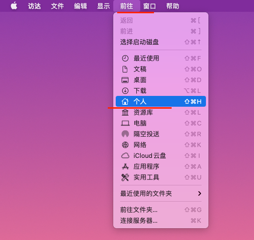

# Jenkins

> 打造自己专属的 CI/CD 工具。

## 1.Jenkins 是什么

## 2.安装 Jenkins

### 2.1 Jenkins 需要的环境

[准备工作](https://www.jenkins.io/zh/doc/pipeline/tour/getting-started/):

- Java8
- Docker

### 2.2 macOs 版本安装

官方推荐使用 Homebrew [安装](https://www.jenkins.io/download/lts/macos/#native-installer-deprecated):

```shell
# 安装
brew install jenkins-lts
# 启动
brew services start jenkins-lts
# 重启
brew services restart jenkins-lts
# 更新
brew upgrade jenkins-lts
```

安装后需要进行[初始化](https://www.macminivault.com/installing-jenkins-on-macos/)一些东西。

### 2.3 忘记密码怎么办？

Jenkins 有一个 xml 文件保存了管理员用户和密码。

查看 xml 文件：

1. 打开 finder

2. 进入管理员用户目录
   

3. 打开隐藏文件

```shell
cmd + shift + .
```

4. 找到 config.xml 文件

通常目录路径是：用户/xxx/.jenkins/users/xxxx/config.xml

然后我们可以看到，id 标签就是管理员用户名，passwordHash 是加密后的密码。

我们可以把这个密码修改为"111111"，加密后就是：

> #jbcrypt:$2a$10$DdaWzN64JgUtLdvxWIflcuQu2fgrrMSAMabF5TSrGK5nXitqK9ZMS

5. 重启 Jenkins，使用新密码登陆

## 3. Jenkins 核心概念

Pipeline(流水线)

> Jenkins Pipeline（或简称为 "Pipeline"）是一套插件，Jenkins 就是通过它们实现 CI/CD 的.

Jenkins Pipeline 自动化的实现了一种流程：将基于版本控制管理的软件**持续的交付到您的用户和消费者手中**。

Jenkins Pipeline 的定义通常被写入到一个文本文件（称为 Jenkinsfile ）中。
