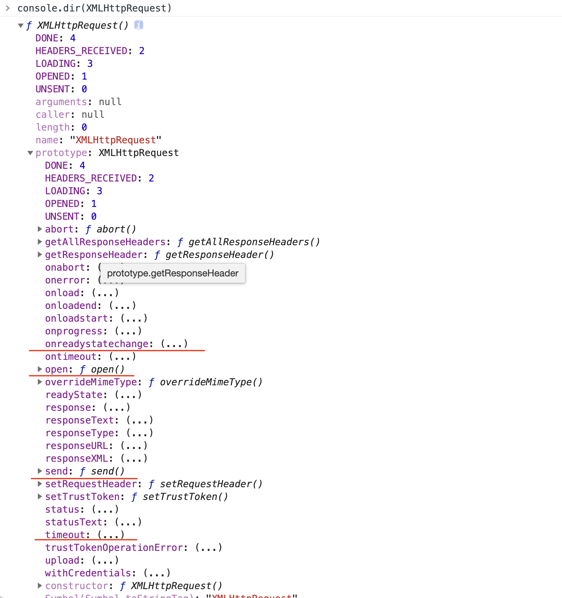

# Ajax 对比 fetch

> 前后端通信协议是通常是 HTTP，HTTP 像快递行业规范，快递员运送包裹要按规范操作。

**包裹**就是我们要传递的数据。

快递单上有地址（IP 地址），有电话（用户信息），等待。

**快递员是谁呢？**

## 1. XMLHttpRequest

作为一个小小的前端，显然是没能力去完全实现一个基于<code style="color: #708090; background-color: #F5F5F5;">HTTP</code>协议的通信服务的。还好，这个由浏览器帮我们做了，感谢 IE，感谢 Chrome。

它们都实现了一个 [WebAPI 接口](https://developer.mozilla.org/zh-CN/docs/Web/API) -- [XMLHttpRequest](https://developer.mozilla.org/zh-CN/docs/Web/API/XMLHttpRequest)。

<code style="color: #708090; background-color: #F5F5F5;">XMLHttpRequest（XHR）</code>对象用于与服务器交互。

### 1.1 构造函数 XMLHttpRequest()

该构造函数用于初始化一个 XMLHttpRequest 实例对象。

_打印看看 XMLHttpRequest 是什么：_



是不是看到了几个非常熟悉的方法：<code style="color: #708090; background-color: #F5F5F5;">open</code>、<code style="color: #708090; background-color: #F5F5F5;">send</code>、<code style="color: #708090; background-color: #F5F5F5;">onreadystatechange</code>、<code style="color: #708090; background-color: #F5F5F5;">ontimeout</code> ...

### 1.2 AJAX

<code style="color: #708090; background-color: #F5F5F5; font-size: 18px">AJAX</code> 是异步的 JavaScript 和 XML（Asynchronous JavaScript And XML），它是一种**技术方案,用于不需要重载（刷新）整个页面**。

这里的 XML 指什么 ❓

> 由于历史原因，之前传输数据一般使用的是 XML，**AJAX**一词中的“X”代表的就是“XML”。
>
> 由于 JSON 的许多优势，比如更加轻量以及作为 Javascript 的一部分，目前 JSON 的使用比 XML 更加普遍。

AJAX 这种”新“方法，包括：HTML、XML、CSS、DOM、JavaScript，以及 XMLHttpRequest.

<code style="color: #708090; background-color: #F5F5F5; font-size: 18px">XMLHttpRequest</code>是 Ajax 的核心，Ajax 利用它可以做这些工作：

- 分析和操纵服务器响应
- 监控请求过程
- 提交表单、上传二进制文件（使用 Ajax 或 FormData 对象）
- 创建异步或同步请求
- 在 Web works 中使用 Ajax

总结以下，<code style="color: #708090; background-color: #F5F5F5; font-size: 18px">AJAX</code> 主要做两件事：

- 1. 在不重新加载页面的情况下**发送请求**给服务器。
- 2. **接受**并使用从服务器发来的**数据**。

#### 1.2.1 实现一个 AJAX

_上代码：_

```js
// 生成一个 XMLHttpRequest 实例
const httpRequest = new XMLHttpRequest();

// 初始化一个请求
// 第三个参数为 true，代表异步操作；false则为 同步，会在 send方法处阻塞
httpRequest.open("POST", "text.html", true);

// 设置请求头
// 必须在 open() 之后、send() 之前调用
httpRequest.setRequestHeader("Accept-Encoding", "gzip");
httpRequest.setRequestHeader(
  "Content-type",
  "application/x-www-form-urlencoded"
);

// 监听 readyState 属性变化
httpRequest.onreadystatechange = function () {
  if (httpRequest.readyState === XMLHttpRequest.DONE) {
    if (httpRequest.status === 200) {
      // 处理返回的数据
      console.log(httpRequest.responseText || httpRequest.response);
      // 获取所有响应头
      console.log(httpRequest.getAllResponseHeaders());
      // 获取单个响应头
      console.log(httpRequest.getResponseHeader("Content-Type"));
    } else {
      console.log("There was a problem with the request.");
    }
  }
};

// 发送请求，参数为要发送的数据，需要和 "Content-type"相对应
// 默认 GET 方法时为 null
httpRequest.send("foo=bar&lorem=ipsum");
```

显然，这是个很简易的封装，我们不能拿它进行开发工作。

社区有成熟的库帮我们实现了 AJAX。

**两个比较出名的库是**：

- JQuery.ajax()

  是 JQuery 的一个方法，在 JQuery 时代，它的应用及其广泛

- axios

  这是个基于 Promise 的 HTTP 客户端，可用于浏览器和 Node.js

## 2. Fetch API

<code style="color: #708090; background-color: #F5F5F5; font-size: 18px">Fetch</code> 等同于 <code style="color: #708090; background-color: #F5F5F5; font-size: 18px">XMLHttpRequest</code>，它提供了许多与 <code style="color: #708090; background-color: #F5F5F5; font-size: 18px">XMLHttpRequest</code> 相同的功能，但被**设计成更具可扩展性和高效性** -- MDN。

Fetch API 提供了一个 JavaScript 接口，<span style="color: #ff0000; font-size: 16px;">用于访问和操纵 HTTP 管道的一些具体部分，例如请求和响应</span>。

与<code style="color: #708090; background-color: #F5F5F5; font-size: 18px">XMLHttpRequest</code>相比，新的 API 提供了更强大和灵活的功能集。

Fetch 提供了对 <code style="color: #708090; background-color: #F5F5F5; font-size: 18px">Request</code> 和 <code style="color: #708090; background-color: #F5F5F5; font-size: 18px">Response</code> （以及其他与网络请求有关的）对象的通用定义。

### 2.1 Fetch 接口

Fetch 接口很简单，只用 4 个：

- WindowOrWorkerGlobalScope.fetch()

  fetch() 方法，用于发起请求获取资源

- Headers

  相当于 response/request 的头信息

- Request ⚠️ 实验中的功能

  相当于一个资源请求

- Response

  相当于请求的响应

- Body

  提供了与 response/request 中的 body 有关的方法

> ⚠️ 注意：fetch() 方法的参数与 Request() 构造器是一样的。

### 2.2 Fetch Headers

> Headers 接口允许您对 HTTP **请求/响应头**执行各种操作。

- Headers.append()：

  给 header 添加值；

  相当于 XMLHttpRequest 中的 setRequestHeader()；

- Headers.values()；

  给 header 中所有值；

  相当于 XMLHttpRequest 中的 getAllResponseHeaders()；

_示例：_

```js
let myHeaders = new Headers();

myHeaders.append("Content-Type", "text/xml");

myHeaders.get("Content-Type");
// should return 'text/xml'
```

### 2.3 Fetch Request

🧪 这是一个实验中的功能。

用来表示资源请求，像 fetch()方法一样。

**示例**：

```js
// 创建一个 Request 对象
const myRequest = new Request("http://localhost/flowers.jpg");

// 直接获取 Request 的值
const myURL = myRequest.url; // http://localhost/flowers.jpg
const myMethod = myRequest.method; // GET
const myCred = myRequest.credentials; // omit

// 也可以把 myRequest 传递给 fetch()
fetch(myRequest)
  .then((response) => response.blob())
  .then((blob) => {
    myImage.src = URL.createObjectURL(blob);
  });
```

### 2.4 Fetch Response

Response 接口呈现了对一次**请求的响应数据**。

**示例**：

```js
const image = document.querySelector(".my-image");
fetch("flowers.jpg")
  .then(function (response) {
    return response.blob();
  })
  .then(function (blob) {
    const objectURL = URL.createObjectURL(blob);
    image.src = objectURL;
  });
```

### 2.5 Fetch Body

Body 代表响应/请求的正文，允许你声明其内容类型是什么以及应该如何处理。

Body 被 Request 和 Response 实现.

**示例**：

```js
const myRequest = new Request("products.json");

fetch(myRequest)
  .then((response) => response.json()) // 使用 response 实现的 json 方法
  .then((data) => {
    console.log(data);
  });
```

## 3. Fetch 用法

_上代码：_

```js
fetch("http://example.com/movies.json")
  .then(function (response) {
    return response.json();
  })
  .then(function (myJson) {
    console.log(myJson);
  });
```

## 4. Ajax 对比 Fetch

- 1. 二者不在一个纬度

  这样对比是不公平的，Ajax 是利用 XML、HTML 和 XMLHttpRequest 来进行异步资源获取的一种技术方案；

  Fetch 和 XMLHttpRequest 一样，都是浏览器提供的 API；

- 2. Fetch 集成度更高，使用更简单

  Fetch 帮我们集成了 Headers、Request、Response，我们直接使用即可。

  Ajax 关于 Headers、Request 和 Response 的部分需要我们手动来处理

- 3. Fetch 基于 Promise

- 4. Fetch 兼容性更差

  IE 目前不支持 Fetch;

## 参考

**文档**：

[Fetch 基本概念 | MDN](https://developer.mozilla.org/zh-CN/docs/Web/API/Fetch_API/Basic_concepts)

[Fetch API | MDN](https://developer.mozilla.org/zh-CN/docs/Web/API/Fetch_API)

[使用 Fetch | MDN](https://developer.mozilla.org/zh-CN/docs/Web/API/Fetch_API/Using_Fetch)

[Ajax | MDN](https://developer.mozilla.org/zh-CN/docs/Web/Guide/AJAX)

**Blog**：

[Fetch API 教程 --> 阮一峰](http://www.ruanyifeng.com/blog/2020/12/fetch-tutorial.html)

[计算机网络起源系列博客 --> 博客园/noteless](https://www.cnblogs.com/noteless/p/10218446.html)
