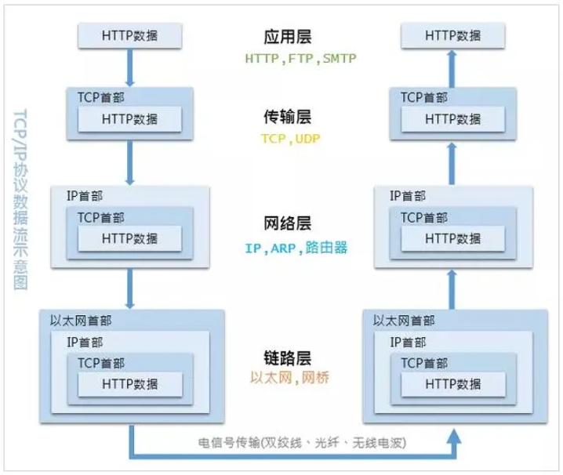
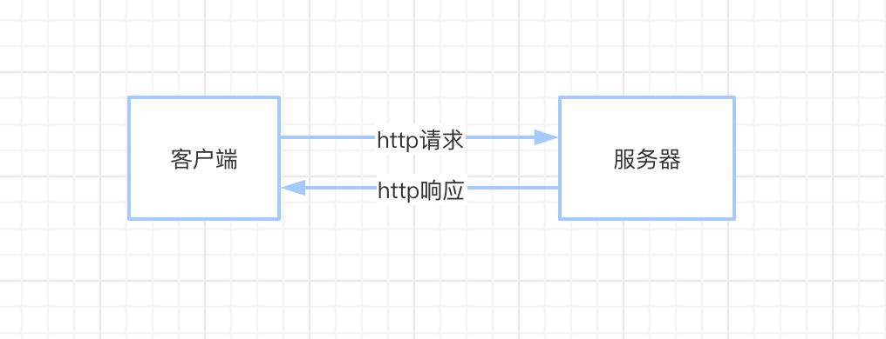

# Ajax、axios、fetch 对比

> 前后端通信协议是通常是HTTP，HTTP像快递行业规范，快递员运送包裹要按规范操作。

**包裹**就是我们要传递的数据。

快递单上有地址（IP地址），有电话（用户信息），等待。

**快递员是谁呢？**

## 1. HTTP

HTTP 是前后端通信的基础，在网络分层协议中的最上层。

*网络分层协议：*


*TCP/IP 数据流：*



本文不讨论网络传输，只是讨论如何使用 HTTP。

*HTTP工作流：*



> ⚠️注意：HTTP的工作顺序是先有请求，然后才有响应的。

为什么强调 <code style="color: #708090; background-color: #F5F5F5;">HTTP</code> 是先有请求，然后才有响应呢？

因为 <code style="color: #708090; background-color: #F5F5F5;">HTTP服务器</code> 不能在没有请求的情况下给客户端推送消息。

服务器向客户端推送消息由别的协议来实现，[EventSource接口](https://developer.mozilla.org/zh-CN/docs/Server-sent_events/EventSource)实现了 服务端 推送<code style="color: #708090; background-color: #F5F5F5;">单向</code>消息到 客户端的服务。也就是说，EventSource接口 只能从服务端推送消息给客户端。

我既想让客户端发送消息到服务器，也想让服务器推送消息到客户端怎么办？那 [WebSockets](https://developer.mozilla.org/zh-CN/docs/Web/API/WebSockets_API)可以满足你。

<code style="color: #708090; background-color: #F5F5F5;">WebSockets</code> 是一种先进的技术。它可以在用户的浏览器和服务器之间打开交互式通信会话。

先进往往伴随着一个缺点：兼容性差。

我们还是老老实实看HTTP吧！后面再研究 <code style="color: #708090; background-color: #F5F5F5;">WebSockets</code>。

## 2. 使用HTTP

作为一个小小的前端，显然是没能力去完全实现一个基于<code style="color: #708090; background-color: #F5F5F5;">HTTP</code>协议的通信服务的。还好，这个由浏览器帮我们做了，感谢IE，感谢Chrome。

它们都实现了一个 [WebAPI接口](https://developer.mozilla.org/zh-CN/docs/Web/API) -- [XMLHttpRequest](https://developer.mozilla.org/zh-CN/docs/Web/API/XMLHttpRequest)。

<code style="color: #708090; background-color: #F5F5F5;">XMLHttpRequest（XHR）</code>对象用于与服务器交互。

### 2.1 构造函数 XMLHttpRequest()

该构造函数用于初始化一个 XMLHttpRequest 实例对象。

*打印看看XMLHttpRequest是什么：*


是不是看到了几个非常熟悉的方法：<code style="color: #708090; background-color: #F5F5F5;">open</code>、<code style="color: #708090; background-color: #F5F5F5;">send</code>、<code style="color: #708090; background-color: #F5F5F5;">onreadystatechange</code>、<code style="color: #708090; background-color: #F5F5F5;">ontimeout</code> ...

### 2.2 使用XMLHttpRequest实例发送一个HTTP请求

*上代码：*

```js
// todo

```

未完待续。。。

## 参考

[Ajax --> MDN](https://developer.mozilla.org/zh-CN/docs/Web/Guide/AJAX)

[axios --> github](https://github.com/axios/axios)

[计算机网络起源系列博客 --> 博客园/noteless](https://www.cnblogs.com/noteless/p/10218446.html)
