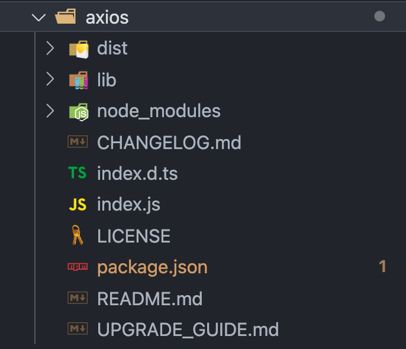

# axios 深度分析（含源码）


## 1. axios 是什么

<code style="color: #708090; background-color: #F5F5F5; font-size: 18px">axios</code> 是一个**基于 Promise 的 HTTP 客户端**，可用于浏览器和 node.js

在服务器端，它使用 node.js 的 <code style="color: #708090; background-color: #F5F5F5; font-size: 18px">http 模块</code>，而在客户端（浏览器）上，它使用 <code style="color: #708090; background-color: #F5F5F5; font-size: 18px">XMLHttpRequests</code>。

**axios 特性**：

- 在浏览器端使用 XMLHttpRequests
- 从 node.js 发起 http 请求
- 支持 Promise API
- 拦截请求和响应
- 转换请求和响应数据
- 取消请求
- JSON 数据的自动转换
- 客户端支持以防 XSRF(跨站伪装)

## 2. axios 怎么用

### 2.1 通过配置文件发起请求

> axios(config)

```js
// Send a POST request
axios({
  method: "post",
  url: "/user/12345",
  data: {
    firstName: "Fred",
    lastName: "Flintstone",
  },
});
```

> axios(url[, config])

```js
// Send a GET request (default method)
axios("/user/12345");
```

**请求方法的别名**

- axios.request(config)
- axios.get(url[, config])
- axios.delete(url[, config])
- axios.head(url[, config])
- axios.options(url[, config])
- axios.post(url[, data[, config]])
- axios.put(url[, data[, config]])
- axios.patch(url[, data[, config]])

### 2.2 创建一个 axios 实例

> axios.create([config])

```js
const instance = axios.create({
  baseURL: "https://some-domain.com/api/",
  timeout: 1000,
  headers: { "X-Custom-Header": "foobar" },
});
```

指定的配置将和实例的配置合并，实例方法和 axios 几乎相同，只是多了下面这一个：

- axios#getUri([config])

### 2.3 Request Config(请求配置文件)

只有 <code style="color: #708090; background-color: #F5F5F5; font-size: 18px">url</code> 配置是必须的，默认 <code style="color: #708090; background-color: #F5F5F5; font-size: 18px">method</code> 为 <code style="color: #708090; background-color: #F5F5F5; font-size: 18px">GET</code>.

```js
{
  // `url` is the server URL that will be used for the request
  url: '/user',
  // `method` is the request method to be used when making the request
  method: 'get', // default
  baseURL: 'https://some-domain.com/api/',
  transformRequest: [function (data, headers) {
    return data;
  }],
  transformResponse: [function (data) {
    return data;
  }],
  headers: {'X-Requested-With': 'XMLHttpRequest'},
  params: {
    ID: 12345
  },
  paramsSerializer: function (params) {
    return Qs.stringify(params, {arrayFormat: 'brackets'})
  },
  data: {
    firstName: 'Fred'
  },
  data: 'Country=Brasil&City=Belo Horizonte',
  timeout: 1000, // default is `0` (no timeout)
  withCredentials: false, // default
  adapter: function (config) {
    /* ... */
  },
  auth: {
    username: 'janedoe',
    password: 's00pers3cret'
  },
  responseType: 'json', // default
  responseEncoding: 'utf8', // default
  xsrfCookieName: 'XSRF-TOKEN', // default
  xsrfHeaderName: 'X-XSRF-TOKEN', // default
  onUploadProgress: function (progressEvent) {
  },
  onDownloadProgress: function (progressEvent) {
  },
  maxContentLength: 2000,
  maxBodyLength: 2000,
  validateStatus: function (status) {
    return status >= 200 && status < 300; // default
  },
  maxRedirects: 5, // default
  socketPath: null, // default
  httpAgent: new http.Agent({ keepAlive: true }),
  httpsAgent: new https.Agent({ keepAlive: true }),
  proxy: { // 代理
  },
  cancelToken: new CancelToken(function (cancel) {
  }),
  decompress: true // default
}
```

### 2.4 Response Schema(响应的数据结构)

请求的响应包含以下信息：

```js
{
  data: {},
  status: 200,
  statusText: 'OK',
  headers: {},
  config: {},
  request: {}
}
```

在 then 方法中使用 response:

```js
axios.get("/user/12345").then(function (response) {
  console.log(response.data);
  console.log(response.status);
  console.log(response.statusText);
  console.log(response.headers);
  console.log(response.config);
});
```

### 2.5 Config Defaults (默认配置)

我们可以为每个请求指定默认配置。

**全局 axios 默认配置**：

```js
axios.defaults.baseURL = "https://api.example.com";
axios.defaults.headers.common["Authorization"] = AUTH_TOKEN;
axios.defaults.headers.post["Content-Type"] =
  "application/x-www-form-urlencoded";
```

**自定义实例默认配置**：

```js
const instance = axios.create({
  baseURL: "https://api.example.com",
});

// 更改实例默认配置
instance.defaults.headers.common["Authorization"] = AUTH_TOKEN;
```

**配置优先级顺序**：

- 1. 优先级最低：库默认值 <code style="color: #708090; background-color: #F5F5F5; font-size: 18px">lib/defaults.js</code>
- 2. 优先级次之：实例的 defaults 属性
- 3. 优先级较高：请求的配置参数

_示例：_

```js
// 这里将使用库默认配置，默认 timeout 为 ’0‘
const instance = axios.create();

// 实例配置的默认属性
instance.defaults.timeout = 2500;

// 请求的配置
instance.get("/longRequest", {
  timeout: 5000,
});
```

### 2.6 Interceptors(拦截器)

我们可以在 <code style="color: #708090; background-color: #F5F5F5; font-size: 18px">then</code> or <code style="color: #708090; background-color: #F5F5F5; font-size: 18px">catch</code> 处理之前拦截一个 <code style="color: #708090; background-color: #F5F5F5; font-size: 18px">requests</code> 或 <code style="color: #708090; background-color: #F5F5F5; font-size: 18px">responses</code>.

可以理解为中间件。

```js
// 添加一个 request interceptor
axios.interceptors.request.use(
  function (config) {
    // Do something before request is sent
    return config;
  },
  function (error) {
    // Do something with request error
    return Promise.reject(error);
  }
);

// 添加一个 response interceptor
axios.interceptors.response.use(
  function (response) {
    // Any status code that lie within the range of 2xx cause this function to trigger
    // Do something with response data
    return response;
  },
  function (error) {
    // Any status codes that falls outside the range of 2xx cause this function to trigger
    // Do something with response error
    return Promise.reject(error);
  }
);
```

**删除拦截器**：

```js
const myInterceptor = axios.interceptors.request.use(function () {
  /*...*/
});
axios.interceptors.request.eject(myInterceptor);
```

**给 axios 实例添加拦截器**：

```js
const instance = axios.create();
instance.interceptors.request.use(function () {
  /*...*/
});
```

### 2.7 Handling Errors(错误处理)

直接使用 catch 语句捕获错误。

```js
axios.get("/user/12345").catch(function (error) {
  if (error.response) {
    // The request was made and the server responded with a status code
    // that falls out of the range of 2xx
    console.log(error.response.data);
    console.log(error.response.status);
    console.log(error.response.headers);
  } else if (error.request) {
    // The request was made but no response was received
    // `error.request` is an instance of XMLHttpRequest in the browser and an instance of
    // http.ClientRequest in node.js
    console.log(error.request);
  } else {
    // Something happened in setting up the request that triggered an Error
    console.log("Error", error.message);
  }
  console.log(error.config);
});
```

使用配置项 validateStatus 的回调函数处理错误。

```js
axios.get("/user/12345", {
  validateStatus: function (status) {
    return status < 500; // Resolve only if the status code is less than 500
  },
});
```

使用 toJSON，您将获得一个对象，其中包含有关 HTTP 错误的更多信息。

```js
axios.get("/user/12345").catch(function (error) {
  console.log(error.toJSON());
});
```

### 2.8 Cancellation(取消请求)

通过 cancelToken 配置项取消请求。

```js
const CancelToken = axios.CancelToken;
// source() 方法生成 CancelToken 实例
const source = CancelToken.source();

axios
  .get("/user/12345", {
    // 配置 cancelToken
    cancelToken: source.token,
  })
  .catch(function (thrown) {
    if (axios.isCancel(thrown)) {
      console.log("Request canceled", thrown.message);
    } else {
      // handle error
    }
  });

axios.post(
  "/user/12345",
  {
    name: "new name",
  },
  {
    cancelToken: source.token,
  }
);

// 给出取消原因
source.cancel("Operation canceled by the user.");
```

将执行程序函数传递给 CancelToken 构造函数来创建取消令牌。

```js
const CancelToken = axios.CancelToken;
let cancel;

axios.get("/user/12345", {
  // 直接调用 new CancelToken() 生成 CancelToken 实例
  cancelToken: new CancelToken(function executor(c) {
    // c 是取消函数
    cancel = c;
  }),
});

// 取消请求
cancel();
```

_源码分析：_

```js
// axios/lib/cancel/CancelToken.js
...
function CancelToken(executor) {
  if (typeof executor !== "function") {
    throw new TypeError("executor must be a function.");
  }

  var resolvePromise;
  // 生成 CancelToken实例 的 promise 🌟🌟
  this.promise = new Promise(function promiseExecutor(resolve) {
    resolvePromise = resolve;
  });

  var token = this;
  // 执行取消函数
  executor(function cancel(message) {
    if (token.reason) {
      // Cancellation has already been requested
      return;
    }

    token.reason = new Cancel(message);
    resolvePromise(token.reason);
  });
}
...
```

这一步我们给 axios 实例的请求配置了一个 <code style="color: #708090; background-color: #F5F5F5; font-size: 18px">cancelToken</code> 选项。

后面我们会知道，最终发送 HTTP 请求的是 **xhr 模块**。（具体调用 xhr 模块的过程后面会说）

_源码分析：_

```js
// axios/lib/adapters/xhr.js
...
// 发送正在的HTTP请求时，会检查是否有 cancelToken 配置项
if (config.cancelToken) {
  // 调用 cancelToken 实例的 promise 方法，取消请求 🌟🌟
  config.cancelToken.promise.then(function onCanceled(cancel) {
    if (!request) {
      return;
    }

    request.abort();
    reject(cancel);
    // Clean up request
    request = null;
  });
}
```

### 2.9 URL-Encoding Bodies(URL 编码)

默认情况下，<code style="color: #708090; background-color: #F5F5F5; font-size: 18px">axios</code> 将 JS 对象序列化为 JSON。

要改为以 <code style="color: #708090; background-color: #F5F5F5; font-size: 18px">application/x-www-form-urlencoded</code> 格式发送数据，可以使用以下选项之一。

**浏览器**：

- 使用 URLSearchParams API

```js
const params = new URLSearchParams();
params.append("param1", "value1");
params.append("param2", "value2");
axios.post("/foo", params);
```

或者使用 qs 库:

```js
const qs = require("qs");
axios.post("/foo", qs.stringify({ bar: 123 }));
```

## 3. axios 源码分析

上面介绍了 <code style="color: #708090; background-color: #F5F5F5; font-size: 18px">axios</code> 的主要功能，下面我们针对这些主要功能，一起来看看 <code style="color: #708090; background-color: #F5F5F5; font-size: 18px">axios</code> 内部是如何工作的。

### 3.1 axios 目录结构

**node_modules 中 axios 目录结构**：



- dist: 源码生成的打包文件
- lib: 源码主要在这里
- index.d.ts: TypeScript 类型配置文件
- index.js: 入口文件
- package.json: npm 的配置文件

为什么要强调这里是 node_modules 中的 axios 目录结构呢？

因为它跟 github 里的 axios 有些许区别。

### 3.2 axios 整体工作流程

1. 从入口文件 index.js 开始

```js
// axios/index.js
module.exports = require("./lib/axios");
```

index.js 只是导出了“./lib/axios”，看来我们真正的入口文件是它。

2. 真正的入口文件 ./lib/axios.js

```js
// axios/lib/axios.js_:
var utils = require("./utils");
...
// 这里引入的就是 axios 默认配置文件
var defaults = require("./defaults");

//  创建 Axios 实例
function createInstance(defaultConfig) {
  // 根据 defaultConfig，创建上下文 context
  var context = new Axios(defaultConfig);
  // 创建实例
  var instance = bind(Axios.prototype.request, context);

  // 复制 axios.prototype 到 instance
  utils.extend(instance, Axios.prototype, context);

  // 复制 context 到 instance
  utils.extend(instance, context);

  return instance;
}

// 创建要导出的默认 instance
var axios = createInstance(defaults);

// 暴露Axios类以允许类继承
axios.Axios = Axios;

// 用于创建新 instance 的工厂函数
axios.create = function create(instanceConfig) {
  return createInstance(mergeConfig(axios.defaults, instanceConfig));
};

// 暴露 Cancel & CancelToken
axios.Cancel = require("./cancel/Cancel");
axios.CancelToken = require("./cancel/CancelToken");
axios.isCancel = require("./cancel/isCancel");

// 暴露 all/spread
axios.all = function all(promises) {
  return Promise.all(promises);
};
axios.spread = require("./helpers/spread");

// 暴露判断 axios 是否出错的方法 isAxiosError
axios.isAxiosError = require("./helpers/isAxiosError");

// 导出 axios
module.exports = axios;
module.exports.default = axios;
```

**小结**：

- axios.js 是入口文件，主要负责创建并导出 axios 实例
- 往 axios 实例挂载实例方法 create、Cancel、all 等
- 导出 axios 实例

3. 如何创建 axios 实例

**createInstance 方法创建 axios 实例**：

```js
function createInstance(defaultConfig) {
  // 生成 context
  var context = new Axios(defaultConfig);
  // 调用 Axios.prototype.request方法，绑定其 this 为 context
  var instance = bind(Axios.prototype.request, context);
  ...
  return instance;
}
```

创建 axios 实例的关键利用<code style="color: #708090; background-color: #F5F5F5; font-size: 18px">构造函数 Axios</code>生成 context;

然后使用<code style="color: #708090; background-color: #F5F5F5; font-size: 18px"> Axios.prototype.request</code> <span style="color: #ff0000; font-size: 16px;">发出请求</span>。

4. 构造函数 Axios

```js
// axios/lib/core/Axios.js
var InterceptorManager = require('./InterceptorManager');
var dispatchRequest = require('./dispatchRequest');
...
// 构造函数Axios，用于创建一个 axios 实例
function Axios(instanceConfig) {
  this.defaults = instanceConfig;
  // 拦截器
  this.interceptors = {
    // request 的 use 方法添加 request拦截器
    request: new InterceptorManager(),
    // response 的 use 方法添加 response拦截器
    response: new InterceptorManager()
  };
}
// 发出请求 🌟🌟🌟
Axios.prototype.request = function request(config) {if (typeof config === 'string') {
    config = arguments[1] || {};
    config.url = arguments[0];
  } else {
    config = config || {};
  }

  // 合并 config
  config = mergeConfig(this.defaults, config);

  // Set config.method
  if (config.method) {
    config.method = config.method.toLowerCase();
  } else if (this.defaults.method) {
    config.method = this.defaults.method.toLowerCase();
  } else {
    config.method = 'get';
  }

  // chain： 拦截器中间件集合
  // dispatchRequest： 默认的用于发送 HTTP请求的中间件 🌟🌟🌟
  var chain = [dispatchRequest, undefined];
  var promise = Promise.resolve(config);

  this.interceptors.request.forEach(function unshiftRequestInterceptors(interceptor) {
    // 给 chain 前面插入 request 中间件
    chain.unshift(interceptor.fulfilled, interceptor.rejected);
  });

  this.interceptors.response.forEach(function pushResponseInterceptors(interceptor) {
    // 给 chain 后面插入 response 中间件
    chain.push(interceptor.fulfilled, interceptor.rejected);
  });

  // 循环执行所有中间件 ♻️
  while (chain.length) {
    promise = promise.then(chain.shift(), chain.shift());
  }

  return promise;
};
// 获取 Uri
Axios.prototype.getUri = function getUri(config) {
  config = mergeConfig(this.defaults, config);
  return buildURL(config.url, config.params, config.paramsSerializer).replace(/^\?/, '');
};

// 为请求方法提供别名
utils.forEach(['delete', 'get', 'head', 'options'], function forEachMethodNoData(method) {
  Axios.prototype[method] = function(url, config) {
    return this.request(mergeConfig(config || {}, {
      method: method,
      url: url,
      data: (config || {}).data
    }));
  };
});

utils.forEach(['post', 'put', 'patch'], function forEachMethodWithData(method) {
  Axios.prototype[method] = function(url, data, config) {
    return this.request(mergeConfig(config || {}, {
      method: method,
      url: url,
      data: data
    }));
  };
});
```

---

**小结**：

- 构造函数 Axios 可以创建一个 axios 实例
- axios 实例的 request 方法会发出 HTTP 请求
- axios 实例的 request 方法会处理拦截器（中间件），保证其执行顺序
- dispatchRequest 是默认的拦截器中间件，它来做具体的 HTTP 发送任务
- axios 实例上挂载了各种 HTTP 请求方法，它们都是调用 request 方法实现的

5. dispatchRequest 模块，发出 HTTP 请求，并返回格式化后的结果

发出 HTTP 请求是 dispatchRequest 模块来完成的。

```js
module.exports = function dispatchRequest(config) {
  throwIfCancellationRequested(config);

  // Ensure headers exist
  config.headers = config.headers || {};

  ...
  // 处理 config
  ...
  // 适配器，根据不同平台调用不同的方法 🌟🌟🌟
  // 浏览器使用 XMLHttpRequest，Node.js使用 http模块
  var adapter = config.adapter || defaults.adapter;

  // 返回适配器执行结果
  return adapter(config).then(
    function onAdapterResolution(response) {
      throwIfCancellationRequested(config);

      // 转换响应数据格式
      response.data = transformData(
        response.data,
        response.headers,
        config.transformResponse
      );

      return response;
    },
    function onAdapterRejection(reason) {
      if (!isCancel(reason)) {
        throwIfCancellationRequested(config);

        // 转换响应数据格式
        if (reason && reason.response) {
          reason.response.data = transformData(
            reason.response.data,
            reason.response.headers,
            config.transformResponse
          );
        }
      }

      return Promise.reject(reason);
    }
  );
};
```

**adapter** 从何而来 ❓

在**第 2 步**的 “./lib/axios.js”文件中引入了默认配置文件，

```js
// 这里引入的就是 axios 默认配置文件
var defaults = require("./defaults");
```

在**第 4 步**的 “Axios.prototype.request”方法中把自定义的 config 和 默认配置文件做了合并处理，

```js
// 合并 config
config = mergeConfig(this.defaults, config);
```

因此，这里的 **adapter** 是用户自定义或默认的方法。

```js
// axios/lib/defaults.js
...
function getDefaultAdapter() {
  var adapter;
  // ⚠️ 判断是采用 XMLHttpRequest 还是 Node.js 的 http 模块 🌟🌟🌟
  if (typeof XMLHttpRequest !== "undefined") {
    // For browsers use XHR adapter
    adapter = require("./adapters/xhr");
  } else if (
    typeof process !== "undefined" &&
    Object.prototype.toString.call(process) === "[object process]"
  ) {
    // For node use HTTP adapter
    adapter = require("./adapters/http");
  }
  return adapter;
}
...
```

所以，**adapter 就是 "xhr 模块" 或 "http 模块" 的导出内容**。

_xhr 模块_：

```js
// axios/lib/adapters/xhr.js
var cookies = require("./../helpers/cookies");
...
module.exports = function xhrAdapter(config) {
  return new Promise(function dispatchXhrRequest(resolve, reject) {
    ...
    // 客户端实例化 request 对象 🌟🌟🌟
    var request = new XMLHttpRequest();
    ...
    // Set the request timeout in MS
    request.timeout = config.timeout;
    // Listen for ready state
    request.onreadystatechange = function handleLoad() {
      ...
    };
    // Handle browser request cancellation (as opposed to a manual cancellation)
    request.onabort = function handleAbort() {
      ...
    };
    // Handle low level network errors
    request.onerror = function handleError() {
      ...
    };
    // Handle timeout
    request.ontimeout = function handleTimeout() {
      ...
    };
    ...
    // Send the request
    request.send(requestData);
  });
};
```

可以看到，xhr 模块是使用 XMLHttpRequest 发起 HTTP 请求。

http 模块是利用了 Node.js 的内置 http 模块来发起 HTTP 请求。

至此，我们看到了 axios 工作的整个流程。

## 4. 封装 axios

> 想要高效使用 axios，为项目做特定的封装是必不可少的事情。

TODO

## 参考

[axios | 官网](https://axios-http.com/)
