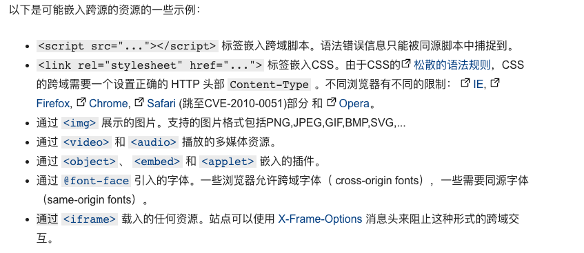

# 跨域

## 1. 开发总的跨域问题

你写的前端项目跑在 “localhost:3999",然后，你向本地服务地址“localhost:8081”发起了一个 HTTP 请求,于是你快乐地喝着快乐水等着服务器返回结果。可是，居然报错了。💔

对于快乐搬砖的你我来说，调用一个 API 居然告说我报错了，于是，你放下手里的快乐水，开始了自己的探索之旅途。

## 2. 什么是跨域

你打开 google，然后来到了 MDN。

你看到了浏览器的[同源策略](https://developer.mozilla.org/zh-CN/docs/Web/Security/Same-origin_policy)，知道了原来同源策略是一个安全策略。

**同源策略：**

- 它用于限制一个 origin 的文档或者它加载的脚本如何能与另一个源的资源进行交互
- 能帮助阻隔恶意文档，减少可能被攻击的媒介

🤔️ 疑问再次产生：什么是同源？

**同源定义：**

- protocol (协议)
- host (主机名)
- port (端口)

URL 中以上 3 个内容必须全部相同，否则就是不同源。

不了解 URL 的请看[这里](https://developer.mozilla.org/zh-CN/docs/Learn/Common_questions/What_is_a_URL).

## 3. 浏览器中的跨网络访问

浏览器中的[可能嵌入跨源资源的示例](https://developer.mozilla.org/zh-CN/docs/Web/Security/Same-origin_policy#%E8%B7%A8%E6%BA%90%E7%BD%91%E7%BB%9C%E8%AE%BF%E9%97%AE)：

## 4. 如何跨域

### 4.1 浏览器中的标签实现跨域

如果我们想成功发起一个跨域请求，关键是要能接收服务器返回的数据。

毕竟，img 标签、link 标签等就都能成功发起跨域请求，然而，我们却没办法通过它们来处理响应的结果。

**思考 🤔 后发现，一下方案应该是可行的：**

- script 标签：可以通过 src 发送一个 GET 请求

- iframe 标签：可以通过 form 表单发起 POST 请求

#### 4.1.1 JSONP 跨域

我们尝试用 script 标签来实现跨域。

你没看错，这种特殊的跨域方式有名字叫 JSONP。

**结论：**

> 实现简单，但是只能发起 GET 请求。

#### 4.1.2 iframe 标签实现跨域

**结论：**

> 实现简单，但是只能发起 GET 请求。

### 4.2 CORS(跨域资源共享)

跨域问题毕竟是服务器禁止不同的源请求资源引起的，我们何不让浏览器允许某些源的请求呢？

浏览器的请求是通过 HTTP 发起的，所以通过设置 HTTP 的头可以达到这个目的。

于是有了一种基于 HTTP 头的机制--跨域资源共享（CORS）,该机制通过允许服务器标示除了它自己以外的其它 origin（域，协议和端口），这样浏览器可以访问加载这些资源。

CORS 是一个 W3C 标准，全称是"跨域资源共享"（Cross-origin resource sharing）。

CORS 解决了因 HTTP 导致的跨域问题，如 XMLHttpRequest（Ajax、Axios） 发起的 HTTP 请求。

#### CORS 的功能概述

跨源资源共享标准新增了一组 HTTP 首部字段，允许服务器声明哪些源站通过浏览器有权限访问哪些资源。

如果浏览器发起一个<code style="color: #708090; background-color: #F5F5F5;">简单请求</code>，请求会直接发送给服务器。

**什么是简单请求 ❓**

简单请求需要满足所有条件：

- 请求方法必须是： GET、HEAD、POST 之一
- HTTP 首部字段只能包含：用户代理自动设置的首部字段（例如 Connection ，User-Agent）、CORS 安全首部字段集合（Accept、Accept-Language、Content-Language、DPR、Downlink、Save-Data、Viewport-Width、Width）
- HTTP 首部字段 Content-Type 的值必须是：text/plain、multipart/form-data、application/x-www-form-urlencoded 之一

**除此之外的都是非简单请求。**

非简单请求会先使用 OPTIONS 方法发起预检请求（preflight request），从而获知服务端是否允许该跨源请求。服务器确认允许之后，才发起实际的 HTTP 请求。

#### CORS 实战实现跨域案例

### 4.3 nginx 代理跨域

### 4.4 WebSocket 协议跨域

## 总结

- 跨域是浏览器的同源策略引起的
- 实现跨域的方法有 JSONP、CORS、Nginx 代理等
- 目前常用的是 CORS，基本成熟的库如（axios）都有简单解决方案
- 跨域显然不单单是一个前端问题（如果前端能直接解决那同源策略就没用了哦），需要后端或运维配合才能实现

## 参考

[浏览器的同源策略](https://developer.mozilla.org/zh-CN/docs/Web/Security/Same-origin_policy#%E8%B7%A8%E6%BA%90%E7%BD%91%E7%BB%9C%E8%AE%BF%E9%97%AE)

[跨源资源共享（CORS）--> MDN](https://developer.mozilla.org/zh-CN/docs/Web/HTTP/Access_control_CORS)

[跨域资源共享 CORS 详解](https://www.ruanyifeng.com/blog/2016/04/cors.html)

[不要再问我跨域的问题了](https://segmentfault.com/a/1190000015597029)

[前端常见跨域解决方案](https://segmentfault.com/a/1190000011145364)

[JSONP 跨域详解](https://www.jianshu.com/p/e1e2920dac95)
