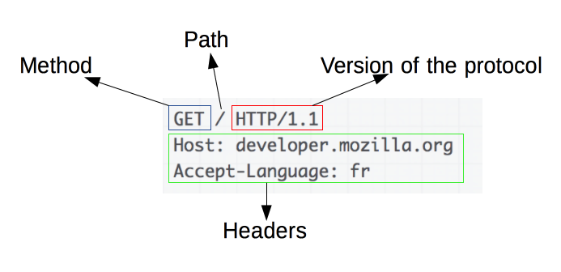

# 一次搞懂 HTTP

> 前后端通信，目前使用最广泛的就是 HTTP。

## 1. Web 及网络基础

### 1.1 Web

<code style="color: #708090; background-color: #F5F5F5; font-size: 18px">WWW</code>(World Wide Web，万维网)这一名称，是 Web 浏览器当年**用来浏览超文本的客户端应用程序时的名称**。现在我们用它表示这一系列的集合，简称 <code style="color: #708090; background-color: #F5F5F5; font-size: 18px">Web</code>.


### 1.2 网络基础 -- TCP/IP 协议族

**网络**是在 <code style="color: #708090; background-color: #F5F5F5; font-size: 18px">TCP/IP</code> 协议族的基础上运作的，<code style="color: #708090; background-color: #F5F5F5; font-size: 18px">TCP/IP</code> 是互联网相关各类协议的**总称**。

**HTTP** 是 <code style="color: #708090; background-color: #F5F5F5; font-size: 18px">TCP/IP</code> 协议族的一个子集。

**HTTP** 是前后端通信的基础，在网络分层协议中的最上层。

_网络分层协议：_


**各层级的作用：**

- **应用层**： HTTP、FTP、DNS(域名系统)

  用于<span style="color: #ff0000; font-size: 16px;">向用户提供应用服务</span>

- **传输层**： TCP、UDP

  <span style="color: #ff0000; font-size: 16px;">为应用层提供两台计算机之间的数据传输</span>

- **网络层**： IP 协议

  用于<span style="color: #ff0000; font-size: 16px;">处理在网络上流动的数据包</span>

  数据包是网络传输的最小数据单位。

- **链路层**： 控制操作系统、硬件设备驱动、NIC（网卡）、光纤

  用来<span style="color: #ff0000; font-size: 16px;">处理连接网络的硬件部分</span>

_TCP/IP 数据流：_


本文不讨论网络传输，只是讨论如何使用 HTTP。

> ⚠️ 注意：HTTP 的工作顺序是先有请求，然后才有响应的。

为什么强调 <code style="color: #708090; background-color: #F5F5F5;">HTTP</code> 是先有请求，然后才有响应呢？

因为 <code style="color: #708090; background-color: #F5F5F5;">HTTP 服务器</code> 不能在没有请求的情况下给客户端推送消息。

服务器向客户端推送消息由别的协议来实现，[EventSource 接口](https://developer.mozilla.org/zh-CN/docs/Server-sent_events/EventSource)实现了 服务端 推送<code style="color: #708090; background-color: #F5F5F5;">单向</code>消息到 客户端的服务。也就是说，EventSource 接口 只能从服务端推送消息给客户端。

我既想让客户端发送消息到服务器，也想让服务器推送消息到客户端怎么办？那 [WebSockets](https://developer.mozilla.org/zh-CN/docs/Web/API/WebSockets_API)可以满足你。

<code style="color: #708090; background-color: #F5F5F5;">WebSockets</code> 是一种先进的技术。它可以在用户的浏览器和服务器之间打开交互式通信会话。

先进往往伴随着一个缺点：**兼容性差**。

我们还是老老实实看 HTTP 吧！后面再研究 <code style="color: #708090; background-color: #F5F5F5;">WebSockets</code>。

### 1.3 和 HTTP 相关的协议

和 HTTP 相关的协议主要有：

- **DNS 协议**
- **IP 协议**
- **TCP 协议**

#### 1.3.1 DNS 服务 -- 负责域名解析

<code style="color: #708090; background-color: #F5F5F5; font-size: 18px">DNS</code>（Domain Name System）服务**提供域名到 IP 的解析服务**。

两台计算机的通信是基于 IP 地址的，但是 IP 地址不利于记忆。

通常我们都是用域名（如：<text>www.google.com</text>）来代替 IP 地址。

但计算机又不理解这些字母（如：<text>www.google.com</text>），计算机更擅长理解数字。

为了解决这个问题，DNS 服务应运而生。

DNS 协议提供通过**域名**查找**IP 地址**或逆向从**IP 地址**反查**域名**的服务。


#### 1.3.2 TCP 协议 -- 确保传输的可靠性

<code style="color: #708090; background-color: #F5F5F5; font-size: 18px">TCP 协议</code>解决如何确保**数据**<span style="color: #ff0000; font-size: 16px;">可靠地</span>传输给对方。

这里的**数据**是指为了方便传输而将大块数据分割后的**文段（segment）**为单位的**数据包**.

<code style="color: #708090; background-color: #F5F5F5; font-size: 18px">TCP 协议</code>为了更容易传递大数据把数据分割，而且<code style="color: #708090; background-color: #F5F5F5; font-size: 18px">TCP 协议</code>能够确认**数据最终是否发送给对方**。

如何确保数据能到达目标 ❓

---

**1. 三次握手策略：** 🤝 🤝 🤝

<code style="color: #708090; background-color: #F5F5F5; font-size: 18px">三次握手</code>策略作用是**双方都能明确自己和对方的收、发能力是正常的**。

握手的标志（flag）是 **SYN**(synchronize)和**ACK**（acknowledgement）.

**三次握手过程：**

1. 发送端 -> 标有 SYN 数据包 -> 接收端：意思是，我想要数据
2. 发送端 <- 标有 SYN/ACK 数据包 <- 接收端：意思是，好啊
3. 发送端 -> 标有 ACK 数据包 -> 接收端：意思是，行，我准备告诉你我想要什么

_三次握手示意图：_


_三次握手详情图：_


---

**2. 数据传输：**

**握手确认**之后，就是**数据传输**。

数据传输大致过程是：

- 发送端把**HTTP 报文（包含请求头、或者有请求体）**发送到接收端
- 接收端 TCP 会排序这些**HTTP 报文**，然后**HTTP 协议**在中携带的信息可以被接收端处理（如：Node.js 的 http 模块）。
- **接收端**<span style="color: #ff0000; font-size: 16px;">根据**HTTP 报文**中携带的信息做出相应</span>。

---

**3. 四次挥手策略：** 🙋‍♂️🙋‍♂️🙋‍♂️

**三次握手过程：**

1. 发送端 -> 标有 FIN 数据包 -> 接收端：意思是，我的需求发送完了(其他层级关了 发送端 socket 等）
2. 发送端 <- 标有 ACK 数据包 <- 接收端：意思是，行，我知道了，等我把数据都发给你了也关了 socket
3. 发送端 <- 标有 FIN 数据包 <- 接收端：意思是，我也发完了(其他层级关了 发送端 socket 等），可以结束了
4. 发送端 -> 标有 ACK 数据包 -> 接收端：意思是，行，结束吧


---

#### 1.3.3 IP 协议 -- 负责传输

IP（Internet Protocol）协议**把各种数据包传递给对方**。

几乎所有的网络系统都要用到**IP 协议**。

如何确保数据传输给对方了呢 ❓

这一确保过程中要满足各类条件，其中最主要的两个是：<code style="color: #708090; background-color: #F5F5F5; font-size: 18px">IP 地址</code> 和 <code style="color: #708090; background-color: #F5F5F5; font-size: 18px">MAC 地址</code>。

- **IP 地址**：指明了节点被分配的地址，可以更改
- **MAX 地址**：指网卡所属的固定地址，几乎不可更改

**IP 地址**可以和**MAX 地址**进行配对。IP 间的通信依赖 **MAC 地址**。

如何根据 IP 地址找到 MAC 地址 ❓

同一个局域网（LAN）中查找比较方便；

不同局域网（例如我们访问一般的网站）中，使用**ARP 协议**，它可以**根据通信双方的 IP 地址查找出对应的 MAC 地址**。


### 1.4 浏览页面网络过程


## 2. HTTP 协议

_HTTP 简易工作流：_


### 2.1 HTTP 用于客户端和服务器之间的通信

通信就是<span style="color: #ff0000; font-size: 16px;">**客户端**向**服务器**发起请求，服务器端返回请求结果</span>。

上面介绍的**三次握手**和**四次挥手**是<code style="color: #708090; background-color: #F5F5F5; font-size: 18px">传输层</code>对传输过程的保护。

传输的内容是什么呢 ❓

换句话来说就是，HTTP 具体通过什么来传递信息的呢 ❓

答案就是：**HTTP 报文**。

### 2.2 HTTP 报文

_HTTP 请求示意图：_


像上面的图示一样，**HTTP 报文**分为**请求报文**和**响应报文**。

- 请求报文：上图左侧客户端的**HTTP 报文**
- 响应报文：上图右侧服务器的**HTTP 报文**

#### 2.2 HTTP 报文组成

- 报文首部（请求头/响应头）
  - 请求行/状态行
  - 请求/响应首部字段（headers）
  - 通用首部字段（headers）
  - 实体首部字段（headers）
- 空行
- 报文主体（请求体/响应体）
  报文主体就是具体传输的载体（如：图片/文本等）

_HTTP 报文组成：_


_HTTP 请求报文首部：_



_HTTP 响应报文首部：_


_HTTP 报文详情：_


### 2.3 HTTP 报文首部 Headers

<code style="color: #708090; background-color: #F5F5F5; font-size: 18px">HTTP Headers</code>用于<span style="color: #ff0000; font-size: 16px;">传递附加信息</span>。

根据不同的上下文，可将 HTTP Headers 分为：

- **通用(General) Headers**：-- 同时适用于请求和响应消息头，但**与最终消息主体中传输数据无关**

- **请求(Request) Headers**： -- 客户端本身信息的消息头

- **响应(Response) Headers**： -- 包含有关响应的补充信息

- **实体(Entity) Headers**： -- 包含有关实体主体的更多信息

#### 2.3.1 通用(General) Headers

- Date：发送/返回该消息的日期和时间
- Cache-Control：指定所有缓存机制
- Connection：浏览器/服务器想要优先使用的连接类型

#### 2.3.2 请求(Request) Headers

常用的**请求 Headers**: 向服务器传递附加信息

- Accept: 能够接受的回应内容类型(对应 Content-Type)，详见[内容协商](https://developer.mozilla.org/zh-CN/docs/Web/HTTP/Content_negotiation)
- Accept-Encoding: 客户端能接收的编码方式列表（gzip, deflate）
- Cookie: 之前由服务器通过 Set-Cookie 发送的一个 超文本传输协议 Cookie
- Host: 指明了请求将要发送到的**服务器主机名和端口号**
- Origin: 发起一个针对 **跨域源资源共享** 的请求，（要求服务器在回应中加入一个‘访问控制-允许来源’（'Access-Control-Allow-Origin'）字段）
- Range: 仅请求某个实体的一部分，网络较差时有用
- User-Agent: 浏览器身份标识字符串

#### 2.3.3 响应(Response) Headers

常用的**响应 Headers**: 向客户端传递附加信息

- Access-Control-Allow-Origin: 指定哪些网站可参与到**跨域源资源共享**
- Accept-Encoding: 服务端返回的编码方式
- Allow: 对于特定资源**有效的动作**(请求方法： GET/HEAD)
- Content-Encoding: **数据的编码类型**
- ETag: 标识某个资源的某个特定版本，**用于 HTTP 缓存**
- Expires: 指定一个日期/时间，超过该时间则认为此回应已经过期，**用于 HTTP 缓存**
- Last-Modified: 所请求的对象的最后修改日期
- Set-Cookie: 设置 HTTP cookie

#### 2.3.4 实体(Entity) Headers

- Content-Length: 表示的请求体/响应体的长度
- Content-Type: 请求体/响应体的 [媒体(MIME) 类型](https://developer.mozilla.org/zh-CN/docs/Web/HTTP/Basics_of_HTTP/MIME_types) （用于 POST 和 PUT 请求中）🌟🌟🌟

⚠️ 注意：

> MIME 类型相当重要，很多时候都是这里出现问题，特别是 Multipart 类型。

### 2.4 HTTP 响应状态码

响应状态码分类：

- 1XX：<span style="color: #ff0000; font-size: 16px;">信息</span>状态码 -- 请求正在处理
- 2XX：<span style="color: #ff0000; font-size: 16px;">成功</span>状态码 -- 请求正常处理完毕
  - 200 OK：正常处理成功
  - 204 No Content：处理成功,但没有资源
  - 206 Partial Content：对资源的某一部分处理成功
- 3XX：<span style="color: #ff0000; font-size: 16px;">重定向</span>状态码 -- 需要进行附加操作以完成请求
  - 301 Moved Permanently：请求资源发生了永久重定向
  - 302 Found：临时重定向
  - 304 Not Modified: 服务器资源未改变，请使用浏览器未过期缓存（和重定向无关）
- 4XX：<span style="color: #ff0000; font-size: 16px;">客户端错误</span>状态码 -- 服务器无法处理请求
  - 400 Bad Request: 请求报文存在错误
  - 403 Forbidden: 无权限访问
  - 404 Not Found: 没找到你要的资源
- 5XX：<span style="color: #ff0000; font-size: 16px;">服务器错误</span>状态码 -- 服务器出错了
  - 500 Internal Server Error: 服务器内部资源出错
  - 503 Service Unavailable: 服务器超负载

## 3. HTTP 能控制 Web 的什么功能

HTTP 良好的扩展性使得越来越多的 Web 功能归其控制。

**HTTP 控制的 Web 特性**：🌟🌟🌟

- **缓存**
  文档如何缓存能通过 HTTP 来控制，这就是我们常说的 **HTTP 缓存**。

- **开放同源限制**
  HTTP 可以通过**修改头部来开放浏览器同源策略的限制**

- **认证**
  使用 <code style="color: #708090; background-color: #F5F5F5; font-size: 18px">Authenticate</code> 相似的头部，或用 <code style="color: #708090; background-color: #F5F5F5; font-size: 18px">HTTP Cookies</code> 来设置指定的会话，可以**保护页面仅让特定的用户进行访问**。

- **代理和隧道**
  **代理**可以用来转发请求，**隧道**可以建立一条与其他服务器通信的线路，可以用这条线路实现 SSL 加密等手段

- **会话**
  HTTP 是**无状态协议**，使用 **HTTP Cookies** 可以知道是谁在和服务器通信，服务器能轻松为用户定制展示内容了

### 3.1 缓存

缓存有多种，如 Memory Cache，ServiceWorker 缓存，这里说的是 **HTTP header 缓存机制**。

一句话总结就是：

> HTTP 缓存由 request headers(请求头) 和 response headers（响应头）来控制某个文件的缓存。

HTTP 缓存已经在其他文章中做了详细描述，[点击查看-HTTP 缓存](https://www.shushuo.me/#/browser/cache?id=_7-http-%e5%ae%9e%e7%8e%b0%e7%bc%93%e5%ad%98)

### 3.2 开放同源限制

由于浏览器的**同源策略**，跨域的资源访问是不被允许的。

然而，我们的客户端总是需要请求不同源的资源，为了突破这种限制，就出现了一中方案**跨域资源共享--CORS**（Cross-Origin Resource Sharing）。

<span style="color: #ff0000; font-size: 16px;">跨域资源共享是通过多个 HTTP headers 来实现的</span>。

跨域问题已经在其他文章中做了详细描述，[点击查看-跨域](https://www.shushuo.me/#/http/cors)

### 3.3 认证

简单的认证可以直接使用 HTTP <code style="color: #708090; background-color: #F5F5F5; font-size: 18px">Proxy-Authenticate</code>这一个响应首部来实现。

<code style="color: #708090; background-color: #F5F5F5; font-size: 18px">Proxy-Authenticate</code>指定了获取 proxy server （代理服务器）上的资源访问权限。

代理服务器对请求进行验证，以便它进一步传递请求。

_示例：_

```js
Proxy-Authenticate: Basic
```

### 3.4 代理和隧道

代理服务器有两种：

- 1. **正向代理**：管道、网关

  正向代理**代表客户端**（或者发送请求的主机），向服务器发送请求。

  （像中介一样，能代替我们向房东租房，但最后还是要和房东签订合同；）

  正向代理可以隐藏客户端的身份；

  主要作用是：

  - 提高访问速度：存储并转发网络服务（如 DNS,网页）以**减少和控制大家所使用的带宽**
  - 突破访问限制: 如 VPN
  - 隐藏客户端真实 IP

- 2. **反向代理**：用于控制和保证服务器的负载均衡、认证、加密和缓存，如 Nginx 就是出名的反向代理服务器

  反向代理**代表服务器**；

  （像二房东一样，能代替我们房东租房，可以和二房东签订合同，我们不知道真正的房东是谁；）

  反向代理可以隐藏服务器的身份；

  作用：

  - 负载均衡：在多个服务器之间分发负载
  - 缓存静态内容：缓存图片等静态内容，为服务器分担压力
  - 压缩：压缩和优化内容以加快传输的速度
  - 隐藏服务器真实 IP

**HTTP 隧道(tunneling)**：

**隧道**可以建立起一条和其他服务器通信的线路，可以帮助我们使用 SSL 等加密手段进行通信。

**隧道**本身不会对 HTTP 请求做解析，会在通信双方断开连接时结束。

### 3.5 会话

HTTP 协议是无状态的，也就是说，每次请求都是独立的，请求完成，HTTP 连接就关闭了。

如果一个用户登录了我们的网站，然后再次发起请求，HTTP 是不知道用户是否登录的，因为上次登录的 HTTP 已经关闭。

于是引入了 <code style="color: #708090; background-color: #F5F5F5; font-size: 18px">Cookie</code> 技术。

<code style="color: #708090; background-color: #F5F5F5; font-size: 18px">Cookie</code>会根据从服务器发送的响应报文的一个叫做 <code style="color: #708090; background-color: #F5F5F5; font-size: 18px">Set-Cookie</code>的首部字段信息，通知客户端保存<code style="color: #708090; background-color: #F5F5F5; font-size: 18px">Cookie</code>。

下次客户端在往该服务器发送请求时会带上之前保存的 <code style="color: #708090; background-color: #F5F5F5; font-size: 18px">Cookie</code>。

服务端拿到<code style="color: #708090; background-color: #F5F5F5; font-size: 18px">Cookie</code>后会去服务器查询这个<code style="color: #708090; background-color: #F5F5F5; font-size: 18px">Cookie</code>的状态，判断用户的登录信息。

_无 Cookie 时的请求：_


_有 Cookie 时的请求：_


保存的 Cookie 内容是什么呢？一般是 **SessionID**.

Session 保存在服务端，记录了一个会话的信息（如：用户 ID，用户登录状态等）。

服务器正是根据这个来 SessionID 来判断用户登录状态。

## 4. HTTPS

HTTP 是有明显缺点的，如：

- 1. 窃听风险：通信使用明文（不加密），内容可能会被窃听
- 2. 伪装风险：不验证通信方的身份，因此可能遭遇伪装
- 3. 篡改风险：无法验证报文的完整性，所以可能被篡改

为了改善这些问题，于是 <code style="color: #708090; background-color: #F5F5F5; font-size: 18px">SSL</code>（Secure Socket Layer,安全套接层）和 <code style="color: #708090; background-color: #F5F5F5; font-size: 18px">TLS</code>（Transport Layer Secure, 安全传输协议层） 出现了。

HTTP 和 SSL 或 TLS 结合，形成了 <code style="color: #708090; background-color: #F5F5F5; font-size: 18px">HTTPS</code>。

SSL 或 TLS 可以<span style="color: #ff0000; font-size: 16px;">加密 HTTP 的通信内容</span>，即 **HTTPS 对报文主体（内容本身）加密，报文首部是没有加密的**。

加密的前提是 -- **客户端和服务同时具备加密和机密的机制**。

### 4.1 伪装风险

任何客户端都可以对服务端发起 HTTP 请求，因为 HTTP 没有确认通信对方是谁的能力。

这样会有诸多隐患：

- 客户端无法确认服务器是否伪装
- 服务端无法确认请求来自谁
- 无法确定接收响应客户端是否是发起请求的客户端
- 无法确定发起请求的客户端是否具有请求资源的权限
- 即使无意义的请求也会照单全收，无法阻止 Dos（Denial of Service,拒绝服务攻击）

### 4.2 HTTPS

**HTTP** + **加密** + **认证** + **完整性保护** = **HTTPS**

<span style="color: #ff0000; font-size: 16px;">HTTPS 是身披 SSL 的 HTTP</span>。

也就是说，HTTP 不是直接发送到 TCP，而是先经过 SSL 处理后在发给 TCP。

_SSL/TLS 通用模型：_


### 4.3 HTTPS 如何工作

**大致过程是**：

- 1. 服务器把自己的**公钥**交给**数字认证机构**认证

- 2. **数字认证机构**颁发一个**数字证书**给服务器，服务器可以证明自己是好人

- 3. 客户端请求数据时，服务端把自己的**公钥**和**数字认证机构**返回

- 4. 客户端使用**公钥**和**数字认证机构**对报文加密

- 5. 服务端使用**私钥**和**数字认证机构**对报文解密

_图示：_


**HTTPS 通信机制：**


**通信大致过程：**

- 握手阶段： 1 - 4 步
- 校验阶段： 5 - 9 步（校验成功后 SSL 建立完成）
- 传输 HTTP 信息： 10 - 11 步
- 关闭 SSL 连接等：12 步

## 5. Web 安全

Web 安全是一个很大的话题，我们主要讨论一下两个主要的安全问题：**SQL 注入攻击**和**XSS**。

- **SQL 注入攻击**：针对 Web 应用使用的数据库，通过运行非法的 SQL 而产生的攻击

- **XSS**（Cross-Site Scripting，跨站脚本攻击）

### 5.1 SQL 注入攻击与防御

**SQL 注入攻击**：

看一个例子：

假如一个购物网站，用户可以通过设置价格来筛选商品。

用户可以输入 100，意思是查看 100 元以下的商品。

如果用户输入：100' OR '1'='1，

产生的 sql 如下：

```sql
SELECT *
FROM ProductsTbl
WHERE Price < '100.00' OR '1' = '1'
ORDER BY ProductDescription;
```

这样，用户就**获取到所有的商品信息**了。

**防御**：

- 使用转义字符，来修复 SQL 注入漏洞，以便忽略掉一些特殊字符
- 使用静态和动态测试，定期检查并发现应用程序中的 SQL 注入漏洞
- 通过对数据库强制执行最小权限原则，来减缓 SQL 注入漏洞的影响

### 5.2 XSS(跨站脚本）攻击与防御

通过利用网页开发时留下的漏洞，通过巧妙的方法注入恶意指令代码到网页，使用户加载并执行攻击者恶意制造的网页程序。

**如何攻击**

Web 页面是由 HTML 组成的，如果黑客利用页面漏洞，在输入框或 URL 查询中注入了**script 标签**，可能被浏览器当作脚本执行。

```js
http://xxx/search?keyword="><script>alert('XSS');</script>
```

```
<input type="text" value=""><script>alert('XSS');</script>">
<button>搜索</button>
<div>
  您搜索的关键词是："><script>alert('XSS');</script>
</div>
```

上面两段脚本会被执行，后果很严重。

**防御**：

- 前端对用户输入过滤
- 转义 HTML
- 输入内容长度控制
- HTTP-only Cookie: 禁止 JavaScript 读取某些敏感 Cookie
- ...

## 6. 如何使用 HTTP

说了那么多，如何发起一个 HTTP 请求？

- 在浏览器输入一个合法的 URL 就会发起一个 HTTP 请求，刷新网页同样会再次发起请求

- XMLHttpRequest 可以在不刷新页面的情况下请求特定 URL，获取数据

  AJAX 使用 XMLHttpRequest 对象与服务器通信

- Fetch API 提供了一个获取资源的接口（包括跨域请求）

关于这几种方法对比，请查看另一篇文章[Ajax 对比 fetch](https://shushuo.me/#/http/ajaxVsFetch)

## 7. HTTP1.1 与 HTTP2.0

**HTTP1.1 相对于 HTTP1.0 的优势：**

- 缓存处理： 多了 Entity tag、If-Unmodified-Since、If-Match、If-None-Match 等缓存信息

  Http1.0 是 If-Modified-Since、Expires

- 增加了更多的请求头和响应头（如：Host）

- 长连接： HTTP1.1 中默认开启 Connection： keep-alive，一定程度上弥补了 HTTP1.0 每次请求都要创建 TCP 连接的缺点

**HTTP2 相对于 HTTP1.1 的优势：**

- HTTP2 采用二进制传递数据（HTTP1.X 是字符串传递）
- HTTP2 支持多路复用（允许同时通过单一的 HTTP/2 连接发起多重的请求-响应消息）
- HTTP2 头部压缩，传输效率更高
- HTTP2 可以服务端推送

## 参考

《图解 HTTP》

[HTTP](https://developer.mozilla.org/zh-CN/docs/Web/HTTP)

[HTTP Headers | MDN](https://developer.mozilla.org/zh-CN/docs/Web/HTTP/Headers)

[HTTP 头字段 ｜ wikipedia](https://zh.wikipedia.org/wiki/HTTP%E5%A4%B4%E5%AD%97%E6%AE%B5)
