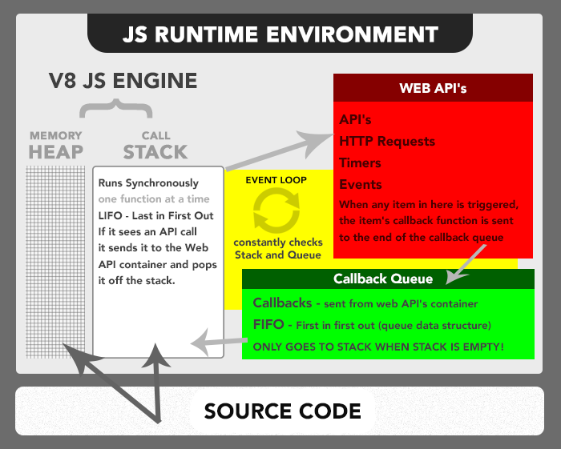

# JavaScript 异步的本质

## 1. 认识异步

通常，程序的执行是同步的，按顺序的，同一时间完成一个任务，后面的任务要等待前面任务完成后才能执行。

这很符合我们大脑的思维逻辑。

同时也是造成计算机卡顿的原因之一。

然而，计算机不是只有一个大脑，多核 CPU 是可以同时处理多个事情的。

合理使用多核 CPU，是**异步编程**的出发点。

### 1.1 同步的问题

**阻塞：**

浏览器里面的一个 web 应用进行密集运算（耗时较多）、调用同步 API 时，整个浏览器就像冻僵了一样，这叫做<code style="color: #708090; background-color: #F5F5F5; font-size: 18px">阻塞</code>；

_调用同步 API 发生阻塞：_

alert 是代码发生\*_阻塞_，直到关闭“alert”弹出的窗口，它后面的代码不会执行。

```js
alert("Hello World");
console.log("阻塞终于结束了");
```

_一个阻塞的例子 🌰 ：_

```js
const btn = document.querySelector("button");
btn.addEventListener("click", () => {
  let myDate;
  // 循环创建大量的日期对象，很耗时
  for (let i = 0; i < 10000000; i++) {
    let date = new Date();
    myDate = date;
  }

  // 直到上面的循环执行完成，才会执行到这里
  console.log(myDate);

  let pElem = document.createElement("p");
  pElem.textContent = "This is a newly-added paragraph.";
  document.body.appendChild(pElem);
});
```

_渲染 UI 导致阻塞 🌰 ：_

```js
// 1百万个蓝色的圆填满整个<canvas>，渲染耗时较大
function expensiveOperation() {
  for (let i = 0; i < 1000000; i++) {
    ctx.fillStyle = "rgba(0,0,255, 0.2)";
    ctx.beginPath();
    ctx.arc(
      random(0, canvas.width),
      random(0, canvas.height),
      10,
      degToRad(0),
      degToRad(360),
      false
    );
    ctx.fill();
  }
}

fillBtn.addEventListener("click", expensiveOperation);

alertBtn.addEventListener("click", () => alert("You clicked me!"));
```

如果你点击第一个按钮，然后快速点击第二个，会注意到 alert 消息并没有立刻出现，只有等到圆圈都画完以后，才会出现：

为什么会这样呢 ❓

<span style="color: #ff0000; font-size: 16px;">因为 JavaScript 是单线程的</span>。

## 2. 线程

一个**线程**是一个基本的处理过程，程序用它来完成任务。

每个任务顺序执行，只有前面的结束了，后面的才能开始。这是线程的基本逻辑。

现在的计算机大都有多个内核（core），因此可以**同时执行多个任务**。

支持多线程的编程语言可以使用计算机的多个内核，同时完成多个任务:

```js
Thread 1: Task A --> Task B
Thread 2: Task C --> Task D
```

### 2.1 JavaScript 是单线程的

JavaScript 是单线程的，所以，即使你有一个多核处理器，JS 也只能在单一线程来工作。

这个线程就是**主线程（main thread）**.

现在 [Web Worker](https://developer.mozilla.org/zh-CN/docs/Web/API/Web_Workers_API)给了 JavaScript 操作**多线程**的能力。

我们可以利用 **Web Worker**来进行耗时的任务，如：密集计算。

_使用 Web Worker 修改上面的例子：_

_1. 新建 worker.js 文件_

```js
onmessage = function () {
  let myDate;
  for (let i = 0; i < 10000000; i++) {
    let date = new Date();
    myDate = date;
  }

  postMessage(myDate);
};
```

_2. 使用 Web Worker_

```js
const btn = document.querySelector("button");
// 初始化worker
const worker = new Worker("worker.js");

btn.addEventListener("click", () => {
  // 启动worker
  worker.postMessage("Go!");

  let pElem = document.createElement("p");
  pElem.textContent = "This is a newly-added paragraph.";
  document.body.appendChild(pElem);
});

// 监听 worker 事件
worker.onmessage = function (e) {
  console.log(e.data);
};
```

这样，**循环创建的耗时任务将不会阻塞其他同步代码的运行**。

### 2.2 JS 多线程 - Web workers

<code style="color: #708090; background-color: #F5F5F5; font-size: 18px">Web workers</code> 很有用，但作用有限。

作用有限主要原因是:

- **1. Web workers 不能访问 DOM**

> 也就是说，<span style="color: #ff0000; font-size: 16px;">Web worker 不能让一个 worker 直接更新 UI</span>.

- **2. Web workers 基本上还是同步的**

> 想要获取 Web worker 的结果<span style="color: #ff0000; font-size: 16px;">就要等它执行完才行</span>.

```js
Main thread: Task A --> Task B
```

假如 TaskA 从服务器获取图片，TaskB 需要加工图片。如果开始 TaskA 后立即尝试运行 TaskB，将得到一个错误，因为图像还没获取。

```js
Main thread: Task A --> Task B --> |Task D|
Worker thread: Task C -----------> |      |
```

假如，TaskD 同时依赖 TaskB 和 TaskC，因为二者在不同线程，只有这两个结果同时提供，程序才能正常运行，但这样不太可能。

所以，Web Worker 可以开启后台线程，但作用有限，它适用于耗时任务：

- 光线追踪：多个 Worker 来完成图片渲染
- 加密：加密是非常耗时的工作
- 数据获取：如果 Web 的数据加载时长过长，可以考虑 web worker 预先获取数据
- [渐进式 Web 应用（PWA）](https://developer.mozilla.org/zh-CN/docs/Web/Progressive_web_apps)
- 拼写检查等

## 3. JS 异步原理

为了解决上面任务同步的问题，**浏览器允许我们异步进行某些操作**。

如：

- Promise 允许我们让一些操作运行（如：从服务器上获取图片）,然后**等到结果返回后再进行其他操作**
- setTimeout(callback, time) 允许我们在一定的时间只有处理某个任务（callback）

```js
Main thread: Task A                   Task B
    Promise:      |__async operation__|
```

由于<span style="color: #ff0000; font-size: 16px;">操作发生在其他地方</span>，因此在处理异步操作的时候，主线程不会被阻塞。

其他地方到底是哪里 ❓❓❓

> 答： 异步 Web API 执行的地方。

Promise 和 setTimeout 里的任务是如何调用 Web API❓

多个异步任务的执行逻辑又是怎样的 ❓

> 答：事件循环（Event Loop）

JS 虽然是单线程，但是**浏览器是多线程啊**。

浏览器的引擎（如 chrome 的 V8）实现了 Event Loop，**当引擎解析到异步 API（如 setTimeout） 时，会自动将他们任务添加到任务队列，然后在后台执行**。浏览器完成这些任务后，它们将返回并作为回调被压入堆栈并执行。

需要明确的是，<span style="color: #ff0000; font-size: 16px;">异步的具体实现是操作系统底层逻辑来做的</span>。

**我们需要做的是理解并合理使用它**。

_浏览器工作原理：_



### 3.1 JS 中常见的异步

**JS 中常见的异步有：**

- Timers(setTimeout、setInterval)
- Events(XHR、各种 DOM 监听事件)
- Promise(Fetch 等)

注意 ⚠️：

DOM 绑定事件方法**直接调用时是同步任务**，只有**用户操作时才是异步任务**。

```js
// 直接调用，同步执行
let btn = document.querySelector("button");
btn.onclick = function () {
  let time = new Date().getTime();
  while (new Date().getTime() - time < 2000) {}
  console.log("1");
};
btn.click();
console.log("2");
// 1 （约2后）
// 2
```

```js
// 用户点击btn元素，异步执行
let btn = document.querySelector("button");
btn.onclick = function () {
  console.log("1");
};
console.log("2");
// 2
// 1 （约2s后）
```

## 4. JS 异步发展过程

JS 异步大概经历了 4 个时期：

- 1. **回调时期**

  有大量的嵌套回调，容易形成地狱嵌套，代码可读性、维护性差

  ```js
  fs.readFile(A, "utf-8", function (err, data) {
    fs.readFile(B, "utf-8", function (err, data) {
      fs.readFile(C, "utf-8", function (err, data) {
        fs.readFile(D, "utf-8", function (err, data) {
          //....
        });
      });
    });
  });
  ```

  需要明确的是，**回调不一定是异步**。

  _同步的回调示例：_

  ```js
  setTimeout(console.log, 0, "timeout");

  let arr = ["a", "b"];
  let b = arr.forEach((item, index) => {
    console.log(item);
  });
  // a
  // b
  // timeout
  ```

- 2. **Promise 时期**

  ES6 新增的 API，异步任务串行化，大大提高了异步的易读性、易于维护

  很多应用和 API 都是基于 Promise，目前已经很成熟，被普遍使用.

  _缺点：_

  - 无法取消 Promise
  - 当处于 pending 状态时，无法得知目前进展到哪一个阶段
  - 错误不能被 try catch

- 3. **生成器函数**

  **生成器函数**可以返回一个**Generator 对象**。

  **生成器函数**在执行时**能暂停**，后面**又能从暂停处继续执行**。

  实际开发一般会配合 **co 库**去使用.

  ```js
  function* generator(i) {
    yield i;
    yield i + 10;
  }

  const gen = generator(10);

  console.log(gen.next().value);
  // expected output: 10

  console.log(gen.next().value);
  // expected output: 20
  ```

- 4. **async/await** 时期

  ES8 中新增，**async 函数**和 **await 关键字**，**让异步代码的写法同步化**。

async 其实是一个语法糖，它的实现就是将 Generator 函数和自动执行器（co），包装在一个函数中。

目前认为这种方案应该是 JS 异步的最终版。

_缺陷：_

1. await 关键字会阻塞其后的代码，直到 promise 完成，就像执行同步操作一样。

**如果多个异步代码没有依赖性**却使用了 await 会导致性能上的降低，代码没有依赖性的话，完全可以使用 **Promise.all** 的方式；

2. 不能在非 async 函数内或代码的顶级上下文环境中使用 await 运算符。这有时会导致需要创建额外的函数封包。

_如何解决：_

```js
// 每个任务耗时 3s，因为 await 会暂停其他任务，共耗时 9s
async function timeTest() {
  await timeoutPromise(3000);
  await timeoutPromise(3000);
  await timeoutPromise(3000);
}
```

将三个 Promise 对象存储在变量中，这样可以<span style="color: #ff0000; font-size: 16px;">同时启动它们关联的进程</span>。

```js
// 并发执行，耗时共约 3s
async function timeTest() {
  const timeoutPromise1 = timeoutPromise(3000);
  const timeoutPromise2 = timeoutPromise(3000);
  const timeoutPromise3 = timeoutPromise(3000);

  await timeoutPromise1;
  await timeoutPromise2;
  await timeoutPromise3;
}
```

## 5. 异步也会阻塞

<span style="color: #ff0000; font-size: 16px;">异步的核心作用是调用了 Web API，让浏览器帮助我们同时处理多任务</span>。

如：

- **setTimeout** 调用了浏览器的计时器线程，帮助我们计算时间；

- **fetch API** 调用了浏览器的网络相关线程，帮助我们在后台完成数据的加载；

- **events**（事件监听）**XHR**、**click 事件**本质上也是浏览器帮我们做的监听工作

我们必须知道，<span style="color: #ff0000; font-size: 16px;">异步的回调也是会阻塞的，因为异步的回调进入调用栈后和同步代码没有却别</span>。

```js

```

无论同步还是异步，代码执行时时要入栈的，如果**入栈的任务发生了阻塞，那整个程序就会发生阻塞**。

但是，发生阻塞的同时，其他异步任务在进行中。

```js
const callback1 = () => {
  alert(1);
  console.log(1);
};

const callback2 = () => {
  console.log(2);
};

setTimeout(callback1, 1000);

setTimeout(callback2, 3000);
```

_如上代码：_

- 我们定义了一个函数，和两个异步任务（setTimeout);
- 代码执行时，约 1s 后，callback 会入栈并执行，可是，遇到了 **alert()**，代码会发生阻塞
- 如果我们不点击 alert 弹窗的确认按钮，代码就不会继续执行，即 console.log(1) 不会执行
- 假如我们 5s 后关闭弹窗，会发生什么？console.log(1) 会执行，callback2 也会立即执行。
- 为什么 callback2 会立即执行呢？因为，**alert()阻塞了主线程**，setTimeout 的计时工作并不在主线程，约 3s 后 callback2 会被添加到调用栈，一旦主线程阻塞停止（我们手动关闭了 alert 弹窗），已经在调用栈内的 callback2 会同步执行

## 参考

**Blog**

视频讲解，值得看几遍，强烈推荐 👍 -- [到底什么是 Event Loop 呢？ | 欧洲 JSConf 2014 ](https://www.youtube.com/watch?v=8aGhZQkoFbQ&ab_channel=JSConf)

大神之作，完美演示异步执行步骤 [loupe](http://latentflip.com/loupe/?code=JC5vbignYnV0dG9uJywgJ2NsaWNrJywgZnVuY3Rpb24gb25DbGljaygpIHsKICAgIHNldFRpbWVvdXQoZnVuY3Rpb24gdGltZXIoKSB7CiAgICAgICAgY29uc29sZS5sb2coJ1lvdSBjbGlja2VkIHRoZSBidXR0b24hJyk7ICAgIAogICAgfSwgMjAwMCk7Cn0pOwoKY29uc29sZS5sb2coIkhpISIpOwoKc2V0VGltZW91dChmdW5jdGlvbiB0aW1lb3V0KCkgewogICAgY29uc29sZS5sb2coIkNsaWNrIHRoZSBidXR0b24hIik7Cn0sIDUwMDApOwoKY29uc29sZS5sb2coIldlbGNvbWUgdG8gbG91cGUuIik7!!!PGJ1dHRvbj5DbGljayBtZSE8L2J1dHRvbj4%3D)

浅显易懂 -- [If Javascript Is Single Threaded, How Is It Asynchronous?](https://dev.to/steelvoltage/if-javascript-is-single-threaded-how-is-it-asynchronous-56gd)

**文档**

异步指南 -- [异步 JavaScript ｜ MDN](https://developer.mozilla.org/zh-CN/docs/Learn/JavaScript/Asynchronous)

对比各种异步方案的优缺点对比 -- [选择正确的方法 ｜ MDN](https://developer.mozilla.org/zh-CN/docs/Learn/JavaScript/Asynchronous/Choosing_the_right_approach)
