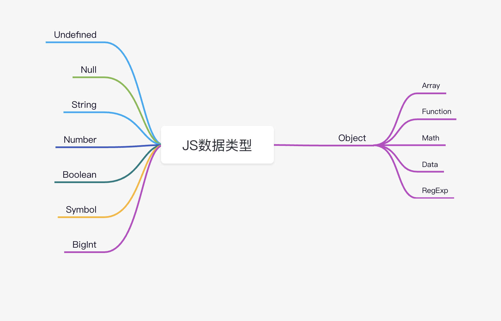
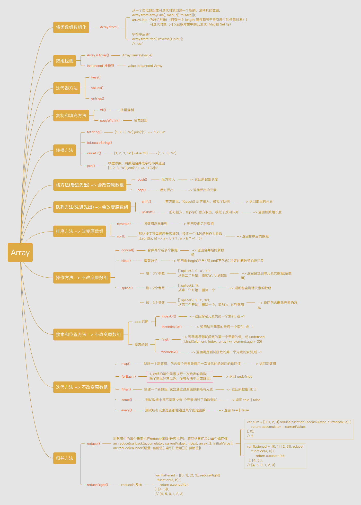

# JavaScript 基础

> 基础扎实，走得更稳、更远。

## 1. 数据类型

### 1.1 数据类型分类



_JS 数据分为两类：_

- 基础类型：String、Number、Undefined、Null、Boolean、Symbol、BigInt

  <span style="color: #ff0000; font-size: 16px;">基础类型存储在栈内存，</span>被引用或拷贝时会创建一个完全相等的变量

- 引用类型：Object(Function、Array、Math)
  <span style="color: #ff0000; font-size: 16px;">引用类型存储在堆内存，</span>存储的是地址，多个引用指向同一个地址

_例 1：_

```js
let a = {
  name: "kobe",
  age: 18
}

// b和a指向同一内存地址
let b = a;
// 修改b中name的值
b.name = "bryant";
console.log(a.name); // "bryant"

function getObj(o) {
  o.name = "kk";
  o = {
    name = "kkbb",
    age = 19
  }
  return o;
}
let c = getOjb(a);

console.log(c.name); // "kkbb"
console.log(a.name); // "kk"
```

```js
let a = {
  name: "kobe",
  age: 18,
};
function change(o) {
  // 相当于修改实参的值，会改变实参
  o.age = 24;
  // 这里给o重新赋值，和传入的实参已经无关了
  o = {
    name: "lbj",
    age: 30,
  };
  return o;
}

let b = change(a);
console.log(b.age); // 30
console.log(a.age); // 24
```

### 1.1 数据类型判断

#### typeof

> typeof 操作符返回一个字符串，表示未经计算的操作数的类型。

_例：_

```js
console.log(typeof "abc"); // string
console.log(typeof 2); // number
console.log(typeof false); // boolean
console.log(typeof undefined); // undefined
console.log(typeof null); // object
console.log(typeof [3]); // object
console.log(typeof { a: 1 }); // object
console.log(typeof Symbol()); // symbol
console.log(typeof console); // object
console.log(typeof console.log); // function
```

结论：

- typeof 只能判断基本数据类型（null 除外）
- typeof 判断引用类型只能判断出函数为 function,其他引用类型数据都为 object

#### instanceof

> instanceof 运算符用于检测构造函数的 prototype 属性是否出现在某个实例对象的原型链上.

_例：_

```js
let a = new String("kobe");
console.log(a instanceof String); // true

console.log("abc" instanceof String); // false
console.log(2 instanceof Number); // false
console.log(false instanceof Boolean); // false
console.log(Symbol() instanceof Symbol); // false
console.log([3] instanceof Array); // true
console.log({ a: 1 } instanceof Object); // true
console.log(console instanceof Object); // true
console.log(console.log instanceof Function); // true
```

可以看出，instanceof 判断数据类型是不准确的：

- instanceof 能有效判断引用数据类型
- instanceof 不能准确判断基础数据类型

#### Object.prototype.toString()

> Object.prototype.toString() 方法返回一个表示该对象的字符串.

```js
Object.prototype.toString({}); // "[object Object]"
Object.prototype.toString.call({}); // 同上结果，加上call也ok
Object.prototype.toString.call(1); // "[object Number]"
Object.prototype.toString.call("1"); // "[object String]"
Object.prototype.toString.call(true); // "[object Boolean]"
Object.prototype.toString.call(function () {}); // "[object Function]"
Object.prototype.toString.call(null); //"[object Null]"
Object.prototype.toString.call(undefined); //"[object Undefined]"
Object.prototype.toString.call(/123/g); //"[object RegExp]"
Object.prototype.toString.call(new Date()); //"[object Date]"
Object.prototype.toString.call([]); //"[object Array]"
Object.prototype.toString.call(document); //"[object HTMLDocument]"
Object.prototype.toString.call(window); //"[object Window]"
```

#### 实现一个数据类型判断函数

```js
function getType(obj) {
  let type = typeof obj;
  if (type !== "object") {
    // 先进行typeof判断，如果是基础数据类型，直接返回
    return type;
  }
  // 对于typeof返回结果是object的，再进行如下的判断，正则返回结果
  let toStringType = Object.prototype.toString
    .call(obj)
    .replace(/^\[object (\S+)\]$/, "$1"); // 注意正则中间有个空格
  // 返回转化为小写的数据类型
  return toStringType && toStringType.toLowerCase();
}
console.log(getType("8")); // string
console.log(getType("8")); // number
console.log(getType([])); // array
```

## 2. 引用类型

### 2.1 基本引用类型

- Date
- RegExp
- 原始值包装类型：Boolean、Number、String

  <span style="color: #ff0000; font-size: 16px;">用到原始值的方法时，后台会自动创建一个原始包装类型</span>，如：let s1 = "abcdefg"; let s2 = s1.substring(2);

  第二次调用时，如 s1.substring() 会读取 s1;

  读取操作会执行以下 3 个步骤：

  - 1. 创建一个 String 类型
  - 2. 调用实例上的特定方法
  - 3. 销毁实例

- 单例内置对象：Global、Math
  - Global 是 ECMAScript 中的全局对象
  - 全局作用域中定义的变量都会变成 Global 的属性
  - 浏览器的 window 实现了 Global，但不只有 Global

_对日期的处理：_

[Moment.js -- 经典的时间处理库](https://momentjs.com/)

```js
// 获取当前时间
// new Date 返回一个对象
let now = new Date();
console.log(now); // Mon Mar 08 2021 01:24:00 GMT+0800 (中国标准时间)
console.log(typeof now); // object

// 获取当前时间戳
let time1 = Date.parse(new Date()); // 精确到秒
let time2 = new Date().valueOf(); // 精确到毫秒
let time3 = new Date().getTime(); // 精确到毫秒
// ES5新增API，获取当前毫秒时间戳，返回一个数字
let start = Date.now();
console.log(start); // 1615138155922
console.log(typeof start); // number

// 获取当前月份，0开始计数
let month = now.getMonth();

// 日期转换
// 转为时间戳
Date.parse();
```

### 2.2 集合引用类型

- Object：对象
- Array：数组
- 定型数组：
- Map：可以像 Object 一样存储键值对

  - Map 可以使用任意数据类型作为键
  - Map 会维护键值对插入顺序
  - Map 和 Object 没什么大的差别，处了使用方式不同，Object 的查询性能略好，Map 增、删、改性能更好

- WeakMap
- Set：允许你存储任何类型的唯一值，<span style="color: #ff0000; font-size: 16px;">Set 中的元素是唯一的</span>
- WeakSet

```js
// Set
let mySet = new Set([1, 2, 3, 1]);

// Set 会忽略重复的值
console.log(mySet); // {1, 2, 3}
```

## 3. 引用类型的操作

### 3.1 Array 的操作

> 数组操作是前端数据处理的重点。

Array 应该是 JS 中第二常用的数据类型吧，第一是 Object。

_数组方法不完全汇总：_



[脑图地址，拿走不谢](https://www.processon.com/view/link/60453082e401fd4f9cbc6f5d)

#### 3.1.1 数组的操作方法

#### 3.1.2 数组去重

_方法 1: 运用 Set 特性_

```js
const numbers = [2, 3, 4, 4, 2, 3, 3, 4, 4, 5, 5, 6, 6, 7, 5, 32, 3, 4, 5];
// new Set去重，... 将 set再次转变为数组
console.log([...new Set(numbers)]);
```

#### 3.1.3 数组扁平化

_方法 1: 运用新 API flat()_

[].flat(): 默认参数扁平化深度为 1;

[].flat(Infinity): 展开任意深度.

```js
const arr1 = [0, 1, 2, [3, [5, 6]]];

console.log(arr1.flat()); // [0, 1, 2, 3, [5, 6]]
console.log(arr1.flat(Infinity)); // [0, 1, 2, 3, 5, 6]
```

_方法 2: 运用 forEach 或 for 循环 + 递归_

```js
function flatten(arr) {
  const result = [];

  arr.forEach((ele) => {
    // 递归
    if (Array.isArray(ele)) {
      result.push(...flatten(ele));
      // 跳出递归
    } else {
      result.push(ele);
    }
  });

  return result;
}
```

_方法 3: Generator function_

```js
function* flatten(array) {
  for (const item of array) {
    if (Array.isArray(item)) {
      yield* flatten(item);
    } else {
      yield item;
    }
  }
}

var arr = [1, 2, [3, 4, [5, 6]]];
const flattened = [...flatten(arr)];
```

#### 3.1.4 数组排序

_方法 1: 原生方法 sort_

```js
// 升序排列
let c = a.sort((a, b) => (a <= b ? -1 : 1));
```

### 3.2 对象的操作

_定义一个对象：_

```js
// 字面量定义一个属性
let obj = {
  name: "nameIsObj",
  size: 123,
};
```

--- 持续更新中... ---

## 参考
