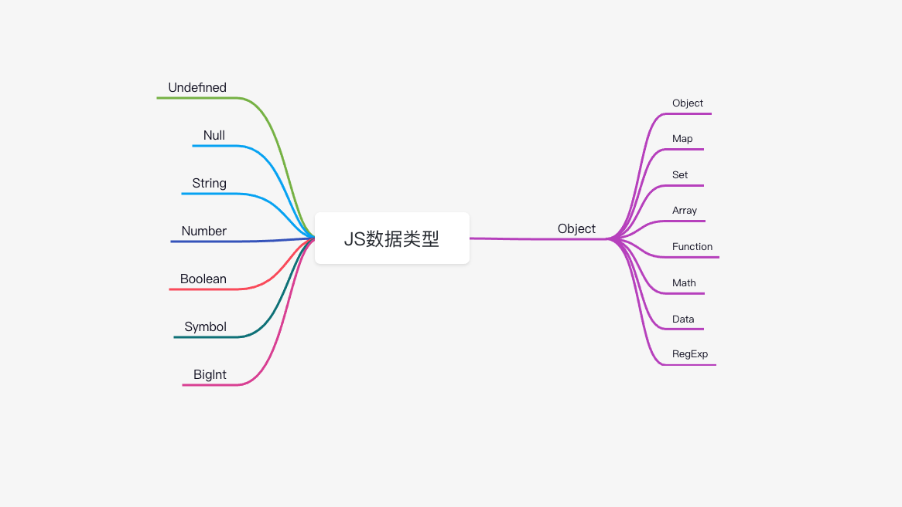
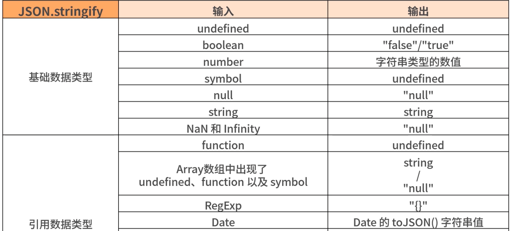
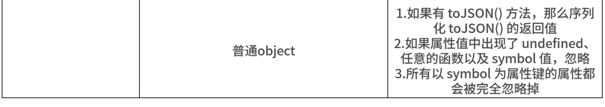
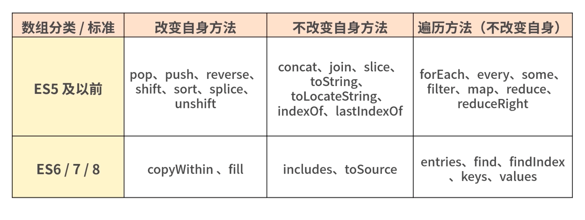
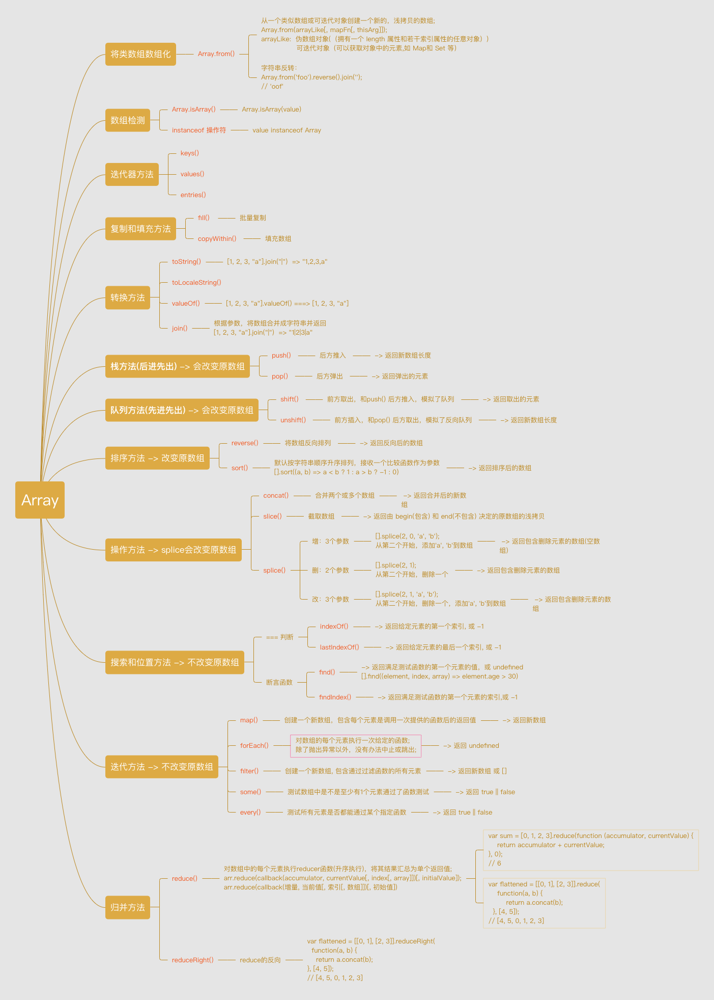

# JavaScript 基础

> 基础扎实，走得更稳、更远。

## 1. 数据类型

### 1.1 数据类型分类



_JS 数据分为两类：_

- 基础类型：String、Number、Undefined、Null、Boolean、Symbol、BigInt

  <span style="color: #ff0000; font-size: 16px;">基础类型存储在栈内存，</span>被引用或拷贝时会创建一个完全相等的变量

- 引用类型：Object(Function、Array、Math)
  <span style="color: #ff0000; font-size: 16px;">引用类型存储在堆内存，</span>存储的是地址，多个引用指向同一个地址

_例 1：_

```js
let a = {
  name: "kobe",
  age: 18
}

// b和a指向同一内存地址
let b = a;
// 修改b中name的值
b.name = "bryant";
console.log(a.name); // "bryant"

function getObj(o) {
  o.name = "kk";
  o = {
    name = "kkbb",
    age = 19
  }
  return o;
}
let c = getOjb(a);

console.log(c.name); // "kkbb"
console.log(a.name); // "kk"
```

```js
let a = {
  name: "kobe",
  age: 18,
};
function change(o) {
  // 相当于修改实参的值，会改变实参
  o.age = 24;
  // 这里给o重新赋值，和传入的实参已经无关了
  o = {
    name: "lbj",
    age: 30,
  };
  return o;
}

let b = change(a);
console.log(b.age); // 30
console.log(a.age); // 24
```

### 1.2 数据类型判断

#### 1.2.1 typeof

> typeof 操作符返回一个字符串，表示未经计算的操作数的类型。

_例：_

```js
console.log(typeof "abc"); // string
console.log(typeof 2); // number
console.log(typeof false); // boolean
console.log(typeof undefined); // undefined
console.log(typeof null); // object
console.log(typeof [3]); // object
console.log(typeof { a: 1 }); // object
console.log(typeof Symbol()); // symbol
console.log(typeof console); // object
console.log(typeof console.log); // function
```

结论：

- typeof 能判断基本数据类型（null 除外）
- typeof 判断引用类型只能判断出函数为 function,其他引用类型数据都为 object

#### 1.2.2 instanceof

> instanceof 运算符用于检测构造函数的 prototype 属性是否出现在某个实例对象的原型链上.

翻译成人话就是，a instanceof Fa,检测 a 是不是 Fa 的实例。

_例：_

```js
let a = new String("kobe");
console.log(a instanceof String); // true

console.log("abc" instanceof String); // false
console.log(2 instanceof Number); // false
console.log(false instanceof Boolean); // false
console.log(Symbol() instanceof Symbol); // false
console.log([3] instanceof Array); // true
console.log({ a: 1 } instanceof Object); // true
console.log(console instanceof Object); // true
console.log(console.log instanceof Function); // true
```

可以看出，instanceof 判断数据类型是不准确的：

- instanceof 能有效判断引用数据类型
- instanceof 不能准确判断基础数据类型

#### 1.2.3 Object.prototype.toString()

> Object.prototype.toString() 方法返回一个表示该对象的字符串.

```js
Object.prototype.toString({}); // "[object Object]"
Object.prototype.toString.call({}); // 同上结果，加上call也ok
Object.prototype.toString.call(1); // "[object Number]"
Object.prototype.toString.call("1"); // "[object String]"
Object.prototype.toString.call(true); // "[object Boolean]"
Object.prototype.toString.call(function () {}); // "[object Function]"
Object.prototype.toString.call(null); //"[object Null]"
Object.prototype.toString.call(undefined); //"[object Undefined]"
Object.prototype.toString.call(/123/g); //"[object RegExp]"
Object.prototype.toString.call(new Date()); //"[object Date]"
Object.prototype.toString.call([]); //"[object Array]"
Object.prototype.toString.call(document); //"[object HTMLDocument]"
Object.prototype.toString.call(window); //"[object Window]"
```

#### 1.2.4 实现一个数据类型判断函数

```js
function getType(data) {
  // 先使用typeof判断基础数据类型
  let type = typeof data;
  if (type === "object") {
    // 使用
    type = Object.prototype.toString
      .call(data)
      .replace(/^\[object (\S+)\]$/, "$1") // 注意正则中间有个空格
      .toLowerCase(); // 返回转化为小写的数据类型，和 typeof 一样
  }

  return type;
}

console.log(getType("abc"));
console.log(getType(1));
console.log(getType(console));
console.log(getType([]));

// string
// number
// console
// array
```

### 1.3 数据类型转换

**强制数据类型转换**：

- Number()

  创建一个 Number 对象

- parseInt()

  parseInt(string, radix);

  解析一个**字符串**并返回**指定基数**的**十进制整数**

- parseFloat()

  **全局方法**，解析一个参数（必要时先转换为字符串）并返回一个**浮点数**

- toString()

  将参数转化为 String 对象

  将参数转化为 String 对象；每个构造函数都有自己的 toString 方法，如 Function.prototype.toString()

- String()

  创建一个 String 对象

- Boolean()

  创建一个 Boolean 对象；

  undefined、null、false、“”、0、NaN 会转化为 false，其他则都为 true

_强制--数据类型转换_:

```js
console.log(Number("1")); // -> 1
console.log(Number("1test")); // -> NaN
console.log(Number(null)); // -> 0
console.log(Number("")); // -> 0
console.log(Number(undefined)); // -> NaN

console.log(parseInt("")); // -> NaN

// parseFloat() 返回 3.14
console.log(parseFloat(3.14)); // -> 3.14
console.log(parseFloat("3.14")); // -> 3.14
console.log(parseFloat("   3.14   ")); // -> 3.14
console.log(parseFloat("314e-2")); // -> 3.14
console.log(parseFloat("0.0314E+2")); // -> 3.14
console.log(parseFloat("3.14some non-digit characters")); // -> 3.14
console.log(parseFloat({ toString: function() { return "3.14" } }); // -> 3.14
// parseFloat() 返回 NaN
console.log(parseFloat("abc123")); // -> NaN

// parseInt() 返回 16
parseInt("0xF", 16); // -> 16
parseInt("F", 16); // -> 16
parseInt("17", 8); // -> 16
parseInt(021, 8); // -> 16
parseInt("015", 10);  // -> 16
parseInt(15.99, 10); // -> 16
parseInt("15,123", 10); // -> 16
parseInt("FXX123", 16); // -> 16
parseInt("1111", 2); // -> 16
parseInt("15 * 3", 10); // -> 16
// parseInt() 返回 NaN
console.log(parseFloat("abc"), 8); // -> NaN （”abc“不是数字）
console.log(parseFloat("123"), 2); // -> NaN (格式错误导致)

console.log(Boolean("")); // -> false
console.log(Boolean(null)); // -> false
console.log(Boolean(NaN)); // -> false
console.log(Boolean("1")); // -> true


```

**隐式数据类型转换**：

- 运算符: +、-、\*、/
- 逻辑运算符: &&、||、!
- 关系操作符: >、<、<=、>=
- 相等运算: ==
- 条件语句: if/while

_隐式--数据类型转换_:

```js
// 一方为 null 或 undefined，只用另一方同样为 null 或 undefined 才返回 true
null == undefined; // => true
null == 0; // => false
null == ""; // => false

// 有 Symbol 则返回 false
Symbol() == "";

// 一方为 Number，一方为 Boolean，会将 Boolean 转换为 Number
0 == false; // true
1 == true; // => true
2 == true; // => false

// 一方为 String, 一方为 Number，将 String 转换为 Number
"123" == 123; // => true
```

#### 1.3.1 手动实现一个 JSON.stringify 方法

我们知道 JSON.stringify() 方法将一个 JavaScript **对象**或**值**转换为 <code style="color: #708090; background-color: #F5F5F5; font-size: 18px">JSON 字符串</code>.

**JSON.stringify 转化规则**：




```js
function jsonStringify(data) {
  let type = typeof data;

  // 根据不同数据类型做转换
  if (type !== "object") {
    let result = data;
  }
}
```

## 2. 引用类型

### 2.1 基本引用类型

- Date
- RegExp
- 原始值包装类型：Boolean、Number、String

  <span style="color: #ff0000; font-size: 16px;">用到原始值的方法时，后台会自动创建一个原始包装类型</span>，如：let s1 = "abcdefg"; let s2 = s1.substring(2);

  第二次调用时，如 s1.substring() 会读取 s1;

  读取操作会执行以下 3 个步骤：

  - 1. 创建一个 String 类型
  - 2. 调用实例上的特定方法
  - 3. 销毁实例

- 单例内置对象：Global、Math
  - Global 是 ECMAScript 中的全局对象
  - 全局作用域中定义的变量都会变成 Global 的属性
  - 浏览器的 window 实现了 Global，但不只有 Global

_对日期的处理：_

[Moment.js -- 经典的时间处理库](https://momentjs.com/)

```js
// 获取当前时间
// new Date 返回一个对象
let now = new Date();
console.log(now); // Mon Mar 08 2021 01:24:00 GMT+0800 (中国标准时间)
console.log(typeof now); // object

// 获取当前时间戳
let time1 = Date.parse(new Date()); // 精确到秒
let time2 = new Date().valueOf(); // 精确到毫秒
let time3 = new Date().getTime(); // 精确到毫秒
// ES5新增API，获取当前毫秒时间戳，返回一个数字
let start = Date.now();
console.log(start); // 1615138155922
console.log(typeof start); // number

// 获取当前月份，0开始计数
let month = now.getMonth();

// 日期转换
// 转为时间戳
Date.parse();
```

### 2.2 集合引用类型

- Object：对象
- Array：数组
- 定型数组：
- Map：可以像 Object 一样存储键值对

  - Map 可以使用任意数据类型作为键
  - Map 会维护键值对插入顺序
  - Map 和 Object 没什么大的差别，除了使用方式不同，Object 的查询性能略好，Map 增、删、改性能更好

- WeakMap
- Set：允许你存储任何类型的唯一值，<span style="color: #ff0000; font-size: 16px;">Set 中的元素是唯一的</span>
- WeakSet

**注意**：

> 1.Map 和 Set 本质上都是**哈希表**，Object 同样也是
>
> 2.Map 像 Object，略有区别
>
> 3.Set 像 Array，Set 中元素具有唯一性
>
> 4.Set 没有索引且无序，因为他数据结构属于哈希表；而 Array 的数据结构属于链表

```js
// Set
let mySet = new Set([1, 2, 3, 1]);

// Set 会忽略重复的值
console.log(mySet); // {1, 2, 3}
```

## 3. 引用类型的操作

### 3.1 Array 的操作

> 数组操作是前端数据处理的重点。

Array 应该是 JS 中第二常用的数据类型吧，第一是 Object。

#### 3.1.1 数组 API 汇总

_数组方法分类：_



_数组方法汇总：_



[脑图地址，拿走不谢](https://www.processon.com/view/link/60453082e401fd4f9cbc6f5d)

#### 3.1.2 类数组

JS 中存在一种**类数组**的对象。

他们不能直接调用数组的所有方法，但具有数组的某些特征。

**常见的类数组**：

- 函数中的 arguments
- getElementsByTagName/ClassName 等获得的 HTML 集合
- querySelect 获得的 NodeList

_示例：_

```js
function sum(a, b) {
  let args = [...arguments];

  console.log(args.reduce((sum, cur) => sum + cur));
}
sum(1, 2);
// => 3
```

```js
function sum(...args) {
  console.log(args.reduce((sum, cur) => sum + cur));
}
sum(1, 2);
// => 3
```

#### 3.1.3 数组去重

_方法 1: 傻瓜方法 for/forEach 遍历_

```js
function remArr(arr) {
  let res = [];

  for (let i = 0; i < arr.length; i++) {
    if (res.indexOf(arr[i]) === -1) res.push(arr[i]);
  }

  return res;
}
```

_方法 2: 运用 Set 特性_

```js
const numbers = [2, 3, 4, 4, 2, 3, 3, 4, 4, 5, 5, 6, 6, 7, 5, 32, 3, 4, 5];
// new Set去重，... 或 Array.from() 将 set再次转变为数组
console.log([...new Set(numbers)]);
console.log(Array.from(new Set(numbers)));
```

_方法 3：运用 reduce 方法：_

```js
function remArr(arr) {
  if (!Array.isArray(arr)) return "Error: args Type Error";

  return arr.reduce((acc, cur) => {
    console.log(acc, cur);
    if (acc.indexOf(cur) === -1) {
      acc.push(cur);
    }
    return acc;
  }, []);
}
```

#### 3.1.4 数组扁平化

_方法 1: 运用新 API flat()_

[].flat(): 默认参数扁平化深度为 1;

[].flat(Infinity): 展开任意深度.

```js
let arr1 = [0, 1, 2, [3, [5, 6]]];

console.log(arr1.flat()); // [0, 1, 2, 3, [5, 6]]
console.log(arr1.flat(Infinity)); // [0, 1, 2, 3, 5, 6]
```

_方法 2: 运用 forEach 或 for 循环 + 递归_

```js
function flatArr(arr) {
  let result = [];

  arr.forEach((ele) => {
    // 递归
    if (Array.isArray(ele)) {
      result = result.concat(flatArr(ele));
      // 跳出递归
    } else {
      result.push(ele);
    }
  });

  return result;
}
```

_方法 3: 利用 toString() 处理_

```js
function flatArr(arr) {
  if (Array.isArray(arr)) {
    return Array.from(arr.toString().split(","));
  }
}
```

_方法 4: Generator function_

```js
function* flatten(array) {
  for (const item of array) {
    if (Array.isArray(item)) {
      yield* flatten(item);
    } else {
      yield item;
    }
  }
}

var arr = [1, 2, [3, 4, [5, 6]]];
const flattened = [...flatten(arr)];
```

#### 3.1.5 数组排序

_方法 1: 原生方法 sort_

```js
// 升序排列
let c = a.sort((a, b) => (a <= b ? -1 : 1));
```

#### 3.1.6 数组遍历

- for 循环
- forEach

#### 3.1.7 map() 和 reduce()

<code style="color: #708090; background-color: #F5F5F5; font-size: 18px">map()</code>、<code style="color: #708090; background-color: #F5F5F5; font-size: 18px">reduce()</code>

- **map()**: **创建一个新数组**，其结果是该数组中的每个元素是调用一次**提供的函数**后的<span style="color: #ff0000; font-size: 16px;">返回值</span>

```js
var new_array = arr.map(function callback(currentValue[, index[, array]]) {
 // Return element for new_array
}[, thisArg])
```

- **reduce()**: 对数组中的**每个元素**执行一个由您提供的 **reducer 函数**

```js
arr.reduce(callback(accumulator, currentValue[, index[, array]])[, initialValue]);
```

看了上面的介绍我们可以知道，_二者的作用与区别_：

- **map**主要作用: 遍历原始数组，创建出一个新数组

```js
const array1 = [1, 4, 9, 16];

const mapFn = (x) => x * 2;

// map1 就是 array1 所有元素执行 mapFn 后的返回值组成的新数组
const map1 = array1.map(mapFn);

console.log(map1);
// [2, 8, 18, 32]
```

- **reduce**主要作用: 遍历原始数组，对数组的每个元素，做你想做的任何事

> 简单说就是，reduce 可以做很多。

1. reduce -> map

<code style="color: #708090; background-color: #F5F5F5; font-size: 18px">map</code> 方法接收一个回调函数，函数内接收三个参数，当前项、索引、原数组，返回一个新的数组。

```js
const testArr = [1, 2, 3, 4];
Array.prototype.reduceMap = function (callback) {
  return this.reduce((acc, cur, index, array) => {
    const item = callback(cur, index, array);
    acc.push(item);
    return acc;
  }, []);
};
testArr.reduceMap((item, index) => {
  return item + index;
});
// [1, 3, 5, 7]
```

2. reduce -> forEach

<code style="color: #708090; background-color: #F5F5F5; font-size: 18px">forEach</code> 接收一个回调函数作为参数，然后执行函数，没有返回值。

```js
const testArr = [1, 2, 3, 4];
Array.prototype.reduceForEach = function (callback) {
  this.reduce((acc, cur, index, array) => {
    callback(cur, index, array);
  }, []);
};

testArr.reduceForEach((item, index, array) => {
  console.log(item, index);
});
// 1 0
// 2 1
// 3 2
// 4 3
```

3. reduce -> filter

<code style="color: #708090; background-color: #F5F5F5; font-size: 18px">filter</code> 同样接收一个回调函数，回调函数返回 true 则返回当前项，反之则不返回。

```js
const testArr = [1, 2, 3, 4];
Array.prototype.reduceFilter = function (callback) {
  return this.reduce((acc, cur, index, array) => {
    if (callback(cur, index, array)) {
      acc.push(cur);
    }
    return acc;
  }, []);
};
testArr.reduceFilter((item) => item % 2 == 0); // 过滤出偶数项。
// [2, 4]
```

4. reduce -> find

<code style="color: #708090; background-color: #F5F5F5; font-size: 18px">find</code>方法中 callback 同样也是返回 Boolean 类型，返回你要找的第一个符合要求的项。

```js
const testArr = [1, 2, 3, 4];
const testObj = [{ a: 1 }, { a: 2 }, { a: 3 }, { a: 4 }];
Array.prototype.reduceFind = function (callback) {
  return this.reduce((acc, cur, index, array) => {
    if (callback(cur, index, array)) {
      if (acc instanceof Array && acc.length == 0) {
        acc = cur;
      }
    }
    // 循环到最后若 acc 还是数组，且长度为 0，代表没有找到想要的项，则 acc = undefined
    if (index == array.length - 1 && acc instanceof Array && acc.length == 0) {
      acc = undefined;
    }
    return acc;
  }, []);
};
testArr.reduceFind((item) => item % 2 == 0); // 2
testObj.reduceFind((item) => item.a % 2 == 0); // {a: 2}
testObj.reduceFind((item) => item.a % 9 == 0); // undefined
```

5. 二维数组展平为一维数组

```js
const testArr = [
  [1, 2],
  [3, 4],
  [5, 6],
];
testArr.reduce((acc, cur) => {
  return acc.concat(cur);
}, []);
// [1,2,3,4,5,6]
```

6. 计算数组中每个元素出现的个数

初始化的值变成了 {},这个方法*非常常用*，变种也很多。

比如给你一个账单列表（项与项之间的消费类型有相同情况），让你统计账单列表中各个消费类型的支出情况，如 购物 、 学习 、 转账 等消费类型的支出情况。

这就用到了上述方法，去进行**归类**。

```js
const testArr = [1, 3, 4, 1, 3, 2, 9, 8, 5, 3, 2, 0, 12, 10];
testArr.reduce((acc, cur) => {
  if (!(cur in acc)) {
    acc[cur] = 1;
  } else {
    acc[cur] += 1;
  }
  return acc;
}, {});

// {0: 1, 1: 2, 2: 2, 3: 3, 4: 1, 5: 1, 8: 1, 9: 1, 10: 1, 12: 1}
```

```js
const bills = [
  { type: "shop", money: 223 },
  { type: "study", money: 341 },
  { type: "shop", money: 821 },
  { type: "transfer", money: 821 },
  { type: "study", money: 821 },
];
bills.reduce((acc, cur) => {
  // 如果不存在这个键，则设置它赋值 [] 空数组
  if (!acc[cur.type]) {
    acc[cur.type] = [];
  }
  acc[cur.type].push(cur);
  return acc;
}, {});
// {
//   "shop": [
//     {
//       "type": "shop",
//       "money": 223
//     },{
//       "type": "shop",
//       "money": 821
//     }
//   ],
//   "study": [
//     {
//       "type": "study",
//       "money": 341
//     },
//     {
//       "type": "study",
//       "money": 821
//     }
//   ],
//   "transfer": [
//     {
//       "type": "transfer",
//       "money": 821
//     }
//   ]
// }
```

7. 数组去重

```js
const testArr = [1, 2, 2, 3, 4, 4, 5, 5, 5, 6, 7];
testArr.reduce((acc, cur) => {
  if (!acc.includes(cur)) {
    acc.push(cur);
  }
  return acc;
}, []);
// [1, 2, 3, 4, 5, 6, 7]
```

**总结**：

> **reduce** 在你遇到数组复杂操作的时候，它就能大显身手。

### 3.2 对象的操作

#### 3.2.1 对象是什么

_定义一个对象：_

```js
// 字面量定义一个属性
let obj = {
  name: "nameIsObj",
  size: 123,
};

console.dir(obj);
```

_打印结果：_


我们可以看到，对象 obj 上有这些属性：

- name 和 size: 这是我们创建对象时添加的属性
- \_\_proto\_\_ : 这是对象自有的属性，用来继承构造函数 Object.prototype 上的属性

对象 obj 继承了哪些属性呢？

- constructor: 就是 Object 构造函数
  obj.\_\_proto\_\_.constructor === Object.prototype.constructor;

  Object.prototype.constructor === Object;

- hasOwnProperty: 指示对象**自身属性**(⚠️ 不包含原型链上的属性)中是否具有指定的属性

  obj.hasOwnProperty('name'); // true

  obj.hasOwnProperty('toString'); // false

- isPrototypeOf: 用于测试一个对象是否存在于另一个对象的原型链上
- propertyIsEnumerable: 检测指定的属性是否可枚举
- valueOf：返回指定对象的原始值
  Number、String、Function、Array 等任何 Object 实例都有这个属性
- toString、toLocaleString：返回一个表示该对象的字符串
  Number、String、Function、Array 等任何 Object 实例都有这个属性

#### 3.2.2 操作对象

#### Object 构造函数上的方法

- Object.assign(target, obj1, obj2): 分配一个或多个对象到目标对象上
- Object.keys(): 获取给定对象的自身可枚举属性
- Object.create()：
- Object.defineProperties(): 直接在一个对象上定义新的属性或修改现有属性，并返回该对象

...

--- 持续更新中... ---

## 参考

[以前我没得选，现在我喜欢用 Array.prototype.reduce](https://mp.weixin.qq.com/s/_S9kiL_bDPHkLg8WS_NJBA)
