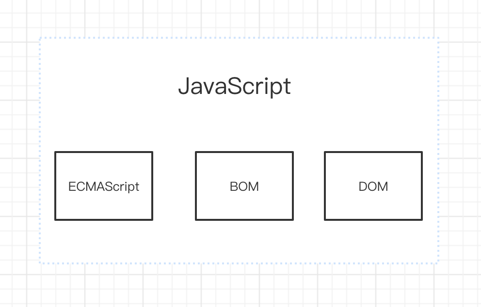
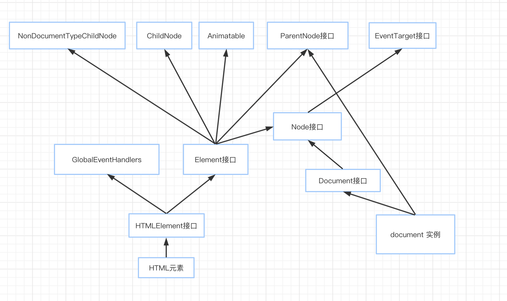

# JavaScript 需要理清的概念

> 本文主要讨论原生 JS 对<code style="color: #708090; background-color: #F5F5F5;"> HTMLEmement </code>创建、选择、设置、删除等。

## 1.基本概念

### 1.1 JavaScript 实现



JavaScript 包括:

- ECMAScript: 我们写的 JS 代码，由 ECMA-262 定义并提供核心功能
- BOM: 提供与浏览器交互的方法和接口
- DOM: 提供与网页内容相交互的方法和接口

所有 JS 相关的问题都逃不出这三点。

### 1.2 Window 和 window

```js
console.log(Window)
// 输出
ƒ Window() { [native code] }
// 结论：Window 是个浏览器实现的接口函数

console.log(window)
// 输出
Window {0: Window, window: Window, self: Window, document: document, name: "", location: Location, …}
// 结论：window 是个Window 的实例

console.log(window.window === window.self === window)
// 输出
true
// 结论：window 是个全局变量，且window.window 和 window.self 都指向它本身

console.log(window.document === document)
// 输出
true
// 结论： window的属性是全局变量

```

#### 结论

---

- Window 是浏览器实现的接口，是个构造函数

- window 是 Window 的一个实例

- window.window 和 window.self 都指向 window 自身

- window 的属性是全局变量，所以可以直接打印出 document

### 1.3 Document 和 document

```js
console.log(Document)
// 输出
ƒ Document() { [native code] }
// 结论： Document 是浏览器接口函数

console.log(document)
// 输出
#document
// 结论：document 是当前窗口内的文档节点

console.log(document instanceof Document)
// 输出
true
// 结论：document 是 Document的实例，它继承了 Document 的属性
```

#### 定义

<code style="color: #708090; background-color: #F5F5F5;">Document</code>接口表示任何在浏览器中载入的网页，并作为网页内容的入口，也就是<span style="color: #ff0000; font-size: 16px;">DOM 树</span>。

<code style="color: #708090; background-color: #F5F5F5;">document</code>是当前窗口内的文档节点。

#### 特性

Document 接口描述了任何类型的文档的通用属性与方法。

根据不同的文档类型（例如 HTML、XML、SVG，...），还能使用更多 API：使用 "contentType = text/html"的 HTML 文档，还实现了 HTMLDocument 接口。

通俗点说就是 Document 接口有操作文档的方法和属性，例如：在 HTML 文档中，document 的构造函数是 HTMLDocument,而 HTMLDocument 继承与 Document.

验证一下我们上面的说法：

```js
console.log(document.__proto__.constructor)
// 输出
ƒ HTMLDocument() { [native code] }

console.log(document.__proto__.__proto__.constructor)
// 输出
ƒ Document() { [native code] }
```

继承关系：


#### Document 的属性和方法

1> **属性**

- Document.body
- Document.contentType
- Document.scripts

2> **继承自 HTMLDocument**
<code style="color: #708090; background-color: #F5F5F5;">HTML</code>的 <code style="color: #708090; background-color: #F5F5F5;">Document</code> 接口继承自 <code style="color: #708090; background-color: #F5F5F5;">HTMLDocument</code> 接口（从 HTML5 扩展）：

- Document.cookie
- Document.domain
- Document.URL
- Document.title
- ...

3> **继承自 Node 的属性**

- Document.nextSibling
- Document.firstChild
- Document.nodeName：返回一个包含该节点名字的 DOMString，Text 节点对应的是 '#text' 还有 Document 节点对应的是 '#document'。
- Document.parentNode
- ...

4> **继承自 Node 和 EventTarget 的方法**

<code style="color: #708090; background-color: #F5F5F5;">Document</code> 的方法: 该接口同样继承了 <code style="color: #708090; background-color: #F5F5F5;">Node</code> 和 <code style="color: #708090; background-color: #F5F5F5;">EventTarget</code> 接口。

- Document.addEventListener()
- Document.createAttribute()
- Document.createElement()
- Document.createTextNode()
- Document.getElementsByClassName()
- Document.hasStorageAccess()
- ...

5> **实例 document 继承自 ParentNode 方法**

<code style="color: #708090; background-color: #F5F5F5;">Document 的实例 document</code>从 <code style="color: #708090; background-color: #F5F5F5;">ParentNode</code> 继承的拓展:

- document.getElementById(String id)
- document.querySelector()
- document.querySelectorAll()
- document.createExpression()
- document.createNSResolver()
- document.evaluate()

6> **监听事件 Event Handle**

- Document.oncopy
- Document.onselectionchange
- Document.onfullscreenchange
- ...

还有很多 HTML5 的拓展等相关的属性和方法，实在太多了，用到就去找吧。

### 1.3 Node 和 Element

**元素继承于节点，节点是 DOM 概念，元素是 HTML 概念。**

先来看一下不完全的接口继承图：


可以看出：

**HTMLElement 接口表示所有的 HTML 元素。**

HTMLElement 继承自父接口 Element 和 GlobalEventHandlers。具体看[这里](https://developer.mozilla.org/zh-CN/docs/Web/API/HTMLElement)。

示例：

```html
<!DOCTYPE html>
<html lang="en">
  <head>
    <meta charset="UTF-8" />
    <meta name="viewport" content="width=device-width, initial-scale=1.0" />
    <title>Document</title>
  </head>
  <body>
    <div id="root" onClick="console.log(2)">
      <span>Hello, world!</span>
    </div>
  </body>
  <script>
    let el = document.getElementById("root");
    // 看一下 <div id="root">节点 的 nodeName 属性
    console.log(el.nodeName);
    // 输出	"DIV"

    // 看一下 <div id="root"></div>元素 的 tagName 属性
    console.log(el.tagName);
    // 输出	"DIV"

    // 看一下 document节点 的 nodeName 属性
    console.log(document.nodeName);
    // 输出	"#document"

    // 看一下 document节点 有没有 tagName属性
    console.log(document.tagName);
    // 输出	"undefined"
  </script>
</html>
```

---

结论：

document 是节点，不是元素。

div 即是节点，又是元素。

---

## 2.DOM

> DOM 是 Document Object Model 的缩写，全称文档对象模型。

<span style="color: #ff0000; font-size: 16px;"> <code style="color: #708090; background-color: #F5F5F5;"> 文档对象模型 (DOM) </code>将 web 页面与脚本或编程语言连接起来。</span>

### 2.1 什么是 DOM？

DOM 模型用一个逻辑树来表示一个文档，树的每个分支的终点都是一个节点(node)，每个节点都包含着对象(objects)。

DOM 的方法(methods)让你可以用特定方式操作这个树，用这些方法你可以改变文档的结构、样式或者内容。

节点可以关联上事件处理器，一旦某一事件被触发了，那些事件处理器就会被执行。

一个 web 页面是一个文档。

### 2.2 DOM 和 JavaScript

JavaScript 使用 <code style="color: #708090; background-color: #F5F5F5;">document</code> 或 <code style="color: #708090; background-color: #F5F5F5;">window</code> 元素的<code style="color: #708090; background-color: #F5F5F5;">API</code>来操作文档本身或获取文档的子类。

**DOM 的方法和属性主要是用来操作元素。**

DOM 操作示例：

```html
<!DOCTYPE html>
<html lang="en">
  <head>
    <meta charset="UTF-8" />
    <meta name="viewport" content="width=device-width, initial-scale=1.0" />
    <title>Document</title>
  </head>
  <body>
    <div
      id="root"
      class="root"
      title="iamdiv"
      onclick="console.log('click div#root')"
      style="font-size: 16px; background-color: yellowgreen;"
    >
      <span>Hello, world!</span>
      <p class="remove">I will be remove!</p>
      <br />
      <a>我是链接</a>
      <br />
    </div>
  </body>
  <script>
    // ------------------------------DOM 查询操作-----------------------------
    // getElementById方法由 Document接口扩展于 ParentNode接口，Document <- document
    // ParentNode 是个原始接口，混合了所有(拥有子元素的) Node 对象包含的共有方法和属性。
    // https://developer.mozilla.org/zh-CN/docs/Web/API/Document 查看getElementById属性
    let el = document.getElementById("root");

    // getElementsByTagName方法来自 Document 接口
    let spanList = document.getElementsByTagName("span");
    let span1 = spanList && spanList[0];

    // getElementsByClassName 方法来自 Document 接口
    let removes = document.getElementsByClassName("remove");
    let remove1 = removes && removes[0];

    // querySelector 方法来自 Element, Element <- HTMLElement
    let a = el.querySelector("a");

    // ------------------------------DOM 新增操作-----------------------------
    // createElement方法来自于Document接口， Document <- document
    let p1 = document.createElement("p");

    // createTextNode方法来自于Document， Document <- document
    let textP1 = document.createTextNode("Hello, boy");

    // appendChild方法来自于Node, Node <-- Element <- HTMLElement
    // 因为 textP1 不是对文档中现有节点的引用,appendChild方法会将其附加到p1的末尾处
    p1.appendChild(textP1);

    // append方法来自于 ParentNode, ParentNode <- Element <- HTMLElement
    // 和appendChild 区别是：appendChild 只能接收 Node 参数，append 可以接收多个节点和字符串
    el.append(p1, "More Text");

    // insertBefore方法来自于 Node接口，Node <- Element <- HTMLElement
    // 因为 p1 是对文档中现有节点的引用，insertBefore() 会将其从当前位置移动到新位置
    el.insertBefore(p1, span1);

    // ------------------------------DOM 修改操作-----------------------------
    // setAttribute方法设置元素的属性， Element <-- setAttribute
    p1.setAttribute("class", "p1");
    el.setAttribute("title", "iAmDivTitle");
    // 直接修改某个属性
    p1.style.color = "red";

    // 获取文本内容
    let span1Text = span1.textContent;
    // 修改文本

    span1.textContent = span1Text + "Add Something Text";

    // 添加一个默认的“冒泡”阶段的监听事件
    // addEventListener方法来自 EventTarget，
    function evClickP(e) {
      e.stopPropagation();
      console.log("click p1");
    }
    p1.addEventListener("click", evClickP, false);

    // 阻止默认事件
    a.addEventListener("click", (e) => {
      e.preventDefault;
      console.log("a的默认跳转事件被阻止了！");
    });

    // ------------------------------删除操作-----------------------------
    // 删除节点, Node <- Element <- HTMLElement
    el.removeChild(remove1);
    //等同于
    // remove 方法来自于 ChildNode, ChildNode <- Element <- HTMLElement
    // remove 方法不兼容IE，需要polyfill https://developer.mozilla.org/zh-CN/docs/Web/API/ChildNode/remove#Polyfill
    // remove1.remove();

    // 删除节点属性
    el.removeAttribute("class");

    // 删除事件
    // 删除使用 EventTarget.addEventListener() 方法添加的事件
    // 注意 “事件捕获”和“事件冒泡” 不匹配是无法删除的
    p1.removeEventListener("click", evClickP);

    // 删除元素自带属性
    el.onclick = null;
  </script>
</html>
```

## 3.BOM

--- 更新中... ---

## 参考

[MDN](https://developer.mozilla.org/zh-CN/)

《JavaScript 高级程序设计 4》
