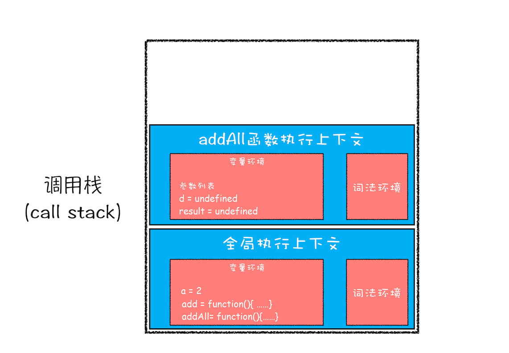
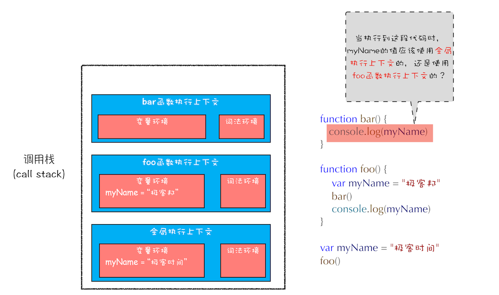

# 深入理解 JavaScript

> 受《你不知道的 JavaScript》系列影响，想深入探索一些 JS 更加硬核的内容。

## 1. 静态语言 VS 动态语言

### 1.1 JS 是哪种语言

我们知道 JS 源码是直接运行在浏览器中的。

这种直接在环中运行的语言我们叫做**动态语言**或**解释型**语言，JS 的运行环境一般指浏览器环境或 Node.js 提供的环境。

**常见的解释型语言**：

- JavaScript
- Python
- PHP

> 和**动态语言**相对的是**静态语言**，也称作**编译型**语言，这些语言是不能直接运行的，需要用编译器，先将代码编译为**机器代码**，再加以运行。

**常见的编译型语言**：

- C
- GO

有些语言比较特殊，采用了<code style="color: #708090; background-color: #F5F5F5; font-size: 18px">混合方式</code>，先将代码编译为**字节码**，在运行时再解释，如：

- C#
- Java

**静态语言 VS 动态语言**：

- **静态语言**中的**变量数据类型**是在**使用前就确定的**；
- **动态语言**中的变量数据类型是在运行时确定的；


> JS 是一种**弱类型**的**动态**语言。

<code style="color: #708090; background-color: #F5F5F5; font-size: 18px">弱类型</code>导致 JavaScript 引擎会在运行时自己计算出变量数据类型；

<code style="color: #708090; background-color: #F5F5F5; font-size: 18px">动态</code>意味着可以使用同一个变量保存不同类型的数据。

### 1.2 编译型语言的编译过程

**编译型**语言的源码在执行之前会经历 3 个步骤：

- 1. 分词/词法分析（Tokenizing/Lexing）

  将由字符组成的字符串分解成有意义的**代码块**；

  代码块被称为<code style="color: #708090; background-color: #F5F5F5; font-size: 18px">词法单元</code>（token）；

  ```js
  var a = 2;
  // 分解成：“var”、“a”、“=”、“2”、“；” 这5个token。
  ```

- 2. 解析/语法分析（Parsing）

  将<code style="color: #708090; background-color: #F5F5F5; font-size: 18px">词法单元流</code>（数组）转化为<code style="color: #708090; background-color: #F5F5F5; font-size: 18px">“抽象语法树”</code>（Abstract Syntax Tree, AST）。

  **AST**是操作源码的的利器，在各种工具中有举足轻重的作用，如 Babel。

  推荐一个网站[astexplorer](https://astexplorer.net/)，直接看到编译后的 JavaScript 的 AST。

- 3. 代码生成

  将**AST**转化为可执行代码；

### 1.3 JS 的编译过程

<code style="color: #708090; background-color: #F5F5F5; font-size: 18px">JavaScript 引擎</code>编译的过程比上面 3 个步骤的编译过程要复杂很多。

<span style="color: #ff0000; font-size: 16px;">JavaScript 的编译往往发生在代码执行前的几微秒（或更短）时间内</span>。

复杂的是<code style="color: #708090; background-color: #F5F5F5; font-size: 18px">JavaScript 引擎</code>在这个过程中使用各种方法，以保证性能最佳。

所以，JavaScript 虽然是解释型语言，但会在代码片段执行前进行编译，然后执行。

## 2. 内存空间

JS 的数据类型有两类：

- 基础类型：String、Number、Undefined、Null、Boolean、Symbol、BigInt

- 引用类型：Object(包含 Object、Array、Function、Math、Date、RegExp、Map、Set)

数据类型更多内容看[这里](https://www.shushuo.me/#/js/base)

> 思考：🤔 JavaScript 在运行时数据时如何存储的 ？

_JS 内存空间：_


- 1. 代码空间

  存储可执行代码，这个我们可以不关心；

- 2. 栈空间

  栈空间就是我们之前反复提及的**调用栈**，是用来<span style="color: #ff0000; font-size: 16px;">存储执行上下文</span>的。

  ```js
  function foo() {
    var a = "极客时间";
    var b = a;
    var c = { name: "极客时间" };
    var d = c;
  }
  foo();
  ```

  执行到第 3 行（即：var b = a;）时的调用栈如下：

  

- 3. 堆空间

  执行到第 4 行（即：var c = { name: "极客时间" };）时的调用栈如下：

  

  **对象类型**是存放在<code style="color: #708090; background-color: #F5F5F5; font-size: 18px">堆</code>空间的，在<span style="color: #ff0000; font-size: 16px;">栈空间中只是保留了对象的引用地址</span>。

> 为什么要把引用类型放在堆内存中呢？这样不是更麻烦了，栈里面还要保存引用？
>
> 答：为了程序执行效率！JS 引擎需要用**栈**来维护指向期间的**上下文状态**，如果**栈**空间过大，会影响上下文切换效率。

## 3. 浏览器是如何运行 JS 代码的


```js
showName();
console.log(myname);
var myname = "极客时间";
function showName() {
  console.log("函数showName被执行");
}
```

### 3.1 **编译阶段**

编译阶段会把上面代码分为两部分：**变量提升部分** 和 **执行部分**；

_变量提升部分：_

```js
// 初始化的任何变量都是 undefined
var myname = undefined;
// 函数声明提升 🌟
function showName() {
  console.log("函数showName被执行");
}
```

_执行部分：_

```js
showName();
console.log(myname);
myname = "极客时间";
```

_图示_：


> 编译阶段形成了“执行上下文”和“可执行代码”。

### 3.2 **执行阶段**

执行阶段很简单，就是**逐行**依次执行。

```js
showName(); // 输出 -> "函数showName被执行"
console.log(myname); // 输出 -> undefined
myname = "极客时间"; // 赋值
```

#### 3.2.1 执行详细过程

_示例：_

```js
var a = 2;
function add(b, c) {
  return b + c;
}
function addAll(b, c) {
  var d = 10;
  result = add(b, c);
  return a + result + d;
}
addAll(3, 6);
```

**Step1: 创建全局上下文，并将其压入栈底**


**Step2: 执行赋值**


**Step3:压入 addAll 函数并执行**

把 addAll 该函数的执行上下文**压入栈**；

然后执行，先执行的是 d=10 的赋值，再调用 add();



**Ste4:压入 add 函数并执行**

把 add 该函数的执行上下文**压入栈**；

然后执行，return b+c；


**Ste5:函数 add 返回，add 的上下文弹出**


**Ste5:函数 addAll 返回，addAll 的上下文弹出**


至此，JavaScript 执行完成。

### 3.3 执行上下文

#### 3.3.1 什么是执行上下文

> **执行上下文**是评估和执行 JS 代码的环境的一个**抽象概念**。

上面的定义是我查询各种资料后的总结，因为**执行上下文**并没有一个明确的定义。

**关于执行上下文需要知道的是：**🌟🌟🌟

> 1. 执行上下文有三种：全局执行上下文、函数执行上下文、eval 执行上下文

> 2. 顾名思义，**执行上下文**只在<span style="color: #ff0000; font-size: 16px;">执行</span>时存在。
>
> 全局上下文会在关闭页面前清除；函数执行上下文会在函数执行时生成，函数执行结束后清除；eval 同理。

> 3. 执行上下文中包含了：变量环境、词法环境、outer、this。

_执行上下文的组成：_


**执行上下文组成**：🌟🌟🌟

- 变量环境

  保存了 var 声明的变量；

- 词法环境

  保存了 let、const 的声明的变量；

- outer

  一个外部引用，用来**指向外部的执行上下文**

- this 🌟🌟🌟

  <span style="color: #ff0000; font-size: 16px;">每个执行上下文中绑定了一个 this</span>

_代码示例：_

```js
function foo() {
  var a = 1;
  let b = 2;
  {
    let b = 3;
    var c = 4;
    let d = 5;
    console.log(a); // 1
    console.log(b); // 3
  }
  console.log(b); // 2
  console.log(c); // 4
  console.log(d); // Uncaught ReferenceError: d is not defined
}
foo();
```

**分析 foo()执行流程：**

---

1. 编译并创建执行上下文


- **变量环境**保存了 var 声明的变量
- **词法环境**（Lexical Environment）保存了 let 声明的变量
- 块中 let 定义的变量（变量 d）还没有放到**词法环境**中，但块中 var 声明的 c 放到了**变量环境**

2. 执行代码到块（即：第 4 行）


- **变量环境**中变量 a 被赋值
- **词法环境**中 b 被赋值，同时栈顶压入了块中的变量，并初始化（b = undefined d = undefined）

3. 执行到 console.log(a)时（即：第 8 行）

_查找变量 a 的过程：_

从**词法环境**的**栈顶** -> **栈底** -> **变量环境**


4. 执行代码到块结束（即：第 11 行）

此时块中的代码(即：{}中的代码)已经执行完，其内部定义的变量就会**从词法环境的栈顶弹出**。


5. 继续执行到结束。

> 这个过程可以看到 JavaScript 引擎如何同时支持**变量提升**和**块级作用域**。

#### 3.3.2 切换执行上下文

栈顶函数执行完成，则**当前上下文指针**会移动到下一个**执行上下文**，这就是<code style="color: #708090; background-color: #F5F5F5; font-size: 18px">切换执行上下文</code>。

栈顶的**执行上下文**会被弹出，当前指针指向的**执行上下文**到了栈顶。


### 3.4 作用域与作用域链

#### 3.4.1 什么是作用域（scope）

通俗地理解，作用域就是**变量与函数的可访问范围**，即作用域**控制着变量和函数的可见性和生命周期**。

- 全局作用域

  全局作用域中的变量在代码中的任何地方都能访问；

  其**生命周期伴随着页面的生命周期**。

- 函数作用域

  函数作用域内的**变量**或者**函数**只能在函数内部被访问。

  函数执行结束之后，函数内部定义的变量会被**销毁**。

- 块作用域

  块级作用域就是使用一对大括号包裹的一段代码，比如函数、判断语句、循环语句等。

  代码块外部是访问不到的块级作用域内的变量，并且等该代码块中的代码执行完成之后，代码块中定义的变量会被销毁。

#### 3.4.2 什么是作用域链

先看一个代码示例：

```js
function bar() {
  console.log(this.b);
  console.log(myName);
}
function foo() {
  this.b = "b";
  var myName = "极客邦";
  bar();
}
var b = "B";
var myName = "极客时间";
foo();
```

打印结果是什么？

为什么？是不是以为会打印"b"、“极客邦”？



> 答案是： “b”、"极客时间"。

> 为什么？打印出“b”比较好理解，因为*bar*在**foo**中执行，所以**bar**里的<code style="color: #708090; background-color: #F5F5F5; font-size: 18px">this</code>指向 **foo函数执行上下文**。
>
> 但是为什么没有打印出“极客邦”，而是打印出“极客时间”呢？因为**作用域链**。

**JavaScript 引擎查找变量的流程**：🌟🌟🌟

- 首先会在“当前的执行上下文”中查找该变

- 然后在 outer 所指向的执行上下文中查找

_查找过程图示：_


可以看到，bar、foo 执行上下文中的 **outer**指向**全局执行上下文**。

这条变量查找的链条就称作<span style="color: #ff0000; font-size: 16px;">作用域链</span>。

#### 3.4.3 词法作用域

<span style="color: #ff0000; font-size: 16px;">**作用域链**是词法作用域决定的</span>。🌟🌟

**词法作用域**是在编译时决定的，即：由代码中**变量声明的位置决定**。🌟🌟

记住，是**声明**时决定的，而不是**执行**时决定。

```javascript
function bar() {
  console.log(this.b);
  console.log(myName);
}
function foo() {
  // 这里的this在声明时决定了，永远指向window
  this.b = "b";
  var myName = "极客邦";
  bar();
  
  // 这里和上面👆bar()中打印的不一样，恰好说明了作用域链是编译时决定的，变量声明由位置决定
  console.log(this.b);
  console.log(myName);
}
var b = "B";
var myName = "极客时间";
foo();
```


现在我们可以回到一小节最后的问题了。

> foo 先在自己的**执行上下文**中查找的变量“词法作用域”，没找到；
>
> 然后，根据**词法作用域**的查找规则，会到**foo 定义时的上下文（即：全局上下文）查找**，而不是**foo 执行时的上下文（即：bar 的上下文）**。

一句话总结：**词法作用域是代码编译阶段就决定好的，和函数是怎么调用的没有关系**。

## 4. 再看闭包

之所以说是“再看”，因为在[函数-闭包](https://www.shushuo.me/#/js/function?id=_5-%e9%97%ad%e5%8c%85)中已经讨论过了。

闭包的关键点是，**函数 A 返回了一个引用了它内部变量的函数 B**，导致**函数 A 的这个内部变量没有随着函数 A 执行完成而销毁**。

我们上面讨论了<code style="color: #708090; background-color: #F5F5F5; font-size: 18px">执行上下文</code>、<code style="color: #708090; background-color: #F5F5F5; font-size: 18px">作用域链</code>、<code style="color: #708090; background-color: #F5F5F5; font-size: 18px">词法作用域</code>...,这些对深入理解闭包很有帮助。

_闭包示例代码：_

```js
function foo() {
  var myName = "极客时间";
  let test1 = 1;
  const test2 = 2;
  var innerBar = {
    getName: function () {
      console.log(test1);
      return myName;
    },
    setName: function (newName) {
      myName = newName;
    },
  };
  return innerBar;
}
var bar = foo();
bar.setName("极客邦");
bar.getName();
console.log(bar.getName());
```

上面的代码中，foo 中的 innerBar 是个对象，它的方法 getName 使用了 foo 中的变量“myName” 和 “test1”，foo 最后返回了 innerBar，这个过程形成了闭包。

_先来看看执行结果：_

```js
// 1
// 1
// 极客邦
```

可以看到，虽然 foo 函数执行完了，但 setName 方法还是改变了 foo 中的变量 myName;

_执行过程分析：_

1. 执行到 var bar = foo() 时的调用栈


2. foo() 执行结束时的调用栈


注意 ⚠️：

按照正常逻辑的话，foo 执行结束，它的执行上下文（包含变量、作用域链等）都会被清除。

可是，由于 foo 的返回值 innerBar 是全局作用域中的变量，且他的方法 getName 和 setName 引用了 foo 中的变量“test1” 和 “myName”；

导致，<span style="color: #ff0000; font-size: 16px;">foo 的执行上下文被清除时，变量“test1” 和 “myName”未被清除</span>。

> 为什么会这样？？
>
> 根据词法作用域的规则，🌟🌟🌟 内部函数 getName 和 setName 总是可以访问它们定义时的外部函数 foo 中的变量 “test1” 和 “myName”。

3. 执行最后一行代码（即：console.log(bar.getName())）时的调用栈


此时，打个断点看一下代码的执行情况：


## 5. 再看 this

[函数-搞懂 this](https://www.shushuo.me/#/js/function?id=_4-%e6%90%9e%e6%87%82-this)中已经讨详细论过了，可以先去看看。

有个疑问 🤔️ ！

> 为什么需要 this ？

_代码示例：_

```js
var myName = "test";
var bar = {
  myName: "time.geekbang.com",
  printName: function () {
    console.log(myName);
  },
};

bar.printName();
// test
```

执行结果是“test”，应该比较好理解。

如果想在 bar 的方法 printName 中访问 bar.myName 怎么办？

```js
// 这样修改一下 printName 就行了
...
printName: function () {
    console.log(bar.myName);
  },
...
```

> 为了**在对象内部的方法中使用对象内部的属性**这一非常普遍的需求，JavaScript 引入了 <span style="color: #ff0000; font-size: 16px;">this 机制</span>。

### 5.1 this 缺陷

- 1. 嵌套函数中的 this 不会从外层函数中继承

```js
var name = "test";
var myObj = {
  name: "极客时间",
  showThis: function () {
    console.log(this.name);
    function bar() {
      console.log(this.name);
    }
    bar();
  },
};
myObj.showThis();
// 极客时间
// test（因为bar中的this指向了window）
```

- 2.普通函数中的 this 默认指向全局对象 window

可以通过 call()方法来显示指定其 this 来解决。

## 参考

《你不知道的 JavaScript》上、中、下卷

维基百科：[编译语言](https://zh.wikipedia.org/wiki/%E7%B7%A8%E8%AD%AF%E8%AA%9E%E8%A8%80)

极客时间 - 李兵[浏览器工作原理与实践](https://time.geekbang.org/column/intro/216)

非常详细 [说说执行上下文](https://juejin.cn/post/6844904158957404167#heading-16)

《JavaScript 高级程序设计》第 4 版
