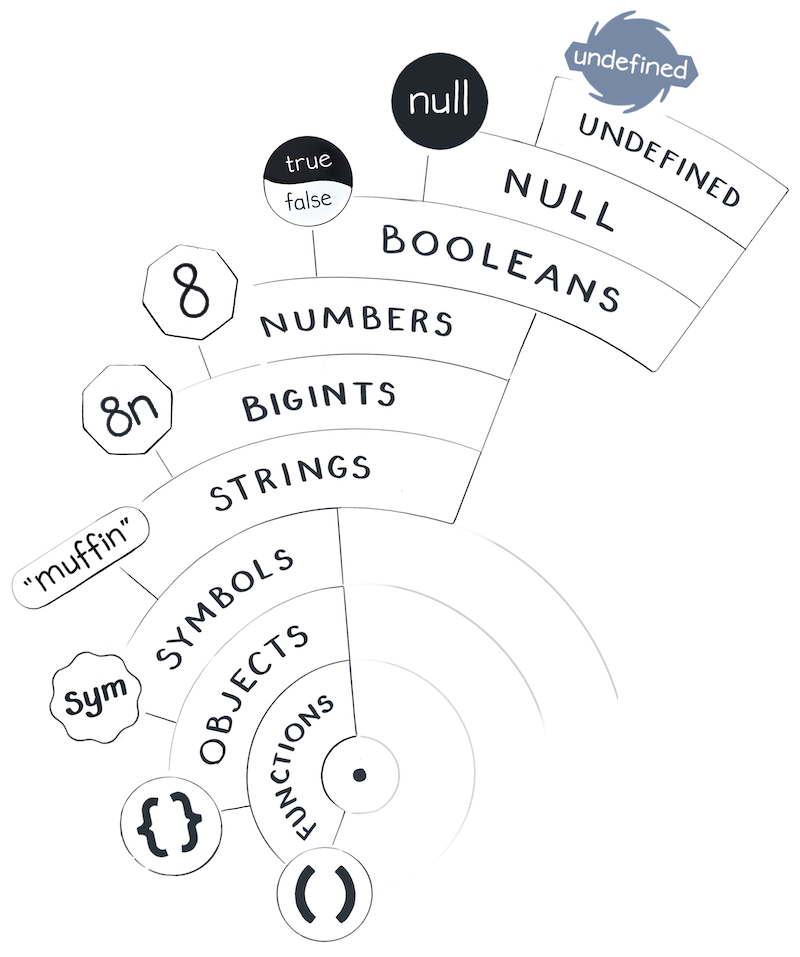

# JS 心智模型

> 人脑无法像电脑一样运转，“心智模型”尽可能帮我们理解代码运行的过程。

_JS 的星球世界 ⬇️_



## 6. Object & Function

<code style="color: #708090; background-color: #F5F5F5; font-size: 18px">非原始值</code>（non-primitive values）是让我们创造自己 <code style="color: #708090; background-color: #F5F5F5; font-size: 18px">value</code> 的类型。

### 6.1 Object

<code style="color: #708090; background-color: #F5F5F5; font-size: 18px">Object</code>和<code style="color: #708090; background-color: #F5F5F5; font-size: 18px">原始值</code>（null, undefined, booleans, numbers, and strings）不同的是：<code style="color: #708090; background-color: #F5F5F5; font-size: 18px">原始值</code>“一直存在”，<span style="color: #ff0000; font-size: 16px;">我们不能"创建"、“修改”和“销毁”他们，我们能做的只有“召唤”（即使用）它们</span>。

但是，我们可以创建一个新的 Object：

```js
// 创建一个新的对象
let arr1 = [1];
// 再创建一个新对象
let arr2 = [];

arr1 === arr2; // false
```

为什么 arr1 和 arr2 不相等？

> 因为 arr2 和 arr1 都是新的对象（二者在内存中的地址不同）。

我们可以创建对象，我们可以销毁他们吗？

```js
arr1 = null;
```

上面的代码意思是："给变量 arr1 赋值 null" ，我们并没有手动销毁上面创建的对象*[1]*。

销毁*[1]*的是 JS 垃圾回收机制，可惜 JS 的垃圾回收机制对我们是不可感知的。

## 6.2 Function

- Function 是 <code style="color: #708090; background-color: #F5F5F5; font-size: 18px">value</code>
- Function 也是 <code style="color: #708090; background-color: #F5F5F5; font-size: 18px">表达式</code>

### 6.2.1 Function 是 value

<code style="color: #708090; background-color: #F5F5F5; font-size: 18px">函数</code>就是 value。我们可以将变量指向它们，就像我们可以处理数字或对象一样。

看一下代码示例：

```js
for (let i = 0; i < 7; i++) {
  console.log(2);
}
```

执行示例中的代码，<code style="color: #708090; background-color: #F5F5F5; font-size: 18px">2</code>这个 value 会被打印 7 次，且每个<code style="color: #708090; background-color: #F5F5F5; font-size: 18px">2</code>都是同一个，因为<code style="color: #708090; background-color: #F5F5F5; font-size: 18px">2</code>是个<code style="color: #708090; background-color: #F5F5F5; font-size: 18px">原始值</code>。

看一下代码示例：

```js
for (let i = 0; i < 7; i++) {
  console.log(function () {});
}
```

执行示例中的代码，log() 方法中的函数同样被执行了 7 次，但是每次都是一个新的 value.

### 6.2.1 Function 是 表达式

像任何表达式一样，*函数表达式*是我们 JavaScript 世界的一个“问题” —— 每次我们提问时，它都会<span style="color: #ff0000; font-size: 16px;">通过创建一个新的函数值来回答我们</span>。

## 小结

- 我们不能创建、修改、销毁<code style="color: #708090; background-color: #F5F5F5; font-size: 18px">原始值</code>，但是可以创建<code style="color: #708090; background-color: #F5F5F5; font-size: 18px">对象</code>

- 函数是 value 也是 表达式，它作为表达式被调用时：通过创建一个新的**函数值**来回答我们

## 7. JS 中的相等

### 7.1 相等有三种

- 1. <code style="color: #708090; background-color: #F5F5F5; font-size: 18px">===</code> 代表严格相等，只有相同的两个值结果才为 true
- 2. <code style="color: #708090; background-color: #F5F5F5; font-size: 18px">==</code> 代表非严格相等，JS 会默认先进行类型转换，然后再去比较
- 3. <code style="color: #708090; background-color: #F5F5F5; font-size: 18px">Object.is()</code>, 和 <code style="color: #708090; background-color: #F5F5F5; font-size: 18px">===</code> 相同

示例：

```js
1 === 1; // true
1 === "1"; // false
[] === [];
1 == "1"; // true
Object.is(1, "1"); // false
Object.is(1, 1); // true
```

### 7.2 两个特殊情况，需要特别注意一下

1. NaN === NaN; -> false

NaN 只有一个，但他们是不等的，记住它吧。

```js
let a = 0 / 0; // a = NaN;
let b = 0 / 0; // a = NaN;
a === b; // false
```

所以，我们不能用 “a === NaN” 这样的表达式验证 “a” 是不是等于 “NaN”.

可以使用下面 3 种来验证：

```js
Number.isNaN(size);
Object.is(size, NaN);
size !== size; // size 不能是对象
```

2. 0 === -0; -> true

0 和 -0 分别代表两个不同的值，但他们是相等的。

```js
0 === -0; // true
```

### 7.3 尽量不要使用“==”

<code style="color: #708090; background-color: #F5F5F5; font-size: 18px">==</code>叫做“松散相等”，它会在两个值不相等时进行转换，然后再次比较。转换规则具体是怎样的？？规则是神秘而混乱的。所以，尽量不要这么用，除非在你能掌握的情况下。

```js
console.log([[]] == ""); // true
console.log(true == [1]); // true
console.log(false == [0]); // true
```

### 小结

> 1. 尽量不要用<code style="color: #708090; background-color: #F5F5F5; font-size: 18px">==</code>做判断，应该使用<code style="color: #708090; background-color: #F5F5F5; font-size: 18px">===</code>
>
> 2. <code style="color: #708090; background-color: #F5F5F5; font-size: 18px">Object.is()</code> 和 <code style="color: #708090; background-color: #F5F5F5; font-size: 18px">===</code>是等效的，除了我们提到的两种情况（NaN 和 -0）
>
> 3. 可以用 Number.isNaN(x)检查 x 是否是 NaN

## 8.属性

### 8.1 对象作为属性

> **对象即使作为属性**也不存在包裹关系，因为，每个对象都独立存在。

```js
let a = {
  b: {
    c: "i am c",
  },
};
```

上面代码的心智模型：


可以看出，我们不能想着**对象嵌套**这样一个模型，如下面是个错误 ❌ 的展示：


### 8.2 使用对象的属性

> 使用对象的属性要注意“引用关系”。

对于<code style="color: #708090; background-color: #F5F5F5; font-size: 18px">属性</code>的修改而言，“.” 与 “=” 的作用是大不相同的。🌟

```js
let ilana = {
  address: { city: "New York" },
};
let place = ilana.address;
place = { city: "Boulder" };
console.log(ilana.address.city); // New York
```

```js
let ilana = {
  address: { city: "New York" },
};
let place = ilana.address;
place.city = "Boulder";
console.log(ilana.address.city); // Boulder
```

搞清楚是*使用了对象*还是*使用了对象的属性*很重要！🌟🌟

```js
let chip = {
  address: { city: "Disneyland" },
};
let dale = {
  address: chip.address,
};
let dale1 = {
  address: {
    // 获取对象 chip 的属性 “address” 的属性 “city”
    // 相当于直接获取到字符串“Disneyland”
    // address 之后的改变不会对这里产生任何影响 🌟🌟🌟
    city: chip.address.city,
  },
};

// 重新给对象 chip 的属性 “address” 赋值
chip.address = { city: "Tokyo" };

console.log(dale.address.city); // Tokyo
console.log(dale1.address.city); // Disneyland
```

**总结：**

---

> 1. JS 中的**原始值**不能被我们"创建"、“修改”和“销毁”，我们能做的只有“召唤”（即使用）它们
>
> 2. JS 中的**非原始值（对象）**可以被创建，但同样不可被“修改”和“销毁”
>
> 3. 每个对象都是独立的，<code style="color: #708090; background-color: #F5F5F5; font-size: 18px">心智模型</code>里不因该有“嵌套对象”的存在
>
> 4. JS 世界中是值传递而不是变量，不应该在心智模型中将一个变量指向另一个变量，而是应该指向它变量所代表的值
>
> 5. 函数是 value 也是 表达式，它作为表达式被调用时：通过创建一个新的函数值来回答我们
>
> 6. 尽量用 “===” 而不是 “==”来做逻辑判断，除非在你能掌控的情况下

## 10. Prototype（原型）

- 1. 任何对象都有个<code style="color: #708090; background-color: #F5F5F5; font-size: 18px">\_\_proto\_\_\</code>属性，指向了它的**构造函数**的 <code style="color: #708090; background-color: #F5F5F5; font-size: 18px">prototype</code>属性,即**指向构造函数的原型对象**.

```js
let obj = {
  teeth: 32,
};

console.log(obj.__proto__ === Object.prototype); // true
```

_Object.prototype 心智模型_：


- 2. <code style="color: #708090; background-color: #F5F5F5; font-size:18px">\_\_proto\_\_\</code>没什么神奇的地方，就是一个对象而已，我们通常不会直接使用它，但是访问对象属性时，浏览器会在对象不存在某个属性时去<code style="color: #708090; background-color: #F5F5F5; font-size: 18px">\_\_proto\_\_\</code>上面查找

## 参考

Dan 神的课程,强烈推荐啊，确实纠正了我的一些问题 👍👍 [Learn my JavaScript Mental Models](https://justjavascript.com/)
