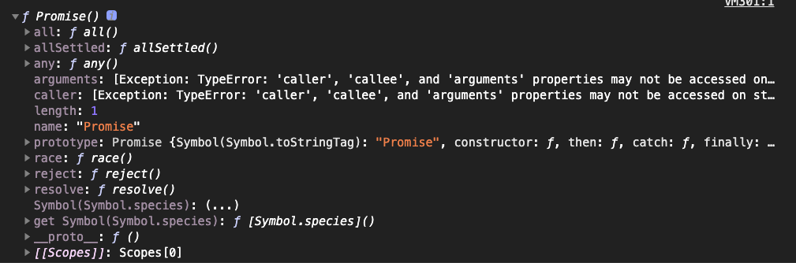

# Promise

> Promise 对象用于表示一个异步操作的最终完成 (或失败)及其结果值。

## Promise 是什么

Promise 是一个对象。

// 浏览器打印Promise

## Promise 有什么用

## Promise 怎么用

## 参考

[Promise](https://developer.mozilla.org/zh-CN/docs/Web/JavaScript/Reference/Global_Objects/Promise)
[使用 Promise](https://developer.mozilla.org/zh-CN/docs/Web/JavaScript/Guide/Using_promises)
