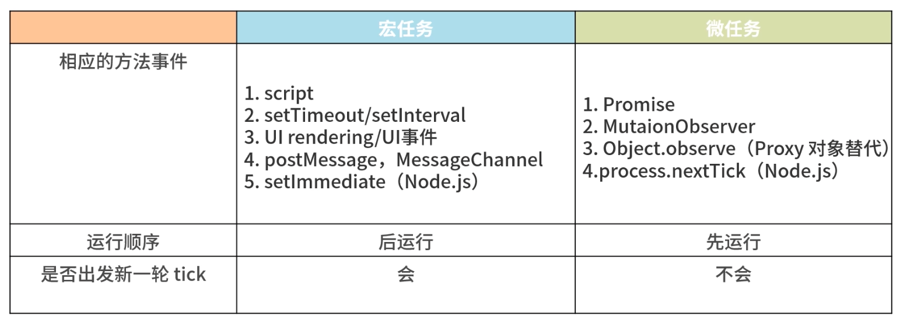

# Event Loop (事件循环)

> 事件循环是 JS 的并发模型。

JavaScript 有一个基于事件循环的<code style="color: #708090; background-color: #F5F5F5; font-size: 18px">并发模型</code>，

<code style="color: #708090; background-color: #F5F5F5; font-size: 18px">事件循环</code><span style="color: #ff0000; font-size: 16px;">负责执行代码、收集和处理事件以及执行队列中的子任务</span>。

## 1. JavaScript 运行时

运行时由三部分组成：

- Stack(栈)：**函数调用形成了一个由若干帧组成的栈**
- Head(堆)：**对象被分配在堆中，堆是一个用来表示一大块（通常是非结构化的）内存区域的计算机术语**
- Queue(队列)：**一个 JavaScript 运行时包含了一个待处理消息的消息队列，每一个消息都关联着一个用以处理这个消息的回调函数**

_JS 运行时：_


## 2. JavaScript 执行上下文

当一段 JavaScript 代码在运行的时候，它实际上是**运行在执行上下文中**，3 种类型的代码会创建一个新的执行上下文：

- 1. 全局上下文：任何 JavaScript 函数之外的代码的执行上下文
- 2. 函数上下文：每个函数会在执行的时候创建自己的执行上下文
- 3. eval(): eval 函数会创建一个新的执行上下文，别这样用 ⚠️

<span style="color: #ff0000; font-size: 16px;">每一个上下文在本质上都是一种作用域层级</span>。

每个代码段开始执行的时候都会创建一个新的上下文来运行它，<span style="color: #ff0000; font-size: 16px;">并且在代码退出的时候销毁掉</span>。

_🌰 例子 1: 上下文执行示例：_

```js
// 1. 程序开始运行，全局上下文被创建
let outputElem = document.getElementById("output");

let userLanguages = {
  Mike: "en",
  Teresa: "es",
};

function greetUser(user) {
  function localGreeting(user) {
    let greeting;
    let language = userLanguages[user];

    switch (language) {
      case "es":
        greeting = `¡Hola, ${user}!`;
        break;
      case "en":
      default:
        greeting = `Hello, ${user}!`;
        break;
    }
    return greeting;
  }
  // 3. 执行 localGreeting(user)，为 localGreeting方法 创建一个新的上下文
  // localGreeting的上下文被推入栈，然后执行完，直至退出，退出的时候它的上下文也会从执行栈中弹出并销毁
  // 程序会从栈中获取下一个上下文并恢复执行, 也就是从 greetUser() 剩下的部分开始执行

  // 6. 执行 localGreeting(user)，入栈，然后出栈，退出的时候它的上下文也从栈中弹出并销毁；
  // 恢复执行 getUser
  outputElem.innerHTML += localGreeting(user) + "<br>\r";
}

// 2. 执行 greetUser()，创建一个它的上下文，执行上下文会被推入执行上下文栈中
// 4. 继续执行 greetUser() 执行完毕并退出，其上下文也从栈中弹出并销毁
greetUser("Mike");
// 5. 执行 greetUser("Teresa")，程序又会为它创建一个上下文并推入栈顶
// 7. 继续执行 greetUser() 执行完毕并退出，其上下文也从栈中弹出并销毁
greetUser("Teresa");
// 8. 主程序退出，全局执行上下文从执行栈中弹出。此时栈中所有的上下文都已经弹出，程序执行完毕
```

## 3. Event Loop(事件循环)

### 3.1 执行至完成

运行时会从最先进入队列的消息开始处理队列中的消息;

被处理的消息会被移出队列，并作为输入参数来调用与之关联的函数;

调用一个函数总是会为其创造一个新的栈帧,且函数的处理会一直进行到执行栈再次为空为止；

（也就是说，**每一个消息完整地执行后，其它消息才会被执行**。）

然后，事件循环将会处理队列中的下一个消息。

**缺点：**🌟

**当一个消息需要太长时间才能处理完毕时，Web 应用程序就无法处理与用户的交互**，例如点击或滚动。

### 3.2 添加消息

在浏览器里，每当**一个事件发生并且有一个事件监听器绑定在该事件上时**，一个消息就会被添加进消息队列。

这两个条件缺一不可，如果没有事件监听器，这个事件将会丢失。

setTimeout 的回调函数也会添加到任务队列。

需要知道的是：**setTimeout 并不会在计时器到期之后直接执行，第二个参数仅仅表示最少延迟时间，而非确切的等待时间。**

### 3.3 什么是 Event Loop

JavaScript 引擎（如 V8）开始解析并执行代码，执行步骤像【例子 1】说的一样。

<span style="color: #ff9933; font-size: 16px;">1> 执行过程中，遇到任务（如：setTimeout、事件回调、Ajax），JavaScript 引擎（如 V8）会调用 Web API,</span>

<span style="color: #ff9933; font-size: 16px;">2> Web API 会根据具体情况，把 <span style="color: #ff0000; font-size: 16px;">触发后的回调函数 🌟🌟🌟（一定是触发后，如：setTimeout()的计时工作是浏览器的独立线程完成的）</span>推入到相应的（微任务和宏任务分别推送到微任务队列和宏任务队列）任务队列末端，</span>

JavaScript 引擎（如 V8）的脚步并没有停下来，它会继续执行所有 JS 代码，执行过程中遇到微任务了就重复 1> 和 2> 中的步骤，直到全部执行完毕。

<span style="color: #ff9933; font-size: 16px;">3> 浏览器可没闲着，它一直在监听着 Stack(栈)是不是已经全部为空，Stack(栈)一旦清空，浏览器会将任务队列中的第一个回调（如果有）推入栈中执行；</span>

执行过程中遇到任务了就重复 1> 和 2> 中的步骤，

这样，任务队列里的任务会被循环执行，直到任务队列为空，全部执行结束。

其中，<span style="color: #ff0000; font-size: 16px;">1> 2> 3> 步形成的机制就是 Event Loop，由于 JavaScript 引擎（如 V8）的执行过程中，把其他事情交给了 Web API 来处理，形成了异步</span>。🌟🌟🌟

_JS 运行环境详细：_


## 4. 宏任务（macro-task） VS 微任务（micro-task）

首先要明确一点，[JS 运行时](https://developer.mozilla.org/zh-CN/docs/Web/API/HTML_DOM_API/Microtask_guide/In_depth#javascript%E8%BF%90%E8%A1%8C%E6%97%B6)的任务队列有两条，分别是<code style="color: #708090; background-color: #F5F5F5; font-size: 18px">宏任务队列</code>和<code style="color: #708090; background-color: #F5F5F5; font-size: 18px">微任务队列</code>。



**微任务：**

- Promise 函数
- queueMicrotask()
- process.nextTick（NodeJS）、
- MutationObserver(html5 新特性)

**宏任务：**

- script(整体代码)
- setTimeout, setInterval, setImmediate（NodeJS）的回调
- I/O
- UI rendering
- 事件回调、XHR 回调（Ajax）等

**微任务和宏任务区别 ❓**

<span style="color: #ff0000; font-size: 16px;">宏任务会发起 Tick，微任务不会发起新一轮 Tick，一个 Tick 中的所有微任务清空才算执行完一个 Tick</span>。

例如：在执行一个宏任务时生成了一个微任务，这个微任务会被添加到微任务队列，新添加的微任务会在该。

### 4.1 异步任务例题分析

```js
async function async1() {
  console.log("async1 start");

  let res = await resolveAfter2Seconds();

  console.log(res);

  await async2();

  console.log("async1 end");
}

function resolveAfter2Seconds(x) {
  return new Promise((resolve) => {
    setTimeout(() => {
      resolve(x);
    }, 2000);
  });
}

async function async2() {
  console.log("async2");
}

async1();

setTimeout(() => {
  console.log("timeout");
}, 0);

new Promise(function (resolve) {
  console.log("promise1");

  resolve();
}).then(function () {
  console.log("promise2");
});

console.log("script end");

//async1 start
// promise1
// script end
// promise2
// undefined
// timeout
// undefined
// async2
// async1 end
```

## 参考

写的非常好，推荐 👍[The Javascript Runtime Environment](https://olinations.medium.com/the-javascript-runtime-environment-d58fa2e60dd0)

[并发模型与事件循环 -- MDN](https://developer.mozilla.org/zh-CN/docs/Web/JavaScript/EventLoop)

[深入：微任务与 Javascript 运行时环境 -- MDN](https://developer.mozilla.org/zh-CN/docs/Web/API/HTML_DOM_API/Microtask_guide/In_depth)

[Node.js 事件循环，定时器和 process.nextTick -- nodeJs 官网](https://nodejs.org/zh-cn/docs/guides/event-loop-timers-and-nexttick/#what-is-the-event-loop)
