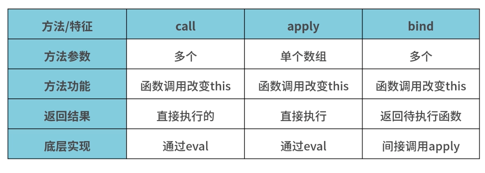

# 关于 JavaScript 函数的一切

> 一个函数是 JavaScript 过程 — 一组执行任务或计算值的语句。

## 1.定义函数

函数可以大致分为两种：

- 普通函数
- 箭头函数
- 构造函数

### 1.1 定义函数

函数声明定义一个普通函数：

```js
function square(number) {
  return number * number;
}
```

函数表达式定义一个普通函数：

```js
// 函数表达式定义函数
// 注意这里是有分号的
const square = function (number) {
  return number * number;
};
```

定义箭头函数：

```js
let sum = (num1, num2) => {
  return num1 + num2;
};
```

使用 Function 构造函数：

```js
// 非常不推荐这种方式，也没人这么用
// 因为函数本身就是Function 的实例，所以这样能很好的说明“函数名”是个指针而已
let sum = new Function("num1", "num2", "return num1 + num2");
```

**函数声明与函数表达式的唯一区别是：函数声明提升。**

通俗来说就是：浏览器的 JS 引擎会把函数声明方式定义的函数名提升到源代码树的顶部。

例：声明式定义函数，函数提升

```js
// 因为 addNum 是声明式定义的，所以函数“addNum” 会被提升到代码的最上方
// 所以这里可以正确执行
let sum1 = addNum(1, 2);

function addNum(num1, num2) {
  return num1 + num2;
}
```

例：表达式定义函数，函数不会提升

```js
// 报错，无法执行
// Uncaught ReferenceError: minusNum is not defined
let minus1 = minusNum(1, 2);

let minusNum = function (num1, num2) {
  return num1 - num2;
};
```

#### 1.1.1 构造函数

函数声明定义一个<span style="color: #ff0000; font-size: 16px;">构造函数</span>：

```js
function Square(number) {
  return number * number;
}
```

**构造函数**没啥特别的，一般函数名首字母大些。

构造函数一般是用来构造对象的。

```js
function Car(make, model, year) {
  this.make = make;
}
Car.prototype.name = function () {
  return this.make;
};

const car1 = new Car("Eagle");
console.log(car1);
```

_打印结果：_


**new 关键字做了如下操作：**🌟🌟🌟

- 1. 内存中创建一个简单对象 {}
- 2. 将新对象内部的 [[Prototype]] 指针赋值为构造函数的 prototype 属性，实现继承(即：car1.\_\_proto\_\_ === Car.prototype)；
- 3. 将新对象内部的 [[Prototype]] 的 constructor 属性指向构造函数（即：car1.\_\_proto\_\_.constructor === Car）；
- 4. 构造函数内，this 指向新对象实例，（即：Car1.bind(car));
- 5. 执行构造函数内代码（给新对象添加属性）
- 6. 如果该函数没有返回对象，则返回 this，即返回了新对象

_手写一个 new 操作符：_

```js
function _new(Constructor, ...args) {
  // 基本边界判断
  if (typeof Constructor !== "function") return false;

  // 1. 创建新的简单对象
  let obj = new Object();
  // 2. 简单对象继承 Constructor原型
  obj.__proro__ = Object.create(Constructor.prototype);
  // 3. 修改简单对象 内部的 [[Prototype]] 的 constructor
  obj.__proto__.constructor = Constructor;
  // 4、5 执行 Constructor 代码，且修改其内部 this 指向 obj;
  let res = Constructor.apply(obj, ...args);

  // 6. 判断 Constructor 执行后返回结果
  let isObject = typeof res === "object" && res !== null;
  let isFunction = typeof res === "function";

  // 6. 返回的是对象（Object/Function）则放回res，否则直接返回 obj
  return isObject || isFunction ? res : obj;
}
```

#### 1.1.2 箭头函数

箭头函数是一个特殊的存在。除了和普通函数写法不同，最关键的是<span style="color: #ff0000; font-size: 16px;">箭头函数的 this 在定义时被确定</span>。

这一点至关重要。因此，使用箭头函数时应当特别注意作用域问题。

_对象中的箭头函数：_

```js
var a = 1;
var obj1 = {
  a: 2,
  // 对象中函数，this 指向调用它的对象
  func1: function () {
    console.log(this.a);
  },
  // 此时箭头函数的作用域是 全局
  func2: () => {
    console.log(this.a);
  },
  // 此时箭头函数的作用域是 func3
  func3: function () {
    let b = () => {
      console.log(this.a);
    };

    return b;
  },
};
obj1.func1(); // 2
obj1.func2(); // 1
obj1.func3()(); // 2
```

_setTimeout 中的箭头函数：_

```js
function foo() {
  setTimeout(() => {
    console.log("id1:", this.id);
  }, 100);
  setTimeout(function () {
    console.log("id2:", this.id);
  }, 100);
}

var id = 21;

foo.call({ id: 42 });
// id1: 42
// id2: 21
```

箭头函数定义时，this 指向 { id: 42 }；

箭头函数执行时，this 仍然指向 { id: 42 }；所以，id2 => 42.

普通函数执行时，this 指向全局对象 window；所以，id1 => 21.

**箭头函数 this 固定化的原因：**

> 箭头函数根本没有自己的 this，导致内部的 this 就是外层代码块的 this。

**因此：**

- 箭头函数不能用于构造函数
- 对象的属性也不要使用箭头函数，此时箭头函数里的 this 指向对象的上下文环境，而不是指向对象

  ```js
  globalThis.s = 21;
  const obj = {
    s: 42,
    m: () => console.log(this.s),
  };

  obj.m(); // 21
  ```

- 需要动态 this 的时候，也不应使用箭头函数
  如：绑定的监听事件中的 this;
  如：继承时挂载在函数上的方法，User.prototype.getName = () => {};

### 1.2 定义箭头函数的其它方式

只有一个参数可以不用括号：

```js
let double = (x) => {
  return 2 * x;
};
let double = (x) => {
  return 2 * x;
};
```

没有参数必须要括号：

```js
let getRandom = () => {
  return Math.random();
};
```

多个参数必须要括号：

```js
let sum = (a, b) => {
  return Math.random();
};
```

如果函数体只有一行，可以省略大括号：

```js
let double = (x) => return 2 * x;
```

## 2.函数是什么

> 先知道函数是什么，才能更好地使用。

打印下看看函数是什么:

```js
function Fn() {
  this.age = 12;
}

console.dir(Fn);
```

_控制台输出结果:_


**可以看到函数 sum 有 6 个属性：**

- arguments: 已经废弃
- caller: 返回调用函数的函数(非标准,了解一下就行了)
- length: 函数参数个数
- name：函数名
- prototype：用于挂载函数需要继承的属性和方法,默认属性有：

  - constructor: prototype 自动获取的属性，指向函数本身（这里是 Fn）

  - \_\_proto\_\_：指向它的构造函数的原型对象 (这里就是 Object.prototype)

- \_\_proto\_\_: 浏览器暴露出的指向构造函数的原型对象(这里是 Function.prototype)的属性;

> 说明:函数 sum 是 Function 对象 的实例,sum 的内部\[\[Prototype\]\]指针会被赋值为构造函数的原型对象,但是我们无法访问,所以由 Chrome 暴露出来让我们看到.

我们看一下这些属性:

```js
function Fn() {
  this.age = 12;
}

const obj = new Fn();

// 1
console.log(Function.prototype.__proto__ === Object.prototype);
// 7
console.log(
  Fn.prototype.__proto__.constructor === Object.prototype.constructor
);

// 3
console.log(Fn.prototype.__proto__ === Object.prototype);
// 6
console.log(Fn.__proto__ === Function.prototype);

// 8
console.log(Function.prototype.constructor === Function);
// 9
console.log(Fn.prototype.constructor === Fn);

// 2
console.log(obj.__proto__ === Fn.prototype);
// 10
console.log(obj.__proto__.constructor === Fn);

// 4
console.log(Fn.prototype.__proto__ === Object.prototype);

// 5
console.log(Fn.prototype.__proto__ === Object.prototype);

// 11
console.log(Function.__proto__ === Function.prototype);

// 12
Fn.customProp = "customProp";
console.dir(Fn);

Function.customProp = "customProp";
console.dir(Function);
```

_关系图 👇：_

红色箭头代表 -- 继承对象属性

绿色箭头代表 -- 继承函数属性

蓝色箭头代表 -- 构造函数


**结论:**

- **函数是一个由 Function 构造函数构建的， 有默认属性的对象**.

我们知道 Function 是个[基本对象](https://developer.mozilla.org/zh-CN/docs/Web/JavaScript/Reference/Global_Objects),同时也是个构造函数。

*总结：*🌟🌟🌟

---

- 1、2、3、4 说明： 对象都通过内部指针 \_\_proto\_\_ ([[Prototype]])继承了它们构造函数的原型 Object.prototype
- 1、3、7、12 说明：函数是对象，且可以直接用“.”操作符设置属性
- 3、6 说明：普通函数不但继承了 Function 相关属性，而且继承了 Object 相关属性
- 4 说明：自定义对象 {} 通过内部指针 \_\_proto\_\_ ([[Prototype]])继承了 Object.prototype
- 5 说明：构造函数 Object 是个函数，且继承了 Function 的原型对象 Function.prototype
- 5，6，11 说明：任何函数的指针 \_\_proto\_\_ ([[Prototype]]) 都指向自定义构造函数 Function 的原型 Function.prototype,包括全局构造函数 Object、Number 和 Function 本身
- 2 说明：new 操作出的 obj 继承了它构造函数原型对象 prototype 上的属性
- 10 说明: new 运算符操作函数得到对象 obj 的构造函数是该函数
- 8、9 说明：函数的原型对象 prototype 的 constructor 属性指向函数本身

---

## 3.函数内部

ES5 中,函数执行时内部存在两个特殊对象 arguments 和 this。

ES6 中新增了 new.target 属性。

- arguments: 类数组，包含调用函数时的参数，箭头函数没有这个属性
- this：this 在标准函数中，this 引用的是把函数当成方法调用的上下文；箭头函数中，this 引用的是定义箭头函数的上下文；函数作为对象中的方法时，this 指向这个对象
- new.target: 通过 new 运算调用时返回构造函数,默认为 undefined

```js
function sum (num1, num2) {
  console.dir(arguments);
  console.dir(this);
}

sum(1);

// 输出
Arguments
{
  0: 1,
  callee: f sum(num1, num2),
  length: 1,
  __proto__: Object
}
Window
{
  alert: f alert()
  ...
}
```

```js
function sum(num1, num2) {
  console.log(new.target);
}

sum(1);
// undefined

let a = new sum();
// function sum(num1, num2) {
//   console.log(new.target);
// }
```

## 4. 搞懂 this

<span style="color: #ff0000; font-size: 16px;">this</span> 是函数内部的一个关键字。

**this 指向什么？**

不一定。

为什么说不一定呢？

<span style="color: #ff0000; font-size: 16px;">在绝大多数情况下，函数的调用方式决定了 this 的值（运行时绑定）</span>。

记住这句话，答应我，一定要记住。

这句话的重点是 **在大多数情况下** 和 **调用方式决定**。

疑问来了 🤔️，什么叫大多数情况？连 MDN 都解释的如此模糊。

然而，函数的执行是在 <code style="color: #708090; background-color: #F5F5F5;">执行上下文</code> 中的。

讨论 this 的值自然离不开 执行上下文。

### 4.1 全局上下文

```js
// 在浏览器中
console.log(this === window); // true

// node 环境中
console.log(this === globalThis); // true
```

**结论：**全局上下文中的 this 指向 全局对象。

### 4.2 函数上下文中的 this

🌰 _例 411-1：_

```js
function test() {
  console.log(this);
}

test();
```

_浏览器运行结果：_


**结论**：

- 非严格模式下，在浏览器中，函数上下文的 this 指向 window 对象。

🌰 _例 411-2：_

```js
// 开启严格模式
"use strict";

function test() {
  console.log(this);
}

test();
```

_浏览器运行结果：_


**结论**：

- 严格模式下，在浏览器中直接执行函数，this 指向的是 undefined。

### 4.3 基类上下文中的 this

```js
class Example {
  constructor() {
    this.name = "Name1";
    console.log("this:", this);
    const proto = Object.getPrototypeOf(this);
    console.log(Object.getOwnPropertyNames(proto));
  }
  first() {}
  second() {}
  static third() {}
}

new Example(); // this: {name: "Name1"}
// ['constructor', 'first', 'second']
```

**结论**：

- 在类的构造函数中，<span style="color: #ff0000; font-size: 16px;">this 指向新对象实例</span>，类中所有<code style="color: #708090; background-color: #F5F5F5;">非静态的方法</code>都会被添加到 this 的原型中。

### 4.4 派生类上下文中的 this

```js
class Base {
  constructor() {
    this.name = "Base";
  }

  getName() {
    return this.name;
  }
}

class Good extends Base {
  constructor() {
    // 相当于 super.constructor() 调用了Base 中的 constructor
    // super() 会生成一个 this 绑定，相当于 this = new Base()
    super();
    console.log(this); // {name: "Base"}
    this.sex = "Boy";
  }
}

let man = new Good();
```

**结论**：

- 派生类中的 this 指向 new Base()

### 4.5 bind() 中的 this

bind() 方法是函数原型上自带的方法, Function.prototype.bind()。

调用 f.bind()会<span style="color: #ff0000; font-size: 16px;">创建</span>一个与 f 具有相同函数体和作用域的函数;

- 新函数的**this 将永久地被绑定到了 bind 的第一个参数**

  <span style="color: #ff0000; font-size: 16px;">无论这个函数是如何被调用的</span>

- 如果没有指定任何参数，就相当于复制了一个 f 而已

_示例：_

```js
function a() {
  console.log("this:", this);
}

// bind 没有添加任何参数
// 函数 c 相当于直接复制了一个全新的函数 a
let c = a.bind();
// 全局作用域下 this 指向 window
c(); // => this: window
```

```js
function f() {
  return this.a;
}

var g = f.bind({ a: "han" });
console.log(g()); // han

var h = g.bind({ a: "yoo" }); // bind只生效一次！
console.log(h()); // han

// bind 值生效一次，所以，g 和 h 无论哪里执行 a 都是 “han”
var o = { a: 37, f: f, g: g, h: h };
console.log(o.a, o.f(), o.g(), o.h()); // 37, 37, azerty, azerty
```

**结论**：

- bind() 中的 this 指向第一个参数，且 bind 只生效一次。
- bind() 没有传参数时 this 指向 window

_手写一个 bind:_

```js
Function.prototype._bind = function (context, ...args) {
  // self 指调用 _bind方法 的函数实例，如上面的 函数f、函数g
  var self = this;
  var fnBound = function () {
    // 执行函数实例，修改函数实例 this 指向为 context
    self.apply(
      this instanceof self ? this : context,
      args.concat(Array.prototype.slice.call(arguments))
    );
  };

  // 设置 fnBound 原型
  if (this.prototype) {
    fnBound.prototype = Object.create(this.prototype);
  }

  // 返回新函数
  return fnBound;
};
```

### 4.6 call() 和 apply() 中的 this

<code style="color: #708090; background-color: #F5F5F5;">call()</code> 和 <code style="color: #708090; background-color: #F5F5F5;">apply()</code> 方法使用一个指定的 this 值和传递的参数来<span style="color: #ff0000; font-size: 16px;">调用一个函数</span>。

call() 和 apply() 方法只有一个区别，就是 call() 方法接受的是一个<code style="color: #708090; background-color: #F5F5F5;">参数列表</code>，而 apply() 方法接受的是一个包含多个参数的 <code style="color: #708090; background-color: #F5F5F5;">数组</code>。

```js
var sData = "Wisen";

function display() {
  console.log("sData value is %s ", this.sData);
}

// this 也指向 window
display.call(); // sData value is Wisen
```

```js
function bar() {
  console.log(Object.prototype.toString.call(this));
}

// 7 会被 new Number(7) 对象化
// this 指向对象化后的 [object Number]
bar.call(7); // [object Number]
bar.call("foo"); // [object String]
```

**结论**：

- call() 中的 this 指向第一个参数，然后调用函数
- call() 没有传参数时 this 也指向 window
- call() 传入的第一个参数是非对象时，该参数会被对象化
- call() 和 apply() 被调用时会立即执行

_手动实现一个 call：_

```js
Function.prototype._call = function (context, ...args) {
  let context = context || window;
  // 给 context 添加方法
  // this 指调用 _call 的函数实例，如（func._call()中的 func）
  context.fn = this;
  // 调用 context 的 fn
  const res = eval("context.fn(...args)");
  delete context.fn;

  // 返回执行结果
  return res;
};
```

_手动实现一个 apply：_

**apply** 和 **call** 的唯一区别是参数不同，**apply**接收一个数组为参数。

```js
Function.prototype._apply = function (context, args) {
  ...
};
```

_bind 对比 call 和 apply_:



### 4.7 箭头函数中的 this

<code style="color: #708090; background-color: #F5F5F5;">箭头函数</code>中的 this 指向<span style="color: #ff0000; font-size: 16px;">被设置为他被创建时的环境</span>。

```js
// 普通的箭头函数，this 与创建时环境中的 this 一致
var globalObject = this;
var foo = () => this;
console.log(foo() === globalObject); // true

// 作为对象的一个方法调用
var obj = { foo: foo };
console.log(obj.foo() === globalObject); // true

// 尝试使用call来设定this,
// call 给箭头函数设置this 会被忽略
console.log(foo.call(obj) === globalObject); // true

// 尝试使用bind来设定this
foo = foo.bind(obj);
console.log(foo() === globalObject); // true
```

💣 注意有坑：

```js
// 函数中的箭头函数
var a = 2;
var obj = {
  a: 1,
  bar: function () {
    // 箭头函数
    var x = () => this.a;
    return x;
  },
};

// 获取 obj.bar 中的箭头函数
var fn1 = obj.bar();
// 执行箭头函数,
console.log(fn1()); // 1

// obj.bar 赋值给 fn
var fn2 = obj.bar;
// 全局作用域下执行 fn2, bar() 的执行环境发生了变化⚠️
console.log(fn2()()); // 2
```

**结论**：

- 箭头函数 中的 this 指向定义时环境对象
- 注意父函数中的箭头函数，会随着父函数的执行上下文而变化

### 4.8 对象中的 this

this 被设置为<span style="color: #ff0000; font-size: 16px;">调用该函数的对象</span>。

```js
var prop = 3;
var o = {
  prop: 37,
  f: function () {
    return this.prop;
  },
  g: function (func) {
    return func();
  },
};

console.log(o.f()); // 37

console.log(o.g(o.f)); // 3

// 相当于
let a = o.g();
a(); // 3
```

**结论**：

- <span style="color: #ff0000; font-size: 16px;">作为对象方法且被对象直接调用时</span>，this 指向该对象
- 不被对象直接调用时，this 由执行环境决定

### 4.9 DOM 事件中的 this

```html
<!DOCTYPE html>
<html lang="en">
  <head>
    <meta charset="UTF-8" />
    <meta name="viewport" content="width=device-width, initial-scale=1.0" />
    <meta http-equiv="X-UA-Compatible" content="ie=edge" />
    <title>Static Template</title>
    <script>
      // 定义函数
      function test() {
        // this -> window
        console.log(this);
      }
    </script>
  </head>
  <body>
    <div class="container">
      <div id="div">Div</div>
      <div id="div1">DIV1</div>
      <!-- 定义内联事件，⚠️ 这里的test不是事件回调函数，不存在事件对象e，要带“()”，只在点击触发时执行 -->
      <div id="div2" onclick="test()">DIV2</div>
      <!-- this -> div#div3 -->
      <div id="div3" onclick="console.log(this)">DIV3</div>
    </div>

    <script>
      let div = document.getElementById("div");
      // 给div的 onclick 绑定方法
      div.onclick = function (e) {
        console.log(this === e.currentTarget); // true
      };

      let container = document.getElementById("div1");
      // 给 div1 添加监听事件及事件回调
      container.addEventListener("click", function (e) {
        console.log(this === e.currentTarget); // true
      });
    </script>
  </body>
</html>
```

**结论**：

- 内联 on-event 处理函数 调用时，它的 this 指向函数执行环境（为 DOM 元素本身或 window）
- 作为事件处理回调函数时，它的 this 指向触发事件的元素

## 5. 闭包

闭包指的是--<span style="color: #ff0000; font-size: 16px;"></span>引用了另一个函数作用域中变量</span>的**函数**,通常在嵌套函数中实现。

```js
function createUser(user) {
  let userName = user.name && user.name.trim();
  let userAge = user.age && user.age;

  return function (userName, userAge) {
    // 在匿名函数中使用了User 中的变量user,形成闭包
    return userName + userAge;
  };
}
let user = createUser({ name: "boy", age: 12 })();
```

### 5.1 理解闭包

理解作用域链对理解闭包很有帮助.

在调用一个函数时，会为函数调用创建一个执行上下文，并创建一个作用域链。

然后用 arguments 和其它命名参数来初始化这个函数的<span style="color: #ff0000; font-size: 16px;">活动对象</span>。

外部函数的活动对象时内部函数作用域链上的第二个对象。

这个作用域链一直向外串起了所有包含函数的活动对象，直到全局执行上下文才终止。

函数执行时，要从作用域链中查找变量，以便读、写值。

```js
function compare (val1, val2) {
  if (val1 < val2) {
    return -1;
  } else if (val1 < val2>){
    return 1;
  } else {
    return 0;
  }
}

let result = compare(5, 10);
```

**这里调用 compare()函数是在全局作用域下的，第一次调用 compare 时，会为它创建一个包含 arguments、val1、val2 的活动对象，这个对象其实是作用域链上的第一个对象，而全局上下文的变量对象则是 compare()作用域链上的第二个对象，其中包含 this、result 和 compare**。

标准函数作用域链示意图 👇：


闭包中的作用域链示意图 👇：


### 5.2 闭包中的 this

> 闭包中使用 this 会让代码变得复杂。

我们知道，在函数外部是不能访问函数的 this 的，闭包作为函数内部的函数，同样不能访问它的包含函数的 this。

例如：

```js
window.identity = "The Window";

let obj = {
  identity: "My Object",
  getIdentityFunc() {
    return function () {
      // 匿名函数无法直接访问getIdentityFunc 的this，所以this指向了window
      return this.identity;
    };
  },
};

console.log(obj.getIdentityFunc()());

// 'The Window'
```

一些特殊情况下 this 的指向：

```js
window.identity = 'The Window';

let obj = {
  identity: 'My Object',
  getIdentityFunc () {
    // 匿名函数无法直接访问getIdentityFunc 的this，所以this指向了window
    return this.identity;
  }
};

console.log(obj.getIdentityFunc()); // 'My Object'
console.log((obj.getIdentityFunc)()); // 'My Object'
console.log((obj.getIdentityFunc = obj.getIdentityFunc)(); // 'The Window'

```

说明一下：

(obj.getIdentityFunc) 和 obj.getIdentityFunc 是等价的，所以都打印出 ‘My Object’;

(obj.getIdentityFunc = obj.getIdentityFunc) 这里执行了一次赋值，赋值表达式的值是函数本身，this 不再于任何对象绑定，所以会打印出‘The Window’。

## 6. 异步函数

异步行为是为了优化因计算量大而运行时间长的操作。

异步行为类似于系统中断。

```js
let x = 3;

setTimeOut(() => (x = x + 3), 1000);

console.log(x); // -> 3
```

执行这段代码，最终我们会打印出 x = 3,因为 setTimeout()是个异步函数，第一次执行到 setTimeout 时系统计时器会开始计时，然后系统计时器会在 1s 后会执行入队的异步中断（将() = x = x + 3 插入消息队列），至于何时会触发这个中断（即执行 x = x + 3），这对 JavaScript 来说是个黑盒，我们无法预知。

异步任务可以保证在当前线程的同步任务之后执行，但在排定异步任务后基本就没法知道系统状态何时变化。

为了让后续代码能够使用，异步执行的函数需要在更新 x 的值以后通知其他代码。当然，如果不需要异步执行的结果，那么就不用等待这个结果了。

<span style="color: #ff0000; font-size: 16px;">设计一个能够知道 x 什么时候可以读取的系统是非常难的。</span>JavaScript 在实现这样一个系统的过程中也经历了几次迭代。

### 6.1 以往的异步编程模式

早期 JavaScript 中，只支持定义回调函数来表明异步操作的完成。串联多个异步操作是一个常见的问题，通常需要深度的嵌套函数（俗称”回调地狱“）来解决。

```js
function double(value) {
  setTimeout(() => setTimeout(console.log, 0, 2 * value), 1000);
}

double(3);

// 6 (约 1000ms 后)
```

1000ms 之后，JavaScript 运行时会把回调函数推到自己的消息队列上去等待执行。

推到任务队列后，**回调函数什么时候出列被执行对于 JavaScript 代码就完全不可见了**。

而且，double()函数在 setTimeout 成功调度异步操作之后会立即退出。

#### 6.1.1 异步调用的嵌套

> 回调可以获取异步函数的返回值

给异步操作提供一个回调，这个回调中包含要使用异步返回值（作为回调的参数）的代码。

```js
function double(value, callback) {
  setTimeout(() => callback(value * 2), 1000);
}

double(3, (x) => console.log(`I was given: {x}`));

// I was given: 6 (约1s后)
```

给异步处理添加一个错误处理的回调：

```js
function double(value, callback, failureCallback) {
  setTimeout(() => {
    try {
      if (typeof value !== "number") {
        throw "Must provide a number as first argument";
      } else {
        callback(value * 2);
      }
    } catch (e) {
      failureCallback(e);
    }
  }, 1000);
}

let success = (x) => console.log(x);

double(3, success, (e) => console.log(e));
// I was given: 6 (约1s后)

double("a", success, (e) => console.log(e));
// Must provide a number as first argument (约1s后)
```

如果我们想在 success()中进一步处理 x，需要将上面的 success 函数替换成：

```js
let success = (x) => {
  double(x, (y) => console.log(`Success ${y}`));
};
```

同理，如果想进一步处理，需要在 double()中继续添加回调。

随着代码越来越复杂，我们的回调慢慢变成真的“回调地狱”，对于代码的理解和维护都是问题。

### 6.2 能不能不嵌套？Promise 出现了

> 我们想更优雅地处理这种嵌套，于是 Promise 诞生了。

#### 6.2.1 什么是 Promise

```js
console.log(Promise);

// -> ƒ Promise() { [native code] }
```

**可以看到 Promise 是个对象，同时也是个构造函数**.

仔细看看由哪些属性：

```js
console.dir(Promise);

// -> ƒ Promise()
// all: ƒ all()
// allSettled: ƒ allSettled()
// any: ƒ any()
// arguments: (...)
// caller: (...)
// length: 1
// name: "Promise"
// prototype: Promise {Symbol(Symbol.toStringTag): "Promise", constructor: ƒ, then: ƒ, catch: ƒ, finally: ƒ}
// race: ƒ race()
// reject: ƒ reject()
// resolve: ƒ resolve()
```

我们可以看到，Promise 有 resolve()、reject()、all()等特有的方法。

它的原型对象（prototype）的有 then()、catch()等方法，也就是 Promise 实例会继承的方法。

其实，Promise 是 ECMAScript 6 对 Promise/A+规范的完善支持。

Promise 作为 ES6 新增的引用类型，可以通过 new 操作符来实例化。

#### 6.2.2 Promise 有什么用？

假设我们要做月饼 🥮，流程是这样的：


_图片来自@东予薏米，侵删_

规则如下：

- 每只兔子完成其中的一步，将完成的结果给下一只兔子
- 生产线上有三个灯（红、绿、黄），默认黄色灯亮，代表“制作中，不知道能不能做好这只月饼”，绿灯代表“做好了这个月饼”，红灯代表“做失败了”
- 一旦完成或失败，月饼就交给下一个兔子，不能重新做
- 如果流水线出现故障给主管
- 做完自己的工作后，把月饼放到传送带给下一个兔子

这里的做月饼是不是和上面 ⬆️ 说的异步回调嵌套有点像？做完自己的工作就是把结果给下一个，失败了就终止这个过程。

Promise 就是利用这个原理来设计的，用来解决“回调地狱”的问题。

**每个兔子就是 Promise，它有三个状态 pending（黄灯）、fulfilled(做成功了)、rejected（失败），传送带就是 then() 方法，月饼就是我们要的“结果”**。

以上只是类比一下，方便理解。

<span style="color: #ff0000; font-size: 16px;">Promise 最主要的作用是串行化异步任务。</span>

#### 6.2.3 Promise 怎么用？

> 我们来看看 Promise 是怎么做月饼的吧，哦不，是怎么处理异步函数的。

一个“回调地狱”：

```js
let now = Date.now();
function callbackHell(x) {
  setTimeout(() => {
    let x1 = x + 1;
    setTimeout(() => {
      let x2 = x1 + 1;
      setTimeout(() => {
        let x3 = x2 + 1;
        console.log("result:", x3);

        let nowHell = Date.now();
        let time = nowHell - now;
        console.log("time:", time);
      }, 0);
    }, 0);
  }, 0);
}

callbackHell(0);

// -> result: 3
// -> time: 4
```

Promise 的等效写法：

```js
let x = 0;
let now = Date.now();
// 初始化一只兔子，给他安装2个灯，因为已经有一个默认的黄灯了（pending）
let p1 = new Promise((resolve, reject) => {
  // 制作月饼（结果）
  x += 1;
  // 制作成功，把月饼给下一个兔子
  resolve(x);
  // 如果失败
  // reject(Error("失败了！"));
})
  .then((x1) => {
    // then 就是月饼盒子，盒子里放的就是月饼（then接收一个函数，函数的默认参数就是上一个Promise返回的结果），下个兔子直接从这里接着做
    // 继续做月饼
    let x2 = x1 + 1;
    // 把做好的月饼给下一位
    return x2;
  })
  .then((x2) => {
    // 继续做月饼
    let x3 = x2 + 1;
    console.log("result:", x3);

    // 看看花了多长时间
    let nowPromise = Date.now();
    let time = nowPromise - now;
    console.log("time:", time);
  });

// -> result: 3
// -> time: 0
```

**1> 构造函数 Promise()**

> new Promise() 可以创造一个新的 Promise 对象。

<span style="color: #ff0000; font-size: 16px;">Promise() 构造函数接收一个“处理器函数”</span>；

然后通过，<span style="color: #ff0000; font-size: 16px;">调用处理器函数的 resolve()或 reject() 方法改变 Promise 的状态，并返回结果或拒绝的原因</span>。

创建一个 Promise 实例：

```js
const myFirstPromise = new Promise((resolve, reject) => {
  // ?做一些异步操作，最终会调用下面两者之一:
  //
  //   resolve(someValue); // fulfilled
  // ?或
  //   reject("failure reason"); // rejected
});
```

**处理器函数**接受两个函数作为参数：

- resolve()

  当“处理器函数”里的任务顺利完成且返回结果值时，可以调用 resolve 函数并把返回结果作为其参数；

  如： resolve(data);

- reject()

  而当异步任务失败且返回失败原因（通常是一个错误对象）时，可以调用 reject 函数并传递一个错误原因作为其参数;

  如：reject(error);

> resolve() 或 reject() 必须被调用，否则，promise 不会往下执行的，因为状态是 pending.

_没有调用 resolve()或 reject(),状态为 pending:_

```js
new Promise((resolve, reject) => {
  console.log(1);
}).then(() => {
  // 状态是 pending,这里不会执行
  console.log(2);
});
// > 1
// > Promise {\<pending\>}
```

_调用 resolve(),状态为 fulfilled:_

```js
new Promise((resolve, reject) => {
  console.log(1);
  resolve(2);
}).then((res) => {
  console.log(res);
  return res;
});
// > 1
// > 2
// > Promise {<fulfilled>: 2}
```

_调用 reject(),状态为 fulfilled:_

```js
new Promise((resolve, reject) => {
  console.log(1);
  reject("error");
}).then(
  (res) => {
    console.log(res);
  },
  (res) => {
    console.log("出错了："res);
  }
);
// > 1
// > 出错了：error
// > Promise {<fulfilled>: undefined}
```

像我们熟悉的[Object()](https://developer.mozilla.org/zh-CN/docs/Web/JavaScript/Reference/Global_Objects/Object)一样，Promise()也有自己的静态方法：

- Promise.all(iterable)：返回一个新的 promise 对象，该 promise 对象在 iterable 参数对象里所有的 promise 对象都成功的时候才会触发成功，一旦有任何一个 iterable 里面的 promise 对象失败则立即触发该 promise 对象的失败

- Promise.allSettled(iterable)：返回一个 promise，该 promise 在所有 promise 完成后完成

- Promise.any(iterable)：接收一个 Promise 对象的集合，当其中的一个 promise 成功，就返回那个成功的 promise 的值。

- Promise.race(iterable)：当 iterable 参数里的任意一个子 promise 被成功或失败后，父 promise 马上也会用子 promise 的成功返回值或失败详情作为参数调用父 promise 绑定的相应句柄，并返回该 promise 对象

- Promise.reject(reason)：返回一个状态为失败的 Promise 对象，并将给定的失败信息传递给对应的处理方法

- Promise.resolve(value)：返回一个状态由给定 value 决定的 Promise 对象。

_如果想要某个函数拥有 promise 功能，怎么办？？_

答案就是： **让它返回一个 promise 即可**。

封装一个 myFetch()函数，让它利用 XMLHttpRequest 发起 HTTP 请求，并返回 promise 👇：

```js
// type: 请求类型； url：请求地址
function myFetch(type, url) {
  // 返回一个promise
  return new Promise((resolve, reject) => {
    let req = new XMLHttpRequest();

    // 这里应该做type判断，暂时省略了
    req.open(type, url);

    req.onload = function () {
      // 判断返回的状态码，并处理
      if (req.status === 200) {
        // 正确返回结果，Resolve the promise with the response text
        resolve(req.response);
      } else {
        // Otherwise reject with the status text
        // which will hopefully be a meaningful error
        reject(Error(req.statusText));
      }
    };

    req.onerror = function () {
      reject(Error("Network Error"));
    };

    // 发起请求
    req.send();
  });
}
```

我们来使用下：

```js
myFetch("story.json").then(
  function (response) {
    console.log("Success!", response);
  },
  function (error) {
    console.error("Failed!", error);
  }
);
```

**2> Promise.resolve() 方法**

_语法：_

> Promise.resole(value)

_返回值：_

> promise

value 可以是以下值：

- 任何合法的 JS 值
- thenable(带有 then 方法的对象)
- promise

Promise.resolve 会根据 value 的类型做不同的解析处理。

如果是个 thenable，返回的 promise 会“跟随”这个 thenable 对象，采用他的最终状态；

如果是个 promise,则返回这个 promise;

否则，返回的 promise 将以此值完成。

_thenable:_

```js
let p1 = Promise.resolve({
  then: function (onFulfill, onReject) {
    // onFulfill 和 onReject 分别处理履行和是拒绝
    onFulfill("onFulfilled");
    // onReject("onRejected");
  },
});

p1.then(
  // 接收履行结果
  (res) => {
    console.log(res);
  },
  // 接收拒绝结果
  (rej) => {
    console.log(rej);
  }
);
// onFulfilled
```

_promise:_

```js
let p1 = new Promise((resolve, reject) => {
  resolve(123);
});

// Promise.resolve() 直接将 p1 返回
let p2 = Promise.resolve(p1);

console.log(p2 === p1); // true

p2.then((res) => {
  console.log(res);
});
// 123
```

_普通值：_

```js
// promise将以 1 完成
let p1 = Promise.resolve(1);

p1.then((res) => {
  console.log(res);
});
// 1
```

**3> 处理器函数的 resolve()**

处理器函数的 resolve(value) 方法会解析 value。

解析规则和 Promise.resolve() 一样。

需要注意的是：<span style="color: #ff0000; font-size: 16px;">resolve(promise) 时会将 promise 动态地插入到链式调用中</span>。

```js
new Promise((resolve, reject) => {
  console.log(1);
  resolve(Promise.resolve(5));
})
  .then((res) => {
    console.log(res);
  })
  .then(() => {
    console.log(6);
  });

// 相当于上面的代码，resolve(Promise.resolve(5)) 被替换
// new Promise((resolve, reject) => {
//   console.log(1);
//   resolve();
// })
//   .then()
//   .then(() => {
//     return 5;
//   })
//   .then((res) => {
//     console.log(res);
//   })
//   .then(() => {
//     console.log(6);
//   });

new Promise((resolve, reject) => {
  console.log(2);
  resolve();
})
  .then(() => {
    console.log(3);
  })
  .then(() => {
    console.log(4);
  });

// 1
// 2
// 3
// 4
// 5
// 6
```

**4> 神奇的 then()**

> then() 不是 myFetch 的终点，我们可以链式调用 then()来 <code style="color: #708090; background-color: #F5F5F5;">变换值</code> 或陆续运行额外的 <code style="color: #708090; background-color: #F5F5F5;">异步操作</code>。

在 6.2.1 中我们知道 then() 就是 Promise.prototype.then，所以 Promise 构造函数 的实例都有这个方法。

**利用 then()进行<span style="color: #ff0000; font-size: 16px;">转换值</span>**

```js
let promise = new Promise((resolve, reject) => {
  resolve(1);
});

promise
  .then((val) => {
    console.log(val); // 1
    return val + 2;
  })
  .then((val) => {
    console.log(val); // 3
  });
```

```js
get("story.json")
  .then(function (response) {
    return JSON.parse(response);
  })
  .then(function (response) {
    console.log("Yey JSON!", response);
  });
```

把上面的函数精简下：

```js
get("story.json")
  .then(JSON.parse)
  .then(
    function (response) {
      console.log("Yey JSON!", response);
    },
    function (err) {
      // 错误处理
      console.log(err);
    }
  );
```

##### 利用 then()进行异步任务链式处理

> 当你在 then() 中返回一个 回调，有一点魔法 🪄。

<span style="color: #ff0000; font-size: 16px;">如果你返回了一个值，下一个 then()会用该值调用。</span>

<span style="color: #ff0000; font-size: 16px;">如果你返回了一个 promise,下一个 then() 会等待它执行，当 promise settles((succeeds/fails))时下一个 then()才会调用。</span>

```js
getJSON("story.json")
  .then(function (story) {
    return getJSON(story.chapterUrls[0]);
  })
  .then(function (chapter1) {
    console.log("Got chapter 1!", chapter1);
  });
```

---

结论：

- then() 方法会返回一个 promise
- then() 方法接受两个函数作为参数,函数的默认参数是 promise settles((succeeds/fails))

---

**5> 错误处理**

> then() 接受两个函数作为参数，一个处理成功时调用，一个失败时调用

🌰 _then()捕获错误:_

```js
get("story.json")
  .then(JSON.parse)
  .then(
    function (response) {
      console.log("Yey JSON!", response);
    },
    function (err) {
      // 错误处理
      console.log(err);
    }
  );
```

🌰 _catch()捕获错误:_

```js
get("story.json")
  .then(function (response) {
    console.log("Success!", response);
  })
  .catch(function (error) {
    console.log("Failed!", error);
  });
```

catch()只是 then(undefined, func)的语法糖，但可读性更好。

其实上面两个例子时不同的，第二个替换成 then()方法：

```js
get("story.json")
  .then(function (response) {
    console.log("Success!", response);
  })
  .then(undefined, function (error) {
    console.log("Failed!", error);
  });
```

catch 像是 try/catch 语句，一旦 “try”中有错误发生，会立即跳转到 catch().

两种捕获方式有何区别呢？

then(func1, func2) 只会执行其中的一个，then(func1).catch(func2) 是调用链上的不同的步骤，因此，func1 和 func2 都会执行。

🌰 _promise 捕获错误例子：_

```js
asyncThing1()
  .then(function () {
    return asyncThing2();
  })
  .then(function () {
    return asyncThing3();
  })
  .catch(function (err) {
    return asyncRecovery1();
  })
  .then(
    function () {
      return asyncThing4();
    },
    function (err) {
      return asyncRecovery2();
    }
  )
  .catch(function (err) {
    console.log("Don't worry about it");
  })
  .then(function () {
    console.log("All done!");
  });
```

_流程图：_


实践中的错误处理：

```js
getJSON("story.json")
  .then(function (story) {
    return getJSON(story.chapterUrls[0]);
  })
  .then(function (chapter1) {
    addHtmlToPage(chapter1.html);
  })
  .catch(function () {
    // 捕获到上面处理的错误
    addTextToPage("Failed to show chapter");
  })
  .then(function () {
    // 处理错误后的页面
    document.querySelector(".spinner").style.display = "none";
  });
```

#### 6.2.4 手写一个 Promise

手写一个 Promise,我们需要实现的功能有哪些？

[Promise/A+](https://promisesaplus.com/) 规范定义了实现 Promise 的具体内容，所以无论谁来实现，逻辑是不变的。

规范内容大致如下：

**术语：**

- promise 是一个包含 then 方法的对象或函数
- thenable 是一个包含 then 方法和对象或者函数
- value 就是任意合法 JS 值
- exception 就是 throw 语句抛出的值
- reason 是一个指示 promise 为什么被 rejected 的值

**Promise 状态：**

- pending 状态，promise 可以切换到 fulfilled 或 rejected
- fulfilled 状态，不能迁移到其它状态，必须有个不可变的 value
- rejected 状态，不能迁移到其它状态，必须有个不可变的 reason

**Then 方法：**

- promise 必须有 then 方法，接受 onFulfilled 和 onRejected 参数
- onFulfilled 和 onRejected 如果是函数，必须最多执行一次
- onFulfilled 的参数是 value，onRejected 函数的参数是 reason
- then 方法可以被调用很多次，每次注册一组 onFulfilled 和 onRejected 的 callback。且如果它们被调用，必须按照注册顺序调用
- then 方法必须返回 promise，且 then 方法的处理是异步的
- then 方法返回的 promise，也有自己的 state 和 result。它们将由 onFulfilled 和 onRejected 的行为指定。

**resolve 的处理逻辑：**

一些特殊的 value 被 resolve 时，要做特殊处理

- 如果 result 是当前 promise 本身，就抛出 TypeError 错误(因为 resolve promise 本身,则会把 promise 本身传给 then，会形成无限循环调用)
- 如果 result 是另一个 promise，那么沿用它的 state 和 result 状态
- 如果 result 是一个 thenable 对象。先取 then 函数，再 call then 函数，重新进入 The Promise Resolution Procedure 过程。

_关键点：_

> ES6 的原生 Promise 中的异步是 V8 引擎提供的微任务，我们可以 setTimeout 来模拟异步，但是他是个宏任务。

具体实现如下 👇：

```js
// 定义Promise 的状态
const PENDING = "pending";
const FULFILLED = "fulfilled";
const REJECTED = "rejected";

// state, result是 promise 的状态和结果
// handleCallback 根据 state 和 result 做的具体处理逻辑
const handleCallback = (callback, state, result) => {
  let { onFulfilled, onRejected, resolve, reject } = callback;

  try {
    // promise状态为 FULFILLED，调用then 方法的 resolve 参数来处理
    if (state === FULFILLED) {
      isFunction(onFulfilled) ? resolve(onFulfilled(result)) : resolve(result);
    } else if (state === REJECTED) {
      isFunction(onRejected) ? resolve(onRejected(result)) : reject(result);
    }
  } catch (err) {
    // 有错误就调用then方法的 reject
    reject(err);
  }
};

// 执行then方法注册的回调
const handleCallbacks = (callbacks, state, result) => {
  while (callbacks.length) handleCallback(callbacks.shift(), state, result);
};

// transition()用来改变状态
const transition = (promise, state, result) => {
  // 只有状态为PENDING 时才能改变状态
  if (promise.state !== PENDING) return;
  promise.state = state;
  promise.result = result;
  // 改变状态后异步调用回调
  queueMicrotask(() => handleCallbacks(promise.callbacks, state, result));
};

// 一些特殊的 value 被 resolve 时，要做特殊处理
/*
 * promise: 本身
 * result: 完成的结果，传给then的onFulfilled进一步处理
 * resolve: then的onFulfilled 处理函数
 * reject: then的onRejected 处理函数
 */
let resolvePromise = (promise, result, resolve, reject) => {
  // resolve promise本身会造成无限循环，所以要抛出错误
  if (result === promise) {
    let reason = new TypeErroe("不能resolve promise本身");
    return reject(reason);
  }

  // resolve 一个promise，直接调用它的then方法
  if (isPromise(result)) {
    return result.then(resolve, reject);
  }

  // resole 一个 thenable对象，先取 then 函数，再 call then 函数，重新进入 The Promise Resolution Procedure 过程
  if (isThenable(result)) {
    try {
      let then = result.then;
      if (isFunction(then)) {
        return new Promise(then.bind(result)).then(resolve, reject);
      }
    } catch (err) {
      return reject(err);
    }
  }

  // 普通值就直接resolve 结果
  resolve(result);
};

// 定义Promise 构造函数
// Promise 接收一个执行器函数，并立即执行
function Promise(fn) {
  // 默认初始状态
  this.state = PENDING;
  // 默认返回结果
  this.result = null;
  // 记录then()方法注册的回调 onFulfilled, onRejected顺序
  this.callbacks = [];

  // 成功需要转换状态PENDING -> FULFILLED，输出value
  // onFulfilled -> transition「改变状态和result」 -> 调用 then()注册的成功回调
  let onFulfilled = (value) => transition(this, FULFILLED, value);
  // 失败需要转换状态PENDING -> REJECTED，给出失败reason
  // onRejected -> transition「改变状态和result」 -> 调用 then()注册的失败回调
  let onRejected = (reason) => transition(this, REJECTED, reason);

  // 定义一个开关，只能调用 resolve 或 reject 中的一个
  let lock = false;

  // resolve(value),
  let resolve = (value) => {
    if (lock) return;
    lock = true;
    // 一些特殊的 value 被 resolve 时，要做特殊处理
    resolvePromise(this, value, onFulfilled, onRejected);
  };

  // reject(value), value值要传给 then方法
  let reject = (reason) => {
    if (lock) return;
    lock = true;
    // 一些特殊的 value 被 resolve 时，要做特殊处理
    onRejected(reason);
  };

  // 调用fn，把resolve, reject作为参数传给fn，用户可以根据情况在fn中使用
  // 当异步任务顺利完成且返回结果值时，用户可以调用 resolve 函数
  // 而当异步任务失败且返回失败原因（通常是一个错误对象）时，需要调用reject 函数
  try {
    fn(resolve, reject);
  } catch (err) {
    reject(err);
  }
}

// 实现 Promise.resolve()
// 返回一个以给定值解析后的 Promise对象
// 根据传入的参数不同做不同的处理
// 注意，不能在解析为自身的 thenable 上调用 Promise.resolve，会无限递归
Promise.resolve = function (value) {
  const promise = new Promise((resolve, reject) => {
    function resolvePromise(promise, value, resolve, reject) {
      let then;
      let thenCalledOrThrow = false; // 判断是否调用了then方法，开关

      // 处理 thenable循环调用
      if (promise === x) {
        return reject(new TypeError("thenable发生了循环调用！"))
      }

      // 处理引用类型数据
      if (value !== null && typeof value === "object" || (typeof value === "function")) {
        try {
          then = value.then;
          // 处理 thenable 或 promise
          if (typeof then === "function") {
            // 直接调用一次 then 方法
            then.call(value, function resolve (thenValue) {
              // 判断只调用一次then方法
              if (thenCalledOrThrow) return;
              thenCalledOrThrow = true;
              return resolvePromise(promise, thenValue, resolve, reject)
            }, function reject(thenError) {
              if (thenCalledOrThrow) return;
              thenCalledOrThrow = true;
              return reject(thenError);
            })
          } else {
            // 基本类型直接返回 resolve(value)
            return resolve(value);
          }
        } cache (e) {
          if (thenCalledOrThrow) return;
          thenCalledOrThrow = true;
          return reject(e);
        }
      } else { // 处理基本类型数据
        return resolve(value);
      }
    }
    resolvePromise(promise, value, resolve, reject);
  });

  return promise;
};

// 实现 Promise.all()
// Promise.all() 接收一个数组，返回一个 promise 对象
// 接收的数组不一定都是 Promise 对象
// Promise.all() 接收的所有 promise 实例全部为 fullfilled 时调用 Promise.resolve()否则调用 Promise.reject()
// 一定注意执行结果的顺序需要和传入的 promises一致
Promise.all = function (promises) {
  return new Promise(function (resolve, reject) {
    if (!Array.isArray(promises)) {
      return reject("参数错误，应该为数组");
    } else {
      let promisesLength = promises.length;
      let resultPromises = new Array(promisesLength);
      let resolvedCount = 0;
      for (let i = 0; i < promisesLength; i++) {
        (function (i) {
          Promise.resolve(promises[i]).then(
            function (value) {
              resolvedCount++;
              resultPromises[i] = value;
              if (promisesLength === resolvedCount) {
                return resolve(resultPromises);
              }
            },
            function (error) {
              return reject(error);
            }
          );
        })(i);
      }
    }
  });
};

// 实现 race()
// Promise.race(iterable) 方法返回一个 promise
// 一旦迭代器中的某个promise解决或拒绝，返回的 promise就会解决或拒绝
Promise.race = function (promises) {
  return new Promise((resolve, reject) => {
    for (let i = 0; i < promises.length; i++) {
      Promise.resolve(promises[i]).then(
        function (value) {
          return resolve(value);
        },
        function (error) {
          return reject(error);
        }
      );
    }
  });
};

// 定义 Promise 的 then()方法
// then()接收两个参数，分别处理 promise 的成功和失败
// 因此，如果 onFulfilled, onRejected 是函数，它们分别默认获取的参数是 value 和 reason
// onFulfilled, onRejected 这两个部分只能执行一个
// then()可以多次被链式调用，因此，then()需要返回一个 promise
// then()可以被多次调用，但需要按顺序执行，因此，需要记录 then()注册的的 onFulfilled, onRejected 顺序
Promise.prototype.then = function (onFulfilled, onRejected) {
  return new Promise((resolve, reject) => {
    let callback = { onFulfilled, onRejected, resolve, reject };

    // 状态为 PENDING时,存储回调到 callbacks
    if (this.state === PENDING) {
      this.callbacks.push(callback);
    } else {
      // 状态不为 PENDING，then方法需要做具体逻辑处理
      // queueMicrotask 入列微任务
      queueMicrotask(() => handleCallback(callback, this.state, this.result));
    }
  });
};
```

### 6.3 异步函数 async/await

> 异步函数的作用是提高 Promise 的易用性.

可以利用它们像编写同步代码那样编写基于 Promise 的代码，而且还不会阻塞主线程。 它们可以让异步代码“智商”下降、可读性提高。

因此有人说这是 JavaScript 异步的“终极形式”（有待商榷）。

异步函数的写法：

```js
async function myAsyncFunc() {
  try {
    const fulfilled = await promise;
  } catch (e) {
    // ...
  }
}
```

**在函数定义之前使用了 async 关键字，就可以在函数内使用 await。**

当您 await 某个 Promise 时，函数暂停执行，直至该 Promise 产生结果，并且暂停并不会阻塞主线程。

如果 Promise 执行，则会返回值。 如果 Promise 拒绝，则会抛出拒绝的值。

#### 示例： 记录获取日志

Promise 写法：

```js
function logFetch(url) {
  return fetch(url)
    .then((response) => response.text())
    .then((text) => {
      console.log(text);
    })
    .catch((err) => {
      console.error("fetch failed", err);
    });
}
```

异步函数 写法：

```js
async function logFetch(url) {
  try {
    const response = await fetch(url);
    console.log(await response.text());
  } catch (err) {
    console.log("fetch failed", err);
  }
}
```

#### 其他异步函数的写法

箭头函数：

```js
const jsonPromises = urls.map(async (url) => {
  const response = await fetch(url);
  return response.json();
});
```

对象方法:

```js
const storage = {
  async getAvatar(name) {
    const cache = await caches.open('avatars');
    return cache.match(`/avatars/${name}.jpg`);
  }
};

storage.getAvatar('jaffathecake').then(…);
```

对象方法:

```js
class Storage {
  constructor() {
    this.cachePromise = caches.open('avatars');
  }

  async getAvatar(name) {
    const cache = await this.cachePromise;
    return cache.match(`/avatars/${name}.jpg`);
  }
}

const storage = new Storage();
storage.getAvatar('jaffathecake').then(…);
```

#### 异步函数的执行规则

**async 定义一个异步函数。**

**await 操作符用于等待一个 Promise 对象。**

#### 示例：

如果一个 Promise 被传递给一个 await 操作符，await 将等待 Promise 正常处理完成并返回其处理结果。

```js
// 定义一个Promise
function resolveAfter2Seconds(val) {
  return new Promise((resolve) => {
    setTimeout(() => {
      console.log(val);
      resolve(val);
    }, 2000);
  });
}

async function f1() {
  // 遇到 await 之前的表达式立即执行，像new Promise()里的执行函数
  let x, y;
  console.log(1);
  try {
    // 遇到 await，暂停执行，直到Promise 返回执行结果
    // 就像then() 方法里的处理
    x = await resolveAfter2Seconds(222);
    let y = x + 111;
    await resolveAfter2Seconds(333);

    return [x, y];
  } catch (e) {
    console.log(e);

    return Error(e);
  }
}

f1();

// 1 （立即执行）
// 222 （约2s后）
// 333 （约4s后）
```

如果该值不是一个 Promise，await 会把该值转换为已正常处理的 Promise，然后等待其处理结果。

```js
async function f2() {
  var y = await 20;
  console.log(y); // 20
}
f2();
```

如果 Promise 处理异常，则异常值被抛出。

```js
async function f3() {
  try {
    var z = await Promise.reject(30);
  } catch (e) {
    console.log(e); // 30
  }
}
f3();
```

## 参考

[JavaScript Promises: An introduction](https://web.dev/promises/)

[异步函数 - 提高 Promise 的易用性](https://developers.google.com/web/fundamentals/primers/async-functions)

[动态图演示 Promises & Async/Await 的过程](https://zhuanlan.zhihu.com/p/145442030)

[100 行代码实现 Promises/A+ 规范](https://juejin.cn/post/6903725134977171463)

[手动实现 Promise 及静态方法](https://github.com/xieranmaya/Promise3/blob/master/Promise3.js)

[从一道让我失眠的 Promise 面试题开始，深入分析 Promise 实现细节](https://juejin.cn/post/6945319439772434469#heading-21)

[Promise/A+](https://promisesaplus.com/)

[ECMAScript6 入门 -- 阮一峰](https://es6.ruanyifeng.com/#docs/function)

《JavaScript 高级程序设计（第 4 版）》
