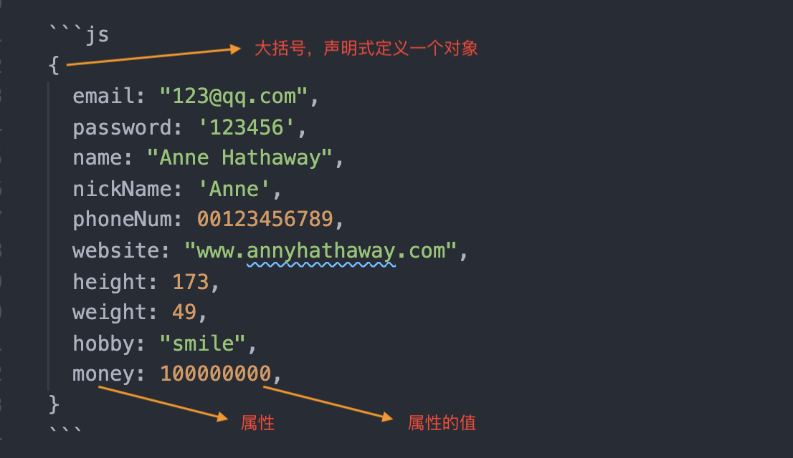
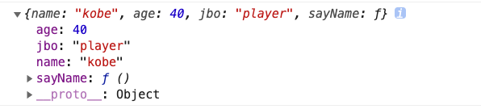
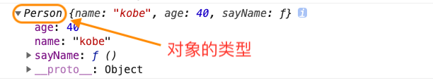

# 一次性搞懂 JS 中的面向对象、继承和 Class(类)

## 1. 什么是对象

> 这个问题很原始，但必须搞清楚。因为，JS 中一切皆对象。

### 1.1 现实中的对象


你想要这样一个对象搞事情：

- 性别：女
- 年龄：18
- 身高：180
- 体重：49.9
- 爱好：打游戏
- 财富：100000000

你打开通微信，看看自己的好友列表，想找找有没有符合自己要求的女生，于是你做了如下事情：

- 查看性别是女生的一共有几个：20
- 排除不适合搞对象的人，如你家亲戚，剩下：10
- 你只想看爱打游戏且身高 180 的，剩下：1
- 再看看剩下的这位女生的年龄：58 岁 💔

伤心的你关了手机，打开了电脑，准备试试做个交友网站，想多认识一些女生。

这是你网站的注册页面：


这就是你的对象。

她有很多属性，昵称、身高、体重、财富、电话号码。

### 1.2 JS 中的对象

醒醒吧少年，该学习了


JS 中，你的对象长成这样。

```js
{
  email: "123@qq.com",
  password: '123456',
  name: "Anne Hathaway",
  nickName: 'Anne',
  phoneNum: 00123456789,
  website: "www.annyhathaway.com",
  height: 173,
  weight: 49,
  hobby: "smile",
  money: 100000000,
}
```



### 1.3 JS 中的对象是什么

ECMA-262 定义：<code style="color: #708090; background-color: #F5F5F5;">对象</code>是一组属性的无序集合。

定义中的关键词有两个：<code style="color: #708090; background-color: #F5F5F5;">属性</code>、<code style="color: #708090; background-color: #F5F5F5;">无序集合</code>。

#### 1.3.1 对象的属性

属性分类：

- 数据属性：包含一个保存数据的位置
- 访问器属性: 不包含数据值，只能用 Object.defineProperty 定义

数据属性有自己的特性，但是这些特性开发者是不能直接访问的。

EAMA 规范用两个中括号把这些特性括起来。

**数据属性的特性：**

- [[Configurable]]: 表示属性是否可通过 delete 删除并重定义，默认为 true
- [[Enumberable]]: 表示是否可以 for-in 循环并返回，默认为 true
- [[Writable]]: 表示是否可以被修改，默认为 true
- [[Value]]: 表示属性的值，，默认为 undefined

```js
// 像其他语言一样，通过构造函数构建一个对象（虽然开发中比较少用到）
let dog = new Object();
dog.category = "dog";
dog.color = "black";
dog.age = 1;
```

上的 dog.category 是指给 dog 对象创建了一个名为 category 的数据属性，意味着 category 的 [[Value]] 特性被设置为 “dog”.

之后，对这个数据的修改都会保存到这个位置。

想修改属性的默认特性，必须使用 Object.defineProperty()方法。

```js
let dog = new Object();
dog.category = "dog";
dog.color = "black";
dog.age = 1;

// 定义 dog对象的 category 特性
Object.defineProperty(dog, "category", {
  // 不可修改
  writeable: false,
  // 值为 ”newDog“
  value: "newDog",
});

console.log(dog.category); // newDog
```

**访问器属性的特性：**

- [[Configurable]]: 表示属性是否可通过 delete 删除并重定义，默认为 true
- [[Enumberable]]: 表示是否可以 for-in 循环并返回，默认为 true
- [[Get]]: 获取函数，默认为 undefined
- [[Set]]: 设置函数，默认为 undefined

```js
let dog = new Object();
dog.category = "dog";
dog.color = "black";
dog.age = 1;

// 给 dog对象添加访问器属性 myCategory
Object.defineProperty(dog, "myCategory", {
  get() {
    return this.category;
  },
  set() {
    this.age = 2;
  },
});

console.log(dog.myCategory); // dog
dog.myCategory = "IamDog";
// set 函数对 age 属性做了修改
console.log(dog.age); // 2
```

#### 1.3.2 无序集合

```js
let obj = {
  1: "I am 1",
  34: "I am 34",
  2: "I am 2",
  “56": "I am 56",
  12: "I am 12",
  0111: "I am 0111",
  20: "I am 20",
  a: "I am a",
  韩: "I am 韩",
  b: "I am b",
};

for (let item in obj) {
  console.log(item + ": " + obj[item]);
}
// 打印结果
// 1: I am 1
// 2: I am 2
// 12: I am 12
// 20: I am 20
// 34: I am 34
// 56: I am 56
// 73: I am 0111
// a: I am a
// 韩: I am 韩
// b: I am b
```

以上结果说明：

- 对象是无序的
- 浏览器遍历对象时会对属性做数据类型转换

### 1.4 对象的属性和常见方法

**先来看看浏览器中的对象：**

```js
// Object 原型对象
console.log(Object);
// 对象实例
console.dir({});
```

### 1.5 为何说“一切皆对象”

JS 中所有的原型对象 String、Number、Boolean、Map、Symbol... 都继承了 Object 原型对象。

```js
console.log(String.__proto__.__proto__.constructor === Object); // true
console.log(Number.__proto__.__proto__.constructor === Object); // true
console.log(Boolean.__proto__.__proto__.constructor === Object); // true
console.log(Map.__proto__.__proto__.constructor === Object); // true

// string 实例的 toString 继承自 String.prototype
console.dir("aaa".toString === String.prototype.toString); // true
```

但是，String、Number、Boolean、Map、Symbol 这些构造函数都定义了自己的 toString。

## 2. 定义一个对象

**声明式：**

```js
let obj = {
  name: "obj",
};
```

**new Object 原型对象：**

```js
let obj = new Object();

obj.name = "obj";
```

## 3. 创建对象

想要批量创建对象怎么办？

总不能每次都复制 + 粘贴吧？

### 3.1 工厂模式

> 像工厂一样，批量生产对象。

```js
function createPerson(name, age) {
  let o = new Object();
  o.name = name;
  o.age = age;

  o.sayName = function () {
    console.log(this.name);
  };

  return o;
}

let person1 = createPerson("kobe", 40);
console.log(person1);
```

_打印结果：_



**优点：**

- 能批量创建对象

**缺点：**

- 无法知道对象的类型（只知道对象实例）

### 3.2 构造函数模式

> 像 Object、Array、Function 都是原生构造函数。

构造函数可以定义对象类型的属性和方法。

```js
function Person(name, age) {
  this.name = name;
  this.age = age;
  this.sayName = function () {
    console.log(this.name);
  };
}

let person1 = new Person("kobe", 40);
let person2 = new Person("kobe", 40);
console.log(person1);
console.log(person1.name === person2.name); // true
// 传入相同参数得到的对象实例的方法不相等
console.log(person1.sayName === person2.sayName); // false
```

_person1:_



**优点：**

- 能批量创建对象，且能看到对象的类型

**缺点：**

- 传入相同参数得到的对象实例的方法不相等

为什么会有这个缺点呢？

因为 new 运算得到的每个实例对象都得到了一个 getName 方法，getName 是个引用类型，两个引用类型各自指向了不同的地址。

_改进一下：_

```js
function Person(name, age) {
  this.name = name;
  this.age = age;
  this.sayName = sayName;
}

function sayName() {
  console.log(this.name);
}

let person1 = new Person("kobe", 40);
let person2 = new Person("kobe", 40);

// 传入相同参数得到的对象实例的方法相等了
console.log(person1.sayName === person2.sayName); // true
```

将 sayName 方法写到构造函数外就行了。

此时，person1 和 person2 的 sayName 都指向了同一个地址。

**新的问题来了！**

我们增加了一个全局变量 sayName 啊。

万万不可取，感觉这样做有点得不偿失。

### 3.3 原型（prototype）模式

> 原型（prototype）是函数特有的属性。

每个函数都有一个 prototype(原型)属性，

它是一个指针，

指向一个对象，

这个对象就是通过构造函数创建的实例对象的原型对象。

实例对象的“\_\_proto\_\_”属性指向这个原型对象。

此时神奇的事情出现了，访问对象时，如果实例本身没有这个属性，会去“\_\_proto\_\_”上找，就找到了构造函数的 prototype(原型)属性上去。

这就是<code style="color: #708090; background-color: #F5F5F5; font-size: 18px;">继承</code>。

_实例对象的原型对象：_

```js
function Person(name, age) {}

Person.prototype.name = "kobe";
Person.prototype.age = 40;
Person.prototype.sayName = function () {
  console.log(this.name);
};

// 此时，obj1 和 obj2 的原型对象都是 Person.prototype
let person1 = new Person();
let person2 = new Person();

// 说明 obj1.getName 和 obj2.getName 指向同一个地址
console.log(person1.sayName === person2.sayName); // true
```

每个属性都写一遍 Person.prototype，太麻烦，优化下。

```js
function Person(name, age) {}

Person.prototype = {
  // 至于这里为什么写 constructor 这个属性，请看上一篇文章【函数】
  constructor: Person,
  name: "kobe",
  age: 40,
  sayName: function () {
    console.log(this.name);
  },
};
```

**优点：**

- 解决了实例对象实例共享构造函数的方法的问题

**缺点：**

- 不能接收参数，只能创建特定的对象

### 3.4 组合使用构造函数模式和原型模式

> 这种方式是 ES6 的 Class 出现之前最常见的自定义构造函数方式。

_组合使用构造函数模式和原型模式：_

```js
function Person(name, age) {
  // 实例属性构造函数里定义
  this.name = name;
  this.age = age;
}

// 实例方法在原型上定义
Person.prototype = {
  // 至于这里为什么写 constructor 这个属性，请看上一篇文章【函数】
  constructor: Person,
  sayName: function () {
    console.log(this.name);
  },
};

let person1 = new Person("kobe", 40);
let person2 = new Person("kobe", 40);
console.log(person1.sayName === person2.sayName); // true
```

**优点：**

- 解决了上面说的所有问题

- **缺点：**

- 属性和原型分开定义，不利于阅读等
- 每次实例化（new Person）都会挂载 prototype 到构造函数上
- 切断了原型链

### 3.5 动态原型模式

> 既然静态挂载 prototype 属性到构造函数（Person）上不合适，那就动态只执行一次挂载吧。

```js
function Person(name, age) {
  // 实例属性构造函数里定义
  this.name = name;
  this.age = age;
  // 判断 Person 上是不是有 sayName
  if (typeof this.sayName != "function") {
    // 只在第一次实例化时执行
    Person.prototype.sayName = function () {
      console.log(this.name);
    };
    // 可以一次挂载所有方法
    Person.prototype.sayAge = function () {
      console.log(this.age);
    };
  }
}

// 不可以再次声明式定义 prototype 属性，重新给 prototype 赋值会切断原型链
// Person.prototype = {
//   constructor: Person,
//   sayName: function () {
//     console.log(1111);
//   },
// };

let person1 = new Person("kobe", 40);
let person2 = new Person("kobe", 40);
// console.dir(person1.say()); // 1111
console.log(person1.sayName === person2.sayName); // true
```

**优点：**

- 构造函数整体性更好
- 性能略好一点

**缺点：**

- 没啥明显缺点

## 4. 继承

> 继承是面向对象语言中的重要组成部分。

很多<code style="color: #708090; background-color: #F5F5F5; font-size: 18px">面向对象</code>（Object-Oriented,简称 OO）语言都支持两种继承：接口继承、实现继承。

- 接口继承：继承方法的签名
- 实现继承：继承实际的方法

ECMAScript 中的函数是没有签名的，所以 JS 没有接口继承。

实现继承是 ECMAScript 中唯一的继承方式，它是通过<code style="color: #708090; background-color: #F5F5F5; font-size: 18px">原型链</code>实现的。

### 4.1 原型链

原型链的思路是：通过原型继承多个引用类型的属性和方法。

**构造函数、原型和对象的关系：**

每个构造函数都有一个原型对象 prototype，原型对象有一个属性（constructor）指回构造函数，而实例有一个内部指针[[Prototype]]指向原型对象。

关键点：<span style="color: #ff0000; font-size: 16px;">对象的指针 [[Prototype]]（浏览器中的 \_\_proto\_\_）函数的原型对象 prototype</span>

具体如何指向请看[JS 的原型链继承图](https://www.processon.com/view/link/5fe31092e0b34d299ffac6b1)

### 4.2 简单的原型链继承

```js
// 父构造函数
function SuperType() {
  this.property = true;
  this.colors = ["black", "white"];
}

SuperType.prototype.getSuperValue = function () {
  return this.property;
};

// 子构造函数

function SubType() {
  this.subProperty = false;
}

// 继承 SuperType
SubType.prototype = new SuperType();

SubType.prototype.getSubValue = function () {
  return this.subProperty;
};

// 实例对象
let obj1 = new SubType();
obj1.colors.push("orange");
let obj2 = new SubType();
console.log(obj2.getSuperValue()); // true
console.log(obj2.colors); // ["black", "white", "orange"]
```

**原型链的问题：**

- 1. 子构造函数原型中继承的父构造函数的引用类型（如：this.colors）会在实例中共享
- 2. 子类型无法给父类型构造函数传参

**结论**

不能单独使用**原型链**解决继承问题。

### 4.3 盗用构造函数继承（经典继承）

在子类构造函数中调用父类构造函数。

```js
// 父构造函数
function SuperType() {
  this.colors = ["black", "white"];
  this.getColors = function () {
    return this.colors;
  };
}

// 子构造函数
function SubType() {
  // 继承 SuperType
  SuperType.call(this);
}

// 实例对象
let obj1 = new SubType();
obj1.colors.push("orange");
obj1.getColors = function () {
  return 111;
};
let obj2 = new SubType();
console.log(obj2.colors); // ["black", "white"]
console.log(obj2.getColors()); //
console.log(obj1.getColors()); //
```

**盗用构造函数解决的问题：**

- 解决了子构造函数实例共享父构造函数引用类型的问题
- 可以在子类构造函数中向父类构造函数传递参数

**缺点：**

- 子类不能访问父类原型上的方法，所以，所有类型只能使用构造函数模式
- 只能在构造函数中添加方法,所有实例都要创建新方法,造成内存性能浪费

**结论**

不能单独使用**盗用构造函数**解决继承问题。

### 4.4 组合继承

既然单独使用<code style="color: #708090; background-color: #F5F5F5; font-size: 18px">原型链</code>和<code style="color: #708090; background-color: #F5F5F5; font-size: 18px">盗用构造函数</code>都无法完成继承，那就把他们组合起来试试。

```js
function SuperType(name) {
  this.name = name;
  this.colors = ["white", "black"];
}
SuperType.prototype.getColors = function () {
  return this.colors;
};

function SubType(name, age) {
  // 继承属性
  SuperType.call(this, name);

  this.age = age;
}

// 继承方法
SubType.prototype = new SuperType();

let obj1 = new SubType("han", 18);
```

**优点：**

- 组合继承使用<code style="color: #708090; background-color: #F5F5F5; font-size: 18px">原型链继承</code>解决函数继承问题，使用<code style="color: #708090; background-color: #F5F5F5; font-size: 18px">盗用构造函数</code>解决引用类型共享问题
- 保留了 instanceof 和 isPrototypeOf() 方法识别合成对象的能力

**缺点：**

- 调用了两遍父类构造函数（继承属性和继承方法各调用了一次）

**结论**

组合继承是 JS 中使用最多的继承模式。

### 4.5 原型式继承

如何不自定义类型也能实现对象间的信息共享？

```js
function object(o) {
  function F() {}
  F.prototype = o;
  return new F();
}
```

这样我们就得到了一个继承了对象 o 的函数。

本质上是 object()对传入的对象 o 进行一次浅复制。

**何时使用原型式继承？**

你有一个对象，想在它的基础上再创建一个新对象。

ES5 新增的 <code style="color: #708090; background-color: #F5F5F5; font-size: 18px">Object.create()</code> 方法做了实现。

### 4.6 寄生式继承

原理：创建一个实现继承的函数，以某种方式增强对象，然后返回。

```js
function createAnother(original) {
  // 创建继承新对象
  let clone = Object.create(original);
  // 增强对象
  clone.sayHi = function () {
    console.log("hi");
  };

  // 返回对象
  return clone;
}

let person = {
  name: "john",
  age: 30,
};

let anotherPerson = createAnother(person);

anotherPerson.sayHi(); // hi
```

**优点：**

- **缺点：**

- **结论**

### 4.7 寄生组合式继承

<code style="color: #708090; background-color: #F5F5F5; font-size: 18px">原型链继承</code>、<code style="color: #708090; background-color: #F5F5F5; font-size: 18px">盗用构造函数继承</code>、<code style="color: #708090; background-color: #F5F5F5; font-size: 18px">寄生式继承</code>都只解决了部分继承问题，把它们组合在一起就能基本完美实现 JS 对象的继承。

```js
// 寄生式-继承
function inheritFunction(SubType, SuperType) {
  // 父类原型
  let prototype = Object.create(SuperType.prototype);

  // 原型链式-继承
  SubType.prototype = prototype;
  SubType.prototype.constructor = SubType;
}

// 父类
function SuperType(name) {
  this.name = name;
  this.age = 30;
}
SuperType.prototype.sayName = function () {
  return this.name;
};

// 子类
function SubType(name) {
  // 盗用构造函数-继承
  SuperType.call(this, name);
}

// 执行继承
inheritFunction(SubType, SuperType);

let obj = new SubType("john");
console.log(obj.sayName());
```

**优点：**

- 效率高：只调用了一次 SuperType,避免了 SuperType 上用不到的属性
- 原型链完整：可以通过 instanceof 操作符 和 isPrototypeOf() 方法校验

**缺点：**

- 优点复杂，使用麻烦

- **结论**

这是 JS 中最完善的继承。

## 5. 继承终结者--class(类)

<code style="color: #708090; background-color: #F5F5F5; font-size: 18px">类（class）</code>是 ES6 中新的基础性语法糖结构。

<span style="color: #ff0000; font-size: 16px;">实际上类的背后仍然使用的是原型和构造函数的概念</span>。

### 5.1 定义类

类的定义和函数一样，有声明式和表达式两种。

类声明：

```js
class Person {}
```

类表达式：

```js
let Person = class {};
```

函数受函数作用域限制，类受块作用域限制。

```js
{
  function FunctionA() {}
  class ClassA {}
}
console.log(FunctionA); // ƒ FunctionA() {}
console.log(ClassA); // Uncaught ReferenceError: ClassA is not defined
```

注意 ⚠️：

类表达式的名称是可选的，不能在类表达式外部访问这个标识符。

```js
let Person = class PersonName {
  identify() {
    console.log(Person.name, PersonName.name); // PersonName PersonName
  }
};

let p = new Person();

p.identify();

console.log(Person.name); // PersonName
console.log(PersonName); // Uncaught ReferenceError: PersonName is not defined
```

### 5.2 类的组成

类由 5 部分组成：

- 构造函数方法
- 实例方法
- 获取函数
- 设置函数
- 静态类方法

### 5.3 类的构造函数

**constructor 关键字用于在类定义块内部创建类的构造函数。**

使用 new 操作符实例化类时，会调用这个函数。

实例化一个类构造函数会执行如下操作：

- 1. 在内存中创建一个新对象
- 2. 在新对象内部的[[Prototype]]指针被赋值为构造函数的 prototype 属性
- 3. this 指向新对象
- 4. 执行构造函数内部代码（给新对象添加属性）
- 5. 如果构造函数内没有返回值就返回刚创建的新对象（this）

注意 ⚠️：

如果构造函数返回的不是 this,则实例无法通过 instanceof 检验。

类就是特殊的函数：

```js
class Person {}

console.log(typeof Person); // function
console.log(Person.prototype); // {constructor: ƒ}
console.log(Person.prototype.constructor === Person); // true
```

### 5.3 类实例、原型和类成员

每个实例都对应一个唯一的成员对象，所有成员不会在原型上共享。

为了实现方法共享，类中定义的方法作为类原型的方法。

类可以手动添加成员，但是别这样用，这是一种反模式。

```js
class Person {
  constructor() {
    this.colors = ["black", "white"];
  }

  getColors() {
    return this.colors;
  }
}

// 别这样用，反模式
Person.age = 30;

console.dir(Person);

let p1 = new Person();
let p2 = new Person();

console.log(p1.colors === p2.colors); // false
console.log(Person.prototype.getColors()); // ƒ getColors() { return this.colors; }
```

### 5.4 类的继承

#### 5.4.1 继承继承

extends 关键字用来继承类。

#### 5.4.2 构造函数、[[HomeObject]] 和 super()

派生类中使用 super() 可以调用父类构造函数。

super() 相当于 super.constructor();

**super 是什么？**

ES6 中类的构造函数和静态方法中定义了一个指针[[HomeObject]]，指向定义该方法的对象。

指针会自动赋值，且只能在 JS 引擎内部访问。

super 是 [[HomeObject]] 的原型。

因此，使用 super 需要注意 ⚠️：

- 1.  super 只能在派生类中使用
- 2.  super 关键字 不能被单独应用
- 3. super 会调用父类的构造函数，并将返回的实例赋值给 this，不能在 super() 之前使用 this
- 4. super 可以给父类构造函数传参
- 5. 派生类中如果显示定义了 constructor 则必须调用 super(),要么在 constructor 中返回一个对象

### 5.9 手动实现一个类

这个类有哪些特征？

- 一个 constructor 函数自动执行
- 可以实现继承，不能有副作用

```js
function MyClass() {
  this.Super = function (arguments) {};
}

let subClass = MyClass(function () {
  // 调用父类的实例，不传的话父类要自己调用
  this.Super(arguments);
});
```

## 参看

[Object](https://developer.mozilla.org/zh-CN/docs/Web/JavaScript/Reference/Global_Objects/Object)

《JavaScript 高级程序设计 4》
