# 训练计划

必须遵守：⚠️

- 1. 安全第一，谨慎大重量，必须有保护措施 ❗️❗️❗️
- 2. 动作标准比重量更重要

## DAY1. 胸部 + 肱三头肌

### 训练组 1: 上斜史密斯卧推

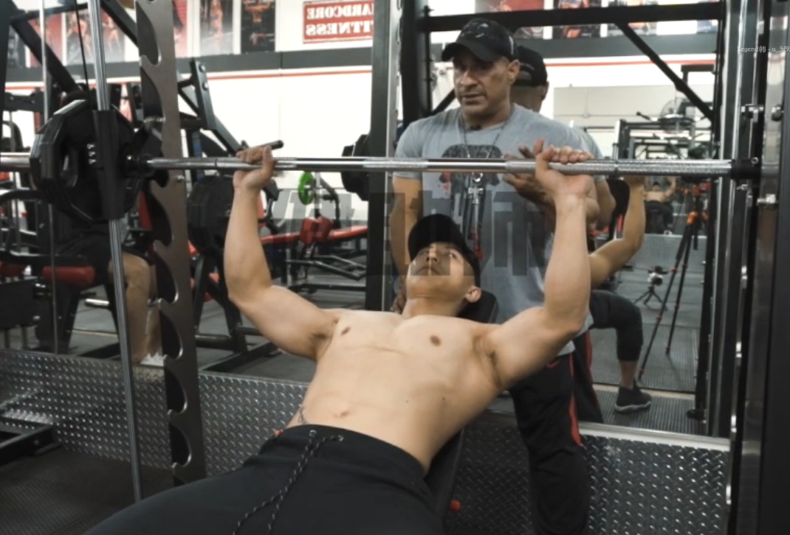

**共 5 组**

- 1-3 组：热身

  - 每组 15-20 次，组间休息 1 分钟
  - 重量选择：完成 20 次力竭为最大重量

- 4-5 组：渐降组

  - 重量选择：完成 7-11 次力竭为最大重量
  - 训练方法：
    - 第 4 组做 3 次，每次**重量减 30%**，每次做完后不休息
    - 做完一组休息 1 分钟
    - 第 5 组重量比第 4 组多 5% - 10%

> 动作要点：挺胸、背反弓、推到顶时略停顿（顶峰收缩）、往上推时快速（爆发力）

### 训练组 2: 平板卧推+飞鸟

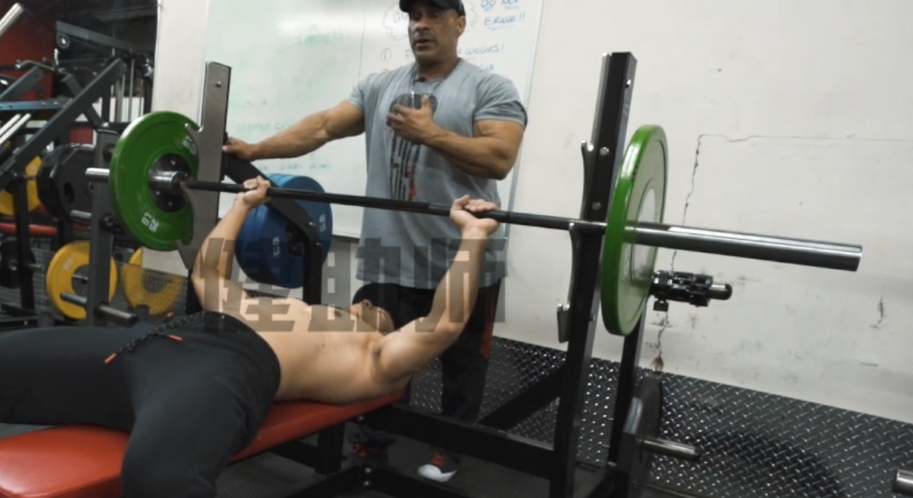

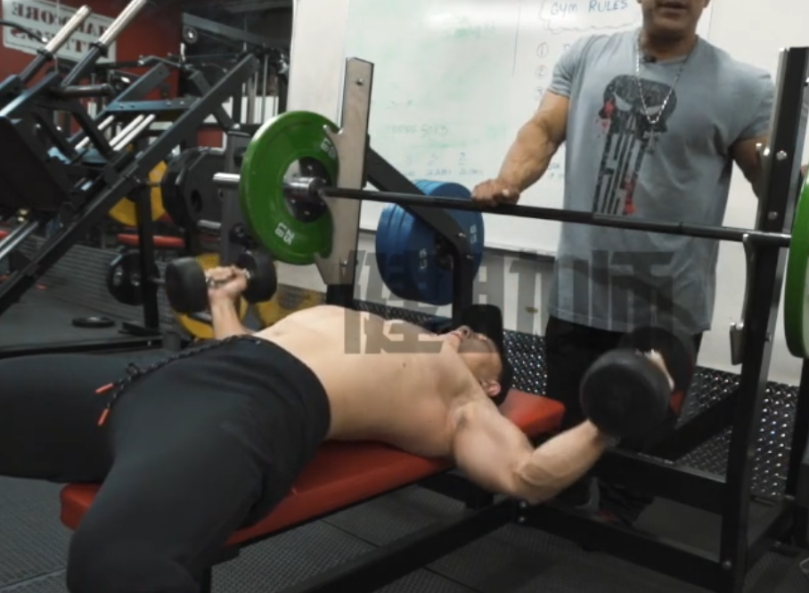

**共 3 组（超级组）**

**平板卧推**和**飞鸟**交替。

- 训练方法：每组间隔休息 1min

- 平板卧推

  - 每组 10-12 次力竭

- 飞鸟
  - 每组 10-12 次力竭

### 训练组 3: 上斜哑铃飞鸟+卧推

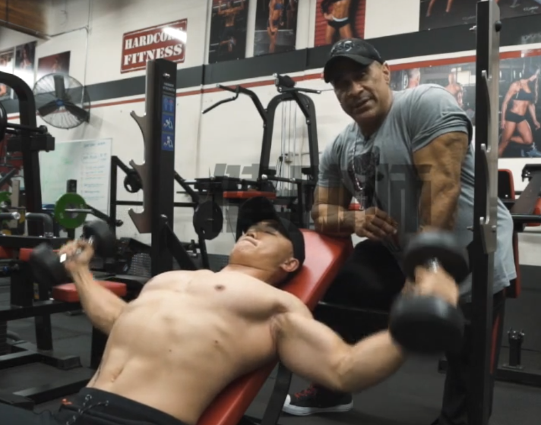
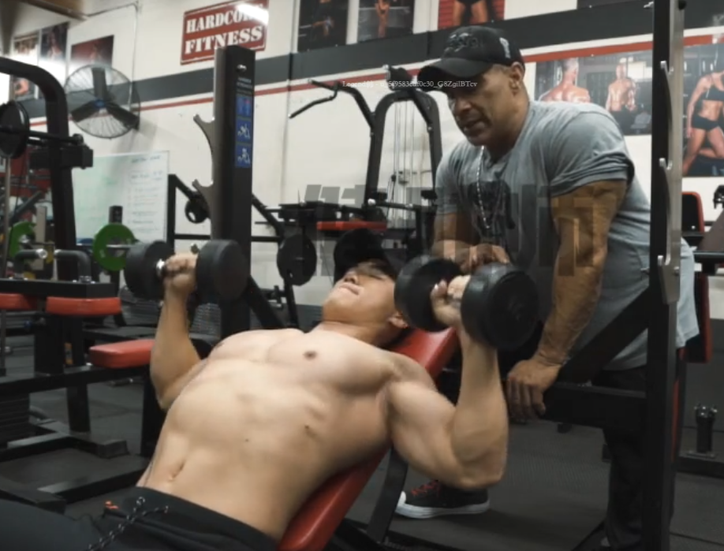

**共 3 组**

每组连续完成 2 个动作；

上斜哑铃飞鸟 10-12 次力竭；

上斜哑铃卧推 7-11 次力竭；

组间休息 1min;

### 训练组 4: 绳索下拉 + 窄距卧推

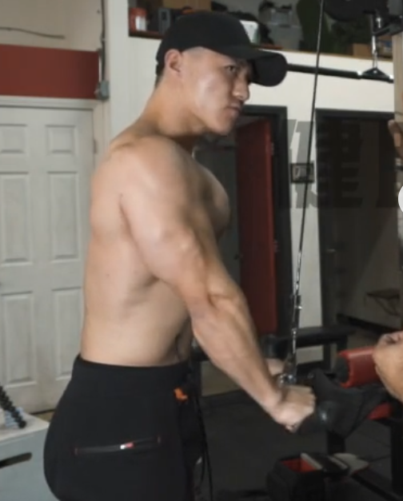

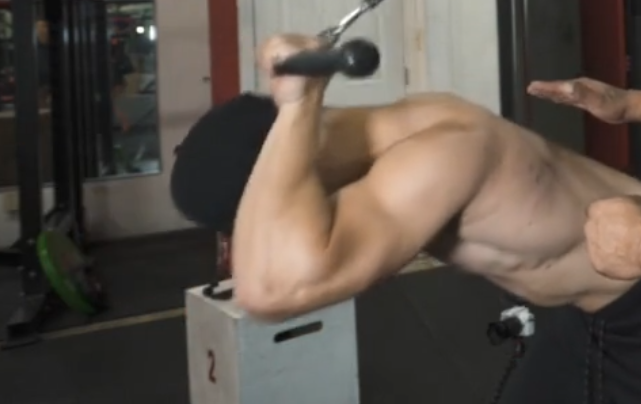

**共三组**

每组 4 个动作，组间休息 1min；

第一个动作：绳索正握下拉

第二个动作：绳索反握下拉

第三个动作：绳索前推

以上每个动作 15 次，力竭；

第四个杠铃窄距卧推，完成 10-15 次力竭；

## DAY2. 背部 + 肱二头肌

### 训练组 1: 高位绳索下拉

3 组 X 15-20/组

> 动作要点：注意手握距离、胳膊肘往里夹

### 训练组 2: 引体向上

3 组 X 15-20/组

> 动作要点：不要晃动身体、胸部不要挺太高

### 训练组 3: 杠铃俯身划船 + 变式绳索划船

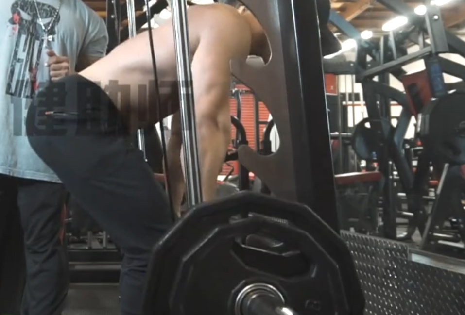

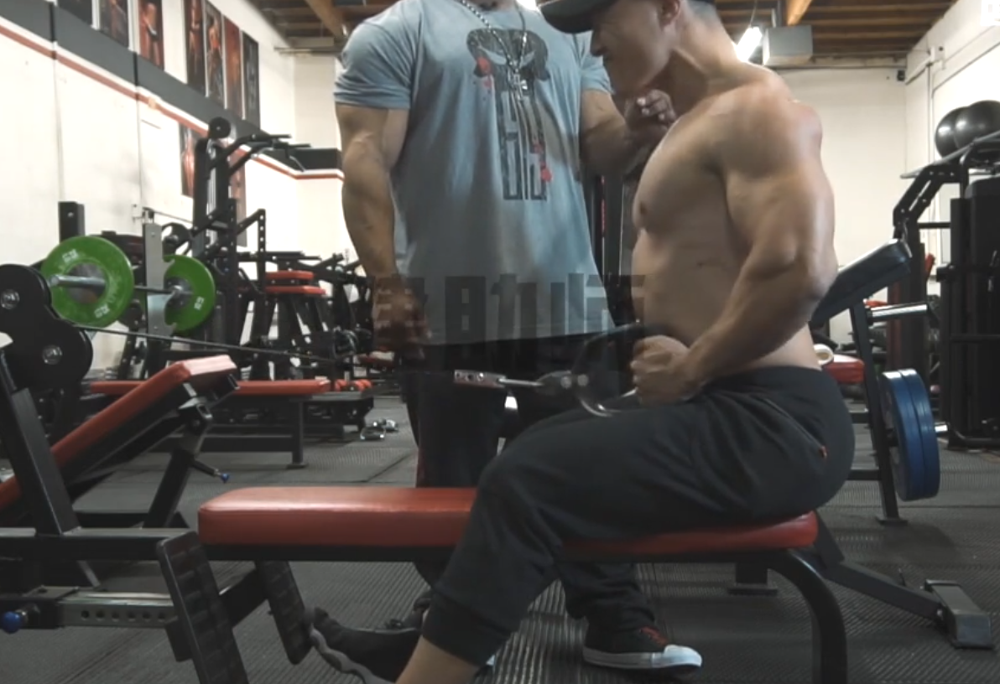

**杠铃俯身划船**：

- 3 组（重量渐降 20% - 30%）

  - 每组 7-11 次
  - 重量选择：完成 10 次力竭为最大重量
  - 组件休息： 1min

> 动作要点：垫高杠铃(否则就是硬拉了)

**变式绳索划船**：

- 3 组

  - 每组 10-15 次
  - 重量选择：完成 12 次力竭为最大重量
  - 组件休息： 1min

> 动作要点：背部挺直、顶峰收缩

### 训练组 4: 单臂哑铃划船

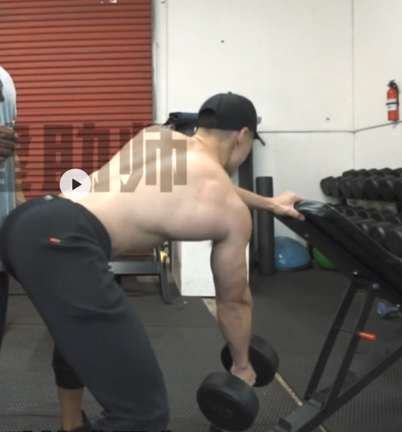

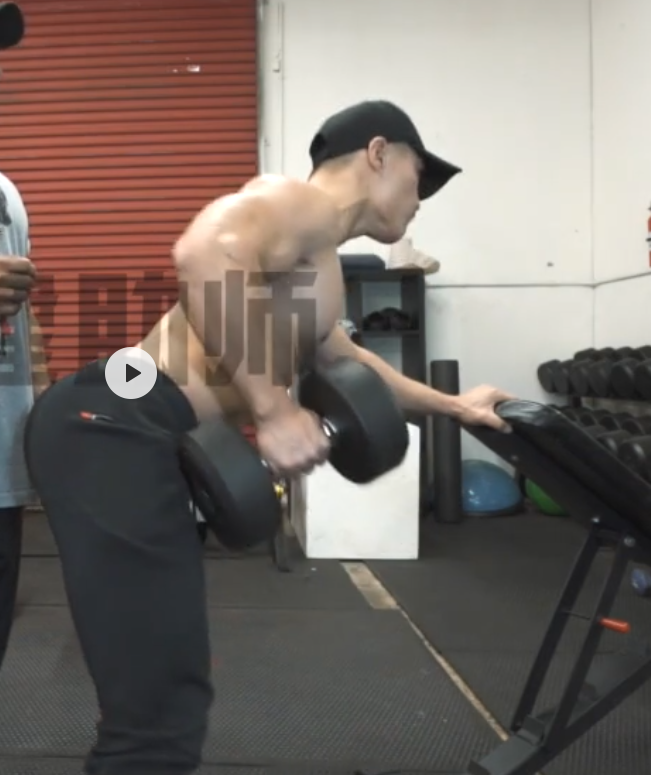

- 3 组

  - 每组 8-10 次 + “欺骗技巧”再完成 5 次，左右手臂连续为一组
  - 重量选择：完成 8-10 次力竭为最大重量
  - 组件休息： 1min

> 动作要点：

### 训练组 5: 变式高位下拉

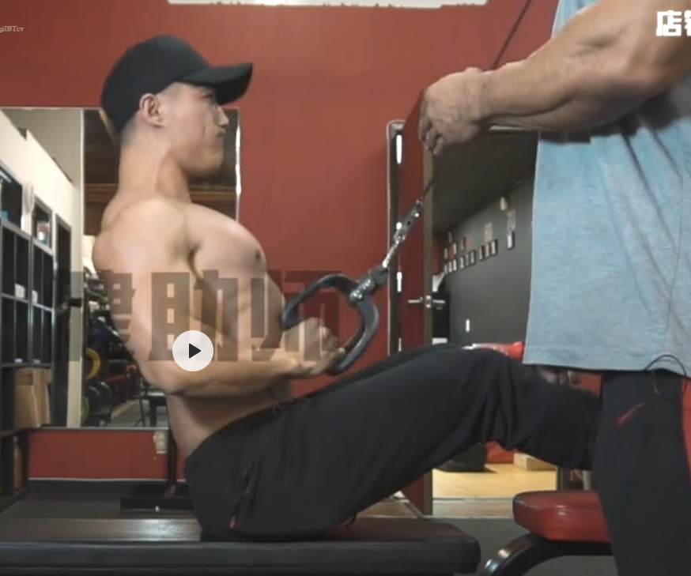

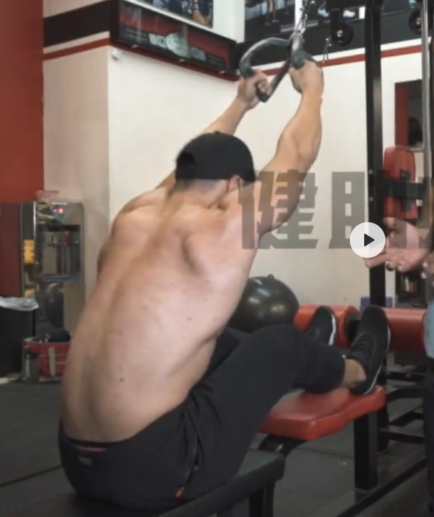

- 4 组

  - 每组 10-15 次
  - 重量选择：完成 10-15 次力竭为最大重量
  - 组件休息： 1min

> 动作要点：挺胸、肩部下沉、手肘于绳索方向一致、全力拉紧收缩背部 3s(顶峰收缩)

### 训练组 6: 肱二头巨人组

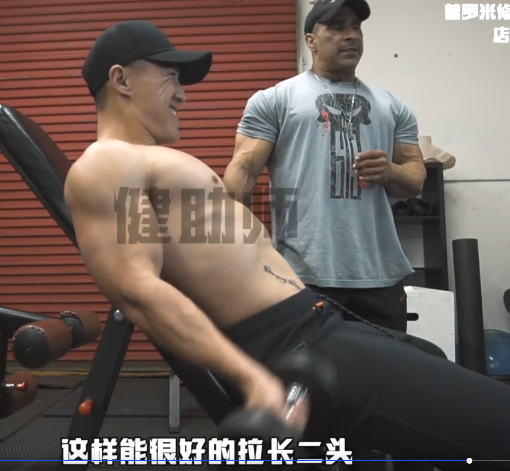

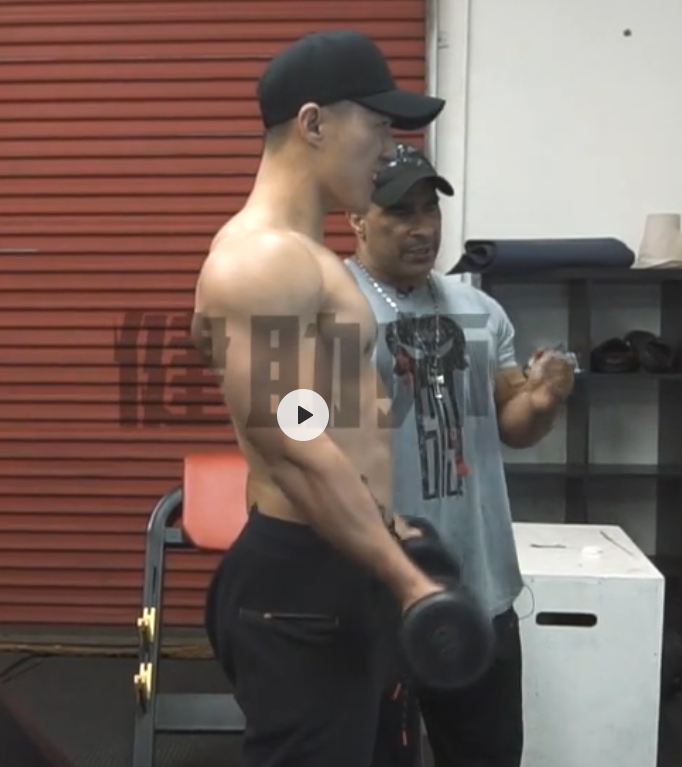

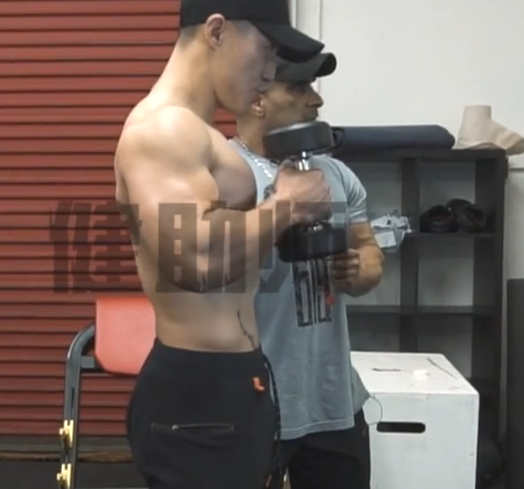

- 3 组

  - 每组 20 次，力竭

**上斜平板臂弯举**：

> 动作要点：小拇指发力、外旋小臂和肱二头肌、手臂伸直下方到身体后侧、最上方时注意顶峰收缩

**站姿臂弯举**：

> 掌心向前、手肘紧贴躯干

**站姿锤式弯举**：

> 胳膊架起来、大臂不要动
