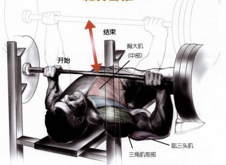
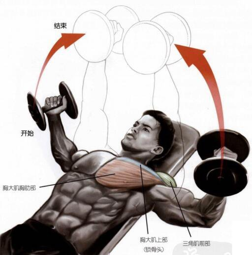

# 训练动作

_人体肌肉图：_

## 1. 史密斯上斜卧推

**锻炼部位**:

- 平板 30-45 度: 训练上胸
- 平板 45-90: 训练肩膀

**动作要领**:

- 核心收紧
- 上背部紧贴座椅，肩部下沉
- 手握宽度
  - 略宽于肩膀：锻炼上胸
- 最高点手臂略微弯曲，以免肘关节损伤

### 参考

[史密斯上斜卧推 | Keep](http://gotokeep.com/exercises/5763d3b011fc5077c3acf559)

## 2. 平板卧推

**锻炼部位**:

- 平躺：训练整个胸大肌
- 平板 30-45 度: 训练上胸
- 手臂约

**动作要领**:

- 核心收紧
- 掌心相对
- 降低座椅斜度，手臂与眼睛平行，可以更好训练大肌上部
- 哑铃降至与胸成水平即可

## 3. 飞鸟

