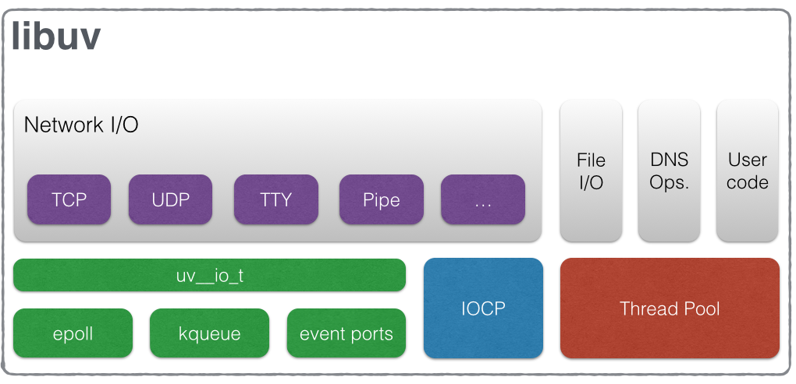

# 深入了解 Node.js

> 说明：
>
> 1. 本文以 Node.js v14.16.0 为参考
> 2. "Node.js"是官方文档的称呼，它也有其他不同的叫法，如：NodeJS/nodeJs，本文使用 Node 代替 Node.js

## 1. Node 起源与 10 年大事件

Ryan Dahl 是一位 C/C++ 程序员，创造 Node 之前他的主要工作是围绕高性能 Web 服务器进行的。经过尝试后他发现高性能 Web 服务器的要点：

- 事件驱动
- 非阻塞 I/O

明确了主要需求，下一步就是找到合适的开发语言.

2008 年，Google 发布了 Chrome 的新一代引擎 -- V8，

而且，JavaScript 在前端已经有很好的事件驱动应用场景，且 JS 的开发门槛也比 C 语言等低一些。

同时，JS 没有相应的服务端历史包袱。

经过 Ryan Dahl 大佬的一通考量，最终，确定了 JavaScript 来作为开发语言。

_Node 10 年大事件：_


## 2. Node 是什么

Node.js 是一个基于 <code style="color: #708090; background-color: #F5F5F5; font-size: 18px">[Google V8 引擎](https://v8.dev/)</code>的<span style="color: #ff0000; font-size: 16px;">JavaScript 运行时</span>。

简单点说就是：**Node.js 利用 V8 引擎提供了一个执行 JavaScript 的环境**。

只不过这个执行环境和浏览器提供的 JavaScript 执行环境不同。

_Chrome 与 Node 的区别：_


_Node 的详细组成：_


**Node 的组成依赖：**

- 核心模块和 C++基础模块（提供接口供我们直接、间接使用）
- V8（C++编写）：JS 引擎，负责 JS 的编译、执行、内存管理、垃圾回收等
- libuv（C 语言编写）：负责处理异步 I/O（包括事件循环、异步 DNS 解析、异步文件操作、异步 TCP、管理异步的线程池等）
- http-parser（C 语言编写）：HTTP 消息解析器
- OpenSSL（C 语言编写）：实现了套接字加密功能（SSL、TLS）
- zlib：资料压缩解压

## 3. Node 如何工作

把 Node 比作一个餐厅，顾客（JS 程序）向服务员点餐（发起任务），服务员（JS 引擎）把下单的菜给到后厨（Chrome API 或 libuv，用于处理异步任务），然后服务员就去服务下一桌顾客了，这种处理了任务请求的过程是<code style="color: #708090; background-color: #F5F5F5; font-size: 18px">异步</code>的。因为服务员（JS 引擎）一直没闲着。

如果服务员把订单给到厨房，然后等厨房做完所有的菜（如：处理数据请求等 IO 操作），在等待期间不去做任何其他事，最后等厨师把菜做出来后把菜端给客户，这个就是<code style="color: #708090; background-color: #F5F5F5; font-size: 18px">同步</code>的。


服务员一直在干活，所以服务员是同步（Node 主线程是单任务且同步）的，有顾客到了就处理他们的点餐，这个过程是很快的（V8 很快），而且要必须很快。如果哪一桌顾客点餐花了一个小时（耗时较多的任务，如：CPU 密集型任务视频解码），服务员一直在处理这一桌顾客，这样会影响整个餐厅的运作（程序运行）。


<span style="color: #ff0000; font-size: 16px;">Node 默认就是这种<code style="color: #708090; background-color: #F5F5F5; font-size: 18px">非阻塞（non-blocking）</code>的 <code style="color: #708090; background-color: #F5F5F5; font-size: 18px">异步架构（Asynchronous Architecture）</code></span>.

### 3.1 Node 系统

_Node 系统各主要模块及工作流程_


这张图解释了官网对 Node 的主要功能描述：

- 1. Node.js 是一个基于 Chrome V8 引擎的 JavaScript 运行环境

  这句话体现在左边那部分，即左侧两列东西。

- 2. Node.js 使用了一个事件驱动、非阻塞式 I/O 的模型，使其轻量又高效

  即右侧的 LIBUV 库。

### 3.2 Node 适用场景

**适用场景：**

- **I/O 密集型（I/O intensive）**: 如 RESTful API 请求

  Node 擅长 I/O 密集型的**优势**主要在于 Node <span style="color: #ff0000; font-size: 16px;">利用事件循环</span>的处理能力。

  Node 面向网络且擅长并行 I/O，不是启动多个线程，为每一个请求服务，<code style="color: #708090; background-color: #F5F5F5; font-size: 18px">资源占用极少</code>。

**不适用场景：**

- **CPU 密集型（I/O intensive）**

  CPU 消耗较大的游戏

  大数据计算

  视频解码

## 4. I / O

I/O（Input/Output），即**输入/输出**，通常指**数据**在**存储器**（内部和外部）或其他周边设备的输入输出，

是信息处理系统（计算机）与外部世界之间的通信。

计算机读写**CPU 缓存**、**内存**、**硬盘**、获取**网络请求**都是 I/O.

I/O 是计算机的基础。

计算机执行我们的代码通常是很快的。

但 **I/O 绝对是计算机基本操作中最慢的**。

_系统的各种延时：_


上图是系统的各种**延时**，不包含脚本执行时间。

如果我们的代码中有挺多同步 I/O，可想而知脚本执行时间可能要以 s（秒）来计算了。

《高性能 JavaScript》一书中曾总结过，超过 100ms，用户就会**感觉卡顿**。

雪上加霜的是，**Js 代码的执行和 UI 渲染引擎共用一个线程**。

所以，

**用户页面显示的时间** > 网络请求时间 + 执行 JS 时间 + 渲染时间。

### 4.1 工作模式

I/O 工作模式有两种：

- 1. **同步**: 调用者会主动等待调用结果

- 2. **异步**: 调用者发起一个异步调用，然后**立即返回**去做别的事；“被调用者”通过状态、通知、回调函数等手段来通知“调用者”。

按照“调用者”线程在等待调用结果时的状态可分为：

- 1. **阻塞**：线程被操作系统挂起，直到执行完任务

- 2. **非阻塞**：线程不被操作系统挂起，可以处理其他事情

以餐厅点菜场景举例说明一下：

你是**服务员**（I/O 线程，调用者），有顾客**点菜**（I/O 操作），你把菜单交给**后厨**（系统内核，被调用者）。

**阻塞**：

你把订单交给后厨之后，然后什么都不干，**等着**后厨做菜

**非阻塞**：

你把订单交给后厨之后，继续去服务其他顾客

**同步**：

后厨收到订单后就开始做菜，做完后就递给你

**异步**：

后厨收到订单后开始做菜，做完后会**喊你**过来拿

所以可以看出，<span style="color: #ff0000; font-size: 16px;">阻塞与非阻塞是相对于你这个服务员（I/O 线程）而言的，同步与异步是相对于后厨（系统内核）而言的</span>。

**阻塞与非阻塞的优缺点：**

---

- 阻塞 -- 你每接到一个请求都要等很长时间，你作为线程，老板要给你开工资（消耗内存），显然你是在**浪费时间**（浪费线程资源）

- 非阻塞 -- 你去服务其他顾客了，但是此时需要**不断地**（轮询）跑过去问后厨有没有把你的订单做好，这样就会**很忙碌**

显然，<span style="color: #ff0000; font-size: 16px;">最完美的方案就是异步非阻塞</span>。

可惜的是，目前所有的操作系统都没有完成这么个方案 🤷‍♂️ 。

[类 Unix 操作系统与 POSIX：](https://zh.wikipedia.org/wiki/%E7%95%B0%E6%AD%A5I/O#%E7%B1%BBUnix%E6%93%8D%E4%BD%9C%E7%B3%BB%E7%BB%9F%E4%B8%8EPOSIX)


**aio** 是什么？它不就实现了**异步非阻塞**吗？

不好意思，它实现的**异步非阻塞**只支持内核 I/O。

Windows 系统同样也没有提供**异步非阻塞**的 I/O。

## 5. Reactor 与 Proactor

处理 web 请求通常有两种体系结构，分别为：

- thread-based architecture（基于线程的架构）

  每来一个请求就开一个线程（PHP）

- event-driven architecture（事件驱动模型）

  每来一个请求，添加一个事件回调（Node）

**事件驱动模型：**

- 1. Reactor 模式

  Reactor 模式是一种被动的处理，即有事件发生时被动处理；

  Reactor 实现相对简单，对于链接多，但耗时短的处理场景高效。

- 2. Proactor 模式

  Proactor 实现逻辑复杂；实现优秀的如 windows IOCP，可惜 \*nix 没有实现。

  适用于异步接收和同时处理多个服务请求的事件驱动程序的场景。

更多关于 Reactor 与 Proactor 的介绍请看下方参考链接 3.

<span style="color: #ff0000; font-size: 16px;">Node 使用的 I/O 模型就是 Reactor</span>。

## 6. Node 的异步 I/O -- Event Loop🌟

<span style="color: #ff0000; font-size: 16px;">Node 的异步 I/O 模型也叫做 -- 事件循环</span>。

_Node 的 Reactor pattern(模型)：_


**过程分析：**

- 1. 应用程序向 **Event Demultiplexer**（事件多路分解器）提交请求来生成新的 I/O 操作。

  同时，应用程序还指定了一个处理程序，当操作完成时将调用该处理程序。

  向 **Event Demultiplexer**（事件多路分解器）提交请求是一种**非阻塞调用**，它立即将控制权返回给应用程序，所以应用程序的执行是同步的。

- 2. <span style="color: #ff0000; font-size: 16px;">当一组 I/O 操作完成时</span>，事件多路分解器将新的事件推入 Event Queue(事件队列)。

- 3. 此时，**Event Loop**（事件循环） 遍历 **Event Queue**（事件队列）中的事件项目

- 4. **Event Loop**（事件循环）调用和当前事件项目关联的**处理程序**（回调函数）

- 5. 执行**处理程序**时，如果有新的 I/O，则执行 5b,会导致一个新的 I/O 循环；如果没有新的 I/O，则会把控制权返回给 **Event Loop**

- 6. 重复执行 3、4、5 步骤，直到**Event Loop**中所有项目都被处理完成时，循环将再次阻塞 **Event Demultiplexer**，直到**Event Demultiplexer**有新的事件添加到 **Event Queue** 会再次触发 **Event Loop**

### 6.1 Event Demultiplexer（事件多路分解器）

<span style="color: #ff0000; font-size: 16px;">Event Demultiplexer（事件多路分解器）处理具体的 I/O 操作</span>，如 <code style="color: #708090; background-color: #F5F5F5; font-size: 18px">File System</code>、<code style="color: #708090; background-color: #F5F5F5; font-size: 18px">DataBase</code>、<code style="color: #708090; background-color: #F5F5F5; font-size: 18px">Computation</code> 等。

Event Demultiplexer 是 libuv 的一部分。

Event Demultiplexer 有一个线程池来处理任务，线程池里有 K 个线程，由 Node 内核来确定。

这个线程池是在启动 Node 时启动的。

线程池里的每个线程可以处理多个 I/O 任务，这是 Node 占用资源少的主要原因之一。

Node 一共有**两种线程**：🌟🌟🌟

- 一个**Event Loop**（事件循环）线程（也叫主线程，主循环，事件线程等），启动 Node 就是启动了一个**Event Loop**（事件循环）线程
- 另一种是工作线程，有 K 个（它们组成工作线程池）

必须知道的是，<span style="color: #ff0000; font-size: 16px;">Node 是单线程是指主线程，但是 libuv 可是多线程的</span>。

### 6.2 Event Loop (事件循环)

Event Loop 是 Node 的关键组成部分。十分关键的那种！

因为，<span style="color: #ff0000; font-size: 16px;">**Event Loop**（事件循环）就是 Node 处理非阻塞 I/O 操作的机制</span>。

**Event Loop**（事件循环）也是在 Node 启动后初始化的。

#### 6.2.1 Event Loop（事件循环）简化概览

_事件循环概览图：_


_事件循环的七个阶段：_


**说明：**

- 宏任务回调函数的同步调用被称为一个 Tick（记号），如：（setTimeout、I/O 的回调函数的同步执行）
- 每个浅黄色框是**Event Loop**（事件循环）机制的一个阶段
- 每个阶段都有一个 FIFO（先入先出）的队列来执行回调
- 当**Event Loop**（事件循环）进入给定的阶段时，它将执行特定于该阶段的任何操作，然后执行该阶段队列中的回调，直到队列用尽或最大回调数已执行
- 当该队列已用尽或达到回调限制，**Event Loop**（事件循环）将移动到下一阶段

**阶段介绍：**

- timers(定时器)：本阶段执行已经被 setTimeout() 和 setInterval() 的调度回调函数。
- 待定回调：执行一些系统操作的回调，比如 TCP 错误
- idle, prepare：仅系统内部使用
- poll(轮询)：

  <span style="color: #ff0000; font-size: 16px;">获取新的 I/O 事件</span>;

  <span style="color: #ff0000; font-size: 16px;">执行与 I/O 相关的回调</span>（几乎所有的 I/O 回调，如：操作读取文件等等。除了关闭的回调函数、计时器和 setImmediate() 回调），<span style="color: #ff0000; font-size: 16px;">Node 将在适当的时候在此阻塞</span>。

- 检测：setImmediate() 回调函数在这里执行
- 关闭的回调函数：一些关闭的回调函数，如：socket.on('close', ...)。

#### 6.2.2 Event Loop 可视化执行过程

_事件循环执行可视化：_


#### 6.2.3 MacroTask(宏任务) 与 MicroTask（微任务）

_Node 整体工作流程：_


**说明：**

- Stack 是主线程调用栈，函数同步执行
- Node 遇到宏任务，会交给 Libuv 中的线程池（Background Threads）来执行它们，将执行完成后的回调放入 Task Queue
- Node 遇到微任务，会直接放入 Microtask Queue
- 当 Stack 中的函数执行完之后，开始运行**事件循环** 中的 MicroTask Queue，<span style="color: #ff0000; font-size: 16px;">一直执行到 MicroTask Queue 清空为止，如果在执行 MicroTask Queue 中有新的 微任务产生，直接插入到 MicroTask Queue 后面</span>
- 清空 MicroTask Queue 后开始执行 Task Queue 中的回调

_Event Loop 具体处理过程：_


_微任务与 Event Loop 的关系：_


**详细说明：**

1. <code style="color: #708090; background-color: #F5F5F5; font-size: 18px">Node</code>中一共有两个微任务，<span style="color: #ff0000; font-size: 16px;">**微任务**不属于 Event Loop 任何阶段</span>：

- process.nextTick()
- Promises

⚠️ 注意：process.nextTick() 的优先级比 Promises 高。

_示例_

```js
setTimeout(() => {
  console.log("timeout1");
  Promise.resolve(1).then(() => {
    console.log("Promise1");
  });
  process.nextTick(() => {
    console.log("nextTick1");
  });
});

setTimeout(() => {
  console.log("timeout2");
  Promise.resolve(1).then(() => {
    console.log("Promise2");
  });
});
// timeout1
// nextTick1
// Promise1
// timeout2
// Promise2

// nextTick1 早于 Promise1 打印出来，说明 nextTick 优先级更高。
```

2. 我们可见的**宏任务**有 4 个：

- setTimeout()、setInterval()
- any I/O operation
- setImmediate()
- close Handlers

3. 图中紫色的循环就是 **Event Loop**，任何阶段的宏任务执行完后都会先去执行**微任务队列**。

#### 6.2.4 Event Loop 过程中的方法对比

**setImmediate() VS setTimeout():**

setImmediate() 是 Node 特有的方法，浏览器中没有。

它是一个在**Event Loop**（事件循环）的单独阶段运行的特殊计时器。

它使用一个 libuv API 来安排回调**在 Event Loop 的 轮询（poll） 阶段完成后执行**。

如下：

```js
// timeout_vs_immediate.js
const fs = require("fs");

fs.readFile(__filename, () => {
  setTimeout(() => {
    console.log("timeout");
  }, 0);
  setImmediate(() => {
    console.log("immediate");
  });
});

// => immediate, timeout
```

在一个**Event Loop**（事件循环）中，setImmediate()永远比 setTimeout()先执行。

需要注意 ⚠️ 的是，如果是在主函数中，二者的执行顺序是**不确定的**。

如下，二者顺序无法确定。

```js
setTimeout(() => {
  console.log("timeout");
}, 0);

setImmediate(() => {
  console.log("immediate");
});
```

**process.nextTick() VS setImmediate() :**

process.nextTick() 从技术上讲不是**Event Loop**（事件循环）的一部分。

nextTick()会把回调放入队列中，再下一个 Tick 时取出执行，所以，nextTick()回调在一个 Tick 中早于其他任务执行。

这是因为 nextTick() 属于 **idle 观察者**，setImmediate()属于 **check 观察者**。

在每一个轮询检查中，idle 观察者先于 I/O 观察者，I/O 观察者先于 check 观察者。

具体实现上，process.nextTick() 的回调保存在一个**数组**中，setImmediate()的结果保存在**链表**中。

process.nextTick()在每一轮循环中，将回调函数全部执行，而 setImmediate()在每轮中执行链表中的一个回调。

```js
process.nextTick(function () {
  console.log("nextTick 回调1");
});
process.nextTick(function () {
  console.log("nextTick 回调2");
});

setImmediate(function () {
  console.log("setImmediate 回调1");
  process.nextTick(function () {
    console.log("强势插入");
  });
});

setImmediate(function () {
  console.log("setImmediate 回调2");
});

console.log("同步执行");

// 同步执行
// nextTick 回调1
// nextTick 回调2
// setImmediate 回调1
// 强势插入 （因为一个Tick只执行一个 setImmediate）
// setImmediate 回调2
```

#### 6.2.5 nextTick 的问题

process.nextTick() 有一个很大的问题，它会发生“饿死” I/O 的潜在风险：

```js
fs.readFile("file.path", (err, file) => {});

const loopTick = () => {
  process.nextTick(loopTick);
};
```

这段代码将会一直停留在 nextTick 阶段，无法进入到 fs.readFile 的回调中，这就是所谓的 I/O starving。

要解决这个问题，使用 setImmediate 替代，因为 setImmediate 属于事件循环，就算不停地循环，也不会阻塞整个事件循环机制。

_Node 官网 Blog 中有这么一句话_

> 我们建议开发人员在所有情况下都使用 setImmediate()，因为它更容易理解。

#### 6.2.6 经典案例分析

_示例分析：_

```js
console.log("script start");

const interval = setInterval(() => {
  console.log("setInterval");
}, 0);

setTimeout(() => {
  console.log("setTimeout 1");

  Promise.resolve()
    .then(() => console.log("promise 3"))
    .then(() => console.log("promise 4"))
    .then(() => {
      setTimeout(() => {
        console.log("setTimeout 2");
        Promise.resolve()
          .then(() => console.log("promise 5"))
          .then(() => console.log("promise 6"))
          .then(() => clearInterval(interval));
      }, 0);
    });
}, 0);

Promise.resolve()
  .then(() => console.log("promise 1"))
  .then(() => console.log("promise 2"));
```

- 1. Tick1:

  - 执行 console.log("script start")，输出 => "script start";
  - Task Queue:【setInterval，setTimeout】；
  - Microtask Queue: 【() => console.log("promise 1")，() => console.log("promise 2")】；
  - 当 Stack 执行完成后，开始执行 Microtask Queue 中的回调
    输出 => "promise1"， "promise2"

  > Task Queue:【setInterval，setTimeout】；

- 2. Tick2:

  - Microtask Queue 为空
  - 执行 Task Queue 中的 setInterval，输出 => setInterval
  - 在 setTimeout 1 之后调度另一个 setInterval

  > Task Queue:【setTimeout，setInterval】；

- Tick3:

  - Microtask Queue 为空
  - 执行 Task Queue 中的 setTimeout
    - 输出“setTimeout1”
    - "Promise 3" 和 "Promise 4" 添加到 Microtask Queue
    - 执行 Microtask Queue 中的 "Promise 3" 和 "Promise 4"
      - 输出 => "Promise 3" 和 "Promise 4"
      - setTimeout2 添加到 Task Queue

  > Task Queue:【setInterval, setTimeout2】；

- Tick4:

  - Microtask Queue 为空
  - 执行 Task Queue 中的 setInterval
    - 输出 => “setInterval”
  - 添加新的 setInterval 到 Macrotask

  > Macrotask Queue: [setTimeout 2, setInterval]

- Tick5:

  - Microtask Queue 为空
  - 执行 setTimeout 2

    - 输出 “setTimeout 2”
    - Microtask Queue: ["promise 5", "promise 6", clearInterval()]

      执行 **Microtask Queue** 中的任务：

      - 输出 => "promise 5"
      - 输出 => "promise 6"
      - clearInterval(interval)，取消 Macrotask Queue 中的 setInterval

  > Macrotask Queue: []

_最终结果：_

```js
// script start
// promise 1
// promise 2
// setInterval
// setTimeout 1
// promise 3
// promise 4
// setInterval
// setTimeout 2
// promise 5
// promise 6
```

## 7. libuv

<code style="color: #708090; background-color: #F5F5F5; font-size: 18px">[libuv](http://docs.libuv.org/en/v1.x/)</code> 是 Node 的核心。

官方文档定义： **libuv 是一个专注于异步 I / O 的多平台支持库**。

uv 是什么意思？uv 是 Unicorn Velociraptor 的缩写，意思是“独角伶盗龙”，它是 libuv 的图标。

_独角伶盗龙：_


如果熟悉 C 语言的化可以看看[libuv 源码](https://github.com/libuv/libuv)。

每个操作系统都有自己的**Event Demultiplexer**（事件多路分解器）接口，🌟🌟🌟

- Linux -- epoll
- MacOS -- kqueue
- Windows -- IOCP

<span style="color: #ff0000; font-size: 16px;">为了解决跨平台的问题，Node.js 官方团队提供了一个名为 libuv 的 C 库</span>。

使 Node.js 与所有主要平台兼容，并规范不同类型资源的非阻塞行为。

**libuv 不止提供了这样的底层抽象，还实现了 Reactor 模型，因此提供了一些列的 API，用于创建事件循环，管理事件队列，运行异步 I/O.**

_libuv 组成：_



**组成说明：**

- 基于 epoll、kqueue、IOCP、event ports 实现的全能<code style="color: #708090; background-color: #F5F5F5; font-size: 18px">事件循环</code>
- 异步 TCP 和 UDP 套接字
- 异步 DNS 解析
- 异步文件和文件系统操作
- 文件系统事件
- ANSI 转义序列控制的 TTY
- IPC 经由套接字共享，使用 Unix 域套接字或命名管道（Windows）
- 子进程
- 线程池（多线程处理 I/O 操作回调）
- 信号处理
- 高清晰度时钟
- 线程和同步原语（primitive）

可以说 libuv 是和 V8 同样重要的 Node 核心。

更多 libuv 的内容可以看参考链接 4.

## 8. Node 的全局变量（global）

**全局变量有：**

- Buffer 类
- console
- process
- global（相当于浏览器的 window）

- setImmediate()
- setInterval()
- setTimeout()
- clearImmediate()
- clearInterval()
- clearTimeout()

V8 新增：

- WebAssembly

V10 新增：

- URL
- URLSearchParams

V11 新增：

- TextDecoder
- TextEncoder
- queueMicrotask(callback)

## 9. 模块系统（CommonJS）

[CommonJS 模块](http://nodejs.cn/api/modules.html)

<span style="color: #ff0000; font-size: 16px;">在 Node.js 模块系统中，每个文件都被视为一个独立的模块</span>。

### 9.1 缓存

<span style="color: #ff0000; font-size: 16px;">模块在第一次加载后会被缓存</span>。

多次调用 require(foo) 不会导致模块的代码被执行多次。

如果想要多次执行一个模块，可以**导出一个函数**，然后调用该函数。

模块是基于其解析的**路径**进行缓存的，所以只要文件或文件夹名称不同，就会多次重新加载，即使他们是同一个文件。

- 不同的文件名（比如从 node_modules 目录加载）不能保证 require('foo') 总能返回完全相同的对象
- ./Foo 和 ./foo 属于不同的文件夹

### 9.2 模块加载过程

Node 中引入模块主要过程：

- 1. 路径分析
- 2. 文件定位
- 3. 编译执行

#### 9.2.1 路径分析

**加载文件模块：**

- '/': 绝对路径加载模块
- './': 当前模块查找模块
- '../': 到上一个目录查找

找不到时会抛 code 属性为 'MODULE_NOT_FOUND' 的 Error。

**加载 node_modules 目录模块：**

如果传递给 require() 的模块标识符不是一个核心模块，也没有以 '/' 、 '../' 或 './' 开头。

Node.js 会从当前模块的父目录开始，尝试从它的 /node_modules 目录里加载模块。

如果还是没有找到，则移动到再**上一层父目录**，直到文件系统的根目录。

#### 9.2.2 文件定位

从缓存加载时，无需路径分析、文件定位和编译执行。

文件定位主要有两个过程：

- 文件扩展名分析

  Node 会按照 .js、.json、.node 的次序补足扩展名，**依次尝试**。

- 目录分析和包

  Node 分析标识符时可能得到一个目录（如：require('./user')或引入一个包 require("axios")）.

  此时，Node 会查看目录的 package.json 文件中的 **main**属性指定的文件；

  如果没有 package.json 会依次查找目录下的 index.js、index.json、index.node。

#### 9.2.3 编译执行

定位到具体文件后，Node 会新建一个模块对象，然后根据路径载入并编译。

不同扩展名，载入方法不同：

- .js : fs 模块同步读取并编译
- .node : 这是 c/c++ 编写的扩展文件，通过 dlopen()方法载入并编译
- .json : fs 模块同步读取，然后 JSON.parse()解析返回结果

<span style="color: #ff0000; font-size: 16px;">每一个编译成功的文件模块都会将其路径作为索引，缓存在 Module.\_catch 对象上</span>。

**JS 的编译过程：**

Node 对获取的 JavaScript 文件内容进行了**包装**。

编译就是用下面的函数包裹住 JavaScript 代码：

```js
(function (exports, require, module, __filename, __dirname) {
  // 模块中的JS代码,如
  var _ = require("lodash");
  exports.flat = _.flat;
});
```

_这样做的目的：_

- 作用域隔离：保持了顶层的变量（用 var、 const 或 let 定义）作用在模块范围内，而不是全局对象
- 有助于提供一些看似全局的但实际上是**模块特定的变量**，如：
  module 、 exports 、 \_\_filename 、 \_\_dirname: 模块绝对文件名和目录路径

经过原生方法处理后，<span style="color: #ff0000; font-size: 16px;">module.exports 属性被返回给了调用方</span>。

这个过程就是 Node 对 CommonJS 模块规范的实现。

**C/C++ 的编译过程：**

- Node 调用 process.dlopen()方法进行加载和执行。

- dlopen()方法在 Windows 和 \*nix 平台下分别有不同的实现，**通过 libuv 兼容层进行了封装**。

- C/C++模块（.node 模块）其实不需要编译，只需要执行即可，执行过程中, module.exports 对象与 .node 模块产生联系，最后返回给调用者。

**JSON 文件的编译过程：**

- Node 利用 fs 模块同步读取 JSON 文件，调用 JSON.parse()解析文件，然后把它赋值, module.exports,供外部调用。

### 9.3 模块作用域

模块封装导致每个模块都有一个作用域。

**作用域中的变量：**

- \_\_filename： 当前文件的文件名

```js
console.log(__filename);
// 打印: /Users/mjr/example.js
console.log(__dirname);
// 打印: /Users/mjr
```

- \_\_dirname : 当前模块目录名，相当于 \_\_filename 的 path.dirname()。

```js
console.log(__dirname);
// 打印: /Users/mjr
console.log(path.dirname(__filename));
// 打印: /Users/mjr
```

- module: 对当前模块的引用。

  module.exports: 用于指定一个模块所导出的内容，**即可以通过 require() 访问的内容**。
  module.children: 被该模块引用的模块对象

- require(id)： 用于引入模块、 JSON、或本地文件

  require.cache： 被引入的模块会缓存到这个对象中。谨慎使用！
  require.main: 表示当 Node.js 进程启动时加载的入口脚本的 Module 对象

- exports: 对 module.exports 的一个引用，**模块执行之前赋值给 module.exports**。

  module.exports.f = ... 可以更简洁地写成 exports.f = ...。

### 9.4 核心模块与文件模块

Node.js 有些<code style="color: #708090; background-color: #F5F5F5; font-size: 18px">核心模块</code>会被编译成<code style="color: #708090; background-color: #F5F5F5; font-size: 18px">二进制</code>。

**JavaScript 核心模块**定义在 Node.js 源代码的 lib/ 目录下;

**C/C++ 核心模块**定义在 Node.js 源代码的 src/ 目录下。

require() 总是会优先加载核心模块。

例如， require('http') 始终返回内置的 HTTP 模块，即使有同名文件。

**文件模块**是指我们编写的模块，包括 npm 安装的 node_modules 中的模块。

#### 9.4.1 JavaScript 核心模块的编译过程

**在编译 C/C++文件之前，编译程序会先将所有 JavaScript 模块文件编译为 C/C++代码**。

JavaScript 核心模块也要经历包装过程。

与文件模块有区别的地方在于：<span style="color: #ff0000; font-size: 16px;">获取源代码的方式（核型模块是从内存中加载的）以及缓存执行结果的位置</span>。

与**文件模块缓存到 Module.\_cache 对象**上有所不同，编译成功的**核心模块缓存到 NativeModule.\_cache 对象**上。

#### 9.4.2 C/C++ 核心模块的编译过程

**C/C++ 模块主内完成核心，JavaScript 主外实现封装**的模式是 Node 能够提高性能的常见方式。

Node 的 <code style="color: #708090; background-color: #F5F5F5; font-size: 18px">buffer、</code><code style="color: #708090; background-color: #F5F5F5; font-size: 18px">crypto、</code><code style="color: #708090; background-color: #F5F5F5; font-size: 18px">evals、</code><code style="color: #708090; background-color: #F5F5F5; font-size: 18px">fs、</code><code style="color: #708090; background-color: #F5F5F5; font-size: 18px">os</code> 等模块都是部分通过 C/C++编写的。

C/C++ 编写的的部分统一称为 <span style="color: #ff0000; font-size: 16px;">内建模块</span>。

_Node 模块的依赖关系：_


一般情况下，**文件模块**可能依赖**核心模块**，**核心模块**会依赖**内建模块**。

**内建模块是如何将内部变量或方法导出，以供外部 JavaScript 核心模块调用的呢 ❓**

- Node 启动时，会生成全局变量 process,并提供 Binding() 方法类协助加载内建模块
- 加载内建模块时，先创建一个 exports 对象，然后调用 get_builtin_module() 方法取出内建加载模块对象，通过执行 register_func()方法填充 exports 对象
- 最后将 exports 对象按模块名缓存，并返回给调用方

#### 9.4.2 核心模块的引入流程

如何让 C/C++ 模块符合 CommonJS 模块规范 ❓

整个过程相当复杂，以 **os** 核心模块为例,

_os 模块从 C/C++ 到 JavaScript 过程：_


### 9.5 C/C++扩展模块

作为一名前端开发者，曾经的一名工科大学生，在大一时学过一学期的 C 语言，然后就没有使用过了（当然，学的时候好像就没用过）😅 。

C/C++ 扩展模块会在**出现性能瓶颈时对我们有很大帮助**。

.node 文件的生成和平台有关，\*nix 平台和 windows 平台下，需要经过不同的编译过程将 C/C++文件编译成 .node 文件，然后会被 Node 处理成 JavaScript 文件。

### 9.6 模块之间的调用关系

_模块间的调用关系图：_


说明：

- 是红色虚线是文件模块使用 process.binding() 方法直接调用 C/C++内建模块，不推荐
- 第三方编写的 C/C++ 扩展模块，为了提高性能，一般只由 JavaScript 文件模块调用

## 10. NPM

> 无论写不写 Node 项目，NPM 都已经是前端必备的工具了。

项目中由各种安装包（package），如 Vue、React、Webpack、Lodash 等。

包里面也有各自需要依赖的包。

<span style="color: #ff0000; font-size: 16px;">包和 NPM 是将模块联系起来的一种机制</span>。

## Node 资源分享

汇集了很多 Node.js 优秀资源 -- [awesome-nodejs](https://github.com/sindresorhus/awesome-nodejs)

Node.js 中文社区 -- [CNode 社区](https://cnodejs.org/)

## 参考

《深入浅出 Node.js》

《Node.js 设计模式 第二版》

C 大神可以仔细去研究 -- [libuv 官网](http://docs.libuv.org/en/v1.x/)

官网文章，讨论如何处理线程，非常推荐 -- [不要阻塞你的事件循环（或是工作线程池）](https://nodejs.org/zh-cn/docs/guides/dont-block-the-event-loop/)

官网文章，更容易理解阻塞与线程 -- [阻塞对比非阻塞一览](https://nodejs.org/zh-cn/docs/guides/blocking-vs-non-blocking/)

官网文章，思路清晰，有必要读 -- [一次 HTTP 传输解析](https://nodejs.org/zh-cn/docs/guides/anatomy-of-an-http-transaction/#http-1)

官方文章，事件循环 -- [Node.js 事件循环，定时器和 process.nextTick()](https://nodejs.org/zh-cn/docs/guides/event-loop-timers-and-nexttick/)

醍醐灌顶的文章，讲 Event Loop -- [Node.js Under The Hood #3 - Deep Dive Into the Event Loop](https://dev.to/khaosdoctor/node-js-under-the-hood-3-deep-dive-into-the-event-loop-135d)

Event Loop 可视化，一目了然执行过程，作者太有心了[JavaScript Visualized: Event Loop](https://dev.to/lydiahallie/javascript-visualized-event-loop-3dif)

[高性能 IO 模型分析-Reactor 模式和 Proactor 模式](https://zhuanlan.zhihu.com/p/95662364)

[Node 事件循环机制](https://juejin.cn/post/6844904137662922760)
