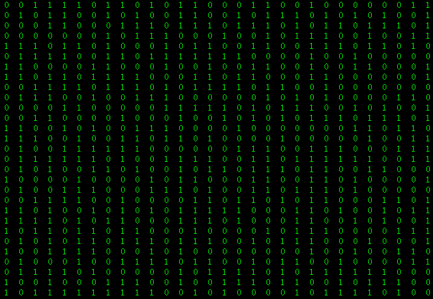
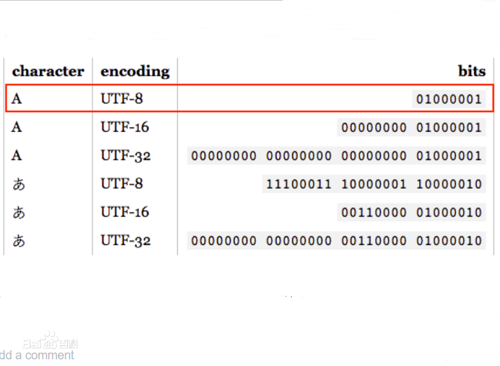
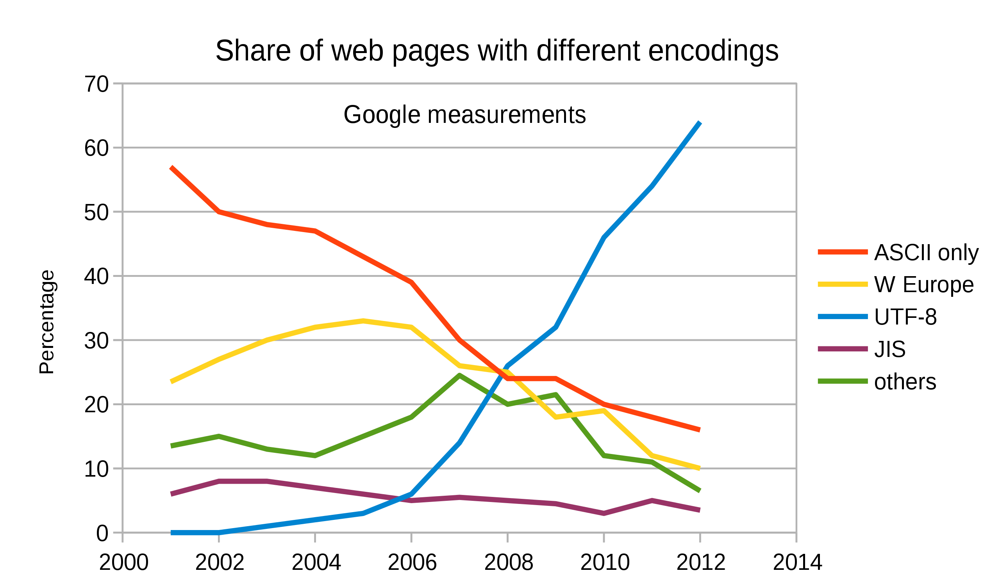
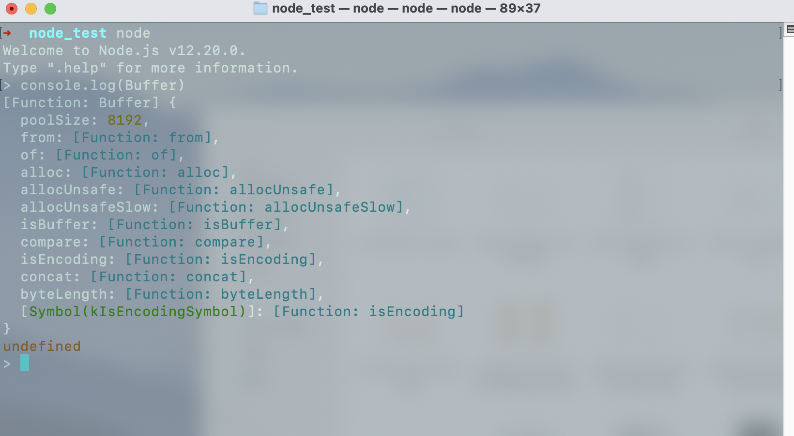

# 理解 Buffer

> Buffer 给了 Node.js 处理二进制的能力。

## 1. 为什么需要 Buffer

答：**因为 Node 要处理二进制数据**。

计算机很傻，只认识 0 和 1，所以，我们的图片、视频、文字，在计算机里都是一堆 0 和 1 而已。

虽然聪明的人类能看懂 0 和 1，却看不懂 0 和 1 背后的真正意义。



除非你是《黑客帝国》里的主角 -- Neo.

那么你眼里的世界是这样的 👇：


回到正常世界吧，人类看不懂二进制数据的，所以需要<code style="color: #708090; background-color: #F5F5F5; font-size: 18px">编码</code>。

**常见的编码格式有：**

- binary（latin1）：也就是二进制，0 和 1 组成，很好理解。
- UTF-8: Node Buffer 默认的编码
- ASCII：基于拉丁字母的编码
- UNICODE: 万国码/国际码，是计算机字符的业界标准，为了兼容全世界的语言文字创造了这些字符，每一个字符都能找到对应的一个 Unicode 编码，无论是中文还是英文
- hex: 16 进制编码，41 也就是 ASCII 里面的英文字母 A.
- GBK: 汉字内码扩展规范
- 等

**Node 支持的编码格式**

- utf8 (默认)
- binary
- hex
- ascii
- utf16le
- base64，

类似 GBK/GB2312 等编码是 Node 无法解析的，需要 iconv 这样的三方库来支持。

_ASCII 和 UTF-8 编码下的字母“A”_




_google 统计的编码使用情况：_



<span style="color: #ff0000; font-size: 16px;">Node 想要处理文件就必然需要处理二进制，所以就有了 Buffer</span>，而且把它作为常量，可见其重要性。

## 2. 字节、字符与字节流

Byte(字节)是一个种对数据大小衡量的单位(B)，

```js
1GB = 1024MB = 1048576KB = 1073741824B
```

**1 字节(B) = 8 比特(bit)**，也就是 8 位，8 位就是一个长度为 8 的二进制，比如 10011001.

它能表示的范围就是 2 的 8 次方(0~255)，所以 ASCII 实际上可以容纳 256 个字符.

一个英文字母占据 一个字节的空间，一个汉字占据 2 个字节的空间。

所以 1GB 可以容纳大约 5 亿个汉字。

```bash
Buffer.from("me")
<Buffer 6d 65>

Buffer.from("我")
<Buffer e6 88 91>
```

英文字母“me”的 utf-8 编码是 “6d 65”,**一个字母对应 一 个字节**。

一个汉字“我”的 utf-8 编码 “e6 88 91”，**一个汉字对应 三 个字节**。

无论是操作字节还是操作字符，当以流的方式进行时，它们本质上就是连续的二进制数据，因为字节是最小的单位，所以本质上我们操作的就是字节，也即<code style="color: #708090; background-color: #F5F5F5; font-size: 18px">字节流</code>。

字节流像水流一样，水的流动就需要有水管来存放这些在流动路上的水，数据的流动也需要一个地方存放这些流动中的数据，数据存放的区域在内存里，我们叫做缓冲 -- Buffer。

_Buffer 示例：_


## 3. Buffer 是什么

<code style="color: #708090; background-color: #F5F5F5; font-size: 18px">Buffer</code> 是一个**构造函数**，而且是一个**全局变量**。

_Node 中直接打印 Buffer:_



```js
{ [Function: Buffer]
  // 分配缓冲区内存的容量
  poolSize: 8192,
  // 根据传入的数据内容创建 buffer
  from: [Function: from],
  of: [Function: of],
  // 正常创建 buffer
  alloc: [Function: alloc],
  // 两种不安全的创建 buffer 方法
  allocUnsafe: [Function: allocUnsafe],
  allocUnsafeSlow: [Function: allocUnsafeSlow],
  // 判断是否是 Buffer 实例对象
  isBuffer: [Function: isBuffer],
  // 比较两个 Buffer 对象的相对位置
  compare: [Function: compare],
  // 判断 Nodejs 是否支持某种编码
  isEncoding: [Function: isEncoding],
  // 拼接几个 Buffer 对象，创建出一个新 Buffer 对象
  concat: [Function: concat],
  // 跟进特定编码统计 buffer 字节数
  byteLength: [Function: byteLength],
  [Symbol(kIsEncodingSymbol)]: [Function: isEncoding] }
```

**需要注意的是：**

- 虽然 Buffer 是个类，但 new Buffer()这个 API 已经废弃，使用 Buffer.from()替换

### 3.1 缓冲内存大小

Node 的缓冲内存是底层 C++层处理的，最大为 2G，也就是说应用中所有的 Buffer 大小加在一起不能超过 2G.

### 3.2 内存分配大小

刚才在打印 Buffer 时，有一个 <code style="color: #708090; background-color: #F5F5F5; font-size: 18px">poolSize: 8192</code>，这个就是 Buffer 的 8kb 内存池的尺度。

当申请的空间小于 4kb 或者大于 4kb，会走不同的分配策略。

## 4. Buffer API

Buffer 是一个**二进制数据容器**。

容器里面可以存放 Buffer 对象。

### 4.1 Buffer.from()

可以**创建 Buffer 对象**。

- Buffer.from(array)

  ```js
  // 创建一个包含字符串 'buffer' 的 UTF-8 字节的新 Buffer。
  const buf = Buffer.from([0x62, 0x75, 0x66, 0x66, 0x65, 0x72]); // <Buffer 62 75 66 66 65 72>
  ```

- Buffer.from(arrayBuffer[, byteOffset[, length]])

  创建与 arrayBuffer 共享内存的 buffer

  ```js
  const arr = new Uint16Array(2);

  arr[0] = 5000;
  arr[1] = 4000;

  // 与 `arr` 共享内存。
  const buf = Buffer.from(arr.buffer);

  console.log(buf);
  // 打印: <Buffer 88 13 a0 0f>

  // 改变原先的 Uint16Array 也会改变 Buffer
  arr[1] = 6000;

  console.log(buf);
  // 打印: <Buffer 88 13 70 17>
  ```

- Buffer.from(buffer)

  返回包含该 Buffer 内容副本的**新缓冲区**

  ```js
  const buf1 = Buffer.from("buffer");
  const buf2 = Buffer.from(buf1);
  // buf2 => <Buffer 62 75 66 66 65 72>
  ```

- Buffer.from(object[, offsetOrEncoding[, length]])

  ```js
  const buf = Buffer.from(new String("buffer")); // <Buffer 62 75 66 66 65 72>
  ```

- Buffer.from(string[, encoding])

  ```js
  // 创建一个包含字符串 'buffer' 的 UTF-8 字节的新 Buffer。
  const buf = Buffer.from("buffer"); // <Buffer 62 75 66 66 65 72>
  ```

<code style="color: #708090; background-color: #F5F5F5; font-size: 18px">\<Buffer 62 75 66 66 65 72\></code> 是一个 Buffer 实例，其中 \<Buffer \>代表是一个 Buffer 实例，62 75 66 66 65 72 就是 ASCII 码表的二进制，8 个一组，为了显示方便，采取了 16 进制显示。

- b（字母） - 62（16 进制） - 1100010（2 进制）
- u （字母） - 75（16 进制） - 1110101（2 进制）
- f（字母）- 66（16 进制） - 1100110（2 进制）
- e（字母）- 65（16 进制） - 11100101（2 进制）
- f（字母）- 72（16 进制） - 1110010（2 进制）

### 4.2 Buffer.alloc()

分配一个大小为 size 字节的新 Buffer。

如果 fill 为 undefined，则用 0 填充 Buffer。

```js
const buf = Buffer.alloc(5);

console.log(buf);
// 打印: <Buffer 00 00 00 00 00>

const buf1 = Buffer.alloc(5, "a");

console.log(buf1);
// 打印: <Buffer 61 61 61 61 61>
```

另外还有两个和 Buffer.alloc()类似的方法<code style="color: #708090; background-color: #F5F5F5; font-size: 18px">Buffer.allocUnsafe(size)</code>、<code style="color: #708090; background-color: #F5F5F5; font-size: 18px">Buffer.allocUnsafeSlow(size)</code>，但是，他们创造的缓冲可能包含敏感数据，生产中很少用到，所以应该避免使用。

### 4.3 Buffer 实例的操作方法

#### 4.3.1 Buffer 写入（write）

- 写入字符串

  ```js
  buf.write(buf.write(string[, offset[, length]][, encoding]))
  ```

  _示例：_

  ```js
  let bufForWrite = Buffer.alloc(32);
  bufForWrite.write("Hello 世界", 0, 9);
  console.log(bufForWrite.toString());
  // Hello 世
  ```

- 截取

  ```js
  buf.slice([start[, end]])
  ```

  _示例：_

  ```js
  let bufFromArr1 = Buffer.from([1, 2, 3, 4, 5]);
  // <Buffer 01 02 03 04 05>
  let bufFromArr2 = bufFromArr1.slice(2, 4);
  // <Buffer 03 04>
  ```

- 拷贝

  ```js
  buf.copy(target[, targetStart[, sourceStart[, sourceEnd]]])
  ```

  _示例：_

  ```js
  let bufCopy1 = Buffer.from("Hello");
  let bufCopy2 = Buffer.alloc(4);
  console.log(bufCopy1);
  // <Buffer 48 65 6c 6c 6f>

  bufCopy1.copy(bufCopy2, 0, 1, 5);
  console.log(bufCopy2);
  // <Buffer 65 6c 6c 6f>
  ```

- 填充

```js
buf.fill(value[, offset[, end]][, encoding])
```

_示例：_

```js
const bufForFill = Buffer.alloc(12).fill("11-11 ");
// <Buffer 31 31 2d 31 31 20 31 31 2d 31 31 20>
console.log(bufForFill.toString());
// 11-11 11-11
```

## 5. Show me your code

> 说明：本节示例使用 Buffer 来处理文件，主要为了演示，项目中应该使用 **Stream** 来处理。

Buffer 在缓冲数据时会把整个数据暂时存放到内存中，显然，这样对计算机性能有影响，如果文件较大（如视频），可能无法完成（Buffer 最大为 2G），**更好的方案是使用 Stream 来处理**。

### 5.1 Buffer 实现 -- 拷贝文件（图片/视频/静态文件等）的小工具

```js
const fs = require("fs");
const path = require("path");

const imgExt = [".png", ".jpg", ".gif"];

// 路径解析，获取所有图片(只考虑当前文件夹，不包含子文件夹)
async function parsePath(pathImg, isTarget) {
  const parsePathImg = path.parse(pathImg);

  // 处理文件
  try {
    if (parsePathImg.ext) {
      // 图片文件直接返回解析后的path
      if (imgExt.indexOf(parsePathImg.ext) !== -1) {
        return [parsePathImg];
      } else {
        throw "图片格式错误";
      }
      // 处理文件夹
    } else {
      // 判断路径是否有效

      // 解析target path时直接返回目录
      if (isTarget) return pathImg;

      // 读取文件夹
      const dir = await fs.promises.readdir(pathImg);
      // 过滤出所有图片
      let imgFileList = dir.filter((file) => {
        const fileParse = path.parse(file);
        return imgExt.indexOf(fileParse.ext) !== -1;
      });

      return imgFileList;
    }
  } catch (error) {
    console.log("路径解析错误：", error);
  }
}

/*
 * @param {string} pathImg  需要复制图片的目录 or 合法的图片路径
 * @param {string} isTarget 要复制到的目录
 */
// Buffer 方式复制图片
const copyImg = async (pathImg, target) => {
  try {
    let fileList = await parsePath(pathImg);
    let targetFile = await parsePath(target, true);

    fileList.map(async (file) => {
      targetFile = Array.isArray(targetFile)
        ? targetFile[0]
        : target + "/" + file;

      console.log(pathImg + "/" + file);
      console.log(targetFile);
      const bufferImg = await fs.promises.readFile(pathImg + "/" + file);
      // 将读取的Buffer数据写入一个新图片
      await fs.promises.writeFile(targetFile, bufferImg);
    });
  } catch (error) {
    console.log("复制图片错误：", error);
  }
};

// 使用案例，把  "./public" 文件夹下的图片复制到 "./copy" 目录下
// copyImg("./public", "./copy");
// 使用案例，把 图片 "./public/img.png" 复制到 "./copy" 目录下
// copyImg("./public/img.png", "./copy");
```

## 参考
