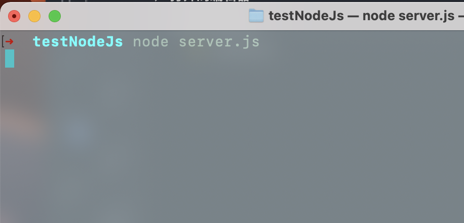
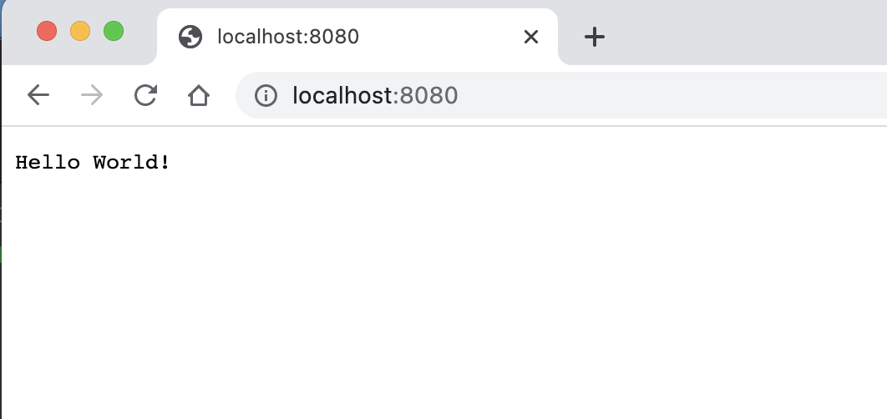
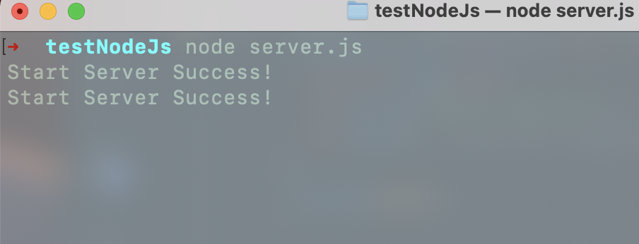
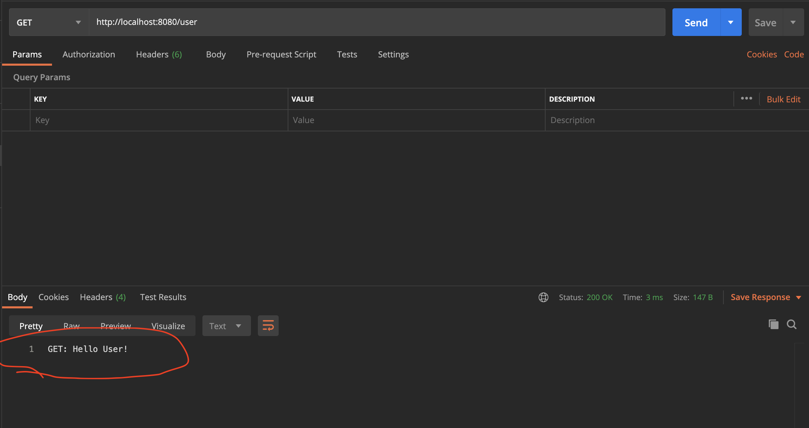
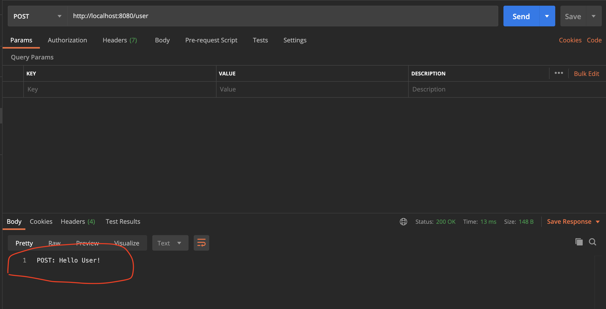
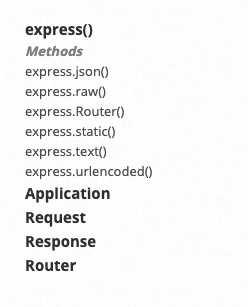

# Express -- NodeJs 使用最广泛的 Web 框架

> Express 是使用量最大的 NodeJs 框架，也是最早的 NodeJs 框架之一。


与其说 Express 是框架，不如说他是个库。

## 1. 没有 Express 时怎么办

> 没有 Express 只能写原生 NodeJs 了！

### 1.1 创建一个 Web 服务

_使用 http 模块创建一个服务：_

```js
// server.js
var http = require("http");

//create a server object:
http
  .createServer(function (req, res) {
    console.log("Star Server Success!");
    res.write("Hello World!"); // write a response to the client
    res.end(); // end the response
  })
  .listen(8080);
```

运行这个服务：

```shell
node server.js
```

_node 服务已经启动：_


浏览器向这个服务器发起一个请求：



发送 2 次请求后，看到打印结果：



然而，这个服务是很弱的，除了返回一个“Hello World!”,什么都做不了。

_开发中遇到的问题：_

- 路由：手动匹配每一个路径和 HTTP 方法？
- 静态文件处理？
- 错误处理：难道要 debug？
- 工具：总不能什么轮子都自己造吧

### 1.2 路由

如：想要获取用户列表

```shell
localhost:8080/users
```

这是就要对请求参数 req 做分析处理了；

```js
// 对req做处理后的 server.js
// server.js
var http = require("http");

//create a server object:
http
  .createServer(function (req, res) {
    let handleRouter = (reqMethod) => {
      switch (reqMethod) {
        case "POST":
          res.write("POST: Hello User!");
          break;
        default:
          res.write("GET: Hello User!");
          break;
      }
    };

    let handleRouterUser = (reqMethod) => {
      switch (reqMethod) {
        case "POST":
          res.write("POST: Hello World!");
          break;
        default:
          res.write("GET: Hello World!");
          break;
      }
    };

    switch (req.url) {
      case "/user":
        // 处理请求方法
        handleRouterUser(req.method);
        break;
      default:
        handleRouter(req.method);
        break;
    }
    res.end(); //end the response
  })
  .listen(8080);
```

上面函数中 req 是个 [http.IncomingMessage](https://nodejs.org/dist/latest-v12.x/docs/api/http.html#http_class_http_incomingmessage) 的实例，它上面挂载有很多属性和方法，url 就是其中一个。

代码虽很臃肿，但是成功匹配到了我们的请求：

_发送一个 user 路径的 Get 请求：_


_发送一个 user 路径的 Post 请求：_


### 1.3 静态文件处理

> 让我们的 Node 服务支持获取静态文件吧。

假如我们的静态文件（图片、html 文件、css 文件等）都放在根目录下的 <code style="color: #708090; background-color: #F5F5F5; font-size: 18px">public</code> 文件夹。

客户端想要请求"/public/test.png"，获取到 “test.png“ 这个图片。

```js
const http = require("http");
const fs = require("fs");

var read = {
  // 异步读取文件方法
  read: function (file_path, func) {
    fs.readFile(file_path, "binary", function (err, data) {
      func(err, data.toString()); // 传入回调函数
    });
  },
  // 同步读取图片
  readSync: function (file_path, res) {
    //设置请求的返回头type,content的type类型列表见上面
    //格式必须为 binary 否则会出错
    var content = fs.readFileSync(file_path, "binary");
    res.setHeader("Content-Type", "image/png");
    res.writeHead(200, "Ok");
    res.write(content, "binary"); //格式必须为 binary，否则会出错
    res.end();
  },
  // 流式处理
  stream: function (file_path, res) {
    res.setHeader("content-type", "image/png"); //设置返回类型
    // 创建可读流
    let stream = fs.createReadStream(file_path);
    let responseData = [];
    if (stream) {
      stream.on("data", function (chunk) {
        //存储文件流
        responseData.push(chunk);
      });
      // 读取文件结束
      stream.on("end", function () {
        // 合并成新的 Buffer
        let finalData = Buffer.concat(responseData);
        res.write(finalData);
        res.end();
      });
    }
  },
};

http
  .createServer(function (req, res) {
    let handleRouter = (reqMethod) => {
      switch (reqMethod) {
        case "POST":
          res.write("POST: Hello User!");
          break;
        default:
          res.write("GET: Hello User!");
          break;
      }
    };

    let handleRouterPublic = async (reqMethod, url) => {
      switch (reqMethod) {
        default:
          // 同步读取图片
          // read.readSync(filePath, res);

          // 异步读取图片
          // read.read(filePath, function (err, file) {
          //   if (err) throw err;

          //   res.writeHead(200, "Ok");
          //   res.write(file, "binary"); //格式必须为 binary，否则会出错
          //   res.end();
          // });

          // 流式处理
          read.stream(filePath, res);
      }
    };

    switch (req.url) {
      case "/public/test.png":
        // 处理请求方法
        handleRouterPublic(req.method, req.url);
        break;
      default:
        handleRouter(req.method);
        break;
    }
    res.end(); //end the response
  })
  .listen(8080);
```

**结论：**

---

没有任何框架也能开发，但是，效率极低、健壮性差，可维护性很差。

---

## 2. Express

### 2.1 Express 是什么


上图是，官方文档的介绍，它告诉我们：

<code style="color: #708090; background-color: #F5F5F5; font-size: 18px">Express</code> 是一个 Node.js <span style="color: #ff0000; font-size: 16px;">Web 框架</span>。

### 2.2 Express 组成

_官方 API 参考目录：_



- express()方法：它会创建一个 Application 实例
- Application 应用实例: 它上面挂载有各种处理方法
- Request：http 请求的 request 对象
- Response: http 请求的 response 对象
- Router: 路由处理对象

### 2.3 Express 设计理念

<span style="color: #ff0000; font-size: 16px;">Express 应用程序基本上是一系列<code style="color: #708090; background-color: #F5F5F5; font-size: 18px">中间件</code>函数调用。</span>

### 2.4 中间件

中间件的原理是什么 ❓

TODO

### 2.5 路由

<code style="color: #708090; background-color: #F5F5F5; font-size: 18px">路由</code>用于确定应用程序如何响应对特定端点的客户机请求。

**路由的写法：**

```js
app.METHOD(PATH, HANDLER);
```

其中：

- app 是 express 的实例。
- METHOD 是 HTTP 请求方法。
- PATH 是服务器上的路径。
- HANDLER 是在路由匹配时执行的函数

把上面的 server.js 用 express 改造一下:

```js
// express-server.js
var express = require("express");
var app = express();
const port = 8080;

// respond with "hello world" when a GET request is made to the homepage
app.get("/", function (req, res) {
  res.write("GET: Hello World!");
});

// POST method route
app.post("/", function (req, res) {
  res.write("POST: Hello World!");
});

app.get("/user", function (req, res) {
  res.write("GET: Hello User!");
});

// POST method route
app.post("/user", function (req, res) {
  res.write("POST: Hello User!");
});

app.listen(port);
```

对，就是这么简单。

### 2.6 静态文件处理

使用内置中间件 express.static 处理静态文件。

```js
app.use(express.static("public"));
```

这样，请求 public 目录下的文件时，会直接返回。

```js
http://localhost:8080/images/kitten.jpg
http://localhost:8080/css/style.css
http://localhost:8080/js/app.js
http://localhost:8080/images/bg.png
http://localhost:8080/hello.html
```

## 3. Express 是怎么做的(源码分析)

// TODO

## 4. 手动实现一个简易的 Express

// TODO

## 参考

官方指南 -- [使用中间件](https://expressjs.com/zh-cn/guide/using-middleware.html)

[使用 Node.js 原生 API 写一个 web 服务器 --> 掘金/蒋鹏飞](https://cloud.tencent.com/developer/article/1740819)

思路清晰 -- [手写 Express.js 源码 --> 腾讯云/蒋鹏飞](https://cloud.tencent.com/developer/article/1740819)
