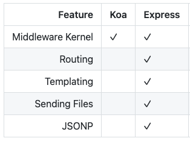

# Koa

官网说 Koa 是**下一代的 Node.js web 框架**。

那么它的上一代是谁呢？

是 Express。

所以，想更好地理解 Koa，自然就要把它和 Express 对比着来看。

## 1. Koa 是什么

<code style="color: #708090; background-color: #F5F5F5; font-size: 18px">Koa</code> 可以看作是 <span style="color: #ff0000; font-size: 16px;">node.js 的 http 模块的抽象</span>，仅此而已。

## 2. Koa 的特征

## 5. Koa VS Express

### 5.1 处理 req、res 的理念不同

从设计理念上讲，Koa 的目标是 "修复和替换 node"，而 Express 则是 "增强节点"。它公开了自己的 ctx.request 和 ctx.response 对象，而不是 node 的 req 和 res 对象。

Koa 可以看作是 <span style="color: #ff0000; font-size: 16px;">node.js 的 http 模块的抽象</span>；

Express 则是 <span style="color: #ff0000; font-size: 16px;">node.js 的应用程序框架</span>，它包含了 <code style="color: #708090; background-color: #F5F5F5; font-size: 18px">Routing（路由）</code>、<code style="color: #708090; background-color: #F5F5F5; font-size: 18px">Templating（模板）</code>、<code style="color: #708090; background-color: #F5F5F5; font-size: 18px">Sending Files</code>（静态文件处理）等中间件。

_Koa VS Express:_



### 5.2 Koa 支持 Promise

支持 Promise 不仅仅是带来语法上的方便。

要知道，Node.js 的内置模块大都提供了 Promise 写法，两者契合度更高，十分有利于提高开发效率。

如：

```js

```

### 5.6 选择谁？Koa or Express

2021 年回答这个问题的话，答案是：

**选 Koa**.

_理由如下:_

- 能做 Express 可以做的一切
- 设计理念更简洁（只有 Middleware Kernel）
- 更轻量，灵活性更好（总有些 Express 的功能你是用不到的）
- 支持下一代 ES（async）

## 参考

官方对比，值得一看 -- [Koa VS Express](https://github.com/koajs/koa/blob/master/docs/koa-vs-express.md)
