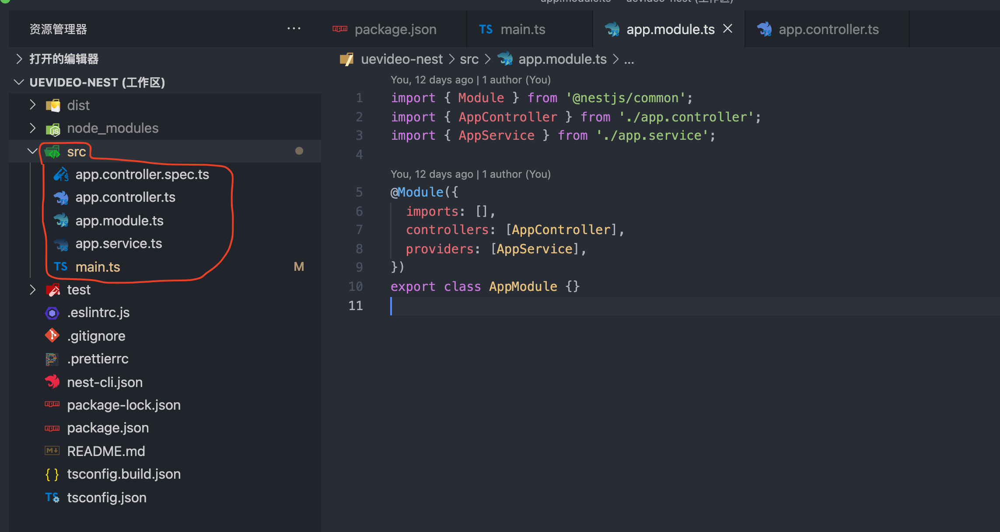
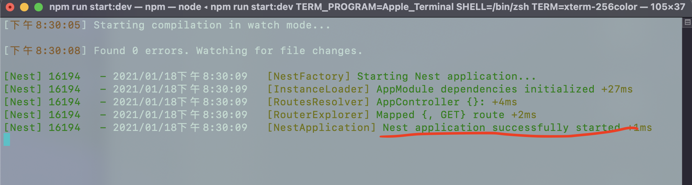
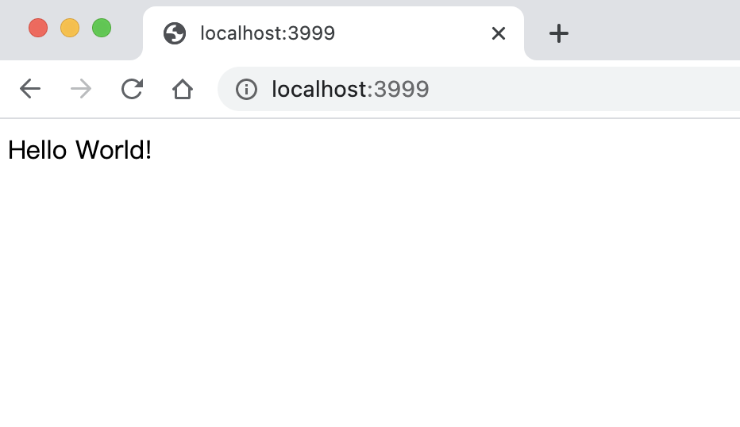
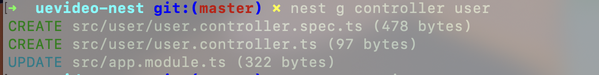
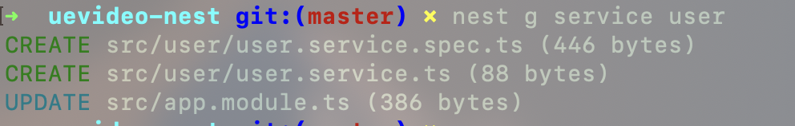
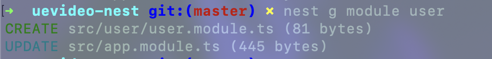

# Nest -- 真正的 NodeJs 框架

> Express、Koa 显然不算 NodeJs 框架，Nest 才是。

## 1. 为什么需要框架

Node.js 可以做很多事，但是如何搭建一个 Node.js 项目就得各显神通了。

每个项目都有自己的架构方案，只是有些架构太烂，所以我们不知道它的存在。

一群大神，确定一个比较好的项目构建方案，得到大家普遍的认可。

于是就是出现了流行的框架。

假如把我们的项目比作大厦，框架就像一个大厦的设计图纸。

我们可以使用图纸高效地建设出一个安全、舒适的大厦。

我么甚至可以根据自己的喜好来修改图纸，以便建设出符合我们需求的大厦。

## 2. NodeJs 框架的发展与对比

NodeJs 框架可谓是百花齐放，目前主流的有：

- Express: 最出名、目前下载量最高的框架
- Koa: Express 团队基于 async/await 的新作
- Egg: 阿里推出的企业级框架
- Nest: 基于 TypeScript 的

_npm 包的下载量对比：_

## 3. 为什么选择 Nest

> Nest 是框架，它组织和规范我们的代码结构。Express\Koa 是封装了 NodeJS HTTP 模块 的库，方便我们使用 NodeJs 的 API 而已。

- 完美支持 TypeScript: 我认为 Node 项目有必要使用 TypeScript
- 架构好：面向 AOP 编程；依赖注入
- 支持 TypeORM: 非常适合非关系型数据库

## 4. NestJs 使用

### 4.1 安装

_脚手架安装：_

```shell
npm i -g @nestjs/cli
nest new my-nest-project
```

_GIT 安装：_

```shell
git clone https://github.com/nestjs/typescript-starter.git my-nest-project
cd my-nest-project
npm install
```

_手动安装：_

```shell
npm i --save @nestjs/core @nestjs/common rxjs reflect-metadata
```

_安装成功后的目录：_



### 4.2 启动

_进入项目文件夹并启动项目：_

```shell
cd my-nest-project
npm run start
```

_nest 启动成功：_



在浏览器输入 http://localhost:3999，可以看到输出：



## 5. 深入了解 NestJs

### 5.1 核心概念

### 5.2 初始化都做了什么

安装成功后的 src 目录是我们的主要工作目录：

_初始化的 src 目录结构：_

- main.ts: 项目入口文件，它使用 NestFactory 用来创建 Nest 应用实例

  ```js
  // main.ts
  import { NestFactory } from "@nestjs/core";
  import { AppModule } from "./app.module";

  async function bootstrap() {
    const app = await NestFactory.create(AppModule);
    await app.listen(3999);
  }
  bootstrap();
  ```

  <span style="color: #ff0000; font-size: 16px;">这里启动 HTTP 服务器，它允许应用程序等待入站 HTTP 请求。</span>

- app.modules.ts: 应用程序的根模块

  ```js
  // app.modules.ts
  import { Module } from "@nestjs/common";
  import { AppController } from "./app.controller";
  import { AppService } from "./app.service";

  @Module({
    imports: [],
    controllers: [AppController],
    providers: [AppService],
  })
  export class AppModule {}
  ```

  app.modules.ts 返回一个@module()修饰器装饰的类 AppModule，跟模块 AppModule 的装饰器里的 controllers 和 providers 里分别引用了 AppController 和 AppService.

- app.controller.ts: 带有单个路由的基本控制器

  ```js
  import { Controller, Get } from '@nestjs/common';
  import { AppService } from './app.service';

  @Controller()
  export class AppController {
    constructor(private readonly appService: AppService) {}

    @Get()
    getHello(): string {
      return this.appService.getHello();
    }
  }
  ```

  app.controller.ts 返回一个@Controller 装饰的类 AppController，类中有个 @Get()装饰的方法 getHello;

  getHello 返回了 './app.service'中的 getHello 方法。

- app.service.ts: 处理具体逻辑的服务文件

  ```js
  // app.service.ts
  import { Injectable } from "@nestjs/common";

  @Injectable()
  export class AppService {
    getHello(): string {
      return "Hello World!";
    }
  }
  ```

  app.service.ts 返回了一个 @Injectable 装饰器装饰的类 AppService，AppService 中有个 getHello 方法，是用来提供给控制器的。

- app.controller.spec.ts: 测试文件

显然，这里的几个装饰器起到了关键作用：<code style="color: #708090; background-color: #F5F5F5;">@Module()</code> 、 <code style="color: #708090; background-color: #F5F5F5;">@Controller()</code> 和 <code style="color: #708090; background-color: #F5F5F5;">@Injectable()</code>.

@Module() 装饰的类叫<span style="color: #ff0000; font-size: 16px;">模块</span>；

@Controller() 装饰的类叫<span style="color: #ff0000; font-size: 16px;">控制器</span>；

@Injectable() 装饰的类叫<span style="color: #ff0000; font-size: 16px;">提供者</span>。

### 5.3 控制反转与依赖注入

<code style="color: #708090; background-color: #F5F5F5;">控制反转</code>（Ioc--Inversion of Control） 是一种设计思想，主要是为了解耦。

<code style="color: #708090; background-color: #F5F5F5;">依赖注入(DI)</code>是控制反转的具体实现。

强烈推荐看下这里，超级通熟易懂：[浅谈控制反转与依赖注入](https://zhuanlan.zhihu.com/p/33492169)

[Nest 中的依赖注入：](https://docs.nestjs.cn/7/fundamentals?id=%e8%87%aa%e5%ae%9a%e4%b9%89%e6%8f%90%e4%be%9b%e8%80%85)

将依赖的实例化委派给 <span style="color: #ff0000; font-size: 16px;">IoC 容器（示例中为 NestJS 运行时系统）</span>，而不是必须在自己的代码中执行。

#### 依赖注入

首先，我们定义一个提供者。<code style="color: #708090; background-color: #F5F5F5;">@Injectable()</code>装饰器将 <code style="color: #708090; background-color: #F5F5F5;">CatsService</code> 类标记为提供者。

```js
// cats.service.ts
import { Injectable } from '@nestjs/common';
import { Cat } from './interfaces/cat.interface';

// @Injectable()将 CatsService类标记为提供者
@Injectable()
export class CatsService {
  private readonly cats: Cat[] = [];

  findAll(): Cat[] {
    return this.cats;
  }
}
```

然后，我们要求 Nest 将提供程序注入到我们的控制器类中：

```js
// cats.controller.ts
import { Controller, Get } from '@nestjs/common';
import { CatsService } from './cats.service';
import { Cat } from './interfaces/cat.interface';

@Controller('cats')
export class CatsController {
  // 即：将提供程序注入到我们的控制器类中
  constructor(private readonly catsService: CatsService) {}

  @Get()
  async findAll(): Promise<Cat[]> {
    return this.catsService.findAll();
  }
}
```

最后，我们在 Nest IoC 容器中注册提供程序

```js
// app.module.ts
import { Module } from "@nestjs/common";
import { CatsController } from "./cats/cats.controller";
import { CatsService } from "./cats/cats.service";

@Module({
  // 注册控制器
  controllers: [CatsController],
  // 注册提供程序
  // 将标记 CatsService与 cats.service.ts文件中的 CatsService 类相关联
  providers: [CatsService],
})
export class AppModule {}
```

这个过程有三个关键步骤：

- 1. 在 cats.service.ts 中 @Injectable() 装饰器声明 CatsService 类是一个可以由 Nest IoC 容器管理的类。
- 2. 在 cats.controller.ts 中 CatsController 声明了一个依赖于 CatsService 令牌(token)的构造函数注入:

  ```js
  constructor(private readonly catsService: CatsService)
  ```

- 3. 在 app.module.ts 中，我们将标记 CatsService 与 cats.service.ts 文件中的 CatsService 类相关联。 我们将在下面确切地看到这种关联（也称为注册）的发生方式。

**总结：**

> 当 Nest IoC 容器实例化 CatsController 时，它首先查找所有依赖项\*。
>
> 当找到 CatsService 依赖项时，它将对 CatsService 令牌(token)执行查找，并根据上述步骤（上面的＃3）返回 CatsService 类。
>
> 假定单例范围（默认行为），Nest 然后将创建 CatsService 实例，将其缓存并返回，或者如果已经缓存，则返回现有实例。

### 5.4 Controllers (控制器)

控制器负责处理传入的 <code style="color: #708090; background-color: #F5F5F5;">请求</code> 和向客户端返回 <code style="color: #708090; background-color: #F5F5F5;">响应</code> 。


使用 nest CLI 命令，创建控制器：

```shell
nest g controller user
```

执行结果如下图 ⬇️：



可以看到，nest CLI 帮我们创建了一个文件夹 user，

然后创建了两个文件 user.controller.ts 和 user.controller.spec.ts，

最后更新了 app.modules.ts，自动帮我们导入并注册了 UserController。

```js
// user.controller.ts
import { Controller } from "@nestjs/common";

@Controller("user")
export class UserController {}
```

```js
// 更新后的 app.modules.ts
import { Module } from "@nestjs/common";
import { AppController } from "./app.controller";
import { AppService } from "./app.service";
import { UserController } from "./user/user.controller";

@Module({
  imports: [],
  controllers: [AppController, UserController],
  providers: [AppService],
})
export class AppModule {}
```

通过个完整的 controller 示例，看看它都做了什么：

```js
import {
  Controller,
  Get,
  Query,
  Post,
  Body,
  Put,
  Param,
  Delete,
} from "@nestjs/common";
import { CreateCatDto, UpdateCatDto, ListAllEntities } from "./dto";

// 匹配路由‘cats’
@Controller("cats")
export class CatsController {
  // 匹配pos请求
  @Post()
  // @Body() 获取HTTP请求的请求体
  create(@Body() createCatDto: CreateCatDto) {
    return "This action adds a new cat";
  }

  // 匹配pos请求
  @Get()
  // @Query() 获取HTTP请求的查询对象
  findAll(@Query() query: ListAllEntities) {
    return `This action returns all cats (limit: ${query.limit} items)`;
  }

  // 匹配路由参数（例如，使用GET /cats/1来获取 id为 1的 cat）
  @Get(":id")
  findOne(@Param("id") id: string) {
    return `This action returns a #${id} cat`;
  }

  // 匹配Put请求
  @Put(":id")
  update(@Param("id") id: string, @Body() updateCatDto: UpdateCatDto) {
    return `This action updates a #${id} cat`;
  }

  // 匹配Delete请求
  @Delete(":id")
  remove(@Param("id") id: string) {
    return `This action removes a #${id} cat`;
  }
}
```

**总结：**

> @Controller()匹配路由
> @Get/@Post 等 HTTP 方法，匹配请求的方法
> @Req/@Body 装饰请求对象等，让我们可以直接使用它们，而不需要手动去获取

[查看 req 详情](https://expressjs.com/en/api.html#req)

### 5.5 Providers (提供者)

<code style="color: #708090; background-color: #F5F5F5;">Providers</code> 是 Nest 的一个基本概念。

许多基本的 Nest 类可能被视为 provider, 如：

- service
- repository
- factory
- helper
- 等等

他们都可以通过 <code style="color: #708090; background-color: #F5F5F5;">constructor</code> 注入依赖关系。

<code style="color: #708090; background-color: #F5F5F5;">Provider</code> 只是一个用 <code style="color: #708090; background-color: #F5F5F5;">@Injectable()</code> 装饰器注释的纯粹的 JavaScript 类。

<code style="color: #708090; background-color: #F5F5F5;">控制器</code>处理 <code style="color: #708090; background-color: #F5F5F5;">HTTP 请求</code>并<span style="color: #ff0000; font-size: 16px;">将更复杂的任务委托给</span><code style="color: #708090; background-color: #F5F5F5;">providers</code>。

_Provider 组成的 Components 提供给 Controller:_


#### service(服务)

使用 CLI 创建服务：

```shell
nest g service user
```

_执行结果 ⬇️：_


和上面 👆 Controllers 章节中创建 controller 一样，nest CLI 帮我们创建了服务，然后在 app.module.ts 中注册服务。这里就不再赘述。

### 5.6 Modules (模块)

<code style="color: #708090; background-color: #F5F5F5;">模块</code>是具有 <code style="color: #708090; background-color: #F5F5F5;">@Module()</code> 装饰器的类.

@Module() 装饰器提供了元数据，Nest 用它来组织应用程序结构。

<code style="color: #708090; background-color: #F5F5F5;">模块</code>定义像<code style="color: #708090; background-color: #F5F5F5;">提供者</code>和<code style="color: #708090; background-color: #F5F5F5;">控制器</code>这样的<code style="color: #708090; background-color: #F5F5F5;">组件组</code>，它们作为整个应用程序的模块部分组合在一起。它们为这些组件提供了<code style="color: #708090; background-color: #F5F5F5;">执行上下文</code>或<code style="color: #708090; background-color: #F5F5F5;">范围</code>。例如，模块中定义的提供程序对模块的其他成员可见，而不需要导出它们。

当提供者需要在模块外部可见时，它首先从其主机模块导出，然后导入到其消费模块。


@module() 装饰器接受一个描述模块属性的对象：

- providers：由 Nest 注入器实例化的提供者，并且可以至少在整个模块中共享
- controllers：必须创建的一组控制器
- imports： 导入模块的列表，这些模块导出了此模块中所需提供者
- exports：由本模块提供并应在其他模块中可用的提供者的子集。

使用 CLI 创建模块：

```shell
nest g module user
```

_执行结果 ⬇️：_


_模块分类：_

- **功能模块：**一个功能，对应一个功能模块。
- **共享模块：**
- **全局模块：**
- **动态模块：**

#### 功能模块

> 一个功能模块，应该包含功能下的所有 Controller 和 Provider

UserController 和 UserService 属于同一个应用程序域。

应该考虑将它们移动到一个功能模块下，即 UserModule。

```js
import { Module } from "@nestjs/common";
import { UserController } from "./user.controller";
import { UserService } from "./user.service";

@Module({
  controllers: [UserController],
  providers: [UserService],
})
export class UserModule {}
```

别忘了在 app.module.ts 中注入 UserModule，此时：

```js
// app.module.ts
import { UserModule } from "./user/user.module";

@Module({
  imports: [UserModule],
  // 注册UserModule后，它的 controllers 和 providers 也会生效，可以在取消这里的 UserController 和 UserService
  // controllers: [AppController, UserController],
  controllers: [AppController],
  providers: [AppService, UserService],
})
export class AppModule {}
```

#### 共享模块

在 Nest 中，默认情况下，模块是<code style="color: #708090; background-color: #F5F5F5;">单例</code>，因此您可以轻松地在多个模块之间共享<code style="color: #708090; background-color: #F5F5F5;">同一个</code>提供者实例。


实际上，每个模块都是一个共享模块。

只需要把实例放到 <code style="color: #708090; background-color: #F5F5F5;">exports</code> 数组中。

_例如：我们要共享 UserService_

```js
import { Module } from "@nestjs/common";
import { UserService } from "./cats.service";

@Module({
  providers: [UserService],
  exports: [UserService],
})
export class CatsModule {}
```

现在，每个导入 CatsModule 的模块都可以访问 CatsService ，并且它们将共享相同的 CatsService 实例。

#### 全局模块

我们想提供一组随时可用的东西 - 例如：helper，数据库连接等等。

这时你需要 <code style="color: #708090; background-color: #F5F5F5;">全局模块</code>。

```js
import { Module, Global } from "@nestjs/common";
import { CatsController } from "./cats.controller";
import { CatsService } from "./cats.service";

@Global()
@Module({
  controllers: [CatsController],
  providers: [CatsService],
  // 导出全局模块
  exports: [CatsService],
})
export class CatsModule {}
```

使用 @Global() 修饰符导出的模块全局可用，且无需导入。这里的 CatsService 模块就是全局模块。

全局模块应该只注册一次，最好由根或核心模块注册。

使一切全局化并不是一个好的解决方案。

#### 动态模块

**静态模块示例，如下 👇**

---

1. 首先，我们将定义一个 UsersModule 来提供和导出 UsersService。

UsersModule 是 UsersService 的主模块。

```js
import { Module } from "@nestjs/common";
import { UsersService } from "./users.service";

@Module({
  providers: [UsersService],
  exports: [UsersService],
})
export class UsersModule {}
```

2. 我们将定义一个 AuthModule，它导入 UsersModule，使 UsersModule 导出的提供程序在 AuthModule 中可用

```js
import { Module } from "@nestjs/common";
import { AuthService } from "./auth.service";
import { UsersModule } from "../users/users.module";

@Module({
  imports: [UsersModule],
  providers: [AuthService],
  exports: [AuthService],
})
export class AuthModule {}
```

这些构造使我们能够注入 UsersService 到 AuthService：

```js
import { Injectable } from '@nestjs/common';
import { UsersService } from '../users/users.service';

@Injectable()
export class AuthService {
  constructor(private readonly usersService: UsersService) {}
  /*
    Implementation that makes use of this.usersService
  */
}
```

我们将其称为<code style="color: #708090; background-color: #F5F5F5;">静态模块绑定</code>。Nest 在主模块和消费模块中已经声明了连接模块所需的所有信息。

Nest 通过以下方式使 UsersService 在 AuthModule 中可用:

1. 实例化 UsersModule ，包括传递导入 UsersModule 本身使用的其他模块，以及传递的任何依赖项
2. 实例化 AuthModule ，并将 UsersModule 导出的提供程序提供给 AuthModule 中的组件(就像在 AuthModule 中声明它们一样)
3. 在 AuthService 中注入 UsersService 实例。

---

**动态模块示例，如下 👇**

---

许多应用程序发现使用配置模块来<code style="color: #708090; background-color: #F5F5F5;">外部化配置</code>详细信息很有用。

这使得在不同部署中动态更改应用程序设置变得容易：例如，开发人员的开发数据库，测试环境的数据库等。

通过将配置参数的管理委派给配置模块，应用程序源代码保持独立于配置参数。

像其他系统中<code style="color: #708090; background-color: #F5F5F5;">插件</code>的概念,可以使用配置项来定制插件的参数。

<span style="color: #ff0000; font-size: 16px;">动态模块提供了一个 API ，用于将一个模块导入到另一个模块中，并在导入模块时定制该模块的属性和行为</span>。

_静态模块：_

```js
import { Module } from "@nestjs/common";
import { AppController } from "./app.controller";
import { AppService } from "./app.service";
import { ConfigModule } from "./config/config.module";

@Module({
  // 静态模块直接导入配置模块
  imports: [ConfigModule],
  controllers: [AppController],
  providers: [AppService],
})
export class AppModule {}
```

_动态模块：_

```js
...
@Module({
  // 动态模块可以根据配置动态地导入模块
  imports: [ConfigModule.register({ folder: './config' })],
  controllers: [AppController],
  providers: [AppService],
})
...
```

具体示例看[这里](https://github.com/nestjs/nest/tree/master/sample/25-dynamic-modules)

---

### 5.7 Entity (实体)

## 6. DataBase (数据库)

## 7. NestJs 部署

## 参考

推荐 👍 , 系列教程 [Nest 框架教程](https://keelii.com/2019/07/03/nestjs-framework-tutorial-1/)
