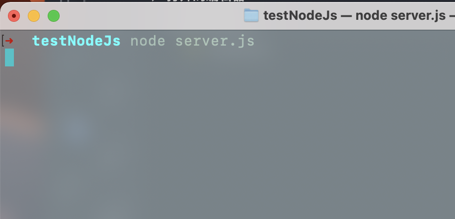
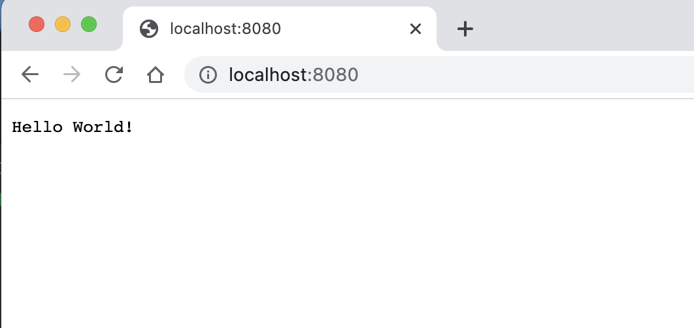
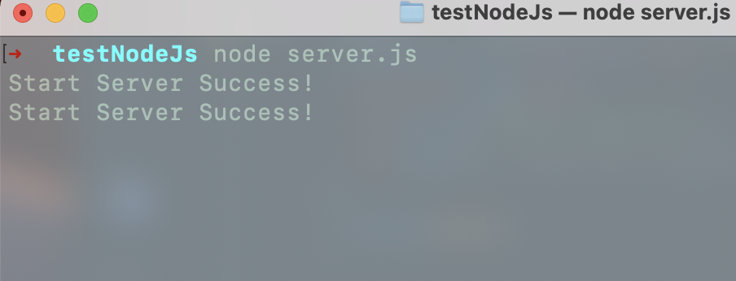
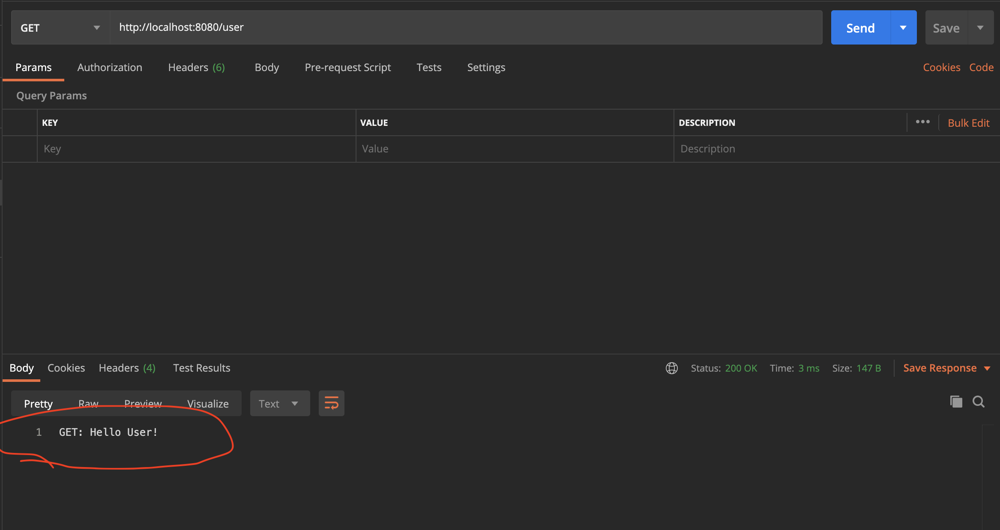
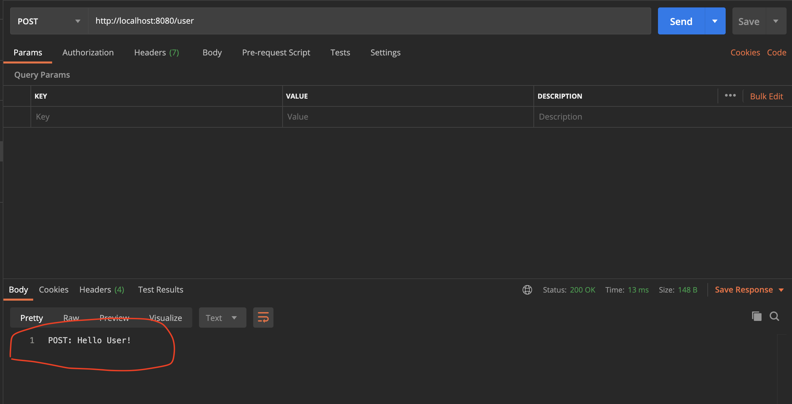

# Express -- NodeJs使用最广泛的框架

> Express 是使用量最大的NodeJs框架，也是最早的NodeJs框架之一。


与其说 Express 是框架，不如说他是个库。

## 1. 没有Express 时怎么办

> 没有Express 只能写原生NodeJs了！

*使用 http模块创建一个服务：*

```js
// server.js
var http = require("http");

//create a server object:
http
  .createServer(function(req, res) {
    console.log("Star Server Success!");
    res.write("Hello World!"); //write a response to the client
    res.end(); //end the response
  })
  .listen(8080); 
```

运行这个服务：

```shell
node server.js
```

*node服务已经启动：*


浏览器向这个服务器发起一个请求：



发送2次请求后，看到打印结果：



然而，这个服务是很弱的，除了返回一个“Hello World!”,什么都做不了。

*开发中遇到的问题：*

- 路由：手动匹配每一个路径和HTTP方法？
- 静态文件处理？
- 错误处理：难道要debug？
- 工具：总不能什么轮子都自己造吧

如：想要获取用户列表

```shell
localhost:8080/users
```

这是就要对请求参数req做分析处理了；

```js
// 对req做处理后的 server.js
// server.js
var http = require("http");

//create a server object:
http
  .createServer(function(req, res) {
    let handleRouter = (reqMethod) => {
      switch (reqMethod) {
        case 'POST':
          res.write("POST: Hello User!");
          break;
        default:
          res.write("GET: Hello User!");
          break;
      }
    }

    let handleRouterUser = (reqMethod) => {
      switch (reqMethod) {
        case 'POST':
          res.write("POST: Hello World!");
          break;
        default:
          res.write("GET: Hello World!");
          break;
      }
    }

    switch (req.url) {
      case '/user':
        // 处理请求方法
        handleRouterUser(req.method);
        break;
      default:
        handleRouter(req.method);
        break;
    }
    res.end(); //end the response
  })
  .listen(8080);
```

上面函数中req是个 [http.IncomingMessage](https://nodejs.org/dist/latest-v12.x/docs/api/http.html#http_class_http_incomingmessage) 的实例，它上面挂载有很多属性和方法，url就是其中一个。

代码虽很臃肿，但是成功匹配到了我们的请求：

*发送一个user路径的 Get请求：*


*发送一个user路径的 Post请求：*


#### 静态文件处理

> 让我们的 Node 服务支持获取静态文件吧。

```js

```

**结论：**
___
没有任何框架也能开发，但是，效率极低、健壮性差，可维护性很差。
___

## 2. Express 做了什么

### 2.1 路由

把上面的server.js用 express 改造一下:

新建一个文件 express-server.js

```js
// express-server.js
var express = require('express');
var app = express();
const port = 3000;

// respond with "hello world" when a GET request is made to the homepage
app.get('/', function(req, res) {
  res.write("GET: Hello World!");
});

// POST method route
app.post('/', function (req, res) {
  res.write("POST: Hello World!");
});

app.get('/user', function(req, res) {
  res.write("GET: Hello User!");
});

// POST method route
app.post('/user', function (req, res) {
  res.write("POST: Hello User!");
});

app.listen(port);
```

对，就是这么简单。

### 2.2 静态文件处理

使用内置中间件 express.static 处理静态文件。

```js
app.use(express.static('public'));
```

这样，请求public目录下的文件时，会直接返回。

```js
http://localhost:3000/images/kitten.jpg
http://localhost:3000/css/style.css
http://localhost:3000/js/app.js
http://localhost:3000/images/bg.png
http://localhost:3000/hello.html
```

## 3. Express 是怎么做的(源码分析)

## 4. 手动实现一个简易的 Express

## 参考

[使用Node.js原生API写一个web服务器 --> 掘金/蒋鹏飞](https://cloud.tencent.com/developer/article/1740819)

[手写Express.js源码 --> 腾讯云/蒋鹏飞](https://cloud.tencent.com/developer/article/1740819)
