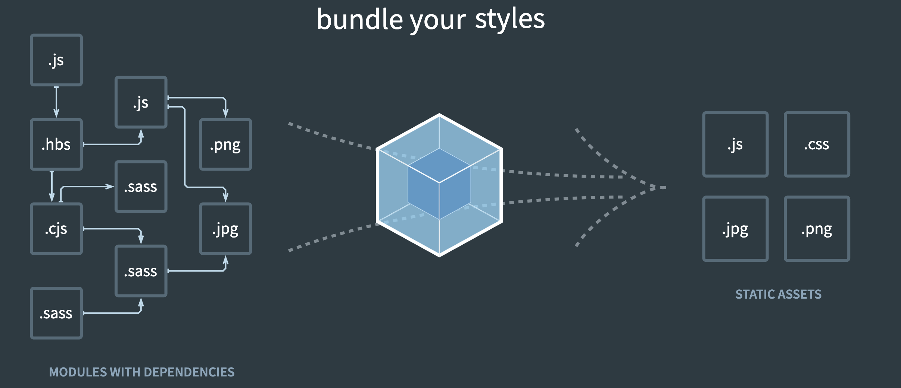
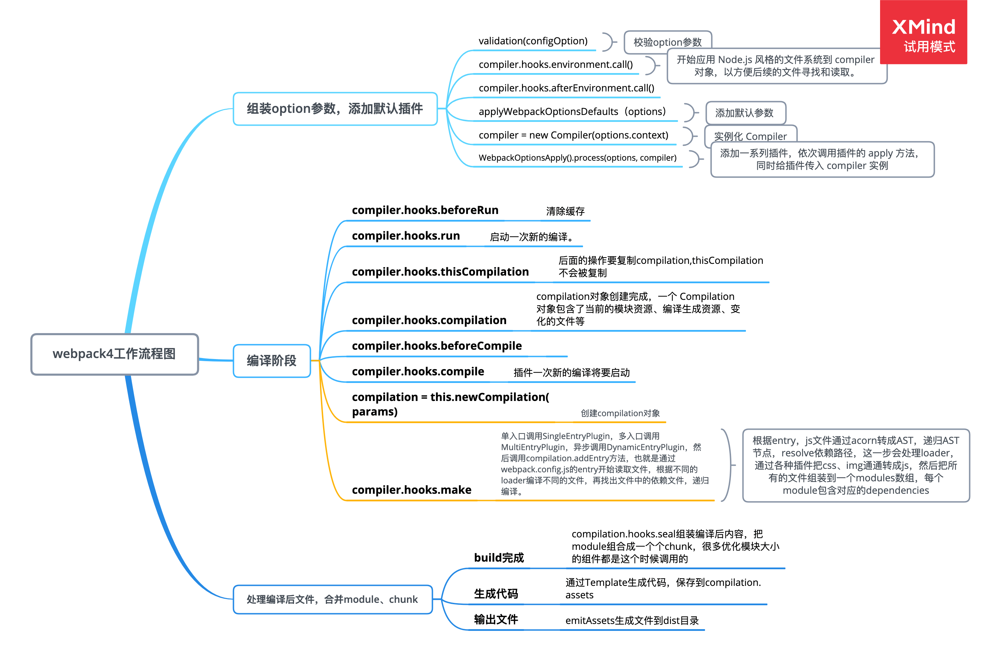

# webpack 基础



## 1. 前端模块化

> 前端项目越越来越复杂，很多问题突显，模块化势在必行。

**模块化可以解决的问题：**

- 命名冲突
- 文件依赖（加载顺序）
- 代码复用
- 样式文件中的模块化（sass、less）

### 1.1 新框架与语言

- 三大前端框架，React、Vue、Angular
- ES6+
- TypeScript
- Flow
- SCSS

### 1.2 前端构建

> 前端项目越来越复杂，更新也越来越快，前端项目的构建就必不可少。
> 前端构建就是将我们的源代码转换成可执行的 JS、CSS、HTML

构建往往包含以下内容：

- 代码转换：将 TypeScript 编译为 JS、将 SCSS 编译为 CSS
- 文件优化：压缩 JS、CSS、HTML 代码，压缩合并图片
- 代码分割：提取多个页面的公共代码，提取首屏不需要执行的代码让其异步加载
- 模块合并：需要将模块化的文件合并为一个文件，减少请求
- 自动刷新：监听本地源代码变化，自动重新构建、刷新浏览器
- 代码校验：代码提交到仓库前需要校验代码是否符合规范，以及单元测试是否通过
- 自动发布：更新代码后，自动构件出线上发布代码并传输给发布系统

## 2. 前端构建工具

> Node.js 是前端工程师所熟悉的，所以大多数前端构建工具都是基于它来开发的。

### 2.1 Grunt

是一个任务执行者，Grunt 有大量的插件封装了常见的任务，也能管理任务之间的依赖关系，自动化执行依赖的任务，每个任务的具体执行代码和依赖关系写在配置文件的 GruntFile.js 里。

- 灵活，只负责执行我们定义的任务
- 大量可复用的插件封装好了常见的构建任务
- 集成度不高，要写很多配置才能使用，无法开箱即用

### 2.2 Gulp

是一个基于流的自动化构建工具。除了可以管理和执行任务，还支持监听文件、读写文件。Gulp 被设计得非常简单，只通过下面 5 种方法就可以支持几乎所有构建场景：

- gulp.task() 注册一个任务
- gulp.run() 执行任务
- gulp.watch() 监听文件的变化
- gulp.src() 读取文件
- gulp.dest() 写文件

gulp 最大特点是引入了流的概念，同时提供了一系列常用的插件去处理流，流可以在插件中使用 pipe()方法传递。

Gulp 优点是好用又不失灵活，既可以单独完成构建，也可以和其他工具搭配使用。缺点是和 Grunt 类似，集成度不高，要写很多配置后才能用，无法做到开箱即用。

可以把 Gulp 看作 Grunt 的加强版，Gulp 增加了监听文件、读写文件、流式处理功能。

### 2.3 webpack

是一个现代 JS 应用程序的*静态模块打包器*，在 webpack 里一切文件皆模块，通过 Loader 转换文件，通过 Plugin 注入钩子，最后输出由多个模块组合成的文件。webpack 处理应用时，它会在内部创建一个*依赖图* ，用于映射到项目需要的每个模块，然后将这些依赖生成到一个或多个 bundle。

- 专注于处理模块化的项目，能做到开箱即用、一步到位
- 可通过 Plugin 扩展，完整好用又不失灵活
- 使用场景不局限于 Web
- 社区庞大活跃，能紧跟时代发展新的特性
- 不足是只能采用模块化开发项目

### 2.4 Rollup

是一个和 Webpack 很类似但专注于 ES6 的模块打包工具。它的亮点在于，能针对 ES6 源码进行 Tree Shaking，以去除那些已被定义但没被使用的代码并进行 Scope Hoisting，以减小输出文件的大小和提升运行性能。然而 Rollup 的这些亮点随后就被 Webpack 模仿和实现。

详细说明它们的差别：

- Rollup 是在 Webpack 流行后出现的替代品
- Rollup 生态链还不完善，体验不如 Webpack
- Rollup 的功能不如 Webpack 完善，但其配置和使用更简单
- Rollup 不支持 Code Spliting，但好处是在打包出来的代码中没有 Webpack 那段模块的加载、执行和缓存的代码
- 用于打包 JavaScript 库时比 Webpack 更有优势，因为其打包出来的代码更小、更快。但它的功能不够完善，在很多场景下都找不到现成的解决方案

## 3. 为什么选择 webpack

> 构建工具是随着时代的发展而产生的，从侧面反映出 Web 开发的发展趋势.

- 在 Npm Script 和 Grunt 时代，Web 开发要做的事情变多，流程复杂，自动化思想被引入，用于简化流程
- 在 Gulp 时代，开始出现一些新语言用于提高开发效率，流式处理思想的出现是为了简化文件转换的流程，例如将 ES5 转换成 ES6
- 在 Webpack 时代，由于单页应用的流行，网页的功能和实现代码变得复杂、庞大，Web 开发向模块化改进

**webpack 成为首选的原因：**

- 大多数团队都会采用“模块化+新语言+新框架”技术方案，Webpack 可以为这些新项目提供一站式的解决方案
- webpack 有良好的生态链和维护团队，能提供良好的开发体验并保证质量
- webpack 被全世界大量的 Web 开发者使用和验证，能找到各个层面所需的教程和经验分享

## 4.webpack 的概念与基础

> 此处详情推荐到官网查看 [webpack 文档](https://webpack.js.org/concepts/)

- 入口（entry）
- 输出（output）
- loader
- plugin

### 4.1 entry

指示 webpack 应该使用哪个模块，来作为构建其内部依赖图的开始，webpack 会找出有哪些模块和 library 是入口起点（直接和间接）依赖的。

### 4.2 output

output 属性告诉 webpack 在哪里输出它所创建的 bundles，以及如何命名这些文件.

### 4.3 module

在 Webpack 里**一切皆模块**，<span style="color: #ff0000; font-size: 16px;">一个模块对应一个文件</span>。

**什么是 webpack 模块？**

Webpack <code style="color: #708090; background-color: #F5F5F5; font-size: 18px">模块</code>能够以各种方式表达它们的依赖关系，几个例子如下：

- ES2015 import 语句
- CommonJs require 语句
- AMD define 和 require 语句
- css/sass/less 文中的 @import 语句
- 样式 （url(...)）或 HTML 文件（）中的图片链接（image url）

**支持的模块类型有哪些？**

- CoffeeScript
- TypeScript
- ESNext（Babel）
- Sass
- Less
- Stylus

### 4.4 chunk

<span style="color: #ff0000; font-size: 16px;">Chunk 指<code style="color: #708090; background-color: #F5F5F5; font-size: 18px">代码块</code>,一个 Chunk 由多个模块组合而成,用于**代码合并与分割**</span>。

例如：webpack 有一个入口文件，入口文件的依赖及各文件的依赖都称为 chunk. 所以我们看到类似的配置：

```js
// 入口文件
entry: {
    app: './src/main.js'
},
// 输出文件
output: {
    // 所有静态文件输出目录，对应一个绝对路径
    path: config.build.assetsRoot,
    // 项目中静态资源的路径，
    // 静态资源最终访问路径 = output.publicPath + 资源loader或插件等配置路径
    publicPath: process.env.NODE_ENV === 'production' ? config.build.assetsPublicPath: config.dev.assetsPublicPath,
    // 入口文件输出时的文件名
    filename: '[name].js'，
    // chunk 输出时的文件名
    chunkFilename: '[name].[chunkhash].min.js'
}
```

### 4.5 loader

webpack 自身只支持 JavaScript。而 loader 能够让 webpack 处理那些非 JavaScript(如：css 文件) 文件，并且先将它们转换为有效模块，然后添加到依赖图中，这样就可以提供给应用程序使用。

webpack 的配置中 loader 有两个特征：

1. test 属性: 用于标识出应该被对应的 loader 进行转换的某个或某些文件
2. use: 表示进行转换时，应该使用哪个 loader

### 4.6 plugin

loader 被用于转换某些类型的模块，而插件则可以用于执行范围更广的任务，插件的范围包括：打包优化、资源管理和注入环境变量等。

### 4.7 mode

通过将 mode 参数设置为 development, production 或 none，可以启用对应环境下 webpack 内置的优化。默认值为 production

### 4.8 模块的解析

_resolver_ 是一个（library）,用于帮助找到绝对路径。模块间的依赖通常在 require、import 语句中。当打包模块时，webpack 使用*enhanced-resolve*来解析路径。

**解析规则是怎样的？**
使用 _enhanced-resolve_ ，webpack 可以解析三种文件路径：

- 绝对路径

```js
import "/home/me/file";
import "C:\\Users\\me\\file";
```

- 相对路径

```js
import "../src/file1";
import "./file2";
```

- 模块路径

模块将在 resolve.modules 中指定的所有目录内搜索。 你可以替换初始模块路径，此替换路径通过使用 resolve.alias 配置选项来创建一个别名。

```js
import "module";
import "module/lib/file";
```

解析路径后，解析器(resolver)将检查路径是否指向文件或目录。如果文件有文件扩展名，则直接打包。否则，将[resolve.extensions]选项作为文件扩展名来解析。

如果路径指向文件夹，按顺序查找目录下的扩展名：

- package.json
- main 字段

webpack 根据构建目标(build target)为这些选项提供了合理的默认配置。

## 5. 依赖图

任何时候，一个文件依赖于另一个文件，webpack 就把此视为文件之间有依赖关系。这使得 webpack 可以接收非代码资源(non-code asset)（例如图像或 web 字体），并且可以把它们作为*依赖*提供给你的应用程序。

从这些入口起点开始，webpack 递归地构建一个依赖图，这个依赖图包含着应用程序所需的每个模块，然后将所有这些模块打包为少量的 bundle - 通常只有一个 - 可由浏览器加载。

## 6. manifest (清单)

在使用 webpack 构建的典型应用程序或站点中，有三种主要的代码类型：

- 你或你的团队编写的源码
- 你的源码会依赖的任何第三方的 library 或 "vendor" 代码
- webpack 的 runtime 和 manifest，管理所有模块的交互

**什么是 Runtime？**

&#8195; 主要是指：在浏览器运行时，webpack 用来连接模块化的应用程序的所有代码。runtime 包含：在模块交互时，连接模块所需的加载和解析逻辑。包括浏览器中的已加载模块的连接，以及懒加载模块的执行逻辑。

**什么是 Manifest？**

&#8195; 那么，一旦你的应用程序中，形如 index.html 文件、一些 bundle 和各种资源加载到浏览器中，你精心安排的 /src 目录的文件结构现在已经不存在，所以 webpack 如何管理所有模块之间的交互呢？这就需要一个 manifest. <font color=#FF7F50>webpack 把代码从 node_modules 中的模块抽离出来，那些基本固定不变的叫做 vendor； 所以把会重复跟随变动的部分抽离出来作为 manifest 文件。注意：每次重新构建 vendor 和 mainfest 都会重新构建</font>

<table><tr><td bgcolor=#7FFFD4>
&#8195; 当编译器(compiler)开始执行、解析和映射应用程序时，它会保留所有模块的详细要点。这个数据集合称为 "Manifest"，当完成打包并发送到浏览器时，会在运行时通过 Manifest 来解析和加载模块。无论你选择哪种模块语法，那些 import 或 require 语句现在都已经转换为 __webpack_require__ 方法，此方法指向模块标识符(module identifier)。通过使用 manifest 中的数据，runtime 将能够查询模块标识符，检索出背后对应的模块. <br>

&#8195; <font color=yellowgreen> 通过使用 bundle 计算出内容散列(content hash)作为文件名称，这样在内容或文件修改时，浏览器中将通过新的内容散列指向新的文件，从而使缓存无效。一旦你开始这样做，你会立即注意到一些有趣的行为。即使表面上某些内容没有修改，计算出的哈希还是会改变。这是因为，runtime 和 manifest 的注入在每次构建都会发生变化。</font>

</td></tr></table>

## 7. hot module replacement (HMR) 模块热替换

模块热替换功能会在应用程序运行过程中替换、添加或删除模块，而无需重新加载整个页面。主要是通过以下几种方式，来显著加快开发速度：

- 保留在完全重新加载页面时丢失的应用程序状态
- 只更新变更内容，以节省宝贵的开发时间
- 调整样式更加快速 - 几乎相当于在浏览器调试器中更改样式

**热替换是如何运作的？**

> **在应用程序中**

1. 应用程序代码要求 HMR runtime 检查更新
2. HMR runtime（异步）下载更新，然后通知应用程序代码
3. 应用程序代码要求 HMR runtime 应用更新
4. HMR runtime（异步）应用更新

> **在编译器中**

除了普通资源，编译器(compiler)需要发出 "update"，以允许更新之前的版本到新的版本。"update" 由两部分组成：

1. 更新后的 manifest(JSON)
2. 一个或多个更新后的 chunk (JavaScript)

manifest 包括新的编译 hash 和所有的待更新 chunk 目录。每个更新 chunk 都含有对应于此 chunk 的全部更新模块（或一个 flag 用于表明此模块要被移除）的代码。

编译器确保模块 ID 和 chunk ID 在这些构建之间保持一致。通常将这些 ID 存储在内存中（例如，使用 webpack-dev-server 时），但是也可能将它们存储在一个 JSON 文件中。

> **在模块中**

HMR 是可选功能，只会影响包含 HMR 代码的模块。当一个模块中实现了 HMR 接口，就可以描述出当模块被更新后发生了什么，然而并不需要每个模块中都含有 HMR 代码，如果一个模块没有 HMR 处理函数，更新就会冒泡。在一个模块树中，一个单独的模块被更新，那么整组依赖模块都会被重新加载。

> **在 HMR 中**

请移步这里看详细内容 [webpack 模块热替换](https://webpack.docschina.org/api/hot-module-replacement)

<br>

## 8.webpack 的配置文件

> 查看更多详细的配置信息[webpack 官方配置详解]()

webpack 开箱即用，但是会假定项目的入口起点为 src/index，然后会在 dist/main.js 输出结果，并且在 <font color=#FF7F50>生产环境开启压缩和优化</font>。项目需要继续扩展能力，那就需要再项目根目录创建一个 webpack.config.js 文件，webpack 会自动使用它。

<br>

## 9. webpack 的工作流程



## 参考

[webpack 主流程源码阅读以及实现一个 webpack](https://github.com/6fedcom/fe-blog/tree/master/webpack/webpack)

[webpack 打包原理 ? 看完这篇你就懂了 !](https://segmentfault.com/a/1190000021494964)
