# Webpack 实战入门与配置详解(结合 React)

> 听够了 webpack 概念? 我们来实战一下吧。

**准备：**
webpack 依赖 NodeJs,请先确保你已经安装了 NodeJs.

## 1. 初始化

### 1.1 新建文件

打开命令行工具，新建项目文件夹，并进入该文件夹。

（如果不知道命令行工具的话建议先去学习下，不知道基础的 Shell 命令 的话很不利于学习 Webpack，项目工程化几乎离不开命令行。）

```shell
mkdir webpack-project

cd webpack-project
```

记住，目前的命令行运行环境是在 <code style="color: #708090; background-color: #F5F5F5;">webpack-project</code> 目录，这里是我们项目的根目录。

<code style="color: #708090; background-color: #F5F5F5;">pwd</code> 命令可以查看当前 bash 的工作位置。

```shell
$ pwd
/Users/han/Desktop/webpack-project
```

为什么强调这一点呢？因为 Webpack 的工作是打包我们的文件，更直白的说就是将不同目录的依赖文件打包出成一个（或多个）文件。

所以目录的路径是很重要的，加载图片、导入文件都必须路径准确，否则... 你懂得。

### 1.2 初始化项目

**初始化 npm 配置:**

---

现在我们有了一个空文件 webpack-project。

npm 初始化项目，毕竟我们是要做个大项目 😂，需要依赖各种包，当然少不了用 NPM 来管理它们。

```shell
npm init -y
```

<code style="color: #708090; background-color: #F5F5F5;">npm init -y</code> 命令是要按默认配置初始化 npm 配置。

此时我们的项目里应该有一个 package.json 文件了，这个是我们 npm 的配置文件。

```shell
$ ls
package.json
```

ls 命令查看下当前目录中的文件。

**安装 webpack 及相关依赖:**

---

```shell
npm install webpack webpack-cli --save-dev
```

这个命令安装了 2 个包：

- webpack : 它就是 webpack,帮我们完成打包依赖
- webpack-cli: 此工具用于在命令行中运行 webpack

**新建项目入口文件:**

---

新建我们项目的入口文件：src/index.js

```js
function component() {
  const element = document.createElement("div");

  (element.innerHTML = "Hello"), "webpack";

  return element;
}

document.body.appendChild(component());
```

**新建 webpack 配置文件:**

---

webpack4 以后是可以无须任何配置就能工作的，但我们的项目往往很复杂，还是需要我们根据项目需求来配置的。

在根目录新建 webpack 配置文件 webpack.config.js。

注意 ⚠️：

> webpack.config.js 是一个 JS 文件，它导出了一个对象，webpack 执行是根据对象里的配置项运行的。

```js
const path = require("path");

module.exports = {
  // 执行文件入口，以该文件递归所有依赖
  entry: path.join(__dirname, "src/index.js"),
  // 输出配置选项
  output: {
    // 输出名称，所有依赖的模块合并输出到该文件
    filename: "bundle.js",
    /*
     * 执行 webpack 命令打包时会自动在根目录新建一个 dist 目录，
     * 然后将输出文件（index.html、bundle.js、图片等）放到 dist 目录
     */
    path: path.join(__dirname, "dist"),
  },
};
```

现在我们的目录是这样的：

```js
webpack-demo
  |- package.json
  |- webpack.config.js
  |- /src
    |- index.js
```

**运行 webpack 打包:**

---

到这儿我们初始化就算完成了,但是想使用 webpack-cli 命令还需要在 package.json 中稍作配置。

```json
{
  "scripts": {
    "build": "webpack"
  }
}
```

运行 webpack 打包:

```shell
npm run build
```

打包完成后会在根目录生成一个 dist 文件夹，dist 里有我们想要的文件 bundle.js。

打包后我们的目录是这样的：

```js
webpack-demo
  |- dist
    |- bundle.js
  |- package.json
  |- webpack.config.js
  |- /src
    |- index.js
```

bundle.js 是这样的：

```js
document.body.appendChild(
  (function () {
    const e = document.createElement("div");
    return (e.innerHTML = "Hello Webpack!"), e;
  })()
);
```

**index.js 中的代码被打包到这里了，且只有一行，<span style="color: #ff0000; font-size: 16px;">打包成功</span>。**

### 1.3 构建开发环境

上面 👆 在 1.2 中已经完成了打包工作，但是开发过程的体验是很差的。

我们总不能写一会儿代码就要打包一下？然后手动刷新代码？

所以，我们需要搭建一个开发环境，能帮助我们高效开发。

#### 1.3.1 安装 webpack-dev-server

webpack-dev-server 帮助我们启动了一个开发服务器，为我们的 webpack 项目提供运行服务。

我们可以不用等打包好后才能运行代码，而是在开发中实时看到代码的情况，需要打包时我们在打包，然后可以将打包的代码部署上线。

```shell
npm i webpack-dev-server -D
```

#### 1.3.2 根目录新建 index.html

webpack-dev-server 的运行是需要一个 HTMl 模版的；

而且需要在模板中引入我们打包的文件 bundle.js；

因为，webpack-dev-server 不会帮我们注入 bundle.js 到 html 文件。

_根目录新建 index.html:_

```html
<!DOCTYPE html>
<html lang="en">
  <head>
    <meta charset="UTF-8" />
    <title>Webpack</title>
  </head>
  <body>
    <div id="root"></div>
    <!-- 引入打包的 bundle.js -->
    <script src="./bundle.js"></script>
  </body>
</html>
```

#### 1.3.3 配置 npm 运行 webpack-dev-server 的命令

package.json

```json
{
  "scripts": {
    "build": "webpack",
    "dev": "webpack serve --mode development --env development"
  }
}
```

#### 1.3.4 运行 webpack-dev-server

```shell
npm run dev
```

npm run dev 会执行 package.json 中的 “dev” 配置的 命令。

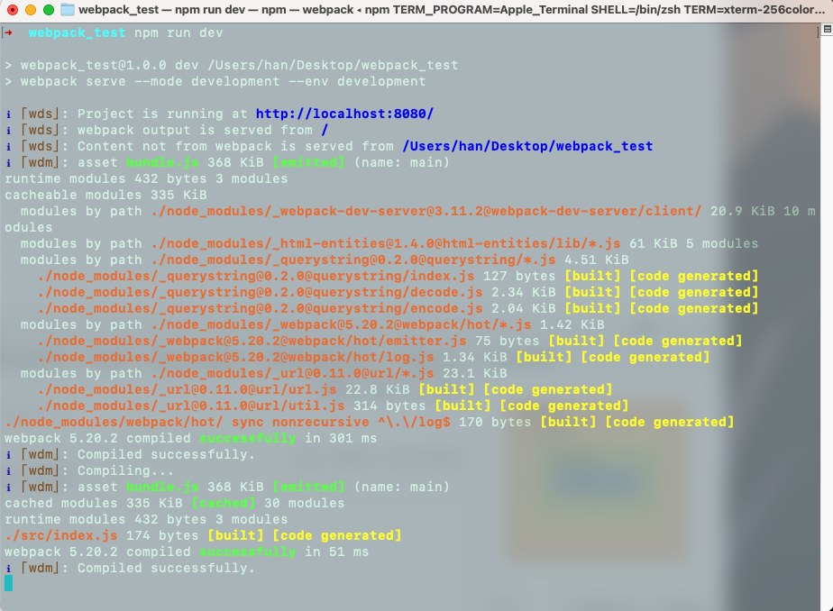

webpack-dev-server 运行输出一系列提示，主要告诉我们：

- 项目运行地址是 localhost:8080/；（浏览器访问就能看到我们运行成功的页面）
- runtime modules 模块大小和数量; (runtime 是 webpack-dev-server 运行时)
- cacheable modules 模块大小及，处理缓存模块依次用到了哪些包。<span style="color: #ff0000; font-size: 16px;">webpack-dev-server 是没有直接生成文件的，生成的缓存文件在内存中。npm run build 才会生成文件到配置的输出目录中。</span>
- 最后告诉我们编译成功了！

浏览器看看效果：

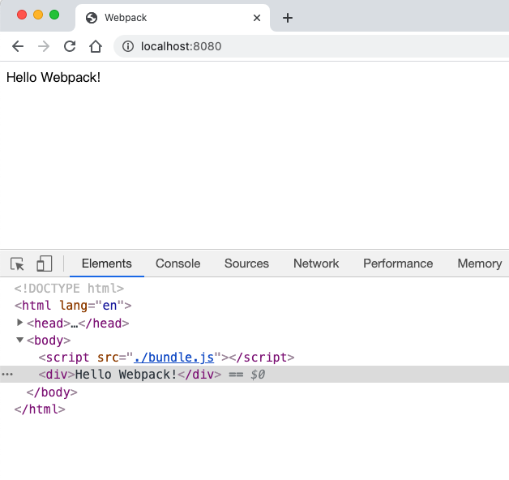

浏览器 Source 面板 有哪些资源：

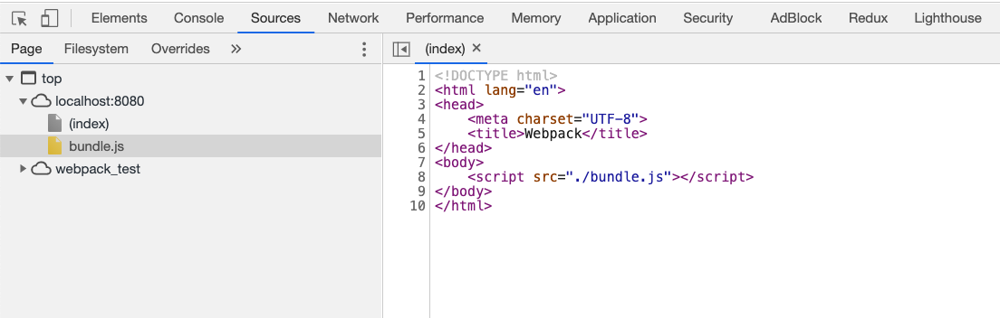

不错，是我们想要的效果，index.html 文件里加载到了 bundle.js;

webpack 把 index.js 里的内容打包到了 bundle.js。

现在，一个最基础的 webpack 搭建好了，可以正式开始干活了。

## 2. 干活之前的疑惑 🤔

> 一切才刚刚起步，我么带着问题来继续探索 Webpack。

1. webpack 只能用于编译 JS 模块，CSS、图片、html 这些资源怎么办？只会写 .vue 的我怎么办？

2. webpack 打包后只有一个 bundle.js 文件（还有其他文件，后面再说），如何调试代码呢？

## 3. 引入 CSS

新建 src/css/style.css 文件。

```css
.smallImg {
  width: 200px;
  height: 200px;
  background: green;
}
```

在 index.html 中使用样式。

```html
<body>
  <div id="root"></div>
  <div class="smallImg"></div>
  <script src="./bundle.js"></script>
</body>
```

重要的是，我们要在 index.js 中引入样式文件。

```js
require("./css/style.css");
```

一切就绪，然后看看结果如何。

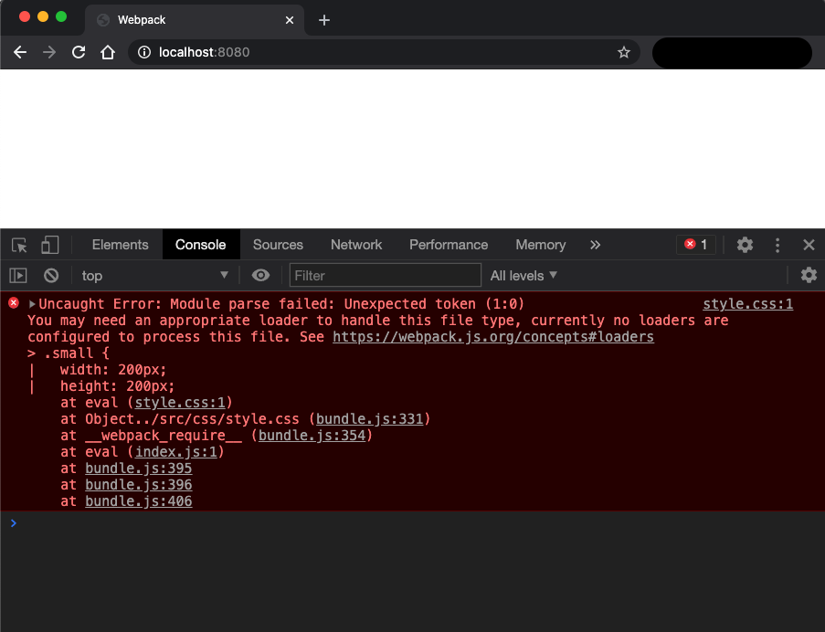

你没看错，报错了。

然后还温馨的提示我们，“模块解析错误，你可能需要一个合适的 loader 来处理这个类型的文件，当前没有 loader 来处理这种文件。”

这种导致报错的文件就是我们在 index.js 中引入的 CSS 文件，前面我们说过，webpack 只能解析 JS 文件。

解决的办法就是引入 loader, 这个 loader 主要干什么呢？

主要就是要把 CSS 文件解析为 JS 文件（bundle.js）中的一部分，让 Webpack 能解析它。

社区有这么一个 loader 就是做这个事情的，它就是 css-loader。

不用担心，大多数我们日常开发中需要的 loader 目前都有成熟的方案。如果没有或 loader 不满足业务需求怎么办？

那就只能自己写个造轮子了 🚗。

---

安装 css-loader：

```shell
npm i css-loader -D
```

只安装完还不行，还要在 webpack.config.js 中配置规则，告诉 webpack 怎么用 css-loader.

```js
const path = require("path");

module.exports = {
  // 执行文件入口，以该文件递归所有依赖
  entry: path.join(__dirname, "src/index.js"),
  // 输出配置选项
  output: {
    // 输出名称，所有依赖的模块合并输出到该文件
    filename: "bundle.js",
    /*
     * 执行 webpack 命令打包时会自动在根目录新建一个 dist 目录，
     * 然后将输出文件（index.html、bundle.js、图片）放到 dist 目录
     */
    path: path.join(__dirname, "dist"),
  },
  module: {
    // rules选项 配置一组加载和转换规则
    rules: [
      {
        // 通过正则匹配CSS 文件
        test: /\.css$/,
        use: ["style-loader", "css-loader?esModule"],
      },
      {
        test: /\.(png|jpg)$/,
        loader: "url-loader",
        options: {
          limit: 3000,
          name: "[name].[hash:8].[ext]",
        },
      },
    ],
  },
};
```

我们重新启动下试试。

果然，没有报错，又成功了。

可是，css 文件好像没有生效啊 ❓

重新打包 📦 下文件，npm run build , 然后看看 bundle.js,如下 ⬇️：

_这里的为了方便对 bundle.js 做了展开处理：_

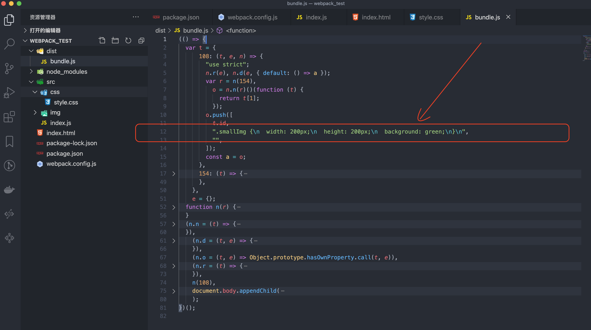

我们写的 CSS 文件被打包到 bundle.js 里了。

打包到 bundle.js 里没啥用啊，笔记 index.html 中并没有生成 css 文件。

所以，我们需要将 bundle.js 里的 css 内容生成 css 文件，然后插入到 index.html 中。

style-loader 正好有这个功能。

安装 style-loader:

```shell
npm i -D style-loader
```

webpack.config.js 中配置使用 style-loader：

```js
rules: [
  {
    test: /\.css$/,
    use: ["style-loader", "css-loader"],
  },
];
```

重新打包 📦 下文件，npm run build , 更新后的 bundle.js,如下 ⬇️

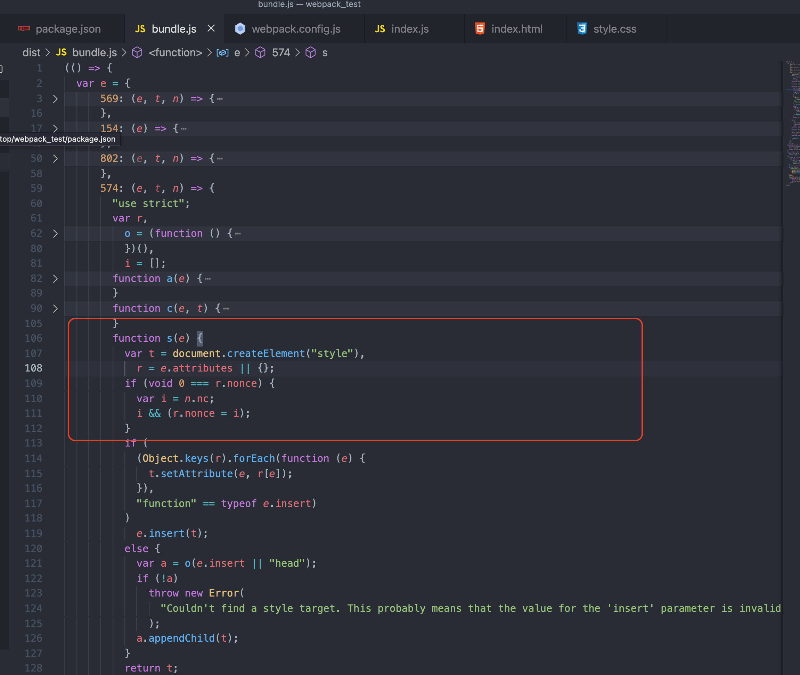

隐隐约约的是不是看到 👀 了点什么？

对，你看的没错，style-loader 在页面了插入了一个 style 元素。如下 ⬇️

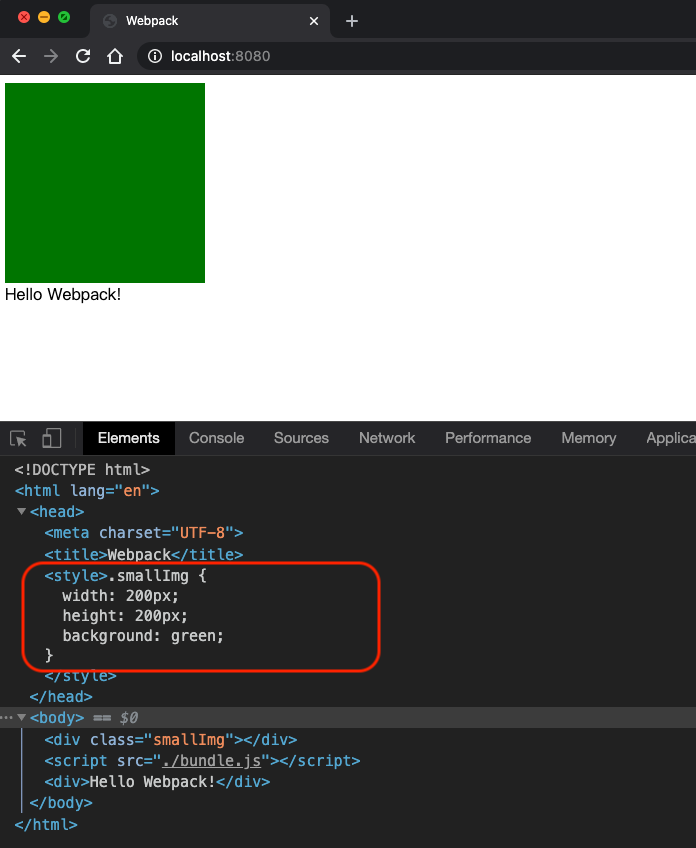

## 4. 引入 图片

是不是感觉绿色的框框有点丑？

我们引入一张漂亮的图片做背景吧。

_修改 style.css 文件：_

```css
.smallImg {
  width: 200px;
  height: 200px;
  background: url(../img/small.jpg) no-repeat;
}
```

又报错！！

少年，我们前面已经说了，webpack 只认识 JS。

CSS 文件我们用 css-loader 来处理，图片文件 我们可以用 url-loader 来处理。

url-loader 依赖 file-loader, 所以我们需要一起安装它们。

```shell
npm i file-loader url-loader -D
```

_webpack.config.js 中配置 图片处理规则：_

```js
rules: [
  {
    test: /\.(png|svg|jpg|jpeg|gif|ico)$/,
    loader: "url-loader",
    options: {
      // 小于 10kb 使用 url-loader 处理成 Base64文件，
      // 大于 10kb 使用 file-loader 正常处理
      limit: 10 * 1024,
      // 图片打包名称
      name: "[name].[hash:8].[ext]",
      // 修改图片打包路径
      // name: 'assets/images/[name].[hash:8].[ext]',
      // 不使用 ES模块语法，否则require 图片时会解析成模块
      esModule: false,
      fallback: {
        loader: "file-loader",
        options: {
          name: "[name].[hash:8].[ext]",
          // 修改图片打包路径
          // name: 'assets/images/[name].[hash:8].[ext]',
          esModule: false,
        },
      },
    },
  },
];
```

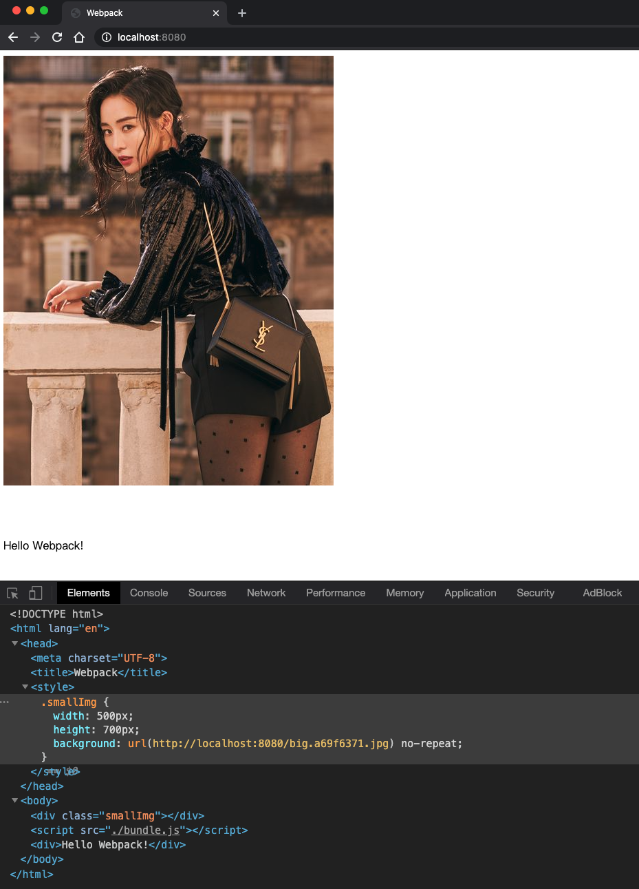

重新打包 📦 下文件，npm run build , dist 目录如下 ⬇️

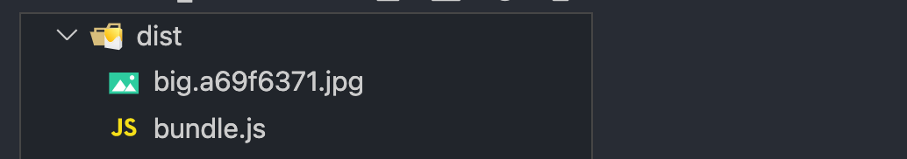

## 5. 打包生成 HTML 文件

目前我们打包的文件有 bundle.js 和 图片，还没有 HTML 文件，这显然是不合适的，毕竟 我们最总打包的项目是要放在 HTMl 文件 中的。

不要把根目录中的 index.html 当成打包 📦 的 HTML 文件，它是 webpack-dev-server 使用的模板文件，和最终的打包文件没有关系。

这是 loader 帮不了我们了，我们功能强大的 <span style="color: #ff0000; font-size: 16px;"> 插件 </span>此刻该出场了。

_安装 html-webpack-plugin:_

```shell
npm install --save-dev html-webpack-plugin
```

webpack.config.js 中配置：

```js
const HtmlWebpackPlugin = require('html-webpack-plugin');

module.exports = {
  ...
  plugins: [
    new HtmlWebpackPlugin(),
  ]
}
```

重新打包 📦 后会在 dist 中生成一个 index.html 文件，且会自动加载打包后的文件 bundle.js。

_html-webpack-plugin 自动生成的 index.html ：_

```html
<!DOCTYPE html>
<html>
  <head>
    <meta charset="utf-8" />
    <title>Webpack App</title>
    <meta name="viewport" content="width=device-width,initial-scale=1" />
    <script defer="defer" src="bundle.js"></script>
  </head>
  <body></body>
</html>
```

打包生成的 index.html 是压缩成单独一行的，这里为了方便查看将其展开了。

我们也可以自定义生成 index.html 的模板，这样来生成我们想要的 index.html,而不是自动生成它。

首先，可以在根目录创建一个 public 文件夹，然后新建一个 index.html 作为 **html-webpack-plugin 的模版**。

_public/index.html:_

```html
<!DOCTYPE html>
<html>
  <head>
    <meta charset="UTF-8" />
    <title>Webpack</title>
  </head>
  <body>
    <div id="root"></div>
    <div class="smallImg"></div>
    <noscript>You need to enable JavaScript to run this app.</noscript>
    <script src="./bundle.js"></script>
  </body>
</html>
```

_配置 html-webpack-plugin 选项：_

```js
const HtmlWebpackPlugin = require('html-webpack-plugin');

module.exports = {
  ...
  plugins: [
    new HtmlWebpackPlugin({
      // 生成的 html文件名称及存放路径
      filename: './index.html',
      // 原html模板文件路径
      template: './public/index.html',
      // 打包后的 js 插入的位置，true/'head'/'body'/false
      inject: false,
      // 压缩HTML文件
      minify: {
        // 移除HTML中的注释
        removeComments: true,
        // 删除空白符与换行符
        collapseWhitespace: false
      },
      // favicon路径
      favicon: './public/favicon.ico',
    }),
  ]
}
```

现在我们可以把根目录中的 index.html 删除，让 webpack-dev-server 也使用 public/index.html 这个模版。

```js
const HtmlWebpackPlugin = require('html-webpack-plugin');

module.exports = {
  ...
  devServer: {
    // 告诉服务器内容的来源
    contentBase: path.join(__dirname, "public/"),
    port: 8081,
    // 开启热替换
    hotOnly: true,
  },
}
```

我们重新定义了 webpack-dev-server 启动服务所监听的端口，然后，浏览器中应该访问 localhost:8081 就能看到重新启动的服务页面。

## 6. 使用 ES7、8、9 和 React

> Webpack 可以识别编译 JS，但是，ES 的更高版本是不行的，我们需要借助 Babel.

_在 index.js 中 使用 ES7 中的装饰器试试：_

```js
require("./css/style.css");

const component = () => {
  const element = document.createElement("div");
  element.innerHTML = "Hello Webpack!";
  return element;
};

function decorateMan(target) {
  target.userName = "human";
}

@decorateMan
class Man {
  constructor() {
    this.userName = "man";
  }
}

console.log("Man.userName:", Man.userName);

document.body.appendChild(component());
```

此时报错，向引入 CSS 时一样，告诉我们无法解析 "@" 符号，需要使用 Loader。

安装 Babel 和相关的包。

```shell
npm install --save-dev babel-loader @babel/core @babel/cli @babel/preset-env @babel/plugin-proposal-class-properties
npm install --save @babel/polyfill
```

babel 解决 ES6 -> ES5 语法问题;

@babel/polyfill 解决新的对象（Promise 等）、方法（Array.prototype.includes 等）

@babel/plugin-proposal-class-properties 解决 stage-X 相关提案语法等

@babel/plugin-proposal-decorators 支持 class 装饰器

注意 @babel/plugin-proposal-decorators 的配置，否则不生效，[查看详细配置](https://babel.docschina.org/docs/en/7.1.0/babel-plugin-proposal-decorators/)。

目前上面这几个包基本能覆盖所有 JS 转换需求，更多的请到 [Babel 官网](https://babeljs.io/docs/en/) 探索吧！

_webpack.config.js 中添加规则：_

```js
rules: [
  {
    test: /\.(js|jsx)$/,
    loader: "babel-loader",
    options: {
      presets: [
        // 预设
        "@babel/env",
        // "@babel/preset-react"
      ],
      plugins: [
        // 支持 class 装饰器，"legacy": true
        ["@babel/plugin-proposal-decorators", { legacy: true }],
        // 支持 stage-x 相关的 plugin，如 stage-3 提案中 class 的 static 属性
        ["@babel/plugin-proposal-class-properties", { loose: true }],
      ],
    },
  },
];
```

从新启动 npm run dev, 可以看到浏览器会打印出结果如下 ⬇️ ：

```console
Man.userName: human
```

说明配置的 Babel 生效了 👍 ！

**既然我们要做个大项目，怎么能少得了 React 或 Vue 呢 ❓**

搞起来！

```shell
npm install --save react react-dom
```

react 就是我们要用的 react 包。

安装 react-dom 是我们要开发浏览器项目，所以要单独安装它。如果你想，开发 APP，可以安装 react-native。

_修改入口文件 index.js 为 React 模块：_

```js
require("./css/style.css");
import React from "react";
import ReactDom from "react-dom";

// 这里不是HTML 语法，是 JSX语法
const element = <h1>Hello, React</h1>;

ReactDom.render(element, document.getElementById("root"));
```

然后就报错了！

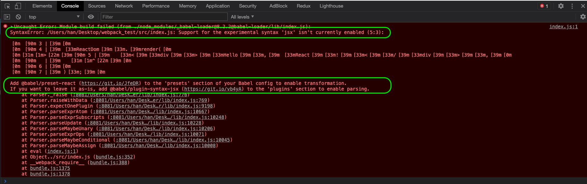

报错提示我们说不支持 jsx 语法，这里不说 jsx 语法，需要连接详情点[这里-JSX 简介](https://zh-hans.reactjs.org/docs/introducing-jsx.html)；

这里不光报错了，还给我们提示了解决办法。

简直良心啊，提示让我们安装 @babel/preset-react，然后配置到 Babel 的 presets 中。

```shell
npm i @babel/preset-react -D
```

_webpack.config.js 中添加配置：_

```js
{
  test: /\.(js)$/,
  loader: "babel-loader",
  options: {
    presets: [
      "@babel/env"
      // 添加到这里
      "@babel/preset-react"
    ],
    plugins: [
      ["@babel/plugin-proposal-decorators",{ "legacy": true }],
      ["@babel/plugin-proposal-class-properties", { "loose" : true }]
    ]
  }
},
```

重新启动下看到了我们想要的结果，如下 ⬇️ 。

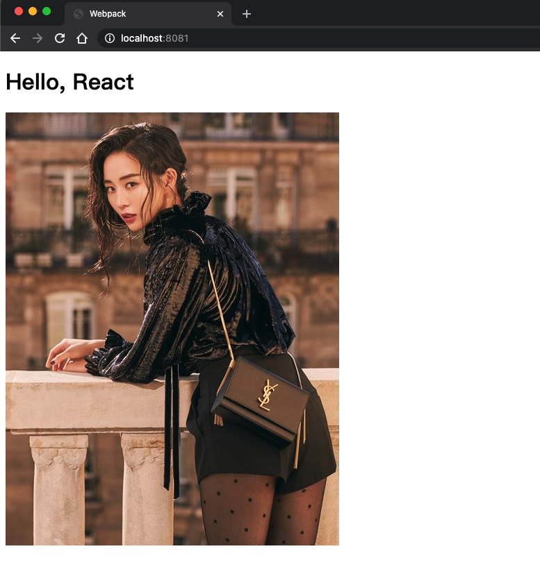

## 7. 完善 Webpack 配置和基础优化

> 现在项目基本运行起来了，让我们来优化一下。

_现在的目录：_

```js
webpack-demo
  |- public
  |- webpack.config.js
  |- /src
    |- css
    |- img
    |- index.js
  |- package.json
  |- webpack.config.js
```

src 目录 作为我们开发时的主目录，我们来优化一下它，把资源分类，方便下面的 webpack 处理。

_优化后的目录：_

```js
webpack-demo
  |- public
  |- webpack.config.js
  |- /src
    |- components // 公共组件
    |- pages      // 页面
    |- plugins    // 自定义的插件
      |- util.js  // 自定义的工具库
    |- pages      // 项目页面
    |- statics    // 用来存放静态资源
      |- images   // 存放图片
      |- fonts    // 存放字体
    |- statics    // 用来存放静态资源
    |- App.js     // 应用主入口，处理应用
    |- index.js   // 项目入口文件，引入App.js等
  |- package.json
  |- webpack.config.js
```

_修改 index.js :_

```js
import React from "react";
import ReactDOM from "react-dom";
import App from "./App.js";

ReactDOM.render(
  <React.Fragment>
    <App />
  </React.Fragment>,
  document.getElementById("root")
);
```

_修改 App.js :_

```js
require("./css/style.css");
import React from "react";
import ReactDom from "react-dom";

const element = <h1>Hello, React</h1>;

const App = () => {
  return element;
};

export default App;
```

### 7.1 mode (模式)

> mode 配置相当重要。

我们使用 Webpack 开发其实有两个环境，一个是我们开发时的 <code style="color: #708090; background-color: #F5F5F5;">开发环境</code>，
一个是要使用我们最终要打包生成的代码的线上 <code style="color: #708090; background-color: #F5F5F5;">生产环境</code>。

模式（mode）共 3 种类：

- 'development': 会将 DefinePlugin 中 process.env.NODE_ENV 的值设置为 development. 为模块和 chunk 启用有效的名。
- 'production': 会将 DefinePlugin 中 process.env.NODE_ENV 的值设置为 production。为模块和 chunk 启用确定性的混淆名称
- 'none': 不使用任何优化项目

<span style="color: #ff0000; font-size: 16px;">如果没有设置，webpack 会给 mode 的默认值设置为 production</span>。

既然有两个环境，我们最好是有两个 Webpack 配置文件：

- webpack.dev.js： 用于开发环境
- webpack.prod.js： 打包时用于生产环境

这两个模块应该继承与我们之前的 webpack.config.js 。

_根目录新建 webpack.dev.js,继承于 webpack.config.js ：_

```js
const path = require("path");
const webpackConfig = require("./webpack.config.js");
const { merge } = require("webpack-merge");

module.exports = merge(webpackConfig, {
  // 开发模式
  mode: "development",
  // 把 webpack.config.js 中用于开发模式的 webpack-dev-server 的配置移动到这里
  devServer: {
    contentBase: path.join(__dirname, "public/"),
    port: 8081,
    hotOnly: true,
  },
});
```

_根目录新建 webpack.prod.js,同样继承于 webpack.config.js ：_

```js
const webpackConfig = require("./webpack.config.js");
const { merge } = require("webpack-merge");

module.exports = merge(webpackConfig, {
  // 生产模式
  mode: "production",
});
```

我们还需要在 package.json 中配置启动命令来调用这两个配置文件。

_package.json :_

```json
{
  "scripts": {
    "build": "webpack --env production --config webpack.prod.js",
    "dev": "webpack serve --env development --config webpack.dev.js"
  }
}
```

<span style="color: #ff0000; font-size: 16px;">后面所有的优化都是针对这两个不同的环境分别处理的。</span>

### 7.2 resolve

<code style="color: #708090; background-color: #F5F5F5;">resolve</code> 是 Webpack 的解析配置。

_webpack.config.js 添加 resolve 选项：_

```js
module.exports = {
  //...
  resolve: {
    // configuration options
  },
};
```

#### 7.2.1 resolve -> alias

- 配置 alias(别名)

  作用：导入模块时会自动寻找匹配别名定义的路径

```js
module.exports = {
  //...
  resolve: {
    alias: {
      Utils: path.resolve(__dirname, "src/utils/"),
    },
  },
};
```

正常导入时“使用相对路径”这种方式，就像这样：

```js
import Utility from "../../utils/utility";
```

配置 alias 后可以这样用：

```js
import Utility from "Utils/utility";
```

验证一下，我们新建文件 src/utils/tools.js。

```js
export function tools(params) {
  console.log("tools");
}
```

在 APP.js 中引入并调用；

```js
...
import { tools } from './utils/tools.js';

tools();
...
```

控制台打印出结果: tools，说明配置成功。

### 7.3 devtool

此选项控制是否生成，以及如何生成 source map。

_webpack.dev.js :_

```js
...
module.exports = WebpackMerge(webpackConfig,{
  ...
  // 开启 source-map,用于代码调试
  devtool: 'source-map',
}
...
```

### 7.4 优化打包路径

目前我们打包的代码全部都在根目录，我们需要给代码做个简单分类，把图片、字体等资源放到 assets 目录。

_期望打包的目录是这样的：_

```js
dist |
  -assets |
  -images | // 存放图片
  -bundle.js |
  -index.html;
```

_配置图片打包路径：_

```js
{
  test: /\.(png|svg|jpg|jpeg|gif|ico)$/,
  loader: 'url-loader',
  options: {
    limit: 3000,
    // 配置图片打包路径
    name: 'assets/images/[name].[hash:8].[ext]'
  }
}
```

### 7.5 缩小文件搜索范围

Webpack 启动后会从配置的 Entry 出发，解析出文件中的导入语句，再递归的解析。

虽然一般能准确递归，但是文件多了难免会出现无效递归的问题，缩小递归的范围是个解决的好办法。

#### 缩小 loader 搜索范围

```js
module.exports = {
  module: {
    rules: [
      {
        test: /\.js$/,
        // babel-loader 支持缓存转换出的结果，通过 cacheDirectory 选项开启
        use: ["babel-loader?cacheDirectory"],
        // 只对项目根目录下的 src 目录中的文件采用 babel-loader
        include: path.resolve(__dirname, "src"),
      },
    ],
  },
};
```

#### 缩小 resolve.modules 搜索范围

```js
module.exports = {
  resolve: {
    // 使用绝对路径指明第三方模块存放的位置，以减少搜索步骤
    // 其中 __dirname 表示当前工作目录，也就是项目根目录
    modules: [path.resolve(__dirname, "node_modules")],
  },
};
```

#### 优化 resolve.extensions 配置

我们往往引入文件时没有带后缀名称。

Webpack 默认会查找 '.js' 和 '.json',找不到就报错。

建议除了 ‘.js’ 的文件其它后缀在引入时带上，这样会减少查找。

```js
module.exports = {
  resolve: {
    // 尽可能的减少后缀尝试的可能性
    extensions: [".js"],
  },
};
```

## 8. 开发环境性能优化

> 开发环境优化主要是要利于开发和测试。

### 8.1 样式检查

写出规范的样式文件，可以借助 stylelint-webpack-plugin。

_安装 stylelint-webpack-plugin 和依赖的插件 ：_

```shell
npm install stylelint-webpack-plugin tylelint stylelint-config-standard --save-dev
```

_在 webpack.dev.js 中配置插件：_

```js
plugins: [
  new StylelintPlugin({
    // 使用什么插件做style 检查,需要手动安装 stylelint 和 stylelint-config-standard
    config: {
      extends: "stylelint-config-standard",
    },
    // 正则匹配想要监测的文件
    // files: 'src/**/*.l?(e|c)ss'
    files: "src/**/*.css",
    // 帮我们修复错误
    fix: true,
  }),
];
```

现在我们随便在 style.css 中输入一个错误，然后保存，webpack-dev-server 会热加载。

我们可以看到，style.css 中的错误会被修改成正确的形式，终端会有一条 built 记录：

```shell
./node_modules/css-loader/dist/cjs.js??ruleSet[1].rules[1].use[1]!./src/css/style.css 1.17 KiB [built]
```

提示我们对 style.css 做了修改。

## 9. 生产环境性能优化

> 生产环境性能优化主要是要打包出体积小、代码结构规范的包。

### 9.1 模块按需加载

有时我们会用到一些库，如 Antd。

这些库往往都比较大，可是我们很可能之用到了其中极小的一部分，如果将库全部打包进去会严重影响打包质量。

### 9.2 压缩 JS/CSS

webpack-parallel-uglify-plugin 可以利用多进程使用 UglifyJS 压缩 JS 代码。

```shell
npm i webpack-parallel-uglify-plugin --save-dev
```

_配置 JS 压缩插件：_

```js
const ParallelUglifyPlugin = require('webpack-parallel-uglify-plugin');

...
plugins: [
  // 使用 ParallelUglifyPlugin 并行压缩输出的 JS 代码
  new ParallelUglifyPlugin({
    // 传递给 UglifyJS 的参数
    uglifyJS: {
      output: {
        // 最紧凑的输出
        beautify: false,
        // 删除所有的注释
        comments: false,
      },
      compress: {
        // 在UglifyJs删除没有用到的代码时不输出警告
        // warnings: false,
        // 删除所有的 `console` 语句，可以兼容ie浏览器
        drop_console: true,
        // 内嵌定义了但是只用到一次的变量
        collapse_vars: true,
        // 提取出出现多次但是没有定义成变量去引用的静态值
        reduce_vars: true,
      }
    },
  }),
  // 打包前清空 dist目录
  new CleanWebpackPlugin(),
],
```

## 10. React 项目优化

### 10.1 使用 CSS Modules

JS 模块化的方案目前比较清晰了，ES Module 方案几乎称为主流，CommonJS 也对其做了支持。

但是，CSS 模块化几乎停滞不前，但是 CSS 模块化在项目中又是必须要做的。

目前社区的主流方案有两种：

- CSS In JS：将 JS 处理成 CSS，这种方案抛弃了 CSS 写法，有些 CSS 的用法无法实现或实现起来很麻烦，代表是 [styled-components](https://styled-components.com/)

- [CSS Modules](https://github.com/css-modules/css-modules): 写法仍然是 CSS 写法，但已不再是 CSS，而是编译成 [ICSS](https://github.com/css-modules/icss)

这里不做讨论，个人倾向于 CSS Modules 方案。

_在 css-loader 中配置 开启 CSS Modules :_

```js
{
  test: /\.css$/,
  use: [
    "style-loader",
    {
      loader: "css-loader",
      options: {
        // 启用css modules
        modules: {
          // 配置 class 命名规则
          localIdentName: "[name]__[local]___[hash:base64:5]",
        }
      }
    }
  ],
}
```

现在样式不能像之前粗鲁地直接 require 到文件模块中，而是要引入样式文件后给需要的元素添加具体的样式。

_新的样式使用方法：_

```js
import React from "react";
// 引入样式文件，不用担心，styles 会被自动解析成对象
import styles from "./css/style.css";

console.log("styles:", styles);
// 输出： styles: {smallImg: "style__smallImg___FFRe_"}
// 可以看到 styles 是个对象，里面包含处理后的 class名称

const App = () => {
  return (
    <>
      <h1>Hello, React</h1>
      <div className={styles.smallImg}></div>
      </img>
    </>
  );
};

export default App;
```

_开启 CSS Modules 之前：_

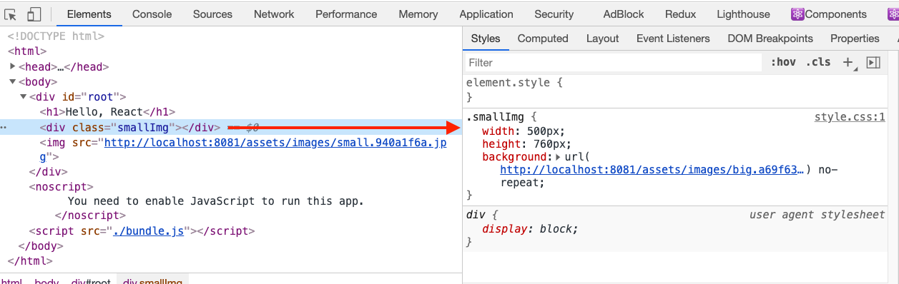

_开启 CSS Modules 之后：_

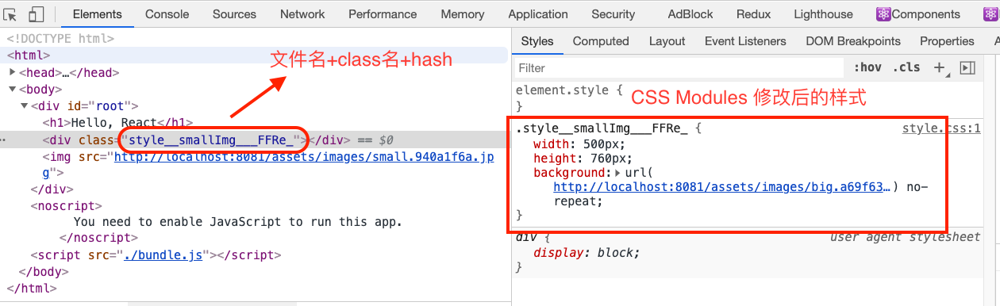

> 有了 CSS Modules 之后，我们就形成了一个局部样式文件，不用担心样式污染，样式文件和我们的组件可以绑定，更利于我们组件的模块化。

### 10.2 按需加载 Antd

有时候我们会引用一些样式库，如 Antd，样式库能大大提高我们的工作效率，特别是我们没有精力搞一套自己的组件库时。

粗暴的使用 Antd;

_安装 Antd:_

```shell
npm install antd --save
```

_Antd 不支持 CSS Modules,需要添加一个 css 文件处理规则：_

```js
// antd样式 不支持 CSS Modules,需单独处理
{
  test:/\.css$/,
  exclude: /src/,
  include: /node_modules\/_antd/,
  use:["style-loader","css-loader"]
},
```

_在 App.js 中使用 Antd 的组件：_

```js
import React from "react";
import styles from "./css/style.css";
// 引入 Antd 组件 DatePicker
import { DatePicker } from "antd";

const App = () => {
  return (
    <>
      <h1>Hello, React</h1>
      // DatePicker
      <DatePicker />
      <div className={styles.smallImg}></div>
      </img>
    </>
  );
};

export default App;
```

_组件正常加载，但是引入了 Antd 所有样式：_

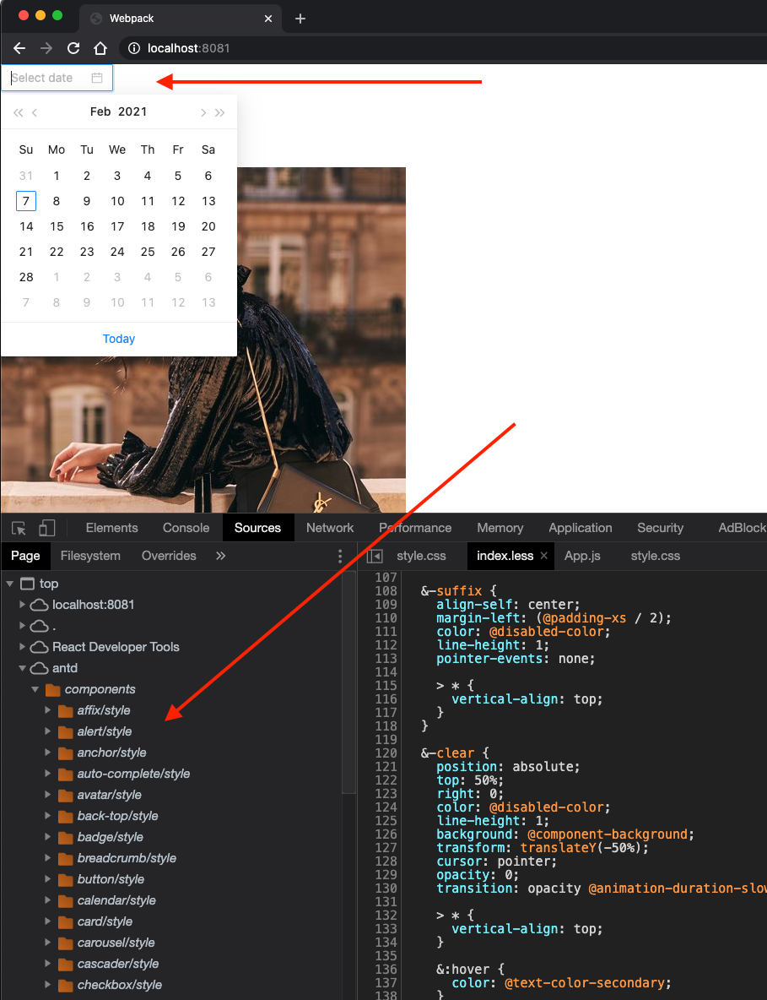

**Antd 按需加载[官方介绍](https://3x.ant.design/docs/react/getting-started-cn#%E6%8C%89%E9%9C%80%E5%8A%A0%E8%BD%BD)：**

antd 默认支持基于 ES modules 的 tree shaking，对于 js 部分，直接引入 import { Button } from 'antd' 就会有按需加载的效果。

css 文件并没有按需加载，因为我们在 index.js 中直接把所有样式都引入了。

我们可以手动按需加载 👇：

```js
import Button from "antd/es/button";
import "antd/es/button/style";
```

我们可以借助一个 babel 插件 来自动完成这个工作，只要引入我们想要的组件 如 import Button from 'antd/es/button'，就会自动帮我们按需加载响应的 CSS 依赖。

这个 Babel 插件就是 babel-plugin-import，它还可以按需加载 lodash、material-ui 等。

_安装 babel-plugin-import :_

```shell
npm install babel-plugin-import --save-dev
```

_Antd 按需加载 :_

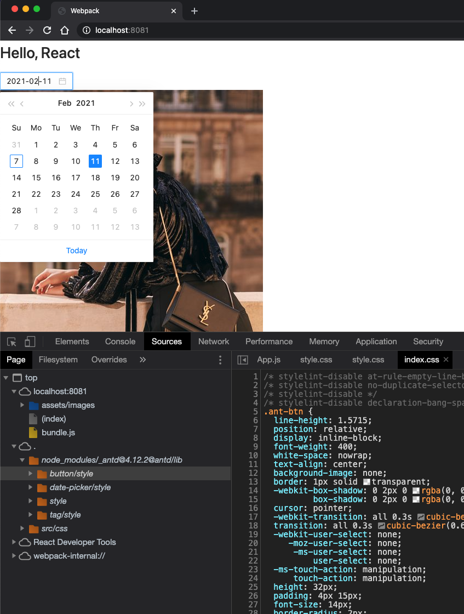

### 10.3 React Router 路由代码分割

> 一个大型单页应用不做拆分是不行的,既然页面是按路由划分的，那么按路由分割就是个解决的方案。

单页应用按需加载是很必须的，把整个应用整体一次加载是不可取的，如果应用复杂时，文件可能较大，加载时间会比较长，用户体验可想而知。

_一个未做代码分割的 React 应用：_


_React Router 分割的 React 应用：_

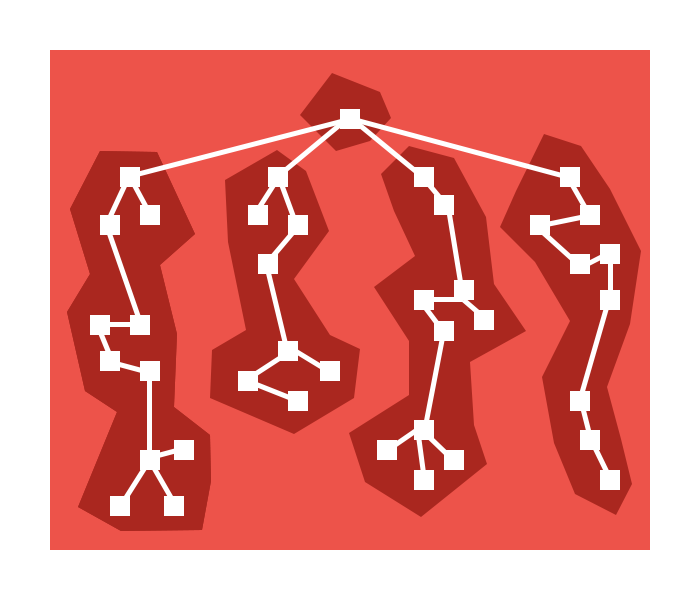

### 10.4 React Loadable 组件代码分割

> React 应用 按路由分割是个解决的方案，但不是最好的方案。

### 1. 理想的拆分 React 应用 ❓

单页应用理想的拆分原则：

1. 将网站划分成一个个小功能，在按照每个功能的相关度将他们分成几个类；
2. 将每一个类合并成一个 chunk，按需加载对应的代码；
3. 不能将用户首次进入网站时看到画面所对应的 功能 Chunk 按需加载；
4. 被分割出去的代码的加载需要一定的触发时机，即当用户操作了或者即将操作对应功能时再去加载对应的代码。

React Router 显然是没有做到上面这几点的，React Router 只是按照路由对 React 应用做了分割。

我们理想的方案是<span style="color: #ff0000; font-size: 16px;">按组件分割，暂时不需要展示的组件就不显示，当用户操作时再按需加载</span>。

_理想的分割 React 应用：_


<code style="color: #708090; background-color: #F5F5F5;">React Loadable</code> 就能按上图 👆 所示的拆分方案完成 React 应用的分割工作。

## 参考

[Webpack 官方文档](https://webpack.js.org/concepts/)

[Webpack 中文文档](https://webpack.docschina.org/concepts/)

[react-loadable 官网 --> 分割 React 组件](https://github.com/jamiebuilds/react-loadable)

[一文彻底搞懂 webpack devtool](https://juejin.cn/post/6844904201311485966)

[深入浅出 Webpack](https://webpack.wuhaolin.cn/)
