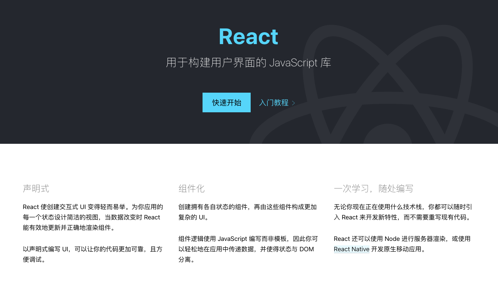

# React 理念

> 本文会根据官方文档的介绍顺序来尝试读源码。先分析 react 的理念显然是有必要的，如果不知道理念的话读别人写的代码会很累。不知道原作者的理念的话读起来一切都是在猜。



## 1.React 是做什么的？

“用于构建用户界面的 JavaScript 库”，官方文档是这样给 React 定义的。

"React 是用 JavaScript 构建**快速响应**的大型 Web 应用程序的首选方式",官方文档 React 哲学里这样说。

React 所做的努力与尝试都是为了**快速响应**。

## 2.React 的特征是什么？

- 声明式：与声明式相对应的是“命令式”，声明式只用声明自己想要的 UI，至于插入渲染等交给 React。命令式就像原生 JS 编程，每一步详细的操作命令都要清晰地表达出来。

- 组件化：组件化解决复用组件的问题。一个个各有状态的组件可以组件出复杂的应用，同时有利于代码管理。

- 一次学习，随处编写：我们用 JSX 构建 React 组件，JSX 可以生成 React “元素”。React “元素”可以用 react-dom 渲染出 web 应用，可以用 React Native 渲染出移动端应用，还可以使用 Node 进行服务器渲染

```javascript
//  ReactDOM 渲染web应用，<App />是个组件，使用了JSX语法，返回一个React"元素"
import React from "react";
import ReactDOM from "react-dom";
import GlobalStyle from './globalStyle.js';
import App from "./App.js";

ReactDOM.render(
  <App />
  document.getElementById("root")
);
```

## 3.React 是如何做到快速响应的？

想知道如何快速响应，就要先知道我们访问 Web 网站和使用 APP 时影响响应速度的关键是什么：

- CPU 性能瓶颈
- IO

### 3.1 如何解决 CPU 瓶颈

项目变大，组件变多，需要做大量计算时就容易遇到 CPU 瓶颈。

例如：向试图渲染 3000 个 li:

```javascript
function App() {
  const len = 3000;
  return (
    <ul>
      {Array(len)
        .fill(0)
        .map((_, i) => (
          <li>{i}</li>
        ))}
    </ul>
  );
}

const rootEl = document.querySelector("#root");
ReactDOM.render(<App />, rootEl);
```

主流浏览器刷新频率为 60Hz，即每（1000ms / 60Hz）16.6ms 浏览器刷新一次。

浏览器的 GUI 渲染线程与 JS 线程是互斥的，也就是说二者不能同时执行。所以，JS 脚本执行时，浏览器渲染、绘制就要暂停。

如果在 16.6ms 内完成以下任务就可能不会出现卡顿：

> JS 脚本执行 > 样式布局 > 样式绘制

看下例子的执行情况如何：


可以看出，JS 执行时间为 291.91ms,远远超出了 16.6ms，多于一帧时间后就会出现卡顿现象，ms 级别的卡顿你可能没有察觉，如果改成 30000 次呢？

### 3.2 如何解决卡顿问题？

> 答案是：在浏览器每一帧的时间中，预留一些时间给 JS 线程，React 利用这部分时间更新组件（源码中可以看到预留时间为 5ms）。

```javascript
// react/packages/scheduler/src/forks/SchedulerDOM.js
let yieldInterval = 5;
```

当预留的时间不够用时，React 将线程控制权交还给浏览器使其有时间渲染 UI，React 则等待下一帧时间到来继续被中断的工作。

这种将长任务分拆到每一帧中，像蚂蚁搬家一样一次执行一小段任务的操作，被称为**时间切片**（time slice）

接下来我们开启 Concurrent Mode：<span style="color: #ff9966">开启后会启用**时间切片**</span>

```javascript
// 通过使用ReactDOM.unstable_createRoot开启Concurrent Mode
// ReactDOM.render(<App/>, rootEl);
// 该特性目前在实验阶段，稳定版本中尚不可用
ReactDOM.unstable_createRoot(rootEl).render(<App />);
```

**时间切片**的关键是：<span style="color: #ff9966">将同步的更新变为可中断的异步更新</span>。

### 3.3 如何解决 IO 瓶颈？

**网络延迟**是前端开发者无法解决的。

前端可以减少用户对网络延迟的感知，达到“欺骗”没有延迟的效果。

React 给出的答案是<span style="color: #ff9966">将人机交互研究的结果整合到真实的 UI 中</span>。

简单说就是延迟跳转，利用延迟的时间去请求数据，用户看到的跳转页面是提前请求过数据的，而不是先跳转过去再请求数据。

为此，React 实现了 Suspense (opens new window)功能及配套的 hook——useDeferredValue (opens new window)。

而在源码内部，为了支持这些特性，同样需要将同步的更新变为可中断的异步更新。

## 参考

[React 官网](https://zh-hans.reactjs.org/)

[React 技术揭秘](https://react.iamkasong.com/preparation/idea.html)
