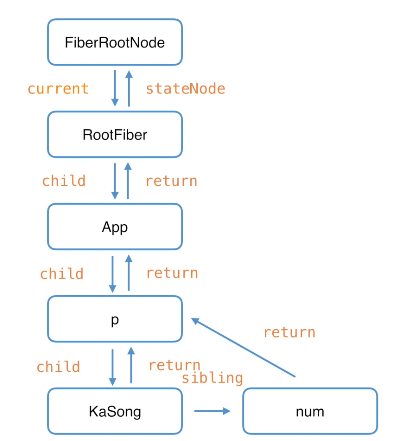
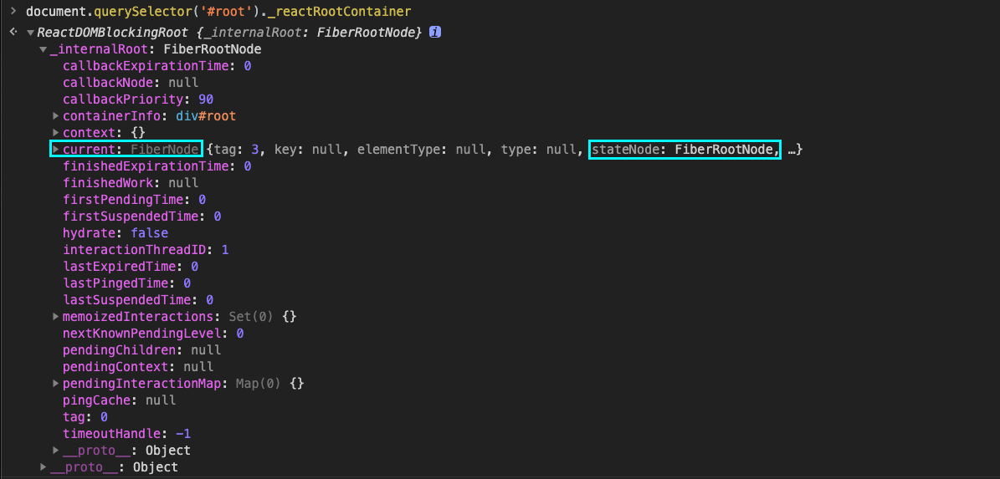
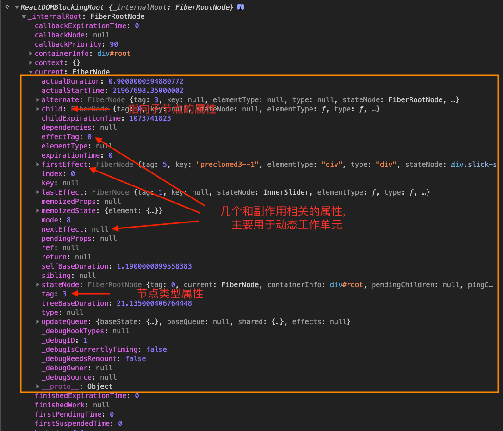
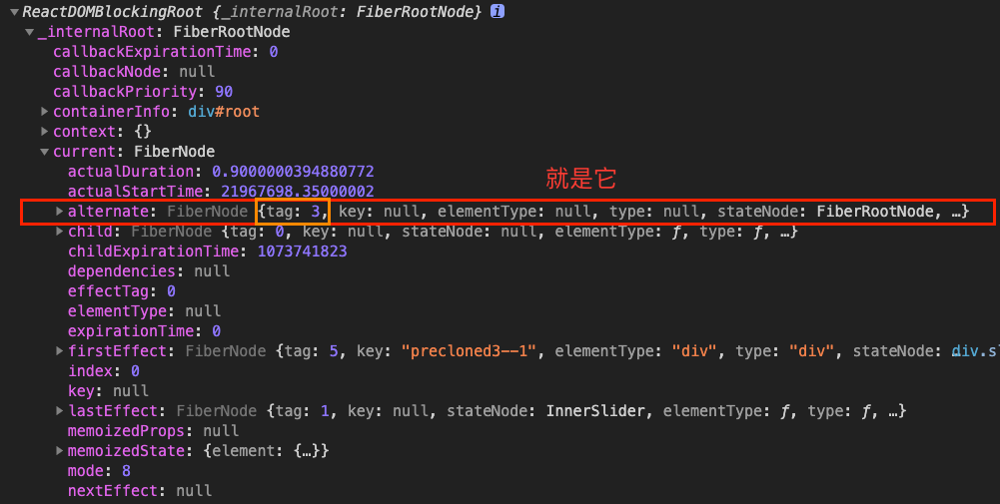
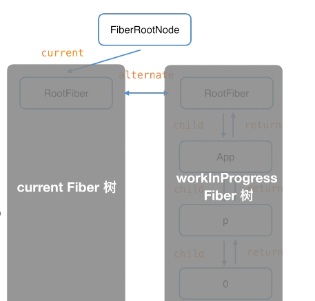
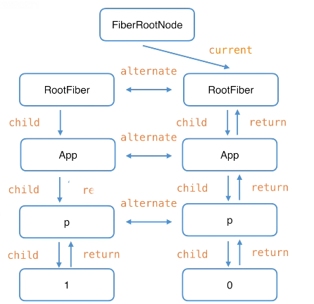

# React Fiber

Fiber 是践行代数效应的产物。

Fiber 一般指的是 Fiber 架构，fiber 代表数据结构。

## 1. 为何需要 Fiber

React 的使命是"快速构建用户界面"。

React 15 之前，组件的更新是同步的，这样可能会阻塞浏览器的渲染，影响体验。

所以，React 团队想要组件可以异步更新，且必须满足：

- <span style="color: #ff0000; font-size: 16px;">1. 更新可以暂停和继续</span>
- <span style="color: #ff0000; font-size: 16px;">2. 更新要有优先级，高优先级可以打断低优先级</span>。

JS 中实现代码暂停的是 <code style="color: #708090; background-color: #F5F5F5; font-size: 18px">generator</code>.

generator 可以完成第一条，但是无法实现第二条。

而且，generator 有传染性，想使用 generator 的话别的函数必须使用它的语法。

基于以上两点，React 团队开发出了一个新的架构 Fiber。

## 2. Fiber 是什么

Fiber 这个词不是 React 团队创造的。

Fiber(纤程) 和系统中的进程、线程，以及 generator 的 协程是不同的。

维基百科中的定义：**在计算机科学中，纤程（英语：Fiber）是一种最轻量化的线程（lightweight threads）。它是一种用户态线程（user thread），让应用程序可以独立决定自己的线程要如何运作。操作系统内核不能看见它，也不会为它进行调度。**

### 2.1 指 Fiber 架构（Fiber Reconciler）

扯远了，React 中的 Fiber 是指 Fiber 架构。

<span style="color: #ff0000; font-size: 16px;">Fiber 架构就是 Fiber Reconciler，它是一套协调计算组件更新变化的方法</span>。

### 2.2 指 fiberNode（Fiber Reconciler）

fiber 是指数据结构。

此时，一个 fiberNode 对应一个组件。

fiberNode 中保存了组件的数据。

此时的 **fiberNode 就是我们所说的 <span style="color: #ff0000; font-size: 16px;">虚拟 DOM</span>**。

例如：

```js
function App() {
  const [num, addNum] = useState(0);
  return <p>hello{num}</p>;
}

ReactDOM.render(<App />, document.getElementById("root"));
```

我们调用 ReactDOM.render, React 会创建应用唯一的根节点：FiberRootNode；

每调用一次 ReactDOM.render, React 会创建一个 RootFiber,并将其挂载到 FiberRootNode 上；

然后会创建一个函数组件 App 的 fiberNode；

接着会创建 p 元素和文本节点 hello。

**父节点通过 child 属性连接子节点；**

**父节点通过 return 属性连接子节点；**

为何用 return，而不用 parent 呢？是不是有点奇怪？

因为 React 中<span style="color: #ff0000; font-size: 16px;">对 fiberNode 的遍历是深度优先递归的，递的阶段先从父节点遍历到子节点，归的阶段子节点返回父节点，所以用 return</span>。

_fiberNode 关系图：_



如果有一个 React 项目，且它的根节点 id 是“root”，我们可以通过如下命令看到 FiberRootNode。

```js
document.querySelector("#root")._reactRootContainer;
```

_FiberRootNode：_



### 2.3 指 fiber 动态工作单元

我们来看一个具体的 fiberNode（RootFiber）：

_RootFiber：_



## 3. Fiber 工作机制 -- 双缓存

机智的你可能发现，上面的容器根 fiberNode(RootFiber)上还有一个<code style="color: #708090; background-color: #F5F5F5; font-size: 18px">tag = 3</code>的 fiberNode。

_RootFiber 的 alternate：_



alternate 的意思是“交替”，每个 fiberNode 上都有这个属性，**两个 Fiber 节点通过它来共享一些属性**。

我想你已经明白了，它就是双缓存中**用于交替 RootFiber 的 fiberNode**。

**首屏渲染时的 Fiber 逻辑：**

1. React 创建 FiberRootNode 这个 Fiber 根；
2. React 创建 容器的根 Fiber 节点（RootFiber），FiberRootNode 的 current 指向它，它叫 CurrentFiber；
3. 因为首屏渲染页面没有元素，所以 RootFiber 下没有子节点；
4. 开始首屏渲染，再创建一个根 Fiber 节点（RootFiber）,两个 RootFiber 通过 alternate 属性连接；
5. 接着，根据组件内容深度优先创建一个新的 Fiber 树,叫 workProgressFiber
6. 然后渲染新的 Fiber 树（workProgressFiber）
7. 新的 Fiber 树渲染后，FiberRootNode 会改变 current 指向新的 RootFiber, workProgressFiber 就变成了新的 CurrentFiber；
8. 这样就完成了一次交替

_首屏渲染 fiber 树：_



假如，我们通过点击按钮触发了组件更新，会新建一棵 Fiber 树(新的 workProgressFiber)，新的 workProgressFiber 会基于 CurrentFiber 创建。

当前 CurrentFiber 的中的所有 fiberNode 的 alternate 属性指向上一个 CurrentFiber 的相应的 FiberNode,

_更新组件渲染 fiber 树：_



**将 CurrentFiber 和更新所生成的 React Element（一般根据 JSX 生成）做对比，生成新的 workProgressFiber 的算法就是 <span style="color: #ff0000; font-size: 16px;">diff 算法</span>。**🌟🌟🌟
