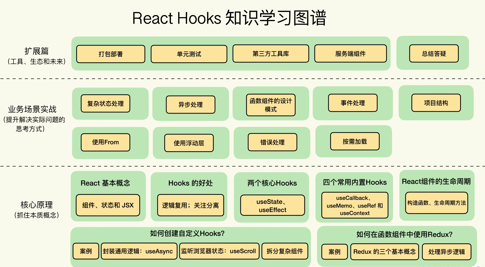

# 一文读懂 React Hooks

> Hook 为已知的 React 概念提供了更直接的 API：props， state，context，refs 以及生命周期。

_React Hooks 学习图谱_



## 1. 为什么需要 Hooks

### 1.1 React 组件之间状态复用很难

### 1.2 Class Component 复杂组件变得难以理解

<code style="color: #708090; background-color: #F5F5F5; font-size: 18px">Class Component</code>是有**状态**和**生命周期**的，所以，复杂一些的组件往往用 Class Component 来实现。

这样往往会导致组件很复杂，难以理解，如：

- 生命周期中的逻辑毫不相关,如：

  - componentDidMount 和 componentDidUpdate 用来获取数据；

  - 设置多个事件监听，然后必须在 componentWillUnmount 清除所有监听；

然而，多数情况下，我们无法再把组件拆分成更小的<code style="color: #708090; background-color: #F5F5F5; font-size: 18px">粒度</code>，因为<span style="color: #ff0000; font-size: 16px;">状态逻辑无处不在</span>。

## 3. 于是出现了 React Hook

**目前写 React 组件的两种方式**：

- Class Component（类组件）

  有生命周期，有状态，可以胜任复杂组件。

- Function Component（函数组件）

  简单易用效率高，但是**无生命周期**、**无状态**，无法胜任复杂组件。

React 官方文档里写了他们开发 Hook 的[动机](https://zh-hans.reactjs.org/docs/hooks-intro.html#motivation)，动机恰恰正是 Hook 要解决的问题：

- 在组件之间复用状态逻辑很难：Hook 使你在无需修改组件结构的情况下复用状态逻辑
- 复杂组件变得难以理解，特别是 state 无处不在，往往需要引入 Redux 等状态管理库：Hook 将组件中相互关联的部分拆分成更小的函数（比如设置订阅或请求数据）
- 难以理解的 class：Hook 使你在非 class 的情况下可以使用更多的 React 特性

我们知道，React 的架构遵循 schedule - render - commit 的运行流程，这个流程是 React 世界最底层的运行规律。

<code style="color: #708090; background-color: #F5F5F5;">ClassComponent</code> 作为 React 世界的原子，他的生命周期（componentWillXXX/componentDidXXX）是为了介入 React 的运行流程而实现的更上层抽象，这么做是为了方便框架使用者更容易上手。

函数组件又叫<code style="color: #708090; background-color: #F5F5F5;">“无状态组件”</code>，在它内部是不能使用 state 的，虽然效率更高，但缺点也足够致命。

所以，我们的组件基本都是 <code style="color: #708090; background-color: #F5F5F5;">ClassComponent</code> 组织起来的，如果组件很简单，那就用纯函数写的<code style="color: #708090; background-color: #F5F5F5;">无状态组件</code>作为一个补充。

在 React 中，我们可以说<code style="color: #708090; background-color: #F5F5F5;">ClassComponent</code> 是一类原子。

那么，<span style="color: #ff0000; font-size: 16px;">Hook 在 React 中就是电子，能在函数组件中更细粒度控制 React 组件</span>。

Hook 拥抱了函数，是我们在<code style="color: #708090; background-color: #F5F5F5;">函数组件</code>里可以使用几乎所有<code style="color: #708090; background-color: #F5F5F5;">ClassComponent</code>的特性。

## 4. React Hook 是什么

[React Hook](https://zh-hans.reactjs.org/docs/hooks-overview.html#but-what-is-a-hook)是一些可以让你在<code style="color: #708090; background-color: #F5F5F5;">函数组件</code>里<span style="color: #ff0000; font-size: 16px;">“钩入” React state 及生命周期等特性的函数</span>。

我们来分析下 React 官方给的这个定义。

**React Hook 是 函数**。

是什么样的函数？

是在函数组件里“钩入” <code style="color: #708090; background-color: #F5F5F5;">React state</code> 及<code style="color: #708090; background-color: #F5F5F5;">生命周期</code>等特性的函数。

那么 **React 的特性**就很好理解了：

> 1. 只能写在函数组件中
>
> 2. 可以用它来“钩入”React state 及*生命周期*等特性

## 5. React Hook 分类和使用

React Hook 大致可以分为 4 种：

- **State Hook**:

  可以让你<span style="color: #ff0000; font-size: 16px;">在函数组件中使用 state</span>

- **Effect Hook**:

  可以让你<span style="color: #ff0000; font-size: 16px;">在函数组件中执行副作用操作</span>

- **自定义 Hook**:

  可以<span style="color: #ff0000; font-size: 16px;">将组件逻辑提取到可重用的函数中</span>

- **其他 Hook**:

### 5.1 State Hook

React 内置了一些像 <code style="color: #708090; background-color: #F5F5F5;">useState</code> 这样的 <code style="color: #708090; background-color: #F5F5F5;">Hook</code>，它是 <code style="color: #708090; background-color: #F5F5F5;">State Hook</code>。

```js
import React, { useState } from "react";

function Example() {
  // 声明一个叫 “count” 的 state 变量
  // 设置了 “count” 初始化值为 0
  // 改变 “count” 可以使用 setCount 这个函数
  const [count, setCount] = useState(0);

  return (
    <div>
      <p>You clicked {count} times</p>
      <button onClick={() => setCount(count + 1)}>Click me</button>
    </div>
  );
}
```

### 5.2 Effect Hook

**useEffect 作用？**

React 会<span style="color: #ff0000; font-size: 16px;">保存你传递的函数（我们将它称之为 “effect”），并且在执行 DOM 更新之后调用它</span>。

> 在 React 组件中执行过数据获取、订阅或者手动修改过 DOM。我们统一把这些操作称为<code style="color: #708090; background-color: #F5F5F5;">“副作用</code>”，或者简称为<code style="color: #708090; background-color: #F5F5F5;">“作用(Effect)”</code>。

#### 5.2.1 什么是副作用

<code style="color: #708090; background-color: #F5F5F5;">副作用</code>是函数执行中和返回值无关或改变返回值的操作。

如：console.log()、Ajax 获取数据并调用 setState 更新状态。

以上操作 console.log 和返回值无关，Ajax 请求的数据会使得函数返回不确定的值，因此都算是副作用。

<code style="color: #708090; background-color: #F5F5F5;">useEffect</code> 就是一个 [Effect Hook](https://zh-hans.reactjs.org/docs/hooks-overview.html#effect-hook)，给函数组件增加了操作副作用的能力。

**当你调用 useEffect 时，就是在告诉 React 在<span style="color: #ff0000; font-size: 16px;">完成对 DOM 的更改后</span>运行你的“副作用”函数**。

useEffect 和 class 组件中的 <code style="color: #708090; background-color: #F5F5F5; font-size: 18px">componentDidMount</code>、<code style="color: #708090; background-color: #F5F5F5; font-size: 18px">componentDidUpdate</code> 和 <code style="color: #708090; background-color: #F5F5F5; font-size: 18px">componentWillUnmount</code> **具有相同的用途**，只不过被合并成了一个 API。

例如，下面这个组件在 React 更新 DOM 后会设置一个页面标题：

```js
import React, { useState, useEffect } from "react";

function Example() {
  const [count, setCount] = useState(0);

  // 相当于 componentDidMount 、 componentDidUpdate 和 componentWillUnMount 的组合
  // 挂载和更新都会执行这个副作用
  useEffect(() => {
    // 使用浏览器的 API 更新页面标题
    document.title = `You clicked ${count} times`;
  });

  return (
    <div>
      <p>You clicked {count} times</p>
      <button onClick={() => setCount(count + 1)}>Click me</button>
    </div>
  );
}
```

#### 5.2.2 useEffect 的使用

_源码中的 useEffect：_

```ts
function useEffect(effect: EffectCallback, deps?: DependencyList): void;
```

useEffect 接收两个参数：

- **effect**(Function)：可以返回清理函数的执行函数

- **deps**(Array): 可选，effect 更新的依赖，只有当列表中的值发生变化时，effect 才会执行

  deps 为空数组“[]”时代表只有挂载时执行

_示例：_

```js
useEffect(() => {
  // 执行函数获取数据并更新数据
  fetch(url)
    .then((res) => res.json())
    .then(updateData())
    .catch((err) => console.log(err));

  // 返回清理函数
  // 会在调用一个新的 effect 之前对前一个 effect 进行清理
  // 一般不需要我们手动清理，关于这部分问题请看官方文档，有详细介绍
  return () => {
    resetData();
  };
});
```

#### 5.2.3 useEffect 特性 📢

**1. useEffect 会在每次组件更新后执行**

例如：我们 setState 引起了组件更新，那么 useEffect 就会执行。

显然，这样有时是不合理的，我们应该尽量减少 effect 的默认更新。

**2. deps 为空[] 时，effect 只在 mount 和 unmount 时执行**

```ts
useEffect(() => {
  // do Something
}, []);
```

**3. deps 是不为空的[] 时，effect 只在 deps 里的状态值发生变化时执行。**

```ts
// mount 发生变化时才会执行
useEffect(() => {
  // do Something
}, [mount])；
```

#### 5.2.4 useEffect 中使用异步函数

_示例：_

```js
useEffect(() => {
  // 异步函数包裹一下业务
  const fetchData = async () => {
    const resData = await fetch(url);
    const data = await resData.json();
    // 操作data
    setData(data);
  };

  // 手动执行函数
  fetchData();
});
```

#### 5.2.5 useEffect 的好处

- **1. 使用多个 Effect 实现关注点分离**

  这个可以解决把过多副作用都放到 componentDidMount 中的问题，解决<code style="color: #708090; background-color: #F5F5F5;">“复杂组件变得难以理解”</code>的问题。

  我们可以使用多个 useEffect 来处理不同的逻辑，以此实现关注点分离。

- **2. 通过跳过 Effect 进行性能优化**

  你可以通知 React 跳过对 effect 的调用，只要传递数组作为 useEffect 的第二个可选参数即可

#### 5.2.6 useEffect 是如何实现的

**useEffect(effect, deps)**函数里的<code style="color: #708090; background-color: #F5F5F5; font-size: 18px">Effect</code>在 React 内部是一个*链表*结构，React 会在每次 DOM 更新后调用需要执行的<code style="color: #708090; background-color: #F5F5F5; font-size: 18px">Effect</code>。

### 5.3 useContext

#### 5.3.1 React 跨组件数据传递的 props drilling 问题

_父组件传数据给子组件：Props_

```js
class App extends React.Component {
  render() {
    return <Toolbar theme="dark" />;
  }
}

function Toolbar(props) {
  // Toolbar 组件接受一个额外的“theme”属性，然后传递给 ThemedButton 组件。
  // 如果应用中每一个单独的按钮都需要知道 theme 的值，这会是件很麻烦的事，
  // 因为必须将这个值层层传递所有组件。
  return (
    <div>
      <ThemedButton theme={props.theme} />
    </div>
  );
}

class ThemedButton extends React.Component {
  render() {
    return <Button theme={this.props.theme} />;
  }
}
```

我们想要的数据是“theme”，它要在 3 个组件之间通过 **props** 来传递 APP -> Toolbar -> ThemedButton;

最终我们会在 **组件 ThemedButton** 使用这个数据。

这样 **组件 Toolbar** 就做了一件没意义的事： **虽然没有使用“theme”，还是要传递这个值给子组件**。

这个问题叫做[props drilling(深度注入)](https://medium.com/front-end-weekly/props-drilling-in-react-js-723be80a08e5).

#### 5.3.2 Context

[Context](https://zh-hans.reactjs.org/docs/context.html) 设计目的是为了共享那些对于一个组件树而言是“全局”的数据，例如当前认证的用户、主题或首选语言。

```js
const themes = {
  light: {
    foreground: "#000000",
    background: "#eeeeee",
  },
  dark: {
    foreground: "#ffffff",
    background: "#222222",
  },
};
// Context 可以让我们无须明确地传遍每一个组件，就能将值深入传递进组件树。
// 为当前的 theme 创建一个 context（“light”为默认值）。
const ThemeContext = React.createContext(themes.light);

class App extends React.Component {
  render() {
    // 使用一个 Provider 来将当前的 theme 传递给以下的组件树。
    // 无论多深，任何组件都能读取这个值。
    // 在这个例子中，我们将 “dark” 作为当前的值传递下去。
    return (
      <ThemeContext.Provider value="dark">
        <Toolbar />
      </ThemeContext.Provider>
    );
  }
}

// 中间的组件再也不必指明往下传递 theme 了。
function Toolbar() {
  return (
    <div>
      <ThemedButton />
    </div>
  );
}

class ThemedButton extends React.Component {
  // 指定 contextType 读取当前的 theme context。
  // React 会往上找到最近的 theme Provider，然后使用它的值。
  // 在这个例子中，当前的 theme 值为 “dark”。
  static contextType = ThemeContext;
  render() {
    return <Button theme={this.context} />;
  }
}
```

#### 5.3.3 useContext

React Hook 提供了一个<code style="color: #708090; background-color: #F5F5F5;">useContext</code>**Hook 函数**,

它接收一个 context 对象（<code style="color: #708090; background-color: #F5F5F5;">React.createContext</code> 的返回值）并返回该 context 的当前值。

当前的 context 值由上层组件中距离当前组件最近的 <MyContext.Provider> 的 value prop 决定。

当组件上层最近的 <MyContext.Provider> 更新时，该 Hook 会触发重渲染，并使用最新传递给 MyContext provider 的 context value 值。

> useContext(MyContext) 相当于 class 组件中的 static contextType = MyContext 或者 <MyContext.Consumer>。
> useContext(MyContext) 只是让你能够读取 context 的值以及订阅 context 的变化。你仍然需要在上层组件树中使用 <MyContext.Provider> 来为下层组件提供 context。

_将上面的 class 组件改为函数组件：_

```js
function App() {
  return (
    // 父组件依然需要提供 ThemeContext.Provider
    <ThemeContext.Provider value={themes.dark}>
      <Toolbar />
    </ThemeContext.Provider>
  );
}

function Toolbar(props) {
  return (
    <div>
      <ThemedButton />
    </div>
  );
}

function ThemedButton() {
  // 子组件通过 useContext 获取 ThemeContext
  const theme = useContext(ThemeContext);
  return (
    <button style={{ background: theme.background, color: theme.foreground }}>
      I am styled by theme context!
    </button>
  );
}
```

#### 5.3.4 useContext 是如何实现的

todo...

### 5.4 自定义 Hook

> 自定义 Hook 更像是一种约定而不是功能。

<code style="color: #708090; background-color: #F5F5F5;">自定义 Hook</code> 可以在组件之间重用一些状态逻辑。

如果函数的名字以 “use” 开头并调用其他 Hook，我们就说这是一个自定义 Hook。

[自定义 Hook](https://zh-hans.reactjs.org/docs/hooks-overview.html#building-your-own-hooks)的作用是不增加组件的情况下，像 <code style="color: #708090; background-color: #F5F5F5;">高阶组件</code>和 <code style="color: #708090; background-color: #F5F5F5;">render props</code> 一样，解决**函数组件**之间重用一些状态的问题。

具体示例，请看[官网示例](https://zh-hans.reactjs.org/docs/hooks-custom.html)，解释的比较清楚，这里不再赘述。

**需要注意** ⚠️：

- 定义 Hook 必须以 “use” 开头

- 在两个组件中使用相同的 Hook **不会共享 state**，只是重用了自定义 Hook 的代码而已

- 每次调用自定义 Hook，它都会获取独立的 state（像多次调用 useState 一样）

### 5.5 其他 Hook

还有一些使用频率较低的但是很有用的 Hook,查看[Hook 索引](https://zh-hans.reactjs.org/docs/hooks-reference.html)。

比如， useReducer 可以让你通过 reducer 来管理组件本地的复杂 state

```js
function Todos() {
  const [todos, dispatch] = useReducer(todosReducer);
  // ...
}
```

[React Hook 的使用](https://zh-hans.reactjs.org/docs/hooks-state.html) 还是看官方文档吧，这里没必要复述了。

## 6. React Hook 工作原理解析

todo...

## 7. 手动实现一个 useState 方法

todo...

## 参考

[React 官方文档](https://zh-hans.reactjs.org/docs/hooks-intro.html)

[React 技术揭秘-Hook](https://react.iamkasong.com/hooks/prepare.html)

[一篇看懂 React Hook](https://zhuanlan.zhihu.com/p/50597236)

[一文吃透 react-hooks 原理](https://juejin.cn/post/6944863057000529933)
