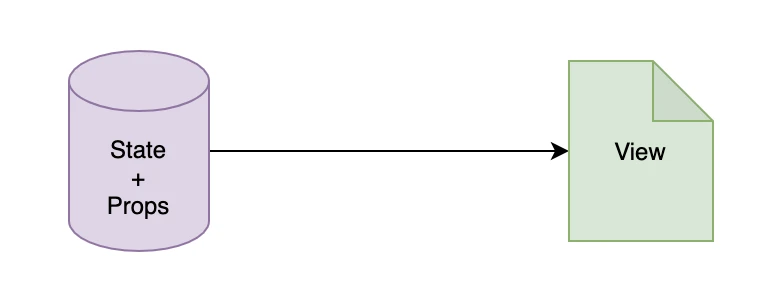
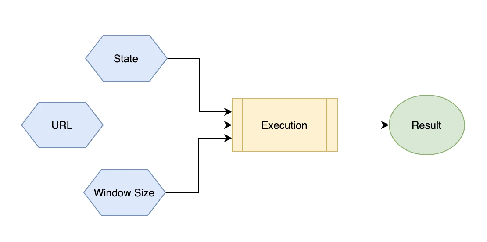

# Hooks

## 1. Hooks 的诞生

React 的哲学之一是**数据驱动**。



在 Hooks 诞生之前，React 使用面向对象的 Class 组件来处理**state**。

其实 Class 并不适合**数据驱动**。

1. Class 的最大好处是**继承**，可是 React 推荐的组件方式是**组合**；

2. Class 的另一个好处是可以使用*实例的熟悉和方法*来保存数据，可是我们一般是不会在外部调用*实例的熟悉和方法*；

React 出现前，调用组件的方式往往是：dialog.show(), dialog.hide() 这样的方式细粒度地去控制 UI 的变化。

**函数组件**就显得比较合适了。新的问题是，**函数组件**如何保存数据？

> 于是，Hooks 就诞生了。

## 2. Hooks

如果我们想要让函数组件更有用，目标就是<span style="color: #ff0000; font-size: 16px;">给函数组件加上状态</span>。

所以，**Hooks 的机制**就是：

> 1. 把某个目标结果*钩到*某个可能会变化的数据源或者事件源上;
>
> 2. 当被钩到的数据或事件发生变化时，产生这个目标结果的代码(钩子函数)会重新执行
>
> 3. 产生更新后的结果(DOM 树)

_Hooks 工作原理_



## 3. Hooks 优势

需要特别注意，Hooks 中*被钩的对象*，不仅可以是某个独立的数据源，也可以是另一个 Hook 执行的结果，这就带来了 Hooks 的最大好处：<span style="color: #ff0000; font-size: 16px;">逻辑的复用</span>。

### 3.1 最大优势：逻辑复用

> Hooks 带来的最大好处：逻辑复用。

_Class 实现逻辑复用_

第一步：定义一个高阶函数，获取监听窗口变化，并把结果传递给子组件

```js
const withWindowSize = Component => {
  // 产生一个高阶组件 WrappedComponent，只包含监听窗口大小的逻辑
  class WrappedComponent extends React.PureComponent {
    constructor(props) {
      super(props);
      this.state = {
        size: this.getSize()
      };
    }
    componentDidMount() {
      window.addEventListener("resize", this.handleResize);
    }
    componentWillUnmount() {
      window.removeEventListener("resize", this.handleResize);
    }
    getSize() {
      return window.innerWidth > 1000 ? "large" ："small";
    }
    handleResize = ()=> {
      const currentSize = this.getSize();
      this.setState({
        size: this.getSize()
      });
    }
    render() {
      // 将窗口大小传递给真正的业务逻辑组件
      return <Component size={this.state.size} />;
    }
  }
  return WrappedComponent;
};
```

```js
class MyComponent extends React.Component {
  render() {
    const { size } = this.props;
    if (size === "small") return;
    else return;
  }
}
// 使用 withWindowSize 产生高阶组件，用于产生 size 属性
export default withWindowSize(MyComponent);
```

_Hooks 实现同样功能_

第一步：定义一个 Hooks

```js
const getSize = () => {
  return window.innerWidth > 1000 ? "large" : "small";
};
const useWindowSize = () => {
  const [size, setSize] = useState(getSize());
  useEffect(() => {
    const handler = () => {
      setSize(getSize());
    };
    window.addEventListener("resize", handler);
    return () => {
      window.removeEventListener("resize", handler);
    };
  }, []);

  return size;
};
```

第二步：使用 Hooks

```js
const Demo = () => {
  const size = useWindowSize();
  if (size === "small") return <SmallComponent />;
  else return <LargeComponent />;
};
```

### 3.2 好处二：有助于关注点分离

仍然以上面监听浏览器窗口大小的变化为例，我们来看 Hooks 是如何做到关注分离的。

在过去的 Class 组件中，我们需要在 componentDidMount 中监听事件，在 componentWillUnmount 中去解绑事件。

而在函数组件中，我们可以把*所有逻辑写在一起*。

**Class 组件和 Hooks 最大区别**：

- Class 组件中，代码是从技术角度组织在一起的（例如在 componentDidMount 中都去做一些初始化的事情）。
- 函数组件中，代码是从业务角度组织在一起的，相关代码能够出现在集中的地方，从而更容易理解和维护。

## 4. 内置 Hooks

### 4.1 useState: 让函数组件有状态

```js
useState(initialState);
```

**使用原则**:

- 1. state 中永远<span style="color: #ff0000; font-size: 16px;">不要保存可以通过计算得到的值</span>

  如：props 传递过来的值、从 URL 中读到的值、从 cookie、localStorage 中读取的值

### 4.2 useEffect: 执行副作用

### 4.3 useCallback: 缓存回调函数

> useCallback(fn, deps)

首先需要明确的是：

> React 函数组件中，每一次 UI 的变化，都是通过**重新执行整个函数**来完成的.

所以，像下面这样，函数*handleIncrement*会在每次更新时重新创建一遍。

有两个弊端：

- 1. 每次创建新的函数，增加不必要的开销
- 2. 更重要的是：每次创建新函数会让接收事件处理函数的组件，**需要重新渲染**

```js
function Counter() {
  const [count, setCount] = useState(0);
  const handleIncrement = () => setCount(count + 1);
  // ...
  return <button onClick={handleIncrement}>+</button>;
}
```

_使用 useCallback 进行性能优化_

```js
import React, { useState, useCallback } from "react";

function Counter() {
  const [count, setCount] = useState(0);
  const handleIncrement = useCallback(
    () => setCount(count + 1),
    [count] // 只有当 count 发生变化时，才会重新创建回调函数
  );
  // ...
  return <button onClick={handleIncrement}>+</button>;
}
```

### 4.4 useMemo：缓存计算的结果

> useMemo(fn, deps);

fn 是产生所需数据的一个*计算函数*。

通常来说，fn 会使用 deps 中声明的一些变量来生成一个结果，用来渲染出最终的 UI。

> 如果某个数据是通过其它数据计算得到的，那么只有当用到的数据，也就是**依赖的数据发生变化**的时候，才应该需要重新计算。

如：列表中搜索用户名，显示用户信息

```js
// 使用 userMemo 缓存计算的结果
const usersToShow = useMemo(() => {
    if (!users) return null;
    return users.data.filter((user) => {
      // 缓存的是这里的计算结果🌟🌟
      return user.first_name.includes(searchKey));
    }
  }, [users, searchKey]);
//...
```

userMemo 避免了因为其他更新而导致的<span style="color: #ff0000; font-size: 16px;">重复计算</span>。

**useMemo**与**useCallback**的关系：

> 一个是缓存*结果*，一个是缓存*函数*；

如果*useMemo*返回的是**函数**，那么，可以认为二者是等效的。

*useMemo*实现了*useCallback*:

```js
const myEventHandler = useMemo(() => {
  // 返回一个函数作为缓存结果
  return () => {
    // 在这里进行事件处理
  };
}, [dep1, dep2]);
```

### 4.5 useRef：在多次渲染之间共享数据

在类组件中，我们可以定义类的成员变量，以便能*在对象上通过成员属性去保存一些数据*。

但是在函数组件中，是没有这样一个空间去保存数据的。

因此，使用**useRef**来保存数据。

我们可以把 useRef 看作是*在函数组件之外创建的一个容器空间*。

_使用 useRef 定义一个 timer_

```js
import React, { useState, useCallback, useRef } from "react";

export default function Timer() {
  // 定义 time state 用于保存计时的累积时间
  const [time, setTime] = useState(0);

  // 定义 timer 这样一个容器用于在跨组件渲染之间保存一个变量
  const timer = useRef(null);

  // 开始计时的事件处理函数
  const handleStart = useCallback(() => {
    // 使用 current 属性设置 ref 的值
    timer.current = window.setInterval(() => {
      setTime((time) => time + 1);
    }, 100);
  }, []);

  // 暂停计时的事件处理函数
  const handlePause = useCallback(() => {
    // 使用 clearInterval 来停止计时
    window.clearInterval(timer.current);
    timer.current = null;
  }, []);

  return (
    <div>
      {time / 10} seconds.
      <br />
      <button onClick={handleStart}>Start</button>
      <button onClick={handlePause}>Pause</button>
    </div>
  );
}
```

> 使用 useRef 保存的数据一般是和 UI 的渲染无关的，当 ref 的值发生变化时，是不会触发组件的重新渲染的，这也是 useRef 区别于 useState 的地方。

useRef 另一个作用是：**保存某个 DOM 节点的引用**。

```js
function TextInputWithFocusButton() {
  const inputEl = useRef(null);
  const onButtonClick = () => {
    // current 属性指向了真实的 input 这个 DOM 节点，从而可以调用 focus 方法
    inputEl.current.focus();
  };
  return (
    <>
      <input ref={inputEl} type="text" />
      <button onClick={onButtonClick}>Focus the input</button>
    </>
  );
}
```

### 4.6 useContext：定义全局状态

React 组件之间的状态传递**只有一种方式**，那就是通过 props。即：这种传递关系*只能在父子组件之间进行*。

如何跨层次，或者同层的组件之间要进行数据的共享呢？答案是：<span style="color: #ff0000; font-size: 16px;">全局状态管理</span>。

Context 是这样一个机制：

1. 在某个组件父组件树上创建一个 Context
2. 所有子组件，就都能*访问*和*修改*这个 Context 了
