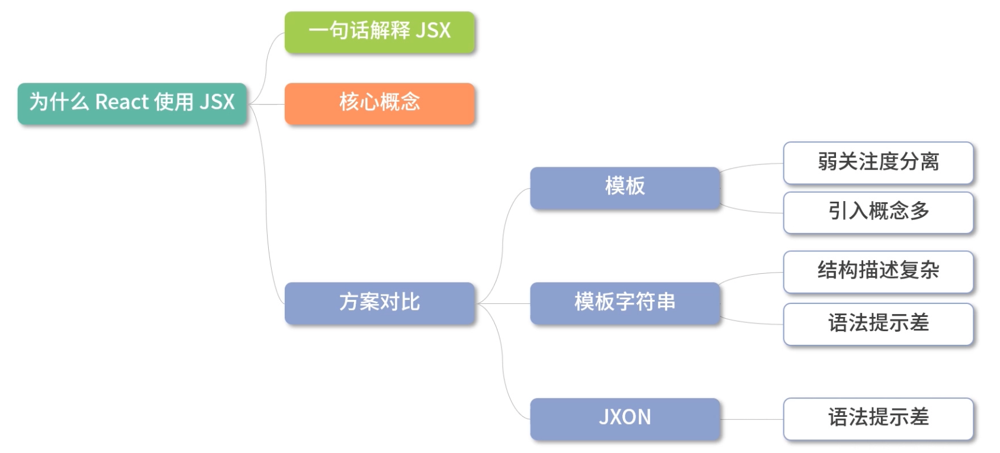
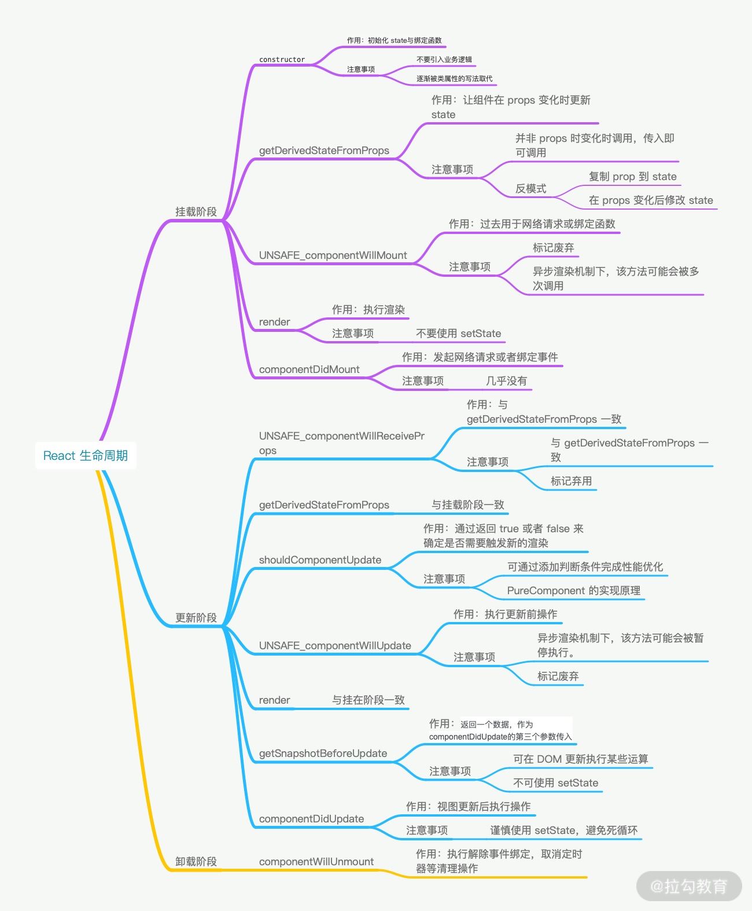
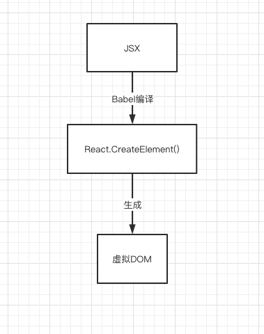
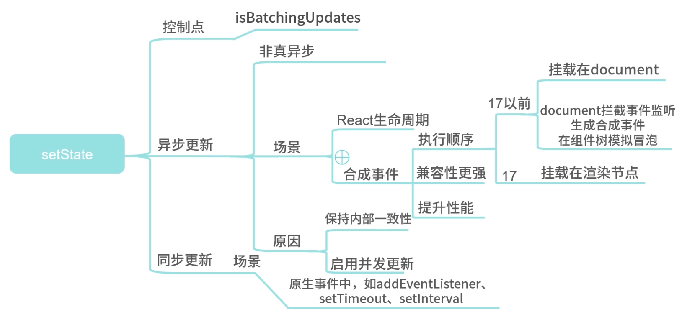
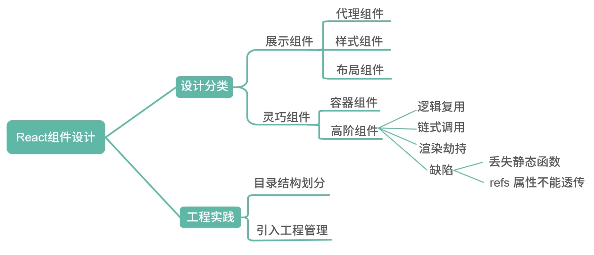

# React 常见面试题

## 0.理论篇

### 0.1 为什么选择 React？

- 1. 数据驱动 UI，摆脱直接操作 DOM
- 2. JSX 灵活易用，实现组件化很简单
- 3. 生态强大且不断进步

### 1. React 基本工作原理

<span style="color: #ff0000; font-size: 16px;">React 的基本思维模式是每次有变动就重新渲染整个应用</span>。

对，你没看错。

变动 React 应用的方式有 3 种：

- New Props
- setState()
- forceUpdate()

**他们都会导致整个应用重新渲染**。

### 2. 每次有变动就重新渲染整个应用，效率岂不是很低？

一般不会。

要知道 React 是用来构建<code style="color: #708090; background-color: #F5F5F5; font-size: 18px">前端应用</code>的，尤其是 SPA，如果你的需求就是只有三个页面的静态页面，那请直接原生 JS 写吧（JQuery 效率更高）。

不会感觉很慢的原因之一是有 <code style="color: #708090; background-color: #F5F5F5; font-size: 18px">Virtual DOM</code> 和 <code style="color: #708090; background-color: #F5F5F5; font-size: 18px">Diff 算法</code>。

React 16 之后引进的 <code style="color: #708090; background-color: #F5F5F5; font-size: 18px">Fiber Reconciler</code> 架构，和未来的 <code style="color: #708090; background-color: #F5F5F5; font-size: 18px">concurrent 模式</code>会大大优化“快”的体验。

React 想要做的是让用户感觉到“更快”。

需要明确的是，代码运行的快是相对。

任何框架都没有原生 JS 运行效率高，“可维护性”和“性能”是要做取舍的。

但目前 React 是世界上做的做的最好的 JS 库之一。


### 3. Virtual DOM 是什么，让 React 更快吗

> 我觉得不应该这样问，应该问 Virtual DOM 是如何工作的。

<span style="color: #ff0000; font-size: 16px;">Virtual DOM 是个对象</span>。

看来 Virtual DOM 好像也就那样，并没有多么高大上。

Virtual DOM 的新架构 Fiber Reconciler（包含了 Diff 算法）才是 React 的精华。

这么说是显然对 Virtual DOM 有误解，因为设计 Virtual DOM 的目的从来都不是为了速度。

相关原因可以看这个知乎问答[网上都说操作真实 DOM 慢，但测试结果却比 React 更快，为什么？](https://www.zhihu.com/question/31809713)，尤雨溪 和 司徒正美 都做了相关回答，值得多读几遍。

**摘选几个经典回答：**

- 尤雨溪：

  > 在我看来 Virtual DOM 真正的价值从来都不是性能，而是它:
  >
  > 1. 为函数式的 UI 编程方式打开了大门；
  > 2. 可以渲染到 DOM 以外的 backend，比如 ReactNative

- 司徒正美：

  > 有了虚拟 DOM，我们是使用够轻量的对象代替超重对象作为直接操作主体，减少对超重对象的操作.
  >
  > 虚拟 DOM 不只是一个缓冲层，里面涉及大量算法，你可以使用 hash 或 KMP (Knuth-Morris-Pratt 算法），确保更新最少。

## 1. API 篇

### 1.1 说一下 React.PureComponent？

<code style="color: #708090; background-color: #F5F5F5; font-size: 18px">React.PureComponent</code> 和 <code style="color: #708090; background-color: #F5F5F5; font-size: 18px">React.Component</code> 很相似，区别在于 <code style="color: #708090; background-color: #F5F5F5; font-size: 18px">React.PureComponent</code> 实现了 <code style="color: #708090; background-color: #F5F5F5; font-size: 18px">shouldComponentUpdate()</code> 这个**生命周期函数**。

<code style="color: #708090; background-color: #F5F5F5; font-size: 18px">shouldComponentUpdate()</code> 会对 props 和 state 进行**浅层比较**，并减少了跳过必要更新的可能性。

## 2.概念篇

### 2.1 说说对 React 的理解

> 1.说说你对 React 的理解。

React 是一个 UI 框架，它的目标主要是让**大型 web 应用**做到“快速响应”;

它有三大特点：**声明式**、**组件化**和**通用性**；

**声明式**的优势是直观；

**组件化**的优势在于视图的拆分与模块复用，可以容易做到高内聚、低耦合；

**通用性**在于 React 会把组件生成**虚拟 DOM**，可以做到一次学习，随处编写。如 React DOM 可以用来写 Web 应用； React Native 可以写移动应用；React 360 可以用来做 VR，它们都是将虚拟 DOM 做不同的渲染。

此外，React 有丰富的生态，满足我们开发**大型 web 应用**应用，如 React-Router、Redux 等。

### 2.2 怎么理解 JSX

> 2.为什么 React 的声明式使用 JSX ？

参考: [JSX 简介](https://zh-hans.reactjs.org/docs/introducing-jsx.html#why-jsx)

<code style="color: #708090; background-color: #F5F5F5; font-size: 18px">JSX</code>是一个 JavaScript 的语法扩展，看上去像模板，但它具有 JavaScript 的全部功能。

<code style="color: #708090; background-color: #F5F5F5; font-size: 18px">JSX</code>可以很好地描述 UI 的本质形式。

React 认为**渲染逻辑**本质上与**UI 逻辑**内在耦合，如 UI 中需要绑定事件和展示准备好的数据、状态变化时需要通知到 UI。

React 没有将<code style="color: #708090; background-color: #F5F5F5; font-size: 18px">标记</code>与<code style="color: #708090; background-color: #F5F5F5; font-size: 18px">逻辑</code>认为分开（Angular 使用的模版则是认为将它们分开），而是通过将二者共同放在**组件**中，来实现<code style="color: #708090; background-color: #F5F5F5; font-size: 18px">关注点分离</code>。

_方案对比：_



---

**关注点分离**是一种面向对象程序设计的方法，如 React 通过<code style="color: #708090; background-color: #F5F5F5; font-size: 18px">组件</code>的**组合**形成一个复杂的 UI，一个个<code style="color: #708090; background-color: #F5F5F5; font-size: 18px">组件</code>就是<span style="color: #ff0000; font-size: 16px;">关注点</span>，通过把关注点分离可以**简化复杂 UI 的开发与维护**，**关注点(组件)复用**更加简单。

---

### 2.3 生命周期

> 3.了解 React 生命周期吗？

参考:[React life cycle](https://projects.wojtekmaj.pl/react-lifecycle-methods-diagram/)

**React 生命周期**是指 React 类组件的<code style="color: #708090; background-color: #F5F5F5; font-size: 18px">挂载</code>-> <code style="color: #708090; background-color: #F5F5F5; font-size: 18px">更新</code> -> <code style="color: #708090; background-color: #F5F5F5; font-size: 18px">卸载</code>这一完整流程。

**React 生命周期函数**是指在生命周期中**不同阶段**调用的特定函数。


_生命周期函数：_



### 2.4 生命周期的坑

> 4.了解 React 生命周期函数注意事项有哪些 ？

需要注意的事分为两类，分别是**生命周期函数使用错误**和**需要在特定的生命周期做处理却没做**。

- getDerivedStateFromProps 容易编写反模式代码，使受控组件与非受控组件区分模糊
- componentWillMount 在 React 中已被标记弃用，不推荐使用，主要原因是**新的异步渲染架构会导致它被多次调用**
- componentWillReceiveProps 同样被标记弃用，被 getDerivedStateFromProps 所取代，主要原因是**性能问题**
- shouldComponentUpdate 通过返回 true 或者 false 来确定是否需要触发新的渲染，主要用于**性能优化**
- componentWillUpdate 同样是由于新的异步渲染机制，而被**标记废弃**
- componentWillUnmount 函数中**忘记解除事件绑定、取消定时器等清理操作**引发性能问题或 Bug。

### 2.5 虚拟 DOM

> 1.虚拟 DOM 的作用是什么？

<code style="color: #708090; background-color: #F5F5F5; font-size: 18px">virtual Dom</code>的主要目的有两个：

- 隔离开发者与 DOM，提升大型前端应用的性能

  直接操作 DOM 是会是网站性能下降；

  React 基于虚拟 DOM 做了<code style="color: #708090; background-color: #F5F5F5; font-size: 18px">Diff</code> 与<code style="color: #708090; background-color: #F5F5F5; font-size: 18px">批处理</code>等，<span style="color: #ff0000; font-size: 16px;">降低操作 DOM 频次</span>，进而提升性能。

- 杜绝 XSS 攻击

  所有的内容都会被转译为成虚拟 DOM，而不是 HTML。

- 跨平台

> 2.虚拟 DOM 比直接操作 DOM 更快？

不是。

<code style="color: #708090; background-color: #F5F5F5; font-size: 18px">虚拟 DOM</code>是 React 提高整体应用性能中的一环。

任何框架都没有使用原生 JS 操作 DOM 快，React 要解决的是大型前端应用的性能问题。

就好比去楼下超市买瓶水，步行(原生 JS)往往会比开法拉利(React)要快。

> 3.虚拟 DOM 的工作原理是什么？

_虚拟 DOM 是什么：_



React 16 中使用了 Fiber 架构，<code style="color: #708090; background-color: #F5F5F5; font-size: 18px">virtual Dom</code>指的就是 Fiber 对象。

当应用更新时，React 会在 **render 阶段**当前操作的<code style="color: #708090; background-color: #F5F5F5; font-size: 18px">virtual Dom</code>和上次页面更新的<code style="color: #708090; background-color: #F5F5F5; font-size: 18px">virtual Dom</code>进行 Diff 运算（即 Diff 算法），得到二者的差异（即页面的变化）。

最后，会在**commit 阶段**将页面变化渲染。

> 4.虚拟 DOM 缺点

- 占用内存
- 无法进行极致优化（前面说了，不是任何时候都需要法拉利）

### 2.6 Diff 算法

> 1.了解 Diff 算法是什么吗？

> 2.如何基于 Diff 算法进行性能优化？

### 2.7 Function 与 Class 组件区别

> 6.React 的 Function Component 与 Class Component 区别？

一句话：两者本质上作为 UI 渲染时是没有区别的，区别在于**设计思想**和**心智模型**不同。

<code style="color: #708090; background-color: #F5F5F5; font-size: 18px">类组件</code>的思想是 <code style="color: #708090; background-color: #F5F5F5; font-size: 18px">OOP(面向对象编程)</code>，<code style="color: #708090; background-color: #F5F5F5; font-size: 18px">函数组件</code>的思想是<code style="color: #708090; background-color: #F5F5F5; font-size: 18px">FP(函数式编程)</code>。

**区别**：

- **函数组件**更纯粹、简单、易测试（本质区别）
- **类组件**通过生命周期包装业务逻辑
- 设计模式上**类组件**可以实现<code style="color: #708090; background-color: #F5F5F5; font-size: 18px">继承</code>，**函数组件**做不到

**未来趋势**：

<code style="color: #708090; background-color: #F5F5F5; font-size: 18px">函数组件</code>引入<code style="color: #708090; background-color: #F5F5F5; font-size: 18px">Hook</code>后功能大大增强，优点得到充分展现，将是主流方案。

_总结对比_：

- 作为组件而言：类组件与函数组件在使用与呈现上没有任何不同，性能上在现代浏览器中也不会有明显差异；
- 理解难易程度：类组件的业务逻辑被分散到生命周期中，有时难以理解；
- 上手难度：类组件的规范性更强，上手简单，函数组件相对比较松散；
- 未来趋势：React Hooks 的推出，生命周期概念的淡出，函数组件可以完全取代类组件；
- 性能优化：类组件主要依靠 shouldComponentUpdate  阻断渲染来提升性能；而函数组件依靠 React.memo 缓存渲染结果来提升性能；

### 2.8 React Hooks

> 1.React Hook 的使用限制有哪些？

> 2.useEffect 与 useLayoutEffect 区别？

> 3.谈谈 React Hook 的设计模式？

## 3. 源码篇

> 回答问题，有码有据。

### 3.1 setState 是同步还是异步？

> 答： 不一定。

React17 目前一共有 3 种模式：

- legacy 模式：ReactDOM.render(<App />, rootNode)。这是当前 React app 使用的方式，不支持 React 某些新功能
- blocking 模式： ReactDOM.createBlockingRoot(rootNode).render(<App />)。实验中，作为迁移到 concurrent 模式的第一个步骤，包含部分新特性
- concurrent 模式： ReactDOM.createRoot(rootNode).render(<App />)。实验中，未来稳定之后，打算作为 React 的默认开发模式。这个模式开启了所有的新功能。

legacy 模式是我们目前常用的模式，这种模式下，setState 是异步更新。

```js
import React from "react";
import ReactDOM from "react-dom";

class App extends React.Component {
  constructor(props) {
    super(props);
    this.state = {
      num: 0,
    };

    this.changeNum = this.changeNum.bind(this);
  }

  changeNum() {
    console.log("num1:", this.state.num);
    this.setState({ num: this.state.num + 1 });
    this.setState({ num: this.state.num + 1 });
    this.setState({ num: this.state.num + 1 });
    console.log("num2:", this.state.num);

    setTimeout(() => {
      console.log("num3:", num);
      this.setState({ num: this.state.num + 1 });
      console.log("num4:", num);
    });
  }

  render() {
    return <div onClick={this.changeNum}>{this.state.num}</div>;
  }
}

const rootElement = document.getElementById("root");
ReactDOM.render(
  <React.StrictMode>
    <App />
  </React.StrictMode>,
  rootElement
);

// 第1次点击
num1: 0;
num2: 0;
num3: 1; // 说明setTimeout 里的state是改变后的
num4: 2; // 说明setTimeout 里的setState是同步执行的
```

**为什么执行 3 次 this.setState({ num: this.state.num + 1 })，num 没有每次增加 3，而是每次加 1？**

因为 React 有个性能优化，会批量处理同一个事件中多次调用 setState 为一次，这叫做批处理。源码实现的方法是 batchedUpdates()。

```js
// React v17.0.2
// packages/react-reconciler/src/ReactFiberWorkLoop.old.js
export function batchedUpdates<A, R>(fn: (A) => R, a: A): R {
  const prevExecutionContext = executionContext;
  executionContext |= BatchedContext;
  try {
    return fn(a);
  } finally {
    executionContext = prevExecutionContext;
    if (executionContext === NoContext) {
      // Flush the immediate callbacks that were scheduled during this batch
      resetRenderTimer();
      flushSyncCallbackQueue();
    }
  }
}
```

React 每次更新都会执行 scheduleUpdateOnFiber(fiber,lane,eventTime) 这个函数。

scheduleUpdateOnFiber 接收的参数 lane 代表更新方式，legacy 模式下的更新方式是 SyncLane。

因此，scheduleUpdateOnFiber(fiber,lane,eventTime) 函数中会进入判断 if (lane === SyncLane) {} else {};

满足 executionContext === NoContext 时，会进入 if (executionContext === NoContext) {}，此时会同步更新状态的值;

什么情况会满足 executionContext === NoContext 呢？

executionContext 不存在时才会满足，setTimeout 里执行的 this.setState(),此时满足 executionContext === NoContext。

```ts
// 源码地址：packages/react-reconciler/src/ReactFiberWorkLoop.old.js
export function scheduleUpdateOnFiber(
  fiber: Fiber,
  lane: Lane,
  eventTime: number,
) {
  ...
  if (lane === SyncLane) {
    if (
      (executionContext & LegacyUnbatchedContext) !== NoContext &&
      (executionContext & (RenderContext | CommitContext)) === NoContext
    ) {
      // Register pending interactions on the root to avoid losing traced interaction data.
      schedulePendingInteractions(root, lane);

      // This is a legacy edge case. The initial mount of a ReactDOM.render-ed
      // root inside of batchedUpdates should be synchronous, but layout updates
      // should be deferred until the end of the batch.
      performSyncWorkOnRoot(root);
    } else {
      ensureRootIsScheduled(root, eventTime);
      schedulePendingInteractions(root, lane);
      if (executionContext === NoContext) {
        // Flush the synchronous work now, unless we're already working or inside
        // a batch. This is intentionally inside scheduleUpdateOnFiber instead of
        // scheduleCallbackForFiber to preserve the ability to schedule a callback
        // without immediately flushing it. We only do this for user-initiated
        // updates, to preserve historical behavior of legacy mode.
        resetRenderTimer();
        flushSyncCallbackQueue();
      }
    }
  } else {
    // Schedule a discrete update but only if it's not Sync.
    if (
      (executionContext & DiscreteEventContext) !== NoContext &&
      // Only updates at user-blocking priority or greater are considered
      // discrete, even inside a discrete event.
      (priorityLevel === UserBlockingSchedulerPriority ||
        priorityLevel === ImmediateSchedulerPriority)
    ) {
      // This is the result of a discrete event. Track the lowest priority
      // discrete update per root so we can flush them early, if needed.
      if (rootsWithPendingDiscreteUpdates === null) {
        rootsWithPendingDiscreteUpdates = new Set([root]);
      } else {
        rootsWithPendingDiscreteUpdates.add(root);
      }
    }
    // Schedule other updates after in case the callback is sync.
    ensureRootIsScheduled(root, eventTime);
    schedulePendingInteractions(root, lane);
  }
  ...
}
```

**使用 concurrent 模式：**

```js
// 使用 concurrent 模式
// 注意，unstable_createRoot只存在于实验版本中，如 v16.9.0-alpha.0
ReactDOM.unstable_createRoot(rootElement).render(<App />);

// 第1次点击
num1: 0;
num2: 0;
num3: 1; // 说明setTimeout 里的state是改变后的
num4: 1; // 说明setTimeout 里的setState是异步执行的
```

_结论：_

- legacy 模式 setState 是异步的
- 因为是异步更新，所以不能依赖当前 state 计算下一个 state
- 同一个事件中连续多次调用 setState，会被批处理成一次
- setTimeout 里的 setState 是同步执行的，且 state 是组件更新之后的值
- concurrent 模式下，所有的 setState 都是异步执行的

**题外话：**

setState 是同步还是异步对我们来说没那么重要，因为如果我们想要在 class 组件中获取状态更新后的值，可以使用 componentDidMount()和 componentDidUpdate()中获取到。

如果想在函数组件中获取，可以使用 useEffect()的回调中来获取。

所以，setState 是不是异步无所谓。

_setState 思维导图_：



参考:

[小前端读源码 - React16.7.0(深入了解 setState)](https://zhuanlan.zhihu.com/p/56507101)

[RFClarification: why is setState asynchronous?](https://github.com/facebook/react/issues/11527)

## 4. 应用篇

### 4.1 Babel 如何编译 JSX 为 JS

> 4.1 Babel 插件如何实现 JSX 到 JS 的编译？

**大致流程：**

- Babel 读取代码并生成**AST(Abstract Syntax Tree)**
- Babel 插件将**AST**转换为 <code style="color: #708090; background-color: #F5F5F5; font-size: 18px">React.createElement</code> 函数

### 4.2 React 性能优化

> 4.2 React 如何做性能优化？

<code style="color: #708090; background-color: #F5F5F5; font-size: 18px">类组件</code>和<code style="color: #708090; background-color: #F5F5F5; font-size: 18px">函数组件</code>在设计上完全不同，所以优化方式也完全不同。

**类组件**：

- shouldComponentUpdate 可以**阻断不必要的渲染**

**函数组件**：

- React.memo **缓存渲染结果**

### 4.3 如何设计 React 组件

> 4.3 如何设计 React 组件？

组件的设计应该遵守[组合优于继承](https://zh-hans.reactjs.org/docs/composition-vs-inheritance.html)的原则，以**关注点**为组件拆分最小**粒度**。

_具体项目中组件的规划如下：_



- **展示组件**（无状态组件）：是指**只作展示、独立运行、不额外增加功能**的组件

  复用性强；

  通过外部传递 props 来控制显示；

- **灵巧组件**（有状态组件）：处理**业务逻辑**与**数据状态**的组件称灵巧组件(也叫有状态组件）

  偏向于业务本身；

### 4.4 如何修改渲染劫持中组件样式

> 4.4 如何在 React 组件的渲染劫持中为原本的渲染结果添加新的样式？

通过<code style="color: #708090; background-color: #F5F5F5; font-size: 18px">super.render()</code>获取原本组件的渲染结果；

根据渲染结果做二次渲染，二次渲染时添加新的属性。

```js
// 定义高阶组件
function iiHOC(WrappedComponent) {
  return class Enhancer extends WrappedComponent {
    render() {
      // 获取 WrappedComponent 的元素树
      const elementsTree = super.render();
      let newProps = {};
      if (elementsTree && elementsTree.type === "input") {
        newProps = { value: "may the force be with you" };
      }
      const props = Object.assign({}, elementsTree.props, newProps);
      // 根据新的 props创建新的组件
      const newElementsTree = React.cloneElement(
        elementsTree,
        props,
        elementsTree.props.children
      );
      return newElementsTree;
    }
  };
}
```

### 4.5 React 如何跨组件通信

**跨组件通信分为四种情况**：

- 父组件 -> 子组件：通过 **Props**

  通常适用于**展示组件**；

- 子组件 -> 父组件：Callback Function

- 兄弟组件之间：通过**共同父组件中转**

- 无嵌套的组件间通信
  1. Context
  2. Portals
  3. 全局变量
  4. 观察者模式
  5. Redux、Mobx 等

### 4.6 如何处理渲染报错

> 6.React 渲染中发生报错会怎样？如何处理 ？

如果没有添加<code style="color: #708090; background-color: #F5F5F5; font-size: 18px">错误边界</code>处理，当渲染发生异常时，用户将会**看到一个无法操作的白屏**，所以一定要添加。

<code style="color: #708090; background-color: #F5F5F5; font-size: 18px">错误边界</code>是一种 React 组件，可以捕获并打印发生在其子组件树任何位置的 JavaScript 错误，会渲染出**备用 UI**。

```js
// 定义一个class组件
class ErrorBoundary extends React.Component {
  constructor(props) {
    super(props);

    this.state = { hasError: false };
  }

  static getDerivedStateFromError(error) {
    // 更新 state 使下一次渲染能够显示降级后的 UI

    return { hasError: true };
  }

  // 渲染时的报错⚠️
  componentDidCatch(error, errorInfo) {
    // 你同样可以将错误日志上报给服务器
    logErrorToMyService(error, errorInfo);
  }

  render() {
    if (this.state.hasError) {
      // 你可以自定义降级后的 UI 并渲染

      return <h1>Something went wrong.</h1>;
    }

    return this.props.children;
  }
}
```

### 4.7 React 应用的性能优化

> 1.如何分析和调优性能瓶颈？

> 2.如何避免重复渲染？

> 3.如何提升 React 代码可维护性？
